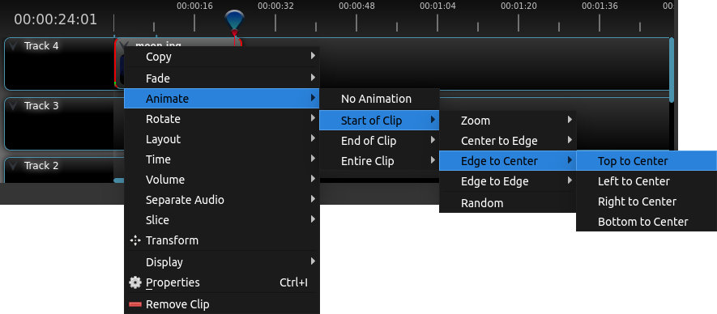
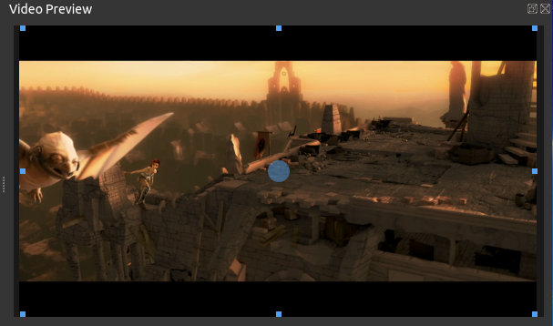
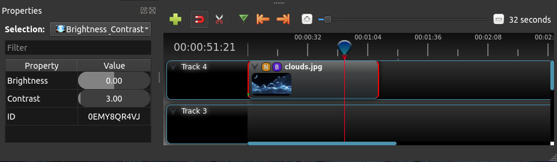

.. Copyright (c) 2008-2020 OpenShot Studios, LLC
 (http://www.openshotstudios.com). This file is part of
 OpenShot Video Editor (http://www.openshot.org), an open-source project
 dedicated to delivering high quality video editing and animation solutions
 to the world.

.. OpenShot Video Editor is free software: you can redistribute it and/or modify
 it under the terms of the GNU General Public License as published by
 the Free Software Foundation, either version 3 of the License, or
 (at your option) any later version.

.. OpenShot Video Editor is distributed in the hope that it will be useful,
 but WITHOUT ANY WARRANTY; without even the implied warranty of
 MERCHANTABILITY or FITNESS FOR A PARTICULAR PURPOSE.  See the
 GNU General Public License for more details.

.. You should have received a copy of the GNU General Public License
 along with OpenShot Library.  If not, see <http://www.gnu.org/licenses/>.

.. _clips_ref:

Clips
=====

Each media file you add to the OpenShot timeline is called a clip, and is visualized by a dark, rounded rectangle
(as seen in the screenshot below). A clip has a large number of properties, which affects how the clip is
rendered and composited, such as scale, location, rotation, and Alpha. These properties can also be animated over time,
and when combined together, can create some amazing effects.

Overview
--------

.. image:: images/clip-overview.jpg

.. table::
   :widths: 5 10 35
   
   ==  ==================  ============
   #   Name                Description
   ==  ==================  ============
   1   Clip 1              A video clip
   2   Transition          A gradual fade transition between the 2 clips
   3   Clip 2              An image clip
   ==  ==================  ============

Cutting & Slicing
-----------------
OpenShot has many easy ways to adjust the start and end positions of a clip (otherwise known as cutting). The most common
method is simply clicking the left (or right) edge of the clip and dragging. Here is a list of methods for cutting clips in OpenShot:

.. table::
   :widths: 30
   
   ==================  ============
   Name                Description
   ==================  ============
   Slice               When the play-head (i.e. red playback line) is overlapping a clip, right click on the clip, and choose Slice
   Slice All           When the play-head is overlapping many clips, right click on the play-head, and choose Slice All (it will cut all intersecting clips)
   Resizing Edge       Mouse over the edge of a clip, and resize the edge
   Split Dialog        Right click on a file, and choose **Split Clip**. A dialog will appear which allows for creating lots of small cuts in a single video file.
   Razor Tool          The razor tool cuts a clip wherever you click, so be careful. Easy and dangerous.
   ==================  ============

Keep in mind that all of the above cutting methods also have :ref:`keyboard_shortcut_ref`, to save even more time.

.. _clip_presets_ref:

Preset Menu
-----------
OpenShot has tons of great preset animations and clip properties, such as fading, sliding, zooming, etc...
These presets can be accessed by right clicking on a clip.

.. table::
   :widths: 20
   
   ==================  ============
   Name                Description
   ==================  ============
   Fade                Fade in or out a clip (often easier than using a transition)
   Animate             Zoom and slide a clip
   Rotate              Rotate or flip a video
   Layout              Make a video smaller or larger, and snap to any corner
   Time                Reverse and speed up or slow down video
   Volume              Fade in or out the volume for a clip
   Separate Audio      Create a clip for each audio track
   Slice               Cut the clip at the play-head position
   Transform           Enable transform mode
   Display             Show waveform or thumbnail for a clip
   Properties          Show the properties panel for a clip
   Copy / Paste        Copy and paste key frames or duplicate an entire clip (with all key frames)
   Remove Clip         Remove a clip from the timeline
   ==================  ============

.. _clip_transform_ref:

Transform
---------
To quickly adjust the location and scale of a clip, select a clip on the timeline, right click and choose **Transform**.
Grab any of the small blue handles to adjust scale, and grab the middle circle to move the image. Note: Pay close
attention to where the play-head (i.e. red playback line) is. Key frames are automatically created at the current playback
position, to help create animations.

For more info on key frames and animation, see :ref:`animation_ref`.

Effects
-------
In addition to the many clip properties which can be animated and adjusted, you can also drop an effect directly onto
a clip. Each effect is represented by a small letter icon. Clicking the effect icon will populate the properties of that
effect, and allow you to edit (and animate) them.

.. _clip_properties_ref:

Properties
----------
Below is a list of clip properties, most of which can be edited, and in most cases, animated over time.  To view a clip's properties,
right-click the clip then click **Properties**.  The Properties window will appear, where you can change these properties.  The properties and their values appear in ascending alphabetical order.  You can use the Filter box to find only the properties in which you are interested (e.g.: Type “gr” and the Gravity property will display).

**Note:** Pay close attention to the position of the play-head (the red verticle line on the timeline).  Key frames are automatically created at the current playback position, to help create animations.

To adjust a property, you can either:

* click the value and drag your mouse from side to side for a coarse adjustment
* Double-click on a value and type a number for a precise adjustment

The value of some of the properties is in a decimal notation (e.g.: the range of possible values is given as 0.00 to 1.00).  The value in the field can be multiplied by 100 to determine the value per 100 (percentage) that it represents (e.g.: 0.50 * 100 = 50%).  An Alpha value of 0.50 represents a point on a line precisely half way between 0% Alpha (transparent) and 100% Alpha (nontransparent).  

Numerical values in OpenShot are shown to 2 decimal places, but you can enter more precise numbers up to 4 decimal places (e.g.: 0.4756).  The more precise numbers will be used in the calculations, but OpenShot will only show 2 decimal places in the value fields.

Adjusting a property value on the first frame of a clip affects that value for the entire clip.  Adjusting a value anywhere else in the clip creates a key frame and the values between the two key frames are automnatically interpolated.  If you create a key frame at a point other than the first frame, a key frame is created at the first frame and the values between the two key frames are interpolated by OpenShot.

.. table::
   :widths: 20

   ==================  ============
   Name                Description
   ==================  ============
   Alpha               A point on a line representing the alpha blending of the clip in decimal (0 to 1)
   Channel Filter      A number representing an audio channel to filter that clears all other channels (-1 to 10)
   Channel Mapping     A number representing an audio channel to output when Channel Filter is enabled (-1 to 10)
   Crop Height         A point on a line representing the crop height of the clip in decimal (0 to 1)
   Crop Width          A point on a line representing the crop width of the clip in decimal (0 to 1)
   Crop X              A point on a line representing position of the clip on the X axis in decimal (0 to 1)
   Crop Y              A point on a line representing the position of the clip on the Y axis in decimal (0 to 1)
   Duration            A number representing the length of the clip (in seconds)
   Enable Audio        A number that represents whether the clip has enabled audio (-1=undefined, 0=no, 1=yes)
   Enable Video        A number that represents whether the clip has enabled video (-1=undefined, 0=no, 1=yes)
   End                 A number representing the time from the beginning of the original clip (in seconds)
   Frame Number        A value that displays the curfrent frame number of the selection in the upper left corner of the video
   Gravity             A value that determines where the clip snaps to its parent
   ID                  A number representing the identifaction of the clip that is automatically created
   Location X          A point on a line representing the relative X position based on the gravity (-1 to 1)
   Location Y          A point on a line representing the relative Y position based on the gravity (-1 to 1)
   Origin X            A point on a line representing the X axis center for shearing and rotation in decimal (0 to 1)
   Origin Y            A point on a line representing the Y axis center for shearing and rotation in decimal (0 to 1)
   Position            A number representing the location on the timeline where the clip begins (in seconds)
   Rotation            A number representing the rotation of the clip in degrees (-360 to 360)
   Scale               A value that determines how a clip should be resized to fit it's parent
   Scale X             A number representing the horizontal resizing on the X axis in decimal (0 to 1)
   Scale Y             A number representing the horizontal resizing on the X axis in decimal (0 to 1)
   Shear X             A number representing the shear angle on the X axis in degrees (-45=left, 45=right)
   Shear Y             A number representing the shear angle on the Y axis in degrees (-45=down, 45=up)
   Start               A number representing the time at which to start playing the clip (in seconds)
   Time                A number representing the frames, direction and speed over time to play
   Track               A value representing the name of the track on which the clip is placed in the timeline
   Volume              A point on a line representing the volume of the clip in decimal (0 to 1)
   Volume Mixing       A value representing volume adjustment levels within the clip
   Waveform Color      The color of the audio waveform displayed on the clip in the timeline if enabled
   Waveform            A value that determines if a waveform should be used instead of the clip's thumbnail
   ==================  ============

Descriptions
""""""""""""

**Alpha** : (0.00 to 1.00)
 *The proportion of the light that is passed through the emulsion on an area of a photographic image.*

 Alpha values represent transparency. An alpha value of 1.00 is nontransparent, a value of 0.00 is transparent.  Values between 0.00 and 1.00 represent semi-transparency. Alpha values of a clip on a higher track less than one allow clips on lower tracks to be partially visible through the upper clip. Animation of the alpha value provides fade-in and fade-out effects.
    
**Channel Filter** : (-1 to 10)
 *To remove by the action of a filter the path for the transfer of signals or data.*

 A number representing an audio channel to filter (clears all other channels).  The channels range from 0 to 10 while a value of -1 means 'no filter'.
    
**Channel Mapping** : (-1 to 10)
 *A graphical representation of the relationships between the path for the transfer of signals or data.*

 A number representing an audio channel to output (only works when filtering a channel).  The channels range from 0 to 10 while a value of -1 means 'no mapping'.

**Crop Height & Crop Width** : (0.00 to 1.00)
 *To cut off or mask the unwanted parts of a clip.*
 
 The default value for no cropping is 1.00. We will call the outline of the clip at this point of calculation (key frame) the “outline box“; its dimensions are used by later operations.  For values greater than 0.00 a crop box is generated, where the left and top sides of the crop box are the same as the outline box, and:

 - crop_box_height = *(outline_box_height)* \* *(crop_height_value)* 
 - crop_box_width = *(outline_box_width)* \* *(crop_width_value)*

 Any part of the clip outside the crop box is cropped.  Crop Height and Crop Width values of 0.00 or less are ignored (treated as 1.00). 

**Crop X & Crop Y** : (-1.00 to 1.00)
 *To cut off or mask the unwanted parts of a clip.*

 Cropping operations happen with respect to the outline box of the clip as it is at this point of calculation. The scaling of the clip remains unchanged.  We will call the outline of the clip at this point of calculation the “outline box“; its dimensions are used by later operations.  Crop X and Crop Y move the clip on the X and Y axes respectively, cropping the area of the clip that then falls outside the outline box.  
 
 - For Crop X a value of 0.00 leaves the clip unchanged; the value can be set -1.00 to 1.00 where 1.00 represents the width of the outline box.  
 - For Crop Y a value of 0.00 leaves the clip unchanged; the value can be set -1.00 to 1.00 where 1.00 represents the height of the outline box.

**Duration** : (seconds)
 *the length of time something continues or exists.*

 The duration displays how long the clip will actually play. It is the difference between the Start value and the End value. It cannot be adjusted, though it changes as the Start and the End values are adjusted.

**Enable Audio** : (Auto, Off, On)
 *To make active; cause to function or act.*

 May be set to **Auto** or **On**, when the clip’s audio (if any) will be used, or **Off** to disable audio.

**Enable Video** : (Auto, Off, On)
 *To make active; cause to function or act.*

 May be set to **Auto** or **On**, when the clip’s video (if any) will be used, or **Off** to disable video.

**End** : (0.00 to ∞)
 *The last part or extremity, lengthwise, of anything that is longer than it is wide or broad.*

 The time from the beginning of the original clip (ignoring any Start value) at which to stop playing. It is set in seconds to 2 decimal places. Valid values are from the Start value upwards. The duration for image clips can be set with this value.  Once you have adjusted the End value, there appears to be no way to reset it to its original value, other than removing and replacing the clip.

**Frame Number** : (None, Clip, Timeline, Both)
 *The information or image on a screen or monitor at any one time.*

 This property allows you to display the number of the current frame in the clip or the timeline in the upper left corner of the screen.

**Gravity** : (Top Left, Top Center, Top Right, Left, Center, Right, Bottom Left, Bottom Center, Bottom Right)
  *An adjustment to a line; arrangement in a straight line.*

  Gravity sets a home position for the clip, once it has been scaled as above. The options are:

  - *Top Left* – the top and left edges of the clip align with the top and left edges of the screen
  - *Top Center* – the top edge of the clip aligns with the top edge of the screen; the clip is horizontally centered on the screen.
  - *Top Right* – the top and right edges of the clip align with the top and right edges of the screen
  - *Left* – the left edge of the clip aligns with the left edge of the screen; the clip is vertically centered on the screen.
  - *Center* (default) – the clip is centered horizontally and vertically on the screen.
  - *Right* – the right edge of the clip aligns with the right edge of the screen; the clip is vertically centered on the screen.
  - *Bottom Left* – the bottom and left edges of the clip align with the bottom and left edges of the screen
  - *Bottom Center* – the bottom edge of the clip aligns with the bottom edge of the screen; the clip is horizontally centered on the screen.
  - Bottom Right – the bottom and right edges of the clip align with the bottom and right edges of the screen

**ID**
 *Something that identifies a person, animal, or thing.*

 Each clip is automatically given an ID. This value cannot be changed.

**Location X & Location Y** : (-1.00 to 1.00)
 Location X and Location Y modify the home position as set by Gravity. The values can be between -1.00 and 1.00:

 - A value of 0.00 means no change.
 - A value of 1.00 in Location X moves the clip one whole screen width right
 - A value of 1.00 in Location Y moves the clip one whole screen height down
 - A value of -1.00 in Location X moves the clip one whole screen width left
 - A value of -1.00 in Location Y moves the clip one whole screen height up
 - Decimal values move the clip by the proportional amount

**Origin X & Origin Y** : (0.00 to 1.00)
 *Something from which anything arises or is derived; source*
 
 Coordinate point used as the center/origin for shearing and rotation.

**Position** : (0.00 to ∞)
 *A place occupied or to be occupied; site.*

 The location of the first frame of the selected clip on the timeline in seconds.

**Rotation** : (-360 to 360)
 *The act of rotating; a turning around as on an axis.*

 We will call the outline of the clip at this point of calculation the “outline box“; its dimensions are used by later operations.  The center of rotation is the center of the outline box. It is not necessarily the center of the clip, if it has been cropped or sheared. Values are set in degrees. The slider allows values between -360 degrees and 360 in degrees, though you can manually enter wider values.

 If OpenShot detects that a media file has been shot in a different orientation (for example from a mobile phone held on its side), it will set the rotation appropriately. However, because this rotation is effectively applied last, other operations like crop and scale may not work as you expect.

**Scale** : (Crop, Best Fit, Stretch, None)
 *A line or bar associated with a drawing, used to indicate measurement when the image has been magnified or reduced.*

 This is the basic resizing, which may be further adjusted by Scale X and Scale Y (below). The options are:

 - *Best Fit* (default) – the clip is as large as possible without changing the aspect ratio.
 - *Crop* – the aspect ratio of the clip is maintained while the clip is enlarged to fill the entire screen, even if that means some of it will be cropped.
 - *None* – the clip is its original size.
 - *Stretch* – the clip is stretched to fill the entire screen, changing the aspect ratio if necessary.

**Scale X & Scale Y** : (0.00 to 1.00)
 Scale X and Scale Y resize the clip after its basic scaling. A value of 1.00 leaves the size as set by the basic scaling. The resulting width is the width given by basic scaling, multiplied by Scale X. The resulting height is the height given by basic scaling, multiplied by Scale Y.

**Shear X & Shear Y** : (-1.00 to 1.00)
 *Forces that push in opposite directions.*

 Shear X and Shear Y leave the top and left sides of the outline box unchanged, and shear the clip by moving the bottom and right sides of the outline box a distance of:

 - (Shear X) \* (Scale X) \* *(screen_width)* 
 - (Shear Y) \* (Scale Y) \* *(screen_height)*

 The values can be set -1.00 to 1.00 by the slider adjustment, but you can enter greater range of values by typing in the value. If the clip has been cropped, the corners of the cropped clip stay at the same proportions in the now-sheared outline box.

**Start** : (0.00 to ∞)
 *To have its origin (at), begin.*

 The time within the (video/audio) clip at which to start playing. For example if the clip is a video, and Start is 10 seconds, then the video starts playing 10 seconds from its beginning. The left hand edge of the clip stays in the same position on the timeline, and the right hand edge is adjusted.

 The Start value is valid from 0 to the length of the clip, and is set in seconds to 2 decimal places.

**Time** : (-∞ to ∞)
 *Ratio of comparison.*

 The value for the property at the key frame represents a frame number.  Determining the value involves calculating between which "frame numbers" you want to interpolate and the speed of playback. Using a calculator or a spreadsheet you would have to make calculations for more values that are not included in the Right-click menu. This also affects the duration of the clip, since the original length of the clip is being ignored at this point.  Using the right-click menu of a clip provides the values for the preset options.

**Track**
 *A segment of a graphical representation of a chronological sequence of events*

 The number or name of the track containing the clip. This value cannot be changed from the Properties pane, but can be changed by clicking the top left hand side of the track.  OpenShot uses tracks to layer videos and images. The top most track is the top layer, and the bottom track is the bottom layer.\

**Volume** : (0.00 to ∞)
 *Strength of sound; loudness.*

 Using the mouse to click and drag, the audio volume can be set between 0.00 and 1.00, where 1.00 represents 100%. If you need to boost the volume above 100%, you can enter a value by double-clicking the value field and typing a new value.

**Volume Mixing** : (Average, None, Reduce)
 *To combine (several tracks).*

 Mixing audio involves adjusting volume levels so that they maintain a good range within each clip, and then adjusting them in proportion to other clips used in the movie.  The following values are available:
 
 - **Average** - define!
 - **None** - define!
 - **Reduce** - define
 
 Consider the following guidelines when adjusting volume levels:

 - If you combine particularly loud audio clips on multiple tracks, clipping (a staccato distortion) may occur. To avoid clipping, reduce volume levels.
 - If you need to adjust the volume separately in different parts of a clip (for example, one person’s voice is faint, while later another’s is too loud), you can use keyframes to vary the volume throughout the clip.
 - If the original level of a clip is much too high or low, you can change the input level. However, adjusting the level will not remove any distortion that may have resulted from recording the clip too high. In those cases, it is best to re-record the clip.

**Wave Color** : (16,777,216 values)
 *The quality of a graphical representation of sound with respect to light reflected by the graphic*

 The color of the waveform that appears on acreen when the Waveform property is set to Yes.  Values may be chosen from the color wheel or you can enter the HSV, RGB or HTML Hex values.

**Waveform** : (No, Yes)
 *The shape of a wave, a graph obtained by plotting the instantaneous values of a periodic quantity against the time.*

 When the value is set to Yes, a graphical wave representing the audio is displayed on the screen instead of the video of the selected clip.

More Information
----------------
For more info on key frames and animation, see :ref:`animation_ref`.
