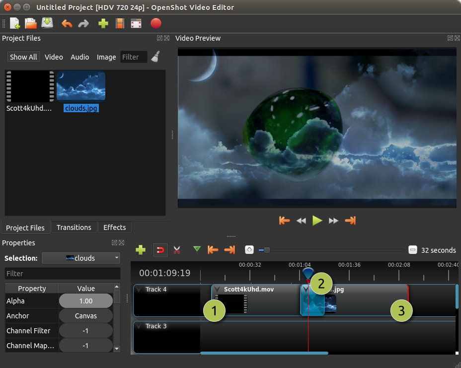

.. Copyright (c) 2008-2016 OpenShot Studios, LLC
 (http://www.openshotstudios.com). This file is part of
 OpenShot Video Editor (http://www.openshot.org), an open-source project
 dedicated to delivering high quality video editing and animation solutions
 to the world.

.. OpenShot Video Editor is free software: you can redistribute it and/or modify
 it under the terms of the GNU General Public License as published by
 the Free Software Foundation, either version 3 of the License, or
 (at your option) any later version.

.. OpenShot Video Editor is distributed in the hope that it will be useful,
 but WITHOUT ANY WARRANTY; without even the implied warranty of
 MERCHANTABILITY or FITNESS FOR A PARTICULAR PURPOSE.  See the
 GNU General Public License for more details.

.. You should have received a copy of the GNU General Public License
 along with OpenShot Library.  If not, see <http://www.gnu.org/licenses/>.

.. _clips_ref:

Clips
=====

In OpenShot, when you add project files (videos, images, and audio) to the timeline, they appear as **clips**
represented by rounded rectangles. These clips come with different properties that influence how they're rendered
and composited. These properties include the clip's :guilabel:`position`, :guilabel:`layer`, :guilabel:`scale`,
:guilabel:`location`, :guilabel:`rotation`, and :guilabel:`alpha`.

You can examine a clip's properties by either right-clicking and selecting :guilabel:`Properties` or by double-clicking the clip.
The properties are listed alphabetically in the Property dock, and you can use the filter options at the top to
find specific properties. See :ref:`clip_properties_ref` for a list of all clip properties.

To **make adjustments** to a property:

- For **rough** changes, you can drag the slider.
- For **precise** adjustments, double-click the property to enter exact values.
- If the property involves **non-numerical choices**, right-click or double-click for options.

Clip properties play a vital role in the :ref:`animation_ref` system. Whenever you modify a clip property, a
``key-frame`` is automatically created at the current playhead position. If you want a property change to apply
throughout the entire clip, ensure the playhead is positioned at or before the clip's start, before making adjustments.
You can easily find a clip's start by using the :guilabel:`next/previous marker` feature on the Timeline toolbar.

.. table::
   :widths: 5 10 35
   
   ==  ==================  ============
   #   Name                Description
   ==  ==================  ============
   1   Clip 1              A video clip
   2   Transition          A gradual fade transition between the 2 clip images (does not affect the audio)
   3   Clip 2              An image clip
   ==  ==================  ============

.. _clips_cutting_slicing_ref:

Trimming & Slicing
------------------
OpenShot provides multiple ways to adjust the start and end trim positions of a clip (also known as trimming). The
most common method is to click and drag the left or right edge of a clip. Trimming can be used to remove unwanted
sections from the beginning or ending of a clip.

To **slice** a clip into smaller sections, OpenShot offers several options, including dividing or slicing a clip
at the play-head (*vertical playback line*) position. Trimming and slicing clips are powerful tools that
allow users to rearrange sections of video and remove unwanted parts.

Here is a list of all methods for cutting and/or trimming clips in OpenShot:

.. table::
   :widths: 30 80

   =======================================   ================================================================
   Trim & Slice Method                       Description
   =======================================   ================================================================
   **Resizing Edge**                         Mouse over the edge of a clip and resize it by dragging **left** or **right**. The left edge of a clip can not be resized smaller than 0.0 (*i.e. the first frame of the file*). The right edge of a clip can not be resized larger than the duration of a file (*i.e. the last frame of a file*).
   **Slice All**                             When the play-head overlaps multiple clips, right-click the play-head and choose :guilabel:`Slice All`.
                                             This will cut/slice all intersecting clips on all tracks. You can also use the keyboard shortcuts
                                             :kbd:`Ctrl+Shift+K` to keep both sides, :kbd:`Ctrl+Shift+J` to keep the left side, or :kbd:`Ctrl+Shift+L`
                                             to keep the right side of the clips.
   **Slice Selected**                        When the play-head overlaps a clip, right-click the clip and choose :guilabel:`Slice`.
                                             This provides options to keep the left side, the right side, or both sides of the clip. Alternatively, use
                                             :kbd:`Ctrl+K` to keep both sides, :kbd:`Ctrl+J` to keep the left side, or :kbd:`Ctrl+L` to keep the right side.
   **Slice Selected (Ripple)**               Slice the selected clip(s) at the play-head position, keeping either the left side (shortcut: :kbd:`W`) or the
                                             right side (shortcut: :kbd:`Q`), while rippling the gap removal across the current track.
   **Razor Tool**                            The :guilabel:`razor tool` from the **Timeline Toolbar** cuts a clip at the position where it is clicked.
                                             Use :kbd:`SHIFT` to slice and keep the left side, or :kbd:`CTRL` to keep the right side.
   **Split File Dialog**                     Right-click on a file and choose :guilabel:`Split File`. This opens a dialog that allows you to create multiple
                                             clips from a single video file.
   =======================================   ================================================================

Keep in mind that the above cutting methods also have :ref:`keyboard_shortcut_ref`, to save even more time.

Selections
----------
Selecting clips and transitions on the timeline is an essential part of editing in OpenShot. Multiple selection methods
are available to streamline your workflow, enabling efficient editing of clips and transitions.

Here is a list of all methods for selecting clips in OpenShot:

.. table::
   :widths: 25 80

   =======================================   ================================================================
   Selection Method                          Description
   =======================================   ================================================================
   **Box Selection**                         Click and drag a selection box around clips or transitions to select multiple items at once. Hold down :kbd:`Ctrl` to add to your current selection.
   **Click Selection**                       Click on a clip or transition to select it. This will deselect all other items unless you hold down :kbd:`Ctrl`.
   **Add to Selection**                      Hold down :kbd:`Ctrl` while clicking to add or remove clips from the current selection, allowing you to select non-adjacent clips.
   **Range Selection**                       Hold down :kbd:`Shift` while clicking to select a range of clips/transitions from the previous selection to the new selection. This supports ranges that span multiple tracks as well.
   **Ripple Selection**                      Hold down :kbd:`Alt` while clicking to ripple select all clips/transitions from your selection to the end of the track. This always adds to your current selection, even if :kbd:`Ctrl` is not pressed.
   **Clear Selection**                       Click anywhere on the timeline or on a new clip/transition to reset the current selection, unless :kbd:`Ctrl` is pressed.
   **Select All**                            Press :kbd:`Ctrl+A` to select all clips and transitions on the timeline.
   **Select None**                           Press :kbd:`Ctrl+Shift+A` to deselect all clips and transitions on the timeline.
   =======================================   ================================================================

Mastering these selection techniques will streamline your editing process, especially when dealing with complex projects.
For more advanced tips on selection and editing, refer to the :ref:`clips_cutting_slicing_ref` section.

.. _clip_presets_ref:

Context Menu
------------
OpenShot has tons of great preset animations and clip properties, such as fading, sliding, zooming, 
reversing time, adjusting volume, etc... These presets can be accessed by right-clicking on a clip,
revealing the context menu. A preset sets one (or more) clip properties for the user without needing
to manually set the key-frame clip properties. See :ref:`clip_properties_ref`.

Some presets allow the user to target either the start, end, or entire clip, and most presets allow
the user to reset a specific clip property. For example, when using the ``Volume`` preset, the user has
the following menu options: 

- **Reset** - This will reset the volume to the original level.
- **Start of Clip** - Your volume level selection will apply at the Beginning of the clip.
- **End of Clip** - Your volume level selection will apply to the End of the clip.
- **Entire Clip** - Your volume level selection will apply to the Entire clip.

.. table::
   :widths: 20 80
   
   ==================  ============
   Preset Name         Description
   ==================  ============
   Fade                Fade the image in or out (often easier than using a transition)
   Animate             Zoom and slide a clip
   Rotate              Rotate or flip a clip
   Layout              Make a video smaller or larger, and snap to any corner
   Time                Reverse and speed up or slow down video
   Volume              Fade in or out the volume, reduce or increase the volume of a clip, or mute
   Separate Audio      Separate the audio from a clip. This preset can either create a single detached audio clip (positioned on a layer below the original clip), or multiple detached audio clips (one per audio track, positioned on multiple layers below the original clip)
   Slice               Cut the clip at the play-head position
   Transform           Enable transform mode
   Display             Show waveform or thumbnail for a clip
   Properties          Show the properties panel for a clip
   Copy / Paste        Copy and paste key frames or duplicate an entire clip (with all key frames)
   Remove Clip         Remove a clip from the timeline
   ==================  ============

Fade
""""
The :guilabel:`Fade` preset enables smooth transitions by gradually increasing or decreasing the clip's opacity. It
creates a fade-in or fade-out of the clip image, ideal for introducing or concluding clips. 
See :ref:`clip_alpha_ref` key-frame.

- **Usage Example:** Applying a fade-out to a video clip to gently conclude a scene.
- **Tip:** Adjust the duration of the fade effect (slow or fast) to control its timing and intensity.

Animate
"""""""
The :guilabel:`Animate` preset adds dynamic motion to clips, combining zooming and sliding animations. It
animates a clip by zooming in or out while sliding across the screen. It can **slide** in many specific
directions, or slide and zoom to a **random** location. See :ref:`clip_location_x_ref` and 
:ref:`clip_scale_x_ref` key-frames.

- **Usage Example:** Using the animate preset to simulate a camera movement across a landscape shot.
- **Tip:** Experiment with different animation speeds and directions for diverse visual effects.

Rotate
""""""
The :guilabel:`Rotate` preset introduces easy rotation and flipping of clips, enhancing their visual appeal. It
enables orientation adjustment, by rotating and flipping a clip for creative visual transformations. See :ref:`clip_rotation_ref` key-frame.

- **Usage Example:** Rotating a photo or video by 90 degree (a portrait video to a landscape)
- **Usage Example:** If your video is oriented sideways (90 degrees), you can rotate it clockwise or counterclockwise by 90 degrees to bring it to the correct orientation. This can be useful when you accidentally recorded a video in portrait mode when you intended it to be landscape.
- **Usage Example:** If your video is upside down, you can rotate it by 180 degrees to flip it to the correct orientation. This can happen if you accidentally held your camera the wrong way while recording.

Layout
""""""
The :guilabel:`Layout` preset adjusts the size of a clip and snaps it to a chosen corner of the screen. It
resizes a clip and anchors it to a corner or the center, useful for picture-in-picture or watermark effects.
See :ref:`clip_location_x_ref` and :ref:`clip_scale_x_ref` key-frames.

- **Usage Example:** Placing a logo in the corner of a video using the layout preset.
- **Tip:** Combine with animation presets for dynamic transitions involving resizing and repositioning.

Time
""""
The :guilabel:`Time` preset manipulates clip playback speed, allowing for reverse playback or time-lapse effects. It
alters the speed and direction of a clip's playback, enhancing visual storytelling. 
See :ref:`clip_time_ref` key-frame.

- **Usage Example:** Creating a slow-motion effect to emphasize a specific action.
- **Tip:** Use time presets to creatively manipulate the pacing of your video.

Volume
""""""
The :guilabel:`Volume` preset controls audio properties, facilitating smooth volume adjustments. It
manages audio volume, including fading in/out, reducing/increasing volume, or muting.
See :ref:`clip_volume_ref` key-frame.

- **Usage Example:** Applying a gradual volume fade-out to transition between scenes.
- **Tip:** Utilize volume presets for quickly lowering or raising volume levels.

Separate Audio
""""""""""""""
The :guilabel:`Separate Audio` preset splits the audio from a clip, creating detached audio clips positioned 
below the original clip on the timeline. This preset can either create a **single** detached audio clip 
(positioned on a layer below the original clip) or **multiple** detached audio clips 
(one per audio track, positioned on multiple layers below the original clip).

- **Usage Example:** Extracting background music from a video clip for independent control.
- **Tip:** Use this preset to fine-tune audio elements separately from the visual content.

Slice
"""""
The :guilabel:`Slice` tool lets you cut a clip at the position of the play-head (*the vertical line that shows your
current position in the timeline*). This will split the clip into two separate parts at the exact point where the play-head is.

Slicing is a key feature for making precise edits and rearranging sections of your video. You can slice a clip and
choose to keep one side or both, and with the ripple option, you can automatically shift other clips on the same
track to fill any gaps caused by the cut.

**Slicing Options:**

- **Keep Both Sides**: This option splits the clip into two parts, keeping everything on both sides of the play-head. It’s useful when you want to break a clip into sections but don’t want to remove anything.
- **Keep Left Side**: This option cuts the clip and removes the part to the right of the play-head, keeping only the part before the play-head. Use this to get rid of the portion of the clip that comes after the current point.
- **Keep Right Side**: This option cuts the clip and removes the part to the left of the play-head, keeping only the part after the play-head. It’s handy for trimming away the beginning of a clip and keeping the rest.
- **Ripple Slicing**: Ripple slicing not only cuts the clip but also moves any clips and transitions that follow to close the gap. This way, your timeline stays continuous without empty spaces after a cut, saving you the trouble of manually adjusting the clips that come after.

**Tips for Beginners:**

- **Example**: If there’s a part of a clip you don’t want (like the end of a scene), use **Keep Left Side** or **Keep Right Side** to remove it. If you want to split a scene into multiple smaller sections to rearrange, use **Keep Both Sides**.
- **Quick Tip**: Slicing can also be used to break a long clip into smaller parts, making it easier to manage and edit each section separately.

For a complete guide to slicing and all available keyboard shortcuts, see the :ref:`clips_cutting_slicing_ref` section.

.. _clip_transform_ref:

Transform
"""""""""
The :guilabel:`Transform` preset activates the **transform tool** for a clip, allowing for quick adjustments to 
location, scale, rotation, shear, and rotation origin point.

To quickly adjust the location, scale, rotation, and shear of a clip, select a clip on the timeline to activate
the transform tool. By default, the selected clip appears in the preview window with transform controls (blue lines and squares). 
Or if the transform tool is disabled, right click on a clip and choose **Transform**. 

- Dragging the blue squares will adjust the **scale** of the image.
- Dragging the center will move the **location** of the image.
- Dragging the mouse on the outside of the blue lines will **rotate** the image.
- Dragging along the blue lines will **shear** the image in that direction.
- Dragging the circle in the middle will move the **origin point** that controls the center of **rotation**. 

Note: Pay close attention to the play-head 
position (red playback line). Key frames are automatically created at the current playback position, to help quickly create 
animations. If you want to transform a clip with **no animation**, be sure the playhead is positioned before (to the left)
of your clip. You can also manually adjust these same clip properties in the property editor, see :ref:`clip_properties_ref`.

.. image:: images/clip-transform.jpg

- **Usage Example:** Using transform mode to resize and reposition a clip for a picture-in-picture effect.
- **Tip:** Utilize this preset to precisely control a clip's appearance.
- **Tip:** To crop a clip in OpenShot, you must use the :ref:`effects_crop_ref` effect. Cropping is not a feature of the transform tool.

Display
"""""""
The :guilabel:`Display` preset toggles the display mode of a clip on the timeline, showing either its 
waveform or thumbnail.

- **Usage Example:** Displaying the audio waveform for precise audio editing.
- **Tip:** Use this preset to focus on specific aspects of a clip's audio during editing.

Properties
""""""""""
The :guilabel:`Properties` preset opens the properties panel for a clip, allowing quick access for adjustments
to clip properties, such as location, scale, rotation, etc... See :ref:`clip_properties_ref`.

- **Usage Example:** Adjusting clip properties like opacity, volume, or position.
- **Tip:** Apply this preset to streamline adjustments to all clip properties in a single dock.

Copy / Cut / Paste
""""""""""""""""""
The :guilabel:`Copy / Paste` preset allows copying and pasting keyframes, effects, or
duplicating an entire clip along with its keyframes. Paste will create a new clip at the position of your
mouse. If you select 1 or more clips before pasting, you can paste "over" those clips with your current clip.

- **Usage Example:** Duplicating a clip with intricate animations for reuse in different parts of the project.
- **Tip:** Use this preset to replicate animations or effects across multiple clips.
- **Tip:** Selecting multiple clips before pasting, sets keyframes and/or effects for all clips.
- **Tip:** You can copy a single effect, and paste it to multiple selected clips.

Remove Gaps
"""""""""""
The :guilabel:`Remove Gap` and :guilabel:`Remove All Gaps` options help you quickly eliminate gaps between clips on the timeline by rippling (i.e., shifting)
subsequent clips to close the gap. These options can be accessed via the context menu and are only available when gaps are detected.

- **Remove Gap:**
  - This option deletes a specific gap between two clips on the timeline. Right-click on the gap between clips to access the :guilabel:`Remove Gap` option.
  - Usage: Use this option to quickly eliminate a specific gap caused by trimming or using the razor tool.

- **Remove All Gaps:**
  - This option removes all gaps between clips on the timeline for the entire track. Right-click on the track name to access the :guilabel:`Remove All Gaps` option.
  - Usage: Ideal for tracks that contain back-to-back clips, such as a photo slideshow, where no gaps are desired.

Remove Clip
"""""""""""
The :guilabel:`Remove Clip` option lets you delete a clip from the timeline. Removing clips is an essential part of
organizing your project and getting rid of unwanted sections. Removing a clip can also impact the surrounding clips.
If you want to clean up the gap that remains after deleting a clip, you have a few options to automatically adjust your timeline.

**How to Remove a Clip:**
To delete a clip, simply select it and press :kbd:`Delete` on your keyboard, or right-click the clip and choose :guilabel:`Remove Clip` from the context menu.
You can also select multiple clips at once by holding down the :kbd:`Ctrl` key and clicking on additional clips, then remove them all at once.

**Ripple Delete:**
If you want to delete a clip and automatically remove the empty space (gap) it leaves behind, use the **Ripple Delete** feature by
pressing :kbd:`Shift+Delete`. This will shift all the remaining clips and transitions on the track to the left, filling in the
gap and keeping your timeline smooth and continuous.

**Remove Gap:**
After deleting a clip, if you have gaps left in your timeline that you want to remove, simply right-click in the empty space
and choose :guilabel:`Remove Gap`. This action will shift all clips and transitions to the left, closing the gap and maintaining the flow of your video.

**Tips for Beginners:**

- **Example**: If you have a clip that’s no longer needed, such as an intro you’ve decided not to use, you can quickly select it and either delete it or use **Ripple Delete** to remove it and shift everything left to close the gap.

For more advanced editing options and shortcuts, refer to the :ref:`clips_cutting_slicing_ref` section.

Effects
-------
In addition to the many clip properties which can be animated and adjusted, you can also drop an effect directly onto
a clip from the effects dock. Each effect is represented by a small colored letter icon. Clicking the effect icon 
will populate the properties of that effect, and allow you to edit (and animate) them. 
For the full list of effects, see :ref:`effects_ref`.

.. image:: images/clip-effects.jpg

Emojis
------
Found to the right of the Effects tab, the Emoji feature provides the user with a pre-selected sampling of emoji categories that can be included in the video production. Similar to the Effects feature, emojis can be dropped directly onto a clip in the respective track and the clip can be either an image or video. The user can then adjust the properties of the chosen emoji to their desired needs by right-clicking it and selecting the available adjustments. 

.. _clip_properties_ref:

Clip Properties
---------------
Below is a list of clip properties which can be edited, and in most cases, animated over time. To view a clip's properties,
right click and choose :guilabel:`Properties`. The property editor will appear, where you can change these properties. Note: Pay
close attention to where the play-head (i.e. red playback line) is. Key frames are automatically created at the current playback
position, to help quickly create animations. 

When animating clip properties, you can fade a clip from opaque to transparent with ``alpha``, slide a clip around the 
screen with ``location_x`` and ``location_y``, scale a clip smaller or larger with the ``scale_x`` and ``scale_y``, 
fade the volume of a clip quieter or louder with ``volume``, and much more. If you want to set a single, static clip property with 
**no animation**, be sure the playhead is positioned before (to the left) of your clip when adjusting the property value.

See the table below for a full list of clip properties.

.. table::
   :widths: 18 18 70

   ======================  ==========  ============
   Clip Property Name      Type        Description
   ======================  ==========  ============
   Alpha                   Key-Frame   Curve representing the alpha for fading the image and adding transparency (1 to 0)
   Channel Filter          Key-Frame   A number representing an audio channel to filter (clears all other channels)
   Channel Mapping         Key-Frame   A number representing an audio channel to output (only works when filtering a channel)
   Frame Number            Enum        The format to display the frame number (if any)
   Duration                Float       The length of the clip (in seconds). Read-only property. This is calculated by: End - Start.
   End                     Float       The end trimming position of the clip (in seconds)
   Gravity                 Enum        The gravity of a clip determines where it snaps to its parent (details below)
   Enable Audio            Enum        An optional override to determine if this clip has audio (-1=undefined, 0=no, 1=yes)
   Enable Video            Enum        An optional override to determine if this clip has video (-1=undefined, 0=no, 1=yes)
   ID                      String      A randomly generated GUID (globally unique identifier) assigned to each clip. Read-only property.
   Track                   Int         The layer which holds the clip (higher tracks are rendered on top of lower tracks)
   Location X              Key-Frame   Curve representing the relative X position in percent based on the gravity (-1 to 1)
   Location Y              Key-Frame   Curve representing the relative Y position in percent based on the gravity (-1 to 1)
   Volume Mixing           Enum        The volume mixing choices control how volume is adjusted before mixing (None=don't adjust volume of this clip, Reduce=lower the volume to 80%, Average=divide volume based on # of concurrent clips, details below)
   Origin X                Key-Frame   Curve representing the rotation origin point, X position in percent (-1 to 1)
   Origin Y                Key-Frame   Curve representing the rotation origin point, Y position in percent (-1 to 1)
   Parent                  String      The parent object to this clip, which makes many of these keyframe values initialize to the parent value
   Position                Float       The position of the clip on the timeline (in seconds, 0.0 is the beginning of the timeline)
   Rotation                Key-Frame   Curve representing the rotation (0 to 360)
   Scale                   Enum        The scale determines how a clip should be resized to fit its parent (details below)
   Scale X                 Key-Frame   Curve representing the horizontal scaling in percent (0 to 1)
   Scale Y                 Key-Frame   Curve representing the vertical scaling in percent (0 to 1)
   Shear X                 Key-Frame   Curve representing X shear angle in degrees (-45.0=left, 45.0=right)
   Shear Y                 Key-Frame   Curve representing Y shear angle in degrees (-45.0=down, 45.0=up)
   Start                   Float       The start trimming position of the clip (in seconds)
   Time                    Key-Frame   Curve representing the frames over time to play (used for speed and direction of video)
   Volume                  Key-Frame   Curve representing the volume for fading audio quieter/louder, mute, or adjusting levels (0 to 1)
   Wave Color              Key-Frame   Curve representing the color of the audio waveform
   Waveform                Bool        Should a waveform be used instead of the clip's image
   ======================  ==========  ============

.. _clip_alpha_ref:

Alpha
"""""
The :guilabel:`Alpha` property is a key-frame curve that represents the alpha value, determining fading and transparency 
of the image in the clip. The curve ranges from 1 (fully opaque) to 0 (completely transparent).

- **Usage Example:** Applying a gradual fade-in or fade-out effect to smoothly transition clips.
- **Tip:** Use keyframes to create complex fading patterns, such as fading in and then fading out for a ghostly effect.

Channel Filter
""""""""""""""
The :guilabel:`Channel Filter` property is a key-frame curve used for audio manipulation. It specifies a single audio 
channel to be filtered while clearing all other channels.

- **Usage Example:** Isolating and enhancing specific audio elements, like isolating vocals from a song.
- **Tip:** Combine with the "Channel Mapping" property to route the filtered channel to a specific audio output.

Channel Mapping
"""""""""""""""
The :guilabel:`Channel Mapping` property is a key-frame curve that defines the output audio channel for the clip. 
This property works in conjunction with the "Channel Filter" property and specifies which channel is retained in the output.

- **Usage Example:** Keeping the filtered channel's audio while discarding others for an unconventional audio mix.
- **Tip:** Experiment with mapping different channels to create unique audio effects, like panning sounds between speakers.

Frame Number
""""""""""""
The :guilabel:`Frame Number` property specifies the format in which the frame numbers are displayed within the clip, if applicable.

- **Usage Example:** Displaying frame numbers in the top left corner of the clip, as either absolute frame number or relative to the start of the clip.
- **Tip:** This can help with identifying precise frame numbers or troubleshooting a problem.

Duration
""""""""
The :guilabel:`Duration` property is a float value indicating the length of the clip in seconds. This is a Read-only property.
This is calculated by: End - Start. To modify duration, you must edit the :guilabel:`Start` and/or :guilabel:`End` clip properties.

- **Usage Example:** Inspect the duration of a clip to ensure it fits a specific time slot in the project.
- **Tip:** Consider using the "Duration" property for clips that need to match specific time intervals, such as dialogue or scenes.

End
"""
The :guilabel:`End` property defines the trimming point at the end of the clip in seconds, allowing you to control how much 
of the clip is visible in the timeline. Changing this property will impact the :guilabel:`Duration` clip property.

- **Usage Example:** Trimming the end of a clip to align with another clip or trimming off unwanted sections of the clip.
- **Tip:** Combine the "Start" and "End" properties to precisely control the visible portion of the clip.

Gravity
"""""""
The :guilabel:`Gravity` clip property sets the initial display position coordinate (X,Y) for the clip, after it has been 
scaled (see :ref:`clip_scale_ref`). This affects where the clip picture is initially displayed on the screen, for example
``Top Left`` or ``Bottom Right``. The default gravity option is ``Center``, which displays the picture in the very
center of the screen. The gravity options are:

  - **Top Left** – The top and left edges of the clip align with the top and left edges of the screen
  - **Top Center** – The top edge of the clip aligns with the top edge of the screen; the clip is horizontally centered on the screen.
  - **Top Right** – The top and right edges of the clip align with the top and right edges of the screen
  - **Left** – The left edge of the clip aligns with the left edge of the screen; the clip is vertically centered on the screen.
  - **Center** (default) – The clip is centered horizontally and vertically on the screen.
  - **Right** – The right edge of the clip aligns with the right edge of the screen; the clip is vertically centered on the screen.
  - **Bottom Left** – The bottom and left edges of the clip align with the bottom and left edges of the screen
  - **Bottom Center** – The bottom edge of the clip aligns with the bottom edge of the screen; the clip is horizontally centered on the screen.
  - **Bottom Right** – The bottom and right edges of the clip align with the bottom and right edges of the screen

Enable Audio
""""""""""""
The :guilabel:`Enable Audio` property is an enumeration that overrides the default audio setting for the clip. 
Possible values: -1 (undefined), 0 (no audio), 1 (audio enabled).

- **Usage Example:** Turning off unwanted audio for a clip, like ambient noise.
- **Tip:** Use this property to control audio playback for specific clips, especially clips which have no useful audio track.

Enable Video
""""""""""""
The :guilabel:`Enable Video` property is an enumeration that overrides the default video setting for the clip. 
Possible values: -1 (undefined), 0 (no video), 1 (video enabled).

- **Usage Example:** Disabling the video of a clip while retaining its audio for creating audio-only sequences.
- **Tip:** This property can be helpful when creating scenes with audio commentary or voiceovers.

ID
""
The :guilabel:`ID` property holds a randomly generated GUID (Globally Unique Identifier) assigned to each clip,
ensuring its uniqueness. This is a Read-only property, and assigned by OpenShot when a clip is created.

- **Usage Example:** Referencing specific clips within custom scripts or automation tasks.
- **Tip:** While typically managed behind the scenes, understanding clip IDs can aid in advanced project customization.

Track
"""""
The :guilabel:`Track` property is an integer indicating the layer on which the clip is placed. Clips on higher tracks are rendered 
above those on lower tracks.

- **Usage Example:** Arranging clips in different layers for creating visual depth and complexity.
- **Tip:** Use higher tracks for elements that need to appear above others, like text overlays or graphics.

.. _clip_location_x_ref:

Location X and Location Y
"""""""""""""""""""""""""
The :guilabel:`Location X` and :guilabel:`Location Y` properties are key-frame curves that determine the relative position of the clip, 
expressed in percentages, based on the specified gravity. The range for these curves is -1 to 1. See :ref:`clip_transform_ref`.

- **Usage Example:** Animating a clip's movement across the screen using key-frame curves for both X and Y locations.
- **Tip:** Combine with gravity settings to create dynamic animations that adhere to consistent alignment rules.

.. _clip_volume_mixing_ref:

Volume Mixing
"""""""""""""
The :guilabel:`Volume Mixing` property is an enumeration that controls how volume adjustments are applied before mixing audio. 
Options: None (no adjustment), Reduce (volume lowered to 80%), Average (volume divided based on the number of concurrent clips).

- **Usage Example:** Automatically lowering the volume of a clip to allow background music to stand out more prominently.
- **Tip:** Experiment with volume mixing options to achieve balanced audio levels across different clips.

Mixing audio involves adjusting volume levels so that **overlapping clips** do not become too loud (creating audio distortion and loss of
audio clarity). If you combine particularly loud audio clips on multiple tracks, clipping (a staccato audio distortion) may occur. 
To avoid distortion, OpenShot might need to reduce the volume levels in overlapping clips. The following audio mixing methods are available:

 - **None** - Make no adjustments to volume data before mixing audio. Overlapping clips will combine audio at full volume, with no reduction.
 - **Average** - Automatically divide the volume of each clip based on the # of overlapping clips. For example, 2 overlapping clips would each have 50% volume, 3 overlapping clips would each have 33% volume, etc...
 - **Reduce** - Automatically reduce overlapping clips volume by 20%, which reduces the likelihood of becoming too loud, but does not always prevent audio distortion. For example, if you have 10 loud clips overlapping, each with a 20% reduction in volume, it might still exceed the max allowable volume and exhibit audio distortion.

For quickly adjusting the volume of a clip, you can use the simple :guilabel:`Volume Preset` menu. See :ref:`clip_presets_ref`.
For precise control over the volume of a clip, you can manually set the :guilabel:`Volume Key-frame`. See :ref:`clip_volume_ref`.

Origin X and Origin Y
"""""""""""""""""""""
The :guilabel:`Origin X` and :guilabel:`Origin Y` properties are key-frame curves that define the rotation origin point's position in percentages. 
The range for these curves is -1 to 1. See :ref:`clip_transform_ref`.

- **Usage Example:** Rotating a clip around a specific point, such as a character's pivot joint.
- **Tip:** Set the origin point to achieve controlled and natural-looking rotations during animations.

.. _clip_parent_ref:

Clip Parent
"""""""""""
The :guilabel:`Parent` property of a clip sets the initial keyframe values to the parent object. For example, if many clips all point to the 
same parent clip, they will inherit all their default properties, such as ``location_x``, ``location_y``, ``scale_x``, ``scale_y``, etc... 
This can be very useful in certain circumstances, such as when you have many clips that need to move or scale together. 

- **Usage Example:** Creating complex animations by establishing a parent-child relationship between clips.
- **Tip:** Utilize this property to propagate changes from the parent clip to child clips for consistent animations.
- **Tip:** You can also set the ``parent`` attribute to a ``Tracker`` or ``Object Detector`` tracked object, so the clip follows the location and scale of a tracked object. Also see :ref:`effect_parent_ref`.

Position
""""""""
The :guilabel:`Position` property determines the clip's position on the timeline in seconds, with 0.0 indicating the beginning.

- **Usage Example:** Timing a clip's appearance to coincide with specific events in the project.
- **Tip:** Adjust the position to synchronize clips with audio cues or visual elements.

.. _clip_rotation_ref:

Rotation
""""""""
The :guilabel:`Rotation` property is a key-frame curve that controls the rotation angle of the clip, 
ranging from -360 to 360 degrees. You can rotate clockwise or counterclockwise. Quickly adjust the orientation angle of
a clip (sideways, upside down, right side up, portrait, landscape), flip a clip, or animate the rotation.  See :ref:`clip_transform_ref`.

- **Usage Example:** Simulating a spinning effect by animating the rotation curve.
- **Tip:** Use this property creatively for effects like rotating text or emulating camera movement.
- **Tip:** Experiment with rotating your video at different angles, not just 90 or 180 degrees. Sometimes a slight tilt or a specific angle can add creative flair to your video, especially for artistic or storytelling purposes.
- **Tip:** After rotating your video, you might end up with black bars around the edges. Consider cropping and resizing the video to eliminate these bars and maintain a clean, polished look.
- **Tip:** If you're dealing with vertical videos that are meant to be watched on horizontal screens, rotate them by 90 degrees and then scale them up to fill the frame. This way, your vertical video will occupy more screen real estate.
- **Tip:** If the horizon in your video appears slanted due to camera tilt, use rotation to level it. This is particularly important for landscape shots to maintain a professional and visually pleasing appearance.

.. _clip_scale_ref:

Scale
"""""
The :guilabel:`Scale` property is the initial resizing or scaling method used to display the picture of a clip, which may be further adjusted by the 
:guilabel:`Scale X` and :guilabel:`Scale Y` clip properties (see :ref:`clip_scale_x_ref`). It is recommended to use assets with the same aspect 
ratio as your project profile, which allows many of these resizing methods to fully scale your clip up to the size 
of the screen, without adding any black bars on the edges. The scale methods are:

 - **Best Fit** (default) – The clip is as large as possible without changing the aspect ratio. This might result in black bars on certain sides of the picture, if the aspect ratio does not exactly match your project size.
 - **Crop** – The aspect ratio of the clip is maintained while the clip is enlarged to fill the entire screen, even if that means some of it will be cropped. This prevents black bars around the picture, but if the aspect ratio of the clip does not match the project size, some of the picture will be cropped off.
 - **None** – The clip is displayed in its original size. This is not recommended, since the picture will not scale correctly if you change the project profile (or project size).
 - **Stretch** – The clip is stretched to fill the entire screen, changing the aspect ratio if necessary.

.. _clip_scale_x_ref:

Scale X and Scale Y
"""""""""""""""""""
The :guilabel:`Scale X` and :guilabel:`Scale Y` properties are key-frame curves that represent horizontal and vertical scaling in percentages, 
respectively. The range for these curves is 0 to 1. See :ref:`clip_transform_ref`. OpenShot limits the max scale values based
on the file type and the project size, to prevent crashes and performance issues.

- **Usage Example:** Creating a zoom-in effect by animating the Scale X and Scale Y curves simultaneously.
- **Tip:** Scale the image larger than the screen, only revealing a portion of the video. This is a simple way to crop a portion of the video.
- **Tip:** Scale the horizontal and vertical elements separately, to squash and stretch the image in fun ways.
- **Tip:** Combine scaling with rotation and location properties for dynamic transformations.

Shear X and Shear Y
"""""""""""""""""""
The :guilabel:`Shear X` and :guilabel:`Shear Y` properties are key-frame curves that represent X and Y shear 
angles in degrees, respectively. See :ref:`clip_transform_ref`. OpenShot limits the max shear values based
on the file type and the project size, to prevent crashes and performance issues.

- **Usage Example:** Adding a dynamic tilt effect to a clip by animating the shear angles.
- **Tip:** Use shear properties for creating slanted or skewed animations. 

Start
"""""
The :guilabel:`Start` property defines the trimming point at the beginning of the clip in seconds.
Changing this property will impact the :guilabel:`Duration` clip property.

- **Usage Example:** Removing the initial portion of a clip to focus on a specific scene or moment.
- **Tip:** Utilize the "Start" property in combination with the "End" property for precise clip trimming.

.. _clip_time_ref:

Time
""""
The :guilabel:`Time` property is a key-frame curve that represents frames played over time, affecting the speed and direction of the video.
You can use one of the available presets (`normal, fast, slow, freeze, freeze & zoom, forward, backward`), by right clicking
on a Clip and choosing the :guilabel:`Time` menu. Many presets are available in this menu for reversing,
speeding up, and slowing down a video clip, see :ref:`clip_presets_ref`.

Optionally, you can manually set key-frame values for the :guilabel:`Time` property. The value represents the
`frame number` at the position of the key-frame. This can be tricky to determine and might require a calculator to find
the needed values. For example, if the beginning of your Clip sets a time value of ``300`` (i.e. `frame 300`),
and the end of your clip sets a time value of ``1`` (`frame 1`), OpenShot will play this clip backwards, starting
at frame 300 and ending at frame 1, at the appropriate speed (based on where these key-frames are set on the timeline).
NOTE: To determine the total number of frames in a clip, multiply the duration of the file with the FPS of the project (for
example: ``47.0 sec clip duration X 24.0 Project FPS = 1128 total frames``).

This allows for some very complex scenarios, such as jump cutting inside a clip, reversing a portion of a clip,
slowing down a portion of a clip, freezing on a frame, and much more. See :ref:`animation_ref` for more
details on manual key-frame animations.

- **Usage Example:** Creating a slow-motion or time-lapse effect by modifying the time curve.
- **Tip:** Adjust the "Time" property to control video playback speed for dramatic visual impact.

.. _clip_volume_ref:

Volume
""""""
The :guilabel:`Volume` property is a key-frame curve that controls audio volume or level, ranging from 0 (mute) to 1 (full volume).
For automatic adjustment of volume, see :ref:`clip_volume_mixing_ref`.

- **Usage Example:** Gradually fading out background music as dialogue becomes more prominent, or increasing or lowering the volume of a clip.
- **Tip:** Combine multiple volume key-frames for nuanced audio adjustments, such as ducking the level of the music when dialog is spoken.
- **Tip:** For **quickly** adjusting the volume of a clip you can use the simple :guilabel:`Volume Preset` menu. See :ref:`clip_presets_ref`.

Wave Color
""""""""""
The :guilabel:`Wave Color` property is a key-frame curve that represents the color of the audio waveform visualization.

- **Usage Example:** Matching the waveform color to the project's overall visual theme.
- **Tip:** Experiment with different colors to enhance the visual appeal of the waveform or animate the color over time.

Waveform
""""""""
The :guilabel:`Waveform` property is a boolean that determines whether a waveform visualization is used instead of the clip's image.

- **Usage Example:** Displaying an audio waveform in place of the video for visually highlighting audio patterns.
- **Tip:** Use waveform visualization for emphasizing music beats or voice modulations.

More Information
----------------
For more info on key frames and animation, see :ref:`animation_ref`.
