.. Copyright (c) 2008-2026 OpenShot Studios, LLC
 (http://www.openshotstudios.com). This file is part of
 OpenShot Video Editor (http://www.openshot.org), an open-source project
 dedicated to delivering high quality video editing and animation solutions
 to the world.

.. OpenShot Video Editor is free software: you can redistribute it and/or modify
 it under the terms of the GNU General Public License as published by
 the Free Software Foundation, either version 3 of the License, or
 (at your option) any later version.

.. OpenShot Video Editor is distributed in the hope that it will be useful,
 but WITHOUT ANY WARRANTY; without even the implied warranty of
 MERCHANTABILITY or FITNESS FOR A PARTICULAR PURPOSE.  See the
 GNU General Public License for more details.

.. You should have received a copy of the GNU General Public License
 along with OpenShot Library.  If not, see <http://www.gnu.org/licenses/>.

.. _effects_ref:

Effects
=======

Effects are used in OpenShot to enhance or modify the audio or video of a clip. They can modify pixels and audio data,
and can generally enhance your video projects. Each effect has its own set of properties, most of which can be animated
over time, for example varying the :guilabel:`Brightness & Contrast` of a clip over time.

Effects can be added to any clip by dragging and dropping them from the Effects tab onto a clip. Each effect is
represented by a small colored icon and the first letter of the effect name. Note: Pay close attention to where the play-head
(i.e. red playback line) is. Key frames are automatically created at the current playback position,
to help create animations quickly.

To view an effect's properties, right-click on the effect icon, revealing the context menu, and choose :guilabel:`Properties`.
The property editor will appear, where you can edit these properties. Properties appear alphabetically in the dock,
with filter options available at the top. Hold :kbd:`Ctrl` and click multiple
effect icons to select them all, the Properties dock will show an entry such as
``3 Selections`` so you can adjust their common settings in one step. See :ref:`clip_properties_ref`.

Masks and Effects
-----------------

All effects can now use a **static or animated mask** to limit where the effect
is applied. This makes effects much more precise, because you can target only
the subject or region you care about and blend the result smoothly into the
original image.

Why this matters:

- Keep edits focused on one area (for example, blur only a face).
- Stack multiple effects on the same subject without affecting the full frame.
- Animate how strongly or where an effect is applied over time.

How to use effect masks:

1. Add an effect to a clip.
2. Open the effect :guilabel:`Properties`.
3. Choose a :guilabel:`Mask: Source` (static image, animated mask video, :guilabel:`Tracker`, or
   :guilabel:`Object Detector`).
4. Adjust :guilabel:`Mask Mode` (for example, *Limit to Mask* or *Vary Strength*).

For quick rectangular masks, add a :guilabel:`Tracker` effect to the clip, draw a box around the area you want to
affect, then choose that tracker as the :guilabel:`Mask: Source` for another effect, such as
:guilabel:`Blur` or :guilabel:`Pixelate`. The tracker box can be moved or resized directly in the video preview while
the Tracker effect is selected, and those box changes can be keyframed over time. Tracker boxes also work on static
photos, so the same workflow can limit an effect to one region of an image.

High-quality animated masks can also be generated with Advanced AI workflows.
In many cases, you can click one or more subjects and let tracking build a mask
automatically. See :ref:`ai_ref`.

Mask controls to know:

- Any effect mask can be inverted to flip between foreground and background.
- Animated mask videos can be looped.
- When looping, set start/end mask trim carefully. If not adjusted, OpenShot
  loops the entire mask source, not just the segment you intended to repeat.

To adjust a property:

- Drag the slider for coarse changes.
- Double-click to enter precise values.
- Right/double-click for non-numerical options.

Effects with ``Margin: Left``, ``Margin: Top``, ``Margin: Right``, and ``Margin: Bottom`` controls can also be
adjusted directly in the video preview. Select the effect, then drag the preview rectangle to move the affected
area, resize its handles, or draw a new rectangle inside the clip.

The same preview rectangle can be used to position Caption text. Select a Caption effect, then move or resize the
white rectangle in the video preview to adjust the Caption margins.

Effect properties are integral to the :ref:`animation_ref` system. When you modify an effect property, a
keyframe is generated at the current playhead position. For a property to span the entire clip,
position the playhead at or before the clip's start before making adjustments. A convenient way to
identify a clip's start is by utilizing the 'next/previous marker' feature on the Timeline toolbar.

.. image:: images/clip-effects.jpg

List of Effects
---------------
OpenShot Video Editor has a total of 43 built-in video and audio effects: 34 video effects and 9 audio effects.
These effects can be added to a clip by dragging the effect onto a clip. The following table contains
the name and short description of each effect.

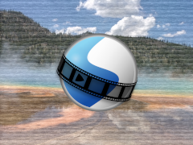

.. |audiovisualization_icon| image:: ../src/effects/icons/audiovisualization@2x.png
   :width: 50px
   :alt: Audio Visualization Icon

.. |beatsync_icon| image:: ../src/effects/icons/beatsync@2x.png
   :width: 50px
   :alt: Beat Sync Icon

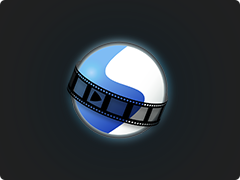

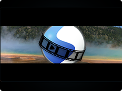

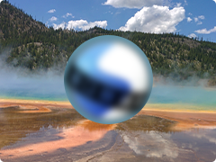

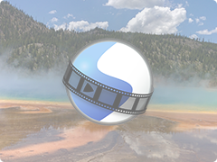

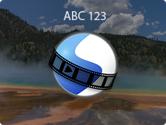

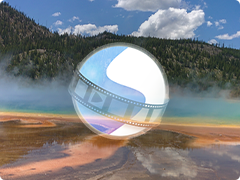

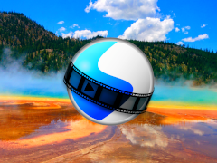

.. |colorgrade_icon| image:: ../src/effects/icons/colorgrade@2x.png
   :width: 50px
   :alt: Color Grade Icon

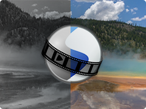

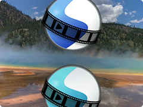

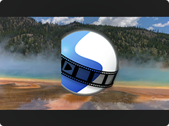

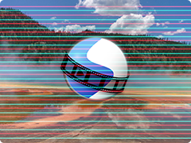

.. |denoiseimage_icon| image:: ../src/effects/icons/denoiseimage@2x.png
   :width: 50px
   :alt: Denoise Image Icon

.. |displace_icon| image:: ../src/effects/icons/displace@2x.png
   :width: 50px
   :alt: Displacement Map Icon

.. |filmgrain_icon| image:: ../src/effects/icons/filmgrain@2x.png
   :width: 50px
   :alt: Film Grain Icon

.. |glow_icon| image:: ../src/effects/icons/glow@2x.png
   :width: 50px
   :alt: Glow Icon

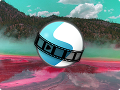

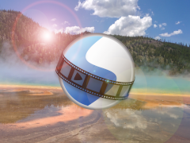

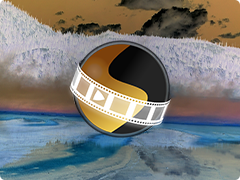

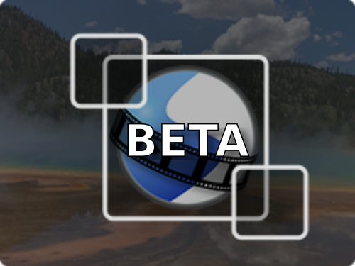

.. |objectmask_icon| image:: ../src/effects/icons/objectmask@2x.png
   :width: 50px
   :alt: Object Mask Icon

.. |outline_icon| image:: ../src/effects/icons/outline@2x.png
   :width: 50px
   :alt: Outline Icon

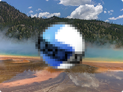

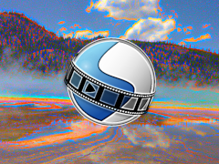

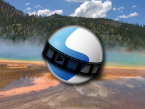

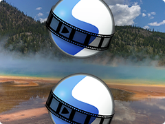

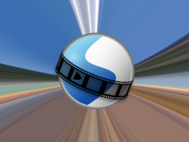

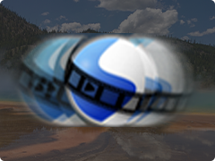

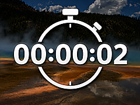

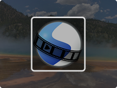

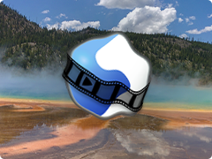

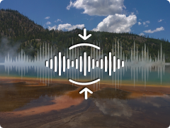

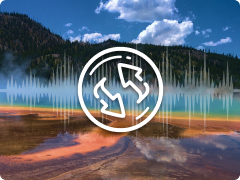

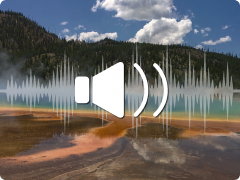

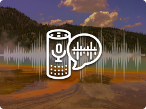

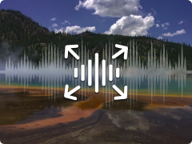

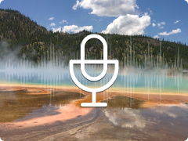

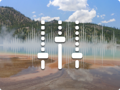

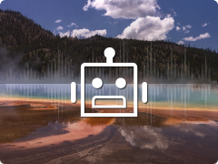

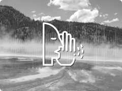

.. table::
   :widths: 15 30 80

   =========================== ============================= ===============
   Icon                        Effect Name                   Effect Description
   =========================== ============================= ===============
   |mask_icon|                 Alpha Mask / Wipe Transition  Grayscale mask transition between images.
   |analogtape_icon|           Analog Tape                   Vintage home-video wobble, bleed, and snow.
   |audiovisualization_icon|   Audio Visualization           Render waveform, spectrum, and other transparent audio visualizations.
   |bars_icon|                 Bars                          Add colored bars around your video.
   |beatsync_icon|             Beat Sync                     Generate audio-reactive color flashes for compositing.
   |blur_icon|                 Blur                          Adjust image blur.
   |brightness_icon|           Brightness & Contrast         Modify frame’s brightness and contrast.
   |caption_icon|              Caption                       Add text captions to any clip.
   |chromakey_icon|            Chroma Key (Greenscreen)      Replace color with transparency.
   |colorgrade_icon|           Color Grade                   Unified grading with corrections, curves, wheels, and LUT support.
   |colormap_icon|             Color Map / Lookup            Adjust colors using 3D LUT lookup tables (.cube format).
   |saturation_icon|           Color Saturation              Adjust color intensity.
   |colorshift_icon|           Color Shift                   Shift image colors in various directions.
   |compressor_icon|           Compressor                    Reduce loudness or amplify quiet sounds.
   |crop_icon|                 Crop                          Crop out parts of your video.
   |deinterlace_icon|          Deinterlace                   Remove interlacing from video.
   |delay_icon|                Delay                         Adjust audio-video synchronism.
   |denoiseimage_icon|         Denoise Image                 Reduce visible grain and color speckles in video frames.
   |displace_icon|             Displacement Map              Use a grayscale image or video to warp the frame.
   |distortion_icon|           Distortion                    Clip audio signal for distortion.
   |echo_icon|                 Echo                          Add delayed sound reflection.
   |expander_icon|             Expander                      Make loud parts relatively louder.
   |filmgrain_icon|            Film Grain                    Add natural film-inspired texture and motion.
   |glow_icon|                 Glow                          Add a soft outer or inner glow to visible pixels.
   |hue_icon|                  Hue                           Adjust hue / color.
   |lensflare_icon|            Lens Flare                    Simulate sunlight hitting a lens with flares.
   |negate_icon|               Negative                      Produce a negative image.
   |noise_icon|                Noise                         Add random equal-intensity signals.
   |objectdetection_icon|      Object Detector               Detect objects in video.
   |objectmask_icon|           Object Mask                   Select and follow a subject with a detailed animated mask.
   |outline_icon|              Outline                       Add outline around any image or text.
   |parametriceq_icon|         Parametric EQ                 Adjust frequency volume in audio.
   |pixelate_icon|             Pixelate                      Increase or decrease visible pixels.
   |robotization_icon|         Robotization                  Transform audio into robotic voice.
   |shadow_icon|               Shadow                        Add a soft drop shadow behind visible pixels.
   |sharpen_icon|              Sharpen                       Boost edge contrast to make video details look crisper.
   |shift_icon|                Shift                         Shift image in different directions.
   |sphericalprojection_icon|  Spherical Projection          Flatten or project 360° and fisheye footage.
   |stabilizer_icon|           Stabilizer                    Reduce video shake.
   |timer_icon|                Timer                         Render a styled count up, count down, clock, timecode, or frame number overlay.
   |tracker_icon|              Tracker                       Track bounding box in video.
   |wave_icon|                 Wave                          Distort image into a wave pattern.
   |whisperization_icon|       Whisperization                Transform audio into whispers.
   =========================== ============================= ===============

Effect Properties
-----------------
Below is a list of **common** effect properties, shared by all effects in OpenShot. To view an effect's properties,
right click and choose :guilabel:`Properties`. The property editor will appear, where you can change these properties. Note: Pay
close attention to where the play-head (i.e. red playback line) is. Key frames are automatically created at the current playback
position, to help quickly create animations.

See the table below for a list of common effect properties. Only the **common properties** that all effects share are listed here.
Each effect also has many **unique properties**, which are specific to each effect, see :ref:`effect_video_effects_ref` for
more information on individual effects and their unique properties.

.. table::
   :widths: 18 18 70

   ======================  ==========  ============
   Effect Property Name    Type        Description
   ======================  ==========  ============
   Apply Before Clip       Boolean     Apply this effect before the Clip processes keyframes? (default is Yes)
   Duration                Float       The length of the effect (in seconds). Read-only property. Most effects default to the length of a clip. This property is hidden when an effect belongs to a clip.
   End                     Float       The end trimming position of the effect (in seconds). This property is hidden when an effect belongs to a clip.
   ID                      String      A randomly generated GUID (globally unique identifier) assigned to each effect. Read-only property.
   Mask: Invert            Bool        Invert the mask source so light areas become dark and dark areas become light.
   Mask: Loop              Bool        Loop an animated mask source when the effect is longer than the source.
   Mask Mode               Enum        Controls how the mask limits or varies the strength of the effect.
   Mask: Source            Reader      The image, image sequence, video, Tracker, or Object Detector used as the effect's grayscale mask source.
   Mask: Time Mode         Enum        Controls how OpenShot maps effect time to an animated mask source.
   Parent                  String      The parent object to this effect, which makes many of these keyframe values initialize to the parent value.
   Position                Float       The position of the effect on the timeline (in seconds). This property is hidden when an effect belongs to a clip.
   Start                   Float       The start trimming position of the effect (in seconds). This property is hidden when an effect belongs to a clip.
   Track                   Int         The layer which holds the effect (higher tracks are rendered on top of lower tracks). This property is hidden when an effect belongs to a clip.
   ======================  ==========  ============

Duration
""""""""
The :guilabel:`Duration` property is a float value indicating the length of the effect in seconds. This is a Read-only property.
This is calculated by: End - Start. To modify duration, you must edit the :guilabel:`Start` and/or :guilabel:`End` effect properties.

*NOTE: Most effects in OpenShot default the effect duration to the clip duration, and hide this property from the editor.*

End
"""
The :guilabel:`End` property defines the trimming point at the end of the effect in seconds, allowing you to control how much
of the effect is visible in the timeline. Changing this property will impact the :guilabel:`Duration` effect property.

*NOTE: Most effects in OpenShot default this property to match the clip, and hide this property from the editor.*

ID
""
The :guilabel:`ID` property holds a randomly generated GUID (Globally Unique Identifier) assigned to each effect,
ensuring its uniqueness. This is a Read-only property, and assigned by OpenShot when an effect is created.

Mask Properties
"""""""""""""""
The :guilabel:`Mask: Source`, :guilabel:`Mask Mode`, :guilabel:`Mask: Time Mode`, :guilabel:`Mask: Loop`, and
:guilabel:`Mask: Invert` properties limit where an effect is applied. The mask source can be a static image, image
sequence, video, :guilabel:`Tracker`, or :guilabel:`Object Detector`. Light areas of the mask usually apply more of
the effect, while dark areas apply less; use :guilabel:`Mask: Invert` when you need the opposite result. Tracker and
Object Detector sources use their bounding boxes as the masked region, which is useful for limiting effects such as
blur, pixelation, color correction, or sharpening to a specific subject.

Track
"""""
The :guilabel:`Track` property is an integer indicating the layer on which the effect is placed. Effects on higher tracks are rendered
above those on lower tracks.

*NOTE: Most effects in OpenShot default this property to match the clip, and hide this property from the editor.*

.. _effect_parent_ref:

Effect Parent
-------------
The :guilabel:`Parent` property of an effect sets the initial keyframe values to a parent effect. For example, if many effects all point to the
same parent effect, they will inherit all their initial properties, such as font size, font color, and background color for a ``Caption`` effect.
In the example of many ``Caption`` effects using the same Parent effect, it is an efficient way to manage a large number of these effects.

NOTE: The ``parent`` property for effects should be linked to the **same type** of parent effect, otherwise their default initial values
will not match. Also see :ref:`clip_parent_ref`.

Position
""""""""
The :guilabel:`Position` property determines the effect's position on the timeline in seconds, with 0.0 indicating the beginning.

*NOTE: Most effects in OpenShot default this property to match the clip, and hide this property from the editor.*

Start
"""""
The :guilabel:`Start` property defines the trimming point at the beginning of the effect in seconds.
Changing this property will impact the :guilabel:`Duration` effect property.

*NOTE: Most effects in OpenShot default this property to match the clip, and hide this property from the editor.*

Sequencing
----------

Effects are normally applied **before** the Clip processes keyframes. This allows the effect to process the raw image of
the clip, before the clip applies properties such as scaling, rotation, location, etc... Normally, this is the preferred
sequence of events, and this is the default behavior of effects in OpenShot. However, you can optionally override this
behavior with the ``Apply Before Clip Keyframes`` property.

If you set the ``Apply Before Clip Keyframes`` property to ``No``, the effect will be sequenced **after** the clip scales, rotates,
and applies keyframes to the image. This can be useful on certain effects, such as the **Mask** effect, when you want
to animate a clip first and then apply a static mask to the clip.

.. _effect_video_effects_ref:

Video Effects
-------------

Effects are generally divided into two categories: video and audio effects. Video effects modify the image and pixel
data of a clip. Below is a list of video effects, and their properties. Often it is best to experiment with an effect,
entering different values into the properties, and observing the results.

Analog Tape
"""""""""""
The **Analog Tape** effect emulates consumer tape playback: horizontal line wobble ("tracking"), chroma bleed, luma softness, grainy snow, a bottom **tracking stripe**, and short **static bursts**.
All controls are key-framable and the noise is deterministic (seeded from the effect’s ID with an optional offset), so renders are repeatable.

.. table::
    :widths: 26 80

    ========================= ===========================================
    Property Name             Description
    ========================= ===========================================
    tracking                  ``(float, 0–1)`` Horizontal **line wobble** plus a subtle bottom **skew**. Higher values increase amplitude and skew height.
    bleed                     ``(float, 0–1)`` **Chroma bleed / fringing.** Horizontal chroma shift + blur with a slight desaturation. Gives the “rainbow edge” look.
    softness                  ``(float, 0–1)`` **Luma softness.** Small horizontal blur on Y (approx. 0–2 px). Keep low to retain detail when noise is high.
    noise                     ``(float, 0–1)`` **Snow, hiss, and dropouts.** Controls grain strength, probability/length of white **streaks**, and a faint line hum.
    stripe                    ``(float, 0–1)`` **Tracking stripe.** Lifts the bottom band, adds hiss/noise there, and widens the lifted region as the value increases.
    static_bands              ``(float, 0–1)`` **Static bursts.** Short bright bands with **row-clumped streaks** (many “shooting stars” across neighboring rows).
    seed_offset               ``(int, 0–1000)`` Adds to the internal seed (derived from the effect ID) for deterministic variation between clips.
    ========================= ===========================================

**Usage notes**

- **Subtle “home video”**: ``tracking=0.25``, ``bleed=0.20``, ``softness=0.20``, ``noise=0.25``, ``stripe=0.10``, ``static_bands=0.05``.
- **Bad tracking / head clog**: ``tracking=0.8–1.0``, ``stripe=0.6–0.9``, ``noise=0.6–0.8``, ``static_bands=0.4–0.6``, ``softness<=0.2``, and set ``bleed`` to about 0.3.
- **Color fringing only**: raise ``bleed`` (about 0.5) and keep other controls low.
- **Different but repeatable snow**: leave the effect ID alone (for deterministic output) and change ``seed_offset`` to get a new, still-repeatable pattern.

Alpha Mask / Wipe Transition
""""""""""""""""""""""""""""
The Alpha Mask / Wipe Transition effect leverages a grayscale mask to create a dynamic transition between two images
or video clips. In this effect, the light areas of the mask reveal the new image, while the dark areas conceal it,
allowing for creative and custom transitions that go beyond standard fade or wipe techniques. This effect only
affects the image, and not the audio track.

.. table::
   :widths: 26 80

   ==========================  ============
   Property Name               Description
   ==========================  ============
   brightness                  ``(float, -1 to 1)`` This curve controls the motion across the wipe
   contrast                    ``(float, 0 to 20)`` This curve controls the hardness and softness of the wipe edge
   reader                      ``(reader)`` This reader can use any image or video as input for your grayscale wipe
   replace_image               ``(bool, choices: ['Yes', 'No'])`` Replace the clips image with the current grayscale wipe image, useful for troubleshooting
   ==========================  ============

Audio Visualization
"""""""""""""""""""
The Audio Visualization effect turns sound into animated visuals, making it easy to create music visualizers,
audio spectrum analyzers, waveform animations, podcast videos, lyric videos, DJ visuals, and social media clips
that react to music, voice, beats, and other audio. It draws from the clip's audio samples and can render waveforms,
filled waveforms, audio bars, radial visualizers, frequency spectrum displays, phase scopes, particles, VU meters,
and radial bars.

Because this is a video effect, the visualization can be composited directly over the source image, placed on a
transparent background, or drawn over a solid, faded, or gradient background. This makes it useful for YouTube music
videos, podcast audiograms, voiceover clips, album preview videos, karaoke-style videos,
and quick promotional clips where the audio needs a strong visual presence.

Common uses include:

- **Music visualizer videos**: Add moving waveforms, spectrum bars, radial bars, or particles to a song, remix, or beat.
- **Podcast and voiceover clips**: Show a waveform or VU meter while a speaker talks, especially for audio-only media.
- **Lyric and karaoke videos**: Combine captions or titles with reactive audio visuals behind or around the text.
- **Social media audiograms**: Create short clips for YouTube Shorts, TikTok, Instagram Reels, and other platforms.
- **DJ, concert, and livestream visuals**: Use neon, radial, particle, or spectrum styles for energetic background motion.
- **Technical audio displays**: Use spectrum, phase scope, or VU meter modes to show frequency content, stereo movement, or loudness.

.. table::
   :widths: 26 80

   ==========================  ============
   Property Name               Description
   ==========================  ============
   visualization_type          ``(int, choices: ['Waveform', 'Filled Waveform', 'Bars', 'Radial', 'Radial Bars', 'Spectrum', 'Phase Scope', 'Particles', 'VU Meter'])``
   style                       ``(int, choices: ['Clean', 'Soft', 'Neon', 'Minimal', 'Retro'])``
   color                       ``(color)`` Seed color for the visualization
   intensity                   ``(float, 0 to 10)`` Overall audio response and visual strength
   smoothing                   ``(float, 0 to 1)`` Smooths the audio response between sampled points
   detail                      ``(float, 0 to 1)`` Controls visual density, such as bars, points, or particles
   glow                        ``(float, 0 to 1)`` Adds soft glow around the visualization
   color_spread                ``(float, 0 to 1)`` Controls color variation around the seed color or rainbow mode
   color_mode                  ``(int, choices: ['Seed', 'Rainbow'])``
   channel_layout              ``(int, choices: ['Auto', 'Combined', 'Split', 'Overlay'])``
   frequency_low               ``(float, 0 to 1)`` Normalized frequency floor: 0 = 20 Hz, 1 = 20 kHz
   frequency_high              ``(float, 0 to 1)`` Normalized frequency ceiling: 0 = 20 Hz, 1 = 20 kHz
   background                  ``(int, choices: ['Transparent', 'Solid', 'Fade', 'Gradient', 'Source'])``
   ==========================  ============

Beat Sync
"""""""""
The **Beat Sync** effect turns audio energy into a flashing full-frame color layer. A simple example is a black
frame that flashes toward white on each drum hit. By placing that flashing clip above your video and changing its
:guilabel:`Composite (Blend Mode)`, you can make the video underneath pulse, brighten, darken, or color-shift with
the beat.

This effect is a little different from most video effects: it does not directly brighten the clip underneath it.
Instead, it creates a new flashing image from the audio clip it is applied to. You preview that flashing image first,
then use the clip's composite mode to blend it with another clip on a lower track.

.. note::

   Beat Sync needs access to audio samples. If the clip's :guilabel:`Enable Audio` property is set manually, use
   :guilabel:`Auto` or :guilabel:`Yes`. If you want Beat Sync to react to an audio clip but you do **not** want to
   hear that clip, set the clip's :guilabel:`Volume` keyframe to ``0.0``. The effect can still use the silent audio
   data to generate the flashing colors.

Basic Workflow
^^^^^^^^^^^^^^

1. Place an audio clip on the Timeline.
2. Drag the :guilabel:`Beat Sync` effect from the **Effects** panel onto that audio clip.
3. Preview the clip by itself first. You should see a flashing color layer, usually black flashing toward white.
4. Open the effect :guilabel:`Properties`.
5. Adjust :guilabel:`Low Color` and :guilabel:`High Color`. For example, black to white creates a brightness flash,
   white to black creates a darkening flash, and red to green creates a color pulse.
6. Adjust :guilabel:`Response Curve` to control how easily the flash appears:

   - Lift the middle of the curve to make smaller sounds flash more strongly.
   - Lower the middle of the curve to make only stronger beats flash.
   - Create a steeper curve for a sharper strobe-like response.

7. If the effect is reacting to the wrong part of the sound, adjust :guilabel:`Low Frequency` and
   :guilabel:`High Frequency`. For example, a bass-only flash should use a lower frequency range.
8. When the flashing layer feels right, select the Beat Sync clip and change its
   :guilabel:`Composite (Blend Mode)` property. Try modes such as
   :guilabel:`Screen`, :guilabel:`Overlay`, :guilabel:`Multiply`, or :guilabel:`Color Dodge`, depending on the look
   you want.
9. Place the video you want to affect on the track **below** the Beat Sync clip.
10. Preview the composited result and fine-tune the colors, curve, intensity, threshold, or composite mode.

Common Uses
^^^^^^^^^^^

- **Music video flashes**: Flash white or bright colors on snare hits, kicks, or strong beats.
- **Bass pulses**: Use a low frequency range so the image reacts mostly to bass drums or bass lines.
- **Silent driver track**: Use a muted audio clip only as the control signal for the visual flash.
- **Color rhythm effects**: Blend between two custom colors, such as blue to yellow or red to green.

Properties
^^^^^^^^^^

.. table::
   :widths: 26 80

   ==========================  ============
   Property Name               Description
   ==========================  ============
   low_color                   ``(color)`` Color generated when the audio response is low. The default is black.
   high_color                  ``(color)`` Color generated when the audio response is high. The default is white.
   intensity                   ``(float, 0 to 10)`` Audio gain before response shaping. Higher values make quieter audio produce stronger flashes.
   threshold                   ``(float, 0 to 1)`` Audio level that must be exceeded before the effect responds. Raise this to ignore quieter sounds.
   attack_ms                   ``(float, 1 to 500)`` How quickly the flash rises after a beat or loud sound.
   decay_ms                    ``(float, 1 to 2000)`` How slowly the flash fades back after the audio energy drops.
   frequency_low               ``(float, 0 to 1)`` Normalized frequency floor: 0 = 20 Hz, 1 = 20 kHz.
   frequency_high              ``(float, 0 to 1)`` Normalized frequency ceiling: 0 = 20 Hz, 1 = 20 kHz.
   invert                      ``(int, choices: ['No', 'Yes'])`` Reverses the audio response, so quiet moments use the high color and loud moments use the low color.
   response_curve              ``(rich curve editor)`` Maps detected audio energy to the blend between :guilabel:`Low Color` and :guilabel:`High Color`.
   ==========================  ============

Technical Notes
^^^^^^^^^^^^^^^

Beat Sync analyzes the clip's audio, filters it to the selected frequency range, follows the audio envelope using
the attack and decay settings, applies the threshold, then samples the :guilabel:`Response Curve`. The resulting
value blends between :guilabel:`Low Color` and :guilabel:`High Color` and fills the entire frame with that color.
The clip's own image is not used as a background; the effect generates a clean color layer intended for compositing.

Because the output is a full-frame layer, the final look depends heavily on the clip's :guilabel:`Composite (Blend Mode)`.
Preview the flashing layer alone first, then choose a blend mode after placing the target video on the track below it.

Bars
""""
The Bars effect adds colored bars around your video frame, which can be used for aesthetic purposes, to frame
the video within a certain aspect ratio, or to simulate the appearance of viewing content on a different display
device. This effect is particularly useful for creating a cinematic or broadcast look.

.. table::
   :widths: 26 80

   ==========================  ============
   Property Name               Description
   ==========================  ============
   bottom                      ``(float, 0 to 0.5)`` The curve to adjust the bottom bar size
   color                       ``(color)`` The curve to adjust the color of bars
   left                        ``(float, 0 to 0.5)`` The curve to adjust the left bar size
   right                       ``(float, 0 to 0.5)`` The curve to adjust the right bar size
   top                         ``(float, 0 to 0.5)`` The curve to adjust the top bar size
   ==========================  ============

Blur
""""
The Blur effect softens the image, reducing detail and texture. This can be used to create a sense of depth,
draw attention to specific parts of the frame, or simply to apply a stylistic choice for aesthetic purposes.
The intensity of the blur can be adjusted to achieve the desired level of softness. Use the ``left``, ``right``,
``top``, and ``bottom`` margin properties to limit the blur to a rectangular area, such as a corner, logo, or
static part of the screen.

.. table::
   :widths: 26 80

   ==========================  ============
   Property Name               Description
   ==========================  ============
   bottom                      ``(float, 0 to 1)`` The curve to adjust the bottom margin size
   horizontal_radius           ``(float, 0 to 100)`` Horizontal blur radius keyframe. The size of the horizontal blur operation in pixels.
   iterations                  ``(float, 0 to 100)`` Iterations keyframe. The # of blur iterations per pixel. 3 iterations = Gaussian.
   left                        ``(float, 0 to 1)`` The curve to adjust the left margin size
   right                       ``(float, 0 to 1)`` The curve to adjust the right margin size
   sigma                       ``(float, 0 to 100)`` Sigma keyframe. The amount of spread in the blur operation. Should be larger than radius.
   top                         ``(float, 0 to 1)`` The curve to adjust the top margin size
   vertical_radius             ``(float, 0 to 100)`` Vertical blur radius keyframe. The size of the vertical blur operation in pixels.
   ==========================  ============

Brightness & Contrast
"""""""""""""""""""""
The Brightness & Contrast effect allows for the adjustment of the overall lightness or darkness of the image
(brightness) and the difference between the darkest and lightest parts of the image (contrast). This effect can be
used to correct poorly lit videos or to create dramatic lighting effects for artistic purposes.

.. table::
   :widths: 26 80

   ==========================  ============
   Property Name               Description
   ==========================  ============
   brightness                  ``(float, -1 to 1)`` The curve to adjust the brightness
   contrast                    ``(float, 0 to 100)`` The curve to adjust the contrast (3 is typical, 20 is a lot, 100 is max. 0 is invalid)
   ==========================  ============

.. _caption_effect_ref:

Caption
"""""""
Add text captions on top of your video. We support both VTT (WebVTT) and SubRip (SRT) subtitle file formats. These
formats are used to display captions or subtitles in videos. They allow you to add text-based subtitles to video content,
making it more accessible to a wider audience, especially for those who are deaf or hard of hearing. The Caption
effect can even animate the text fading in/out, and supports any font, size, color, and margin. OpenShot also has an
easy-to-use Caption editor, where you can quickly insert captions at the playhead position, or edit all your caption
text in one place.

The Caption editor's insert button (the plus icon) creates a complete caption cue at the current playhead position,
using a three-second default duration when possible, and selects the placeholder caption text so you can start typing
immediately. Caption text updates are previewed while you type.

To set a caption's end time from the playhead, remove the existing end timestamp from the cue line, leaving the start
timestamp and arrow. Move the playhead to the desired end time, place the text cursor on that incomplete timestamp line,
and press the plus icon again. OpenShot inserts the current playhead timestamp as the cue's end time.

.. code-block:: console

   :caption: Show a caption, starting at 5 seconds and ending at 10 seconds.

   00:00:05.000 --> 00:00:10.000
   Hello, welcome to our video!

.. table::
   :widths: 26 80

   ==========================  ============
   Property Name               Description
   ==========================  ============
   background                  ``(color)`` Color of caption area background
   background_alpha            ``(float, 0 to 1)`` Background color alpha
   background_corner           ``(float, 0 to 60)`` Background corner radius
   background_padding          ``(float, 0 to 60)`` Background padding
   caption_font                ``(font)`` Font name or family name
   caption_text                ``(caption)`` VTT/Subrip formatted caption text (multi-line)
   color                       ``(color)`` Color of caption text
   bottom                      ``(float, 0 to 1)`` Size of bottom margin
   fade_in                     ``(float, 0 to 3)`` Fade in per caption (# of seconds)
   fade_out                    ``(float, 0 to 3)`` Fade out per caption (# of seconds)
   font_alpha                  ``(float, 0 to 1)`` Font color alpha
   font_size                   ``(float, 0 to 200)`` Font size in points
   left                        ``(float, 0 to 0.5)`` Size of left margin
   line_spacing                ``(float, 0 to 5)`` Distance between lines (1.0 default)
   right                       ``(float, 0 to 0.5)`` Size of right margin
   stroke                      ``(color)`` Color of text border / stroke
   stroke_width                ``(float, 0 to 10)`` Width of text border / stroke
   top                         ``(float, 0 to 1)`` Size of top margin
   ==========================  ============

Chroma Key (Greenscreen)
""""""""""""""""""""""""
The Chroma Key (Greenscreen) effect replaces a specific color (or chroma) in the video (commonly green or blue)
with transparency, allowing for the compositing of the video over a different background. This effect is widely used
in film and television production for creating visual effects and placing subjects in settings that would be otherwise
impossible or impractical to shoot in.

**Green Screen Workflow**

1. Place your background clip on a lower track and your green-screen footage on the track directly above it.
2. Drag and drop the :guilabel:`Chroma Key (Greenscreen)` effect from the **Effects** panel onto your green-screen clip.
3. Double-click the :guilabel:`color` button in the Properties panel to open the color picker, then select the green or blue background color.
4. Raise the :guilabel:`threshold` slider until the background turns fully transparent.
5. Fine-tune :guilabel:`halo` to remove any residual color fringe around the subject edges.

.. table::
   :widths: 26 80

   ==========================  ============
   Property Name               Description
   ==========================  ============
   color                       ``(color)`` The color to match
   threshold                   ``(float, 0 to 125)`` The threshold (or fuzz factor) for matching similar colors. The larger the value the more colors that will be matched.
   halo                        ``(float, 0 to 125)`` The additional threshold for halo elimination.
   keymethod                   ``(int, choices: ['Basic keying', 'HSV/HSL hue', 'HSV saturation', 'HSL saturation', 'HSV value', 'HSL luminance', 'LCH luminosity', 'LCH chroma', 'LCH hue', 'CIE Distance', 'Cb,Cr vector'])`` The keying method or algorithm to use.
   ==========================  ============

.. _effects_color_grade:

Color Grade
"""""""""""
The Color Grade effect combines primary correction, tonal wheels, RGB curves, and LUT support into one
fully animated effect. Use it for **color correction** (white balance, exposure, contrast) and
**color grading** (building a stylized look). Right-click a clip and use :guilabel:`Look → Color` presets to
apply it instantly, or switch to :guilabel:`View → Color View` for a dedicated grading workspace.

.. seealso::

   :doc:`color` — full workflow guide covering the Color Wheels dock, Curve Editor, video scopes,
   color presets, skin tone matching, and step-by-step grading examples.

Properties
^^^^^^^^^^

.. table::
   :widths: 26 80

   ==========================  ============
   Property Name               Description
   ==========================  ============
   temperature                 ``(float, -1 to 1)`` White-balance style warm/cool adjustment. Positive values warm the image; negative values cool it.
   tint                        ``(float, -1 to 1)`` Green/magenta balance adjustment for fine white-balance correction.
   exposure                    ``(float, -2 to 2)`` Overall brightness adjustment in stops.
   contrast                    ``(float, -1 to 1)`` Expand or compress tonal separation around the midtones.
   highlights                  ``(float, -1 to 1)`` Recover or brighten bright tonal regions.
   shadows                     ``(float, -1 to 1)`` Lift or deepen dark tonal regions.
   saturation                  ``(float, 0 to 4)`` Global color intensity multiplier.
   vibrance                    ``(float, -1 to 1)`` Adaptive colorfulness adjustment that affects lower-saturation pixels more strongly.
   mix                         ``(float, 0 to 1)`` Blend between the original frame and the fully graded result.
   wheels                      ``(rich wheels editor)`` Opens the Color Wheels dock for animated :guilabel:`Global`, :guilabel:`Shadows`, :guilabel:`Midtones`, and :guilabel:`Highlights` color and luma adjustments. Includes a preview thumbnail and :guilabel:`Edit` / :guilabel:`Reset` context menu.
   curve_all                   ``(rich curve editor)`` Opens the all-channels Curve Editor popup for overall tonal shaping. Includes a preview thumbnail and :guilabel:`Edit` / :guilabel:`Reset` context menu.
   curve_red                   ``(rich curve editor)`` Opens the red channel Curve Editor popup for animated red-channel shaping.
   curve_green                 ``(rich curve editor)`` Opens the green channel Curve Editor popup for animated green-channel shaping.
   curve_blue                  ``(rich curve editor)`` Opens the blue channel Curve Editor popup for animated blue-channel shaping.
   lut_path                    ``(string)`` Filesystem path to the `.cube` LUT file applied after the correction and curve stages.
   lut_intensity               ``(float, 0 to 1)`` Blend amount for the selected LUT.
   ==========================  ============

Color Map / Lookup
""""""""""""""""""
The Color Map effect applies a 3D LUT (Lookup Table) to your footage, instantly transforming its
colors to achieve a consistent look or mood. A 3D LUT is simply a table that remaps every input hue to a new output
palette. With separate keyframe curves for red, green, and blue channels, you can precisely control, and even
animate, how much each channel is influenced by the LUT, making it easy to fine-tune or blend your grade over time.

LUT files (`.cube` format) can be downloaded from many online resources, including free packs on
photography blogs or marketplaces, such as https://freshluts.com/. OpenShot includes a selection of popular LUTs
designed for **Rec 709** gamma out of the box.

.. table::
   :widths: 20 80

   ===================  ========================================================================
   Property Name        Description
   ===================  ========================================================================
   lut_path             ``(string)`` Filesystem path to the `.cube` LUT file.
   intensity            ``(float, 0.0 to 1.0)`` % Blending overall intensity (0.0 = no LUT, 1.0 = full LUT).
   intensity_r          ``(float, 0.0 to 1.0)`` % Blending the LUT’s red channel (0.0 = no LUT, 1.0 = full LUT).
   intensity_g          ``(float, 0.0 to 1.0)`` % Blending the LUT’s green channel (0.0 = no LUT, 1.0 = full LUT).
   intensity_b          ``(float, 0.0 to 1.0)`` % Blending the LUT’s blue channel (0.0 = no LUT, 1.0 = full LUT).
   ===================  ========================================================================

Gamma and Rec 709
^^^^^^^^^^^^^^^^^
Gamma is the way video systems brighten or darken the midtones of an image. **Rec 709** is the standard gamma curve
used for most HD and online video today. By shipping with **Rec 709** LUTs, OpenShot makes it simple to apply a grade
that matches the vast majority of footage you’ll edit.

If your camera or workflow uses a different gamma (for example a LOG profile), you can still use a LUT made for
that curve. Simply use a `.cube` file designed for your gamma under the Color Map effect’s **LUT Path**.
Just be sure your footage gamma matches the LUT gamma—or the colors may look incorrect.

The following **Rec 709** LUT files are included in OpenShot, organized into the following categories:

Cinematic & Blockbuster
^^^^^^^^^^^^^^^^^^^^^^^

.. container:: gallery

   .. image:: images/colors/cinematic_&_blockbuster_bold_red_cinema.jpg
      :width: 30%

   .. image:: images/colors/cinematic_&_blockbuster_city_neon_cinema.jpg
      :width: 30%

   .. image:: images/colors/cinematic_&_blockbuster_cool_cinema.jpg
      :width: 30%

   .. image:: images/colors/cinematic_&_blockbuster_dreamy_cinema.jpg
      :width: 30%

   .. image:: images/colors/cinematic_&_blockbuster_elegant_dark_cinema.jpg
      :width: 30%

   .. image:: images/colors/cinematic_&_blockbuster_heroic_cinema.jpg
      :width: 30%

   .. image:: images/colors/cinematic_&_blockbuster_romantic_cinema.jpg
      :width: 30%

   .. image:: images/colors/cinematic_&_blockbuster_sunlit_cinema.jpg
      :width: 30%

   .. image:: images/colors/cinematic_&_blockbuster_teal_&_orange_cinema.jpg
      :width: 30%

   .. image:: images/colors/cinematic_&_blockbuster_teal_cinema.jpg
      :width: 30%

   .. image:: images/colors/cinematic_&_blockbuster_warm_cinema.jpg
      :width: 30%

Dark & Moody
^^^^^^^^^^^^

.. container:: gallery

   .. image:: images/colors/dark_&_moody_city_night_film.jpg
      :width: 30%

   .. image:: images/colors/dark_&_moody_cold_shadows.jpg
      :width: 30%

   .. image:: images/colors/dark_&_moody_cool_haze.jpg
      :width: 30%

   .. image:: images/colors/dark_&_moody_dramatic_warmth.jpg
      :width: 30%

   .. image:: images/colors/dark_&_moody_icy_drama.jpg
      :width: 30%

   .. image:: images/colors/dark_&_moody_mystic_emerald_drama.jpg
      :width: 30%

   .. image:: images/colors/dark_&_moody_night_glow.jpg
      :width: 30%

   .. image:: images/colors/dark_&_moody_noir_era.jpg
      :width: 30%

   .. image:: images/colors/dark_&_moody_retro_red_shadows.jpg
      :width: 30%

   .. image:: images/colors/dark_&_moody_spy_night.jpg
      :width: 30%

   .. image:: images/colors/dark_&_moody_teal_horror.jpg
      :width: 30%

   .. image:: images/colors/dark_&_moody_woodland_drama.jpg
      :width: 30%

Film Stock & Vintage
^^^^^^^^^^^^^^^^^^^^

.. container:: gallery

   .. image:: images/colors/film_stock_&_vintage_classic_film.jpg
      :width: 30%

   .. image:: images/colors/film_stock_&_vintage_dark_orange_film.jpg
      :width: 30%

   .. image:: images/colors/film_stock_&_vintage_emerald_film.jpg
      :width: 30%

   .. image:: images/colors/film_stock_&_vintage_faded_memories.jpg
      :width: 30%

   .. image:: images/colors/film_stock_&_vintage_golden_wood_film.jpg
      :width: 30%

   .. image:: images/colors/film_stock_&_vintage_golden_years_film.jpg
      :width: 30%

   .. image:: images/colors/film_stock_&_vintage_green_film_pop.jpg
      :width: 30%

   .. image:: images/colors/film_stock_&_vintage_low_key_film.jpg
      :width: 30%

   .. image:: images/colors/film_stock_&_vintage_red_film.jpg
      :width: 30%

   .. image:: images/colors/film_stock_&_vintage_standard_film.jpg
      :width: 30%

   .. image:: images/colors/film_stock_&_vintage_vintage_400_film.jpg
      :width: 30%

   .. image:: images/colors/film_stock_&_vintage_vintage_green_film.jpg
      :width: 30%

   .. image:: images/colors/film_stock_&_vintage_warm_roast_film.jpg
      :width: 30%

Teal & Orange Vibes
^^^^^^^^^^^^^^^^^^^

.. container:: gallery

   .. image:: images/colors/teal_&_orange_vibes_moonlight_orange.jpg
      :width: 30%

   .. image:: images/colors/teal_&_orange_vibes_signature_teal_&_orange.jpg
      :width: 30%

   .. image:: images/colors/teal_&_orange_vibes_sunset_orange.jpg
      :width: 30%

   .. image:: images/colors/teal_&_orange_vibes_teal_punch.jpg
      :width: 30%

   .. image:: images/colors/teal_&_orange_vibes_tropical_teal.jpg
      :width: 30%

   .. image:: images/colors/teal_&_orange_vibes_western_sunset.jpg
      :width: 30%

Utility & Correction
^^^^^^^^^^^^^^^^^^^^

.. container:: gallery

   .. image:: images/colors/utility_&_correction_clean_&_denoise.jpg
      :width: 30%

   .. image:: images/colors/utility_&_correction_protect_highlights.jpg
      :width: 30%

   .. image:: images/colors/utility_&_correction_warm_correction.jpg
      :width: 30%

Vibrant & Colorful
^^^^^^^^^^^^^^^^^^

.. container:: gallery

   .. image:: images/colors/vibrant_&_colorful_color_pop.jpg
      :width: 30%

   .. image:: images/colors/vibrant_&_colorful_photo_contrast.jpg
      :width: 30%

   .. image:: images/colors/vibrant_&_colorful_valentine_pop.jpg
      :width: 30%

   .. image:: images/colors/vibrant_&_colorful_warm_pop.jpg
      :width: 30%

   .. image:: images/colors/vibrant_&_colorful_warm_to_cool.jpg
      :width: 30%

Color Saturation
""""""""""""""""
The Color Saturation effect adjusts the intensity and vibrancy of colors within the video. Increasing saturation
can make colors more vivid and eye-catching, while decreasing it can create a more subdued, almost
black-and-white appearance.

.. table::
   :widths: 26 80

   ==========================  ============
   Property Name               Description
   ==========================  ============
   saturation                  ``(float, 0 to 4)`` The curve to adjust the overall saturation of the frame's image (0.0 = greyscale, 1.0 = normal, 2.0 = double saturation)
   saturation_B                ``(float, 0 to 4)`` The curve to adjust blue saturation of the frame's image
   saturation_G                ``(float, 0 to 4)`` The curve to adjust green saturation of the frame's image (0.0 = greyscale, 1.0 = normal, 2.0 = double saturation)
   saturation_R                ``(float, 0 to 4)`` The curve to adjust red saturation of the frame's image
   ==========================  ============

Color Shift
"""""""""""
Shift the colors of an image up, down, left, and right (with infinite wrapping).

**Each pixel has 4 color channels:**

- Red, Green, Blue, and Alpha (i.e. transparency)
- Each channel value is between 0 and 255

The Color Shift effect simply "moves" or "translates" a specific color channel on the X or Y axis. *Not all video and
image formats support an alpha channel, and in those cases, you will not see any changes when adjusting the color
shift of the alpha channel.*

.. table::
   :widths: 26 80

   ==========================  ============
   Property Name               Description
   ==========================  ============
   alpha_x                     ``(float, -1 to 1)`` Shift the Alpha X coordinates (left or right)
   alpha_y                     ``(float, -1 to 1)`` Shift the Alpha Y coordinates (up or down)
   blue_x                      ``(float, -1 to 1)`` Shift the Blue X coordinates (left or right)
   blue_y                      ``(float, -1 to 1)`` Shift the Blue Y coordinates (up or down)
   green_x                     ``(float, -1 to 1)`` Shift the Green X coordinates (left or right)
   green_y                     ``(float, -1 to 1)`` Shift the Green Y coordinates (up or down)
   red_x                       ``(float, -1 to 1)`` Shift the Red X coordinates (left or right)
   red_y                       ``(float, -1 to 1)`` Shift the Red Y coordinates (up or down)
   ==========================  ============

.. _effects_crop_ref:

Crop
""""
The Crop effect removes unwanted outer areas from the video frame, allowing you to focus on a particular part of the
shot, change the aspect ratio, or remove distracting elements from the edges of the frame. This effect is the
primary method for cropping a Clip in OpenShot. The ``left``, ``right``, ``top``, and ``bottom`` key-frames can
even be animated, for a moving and resizing cropped area. You can leave the cropped area blank, or you can
dynamically resize the cropped area to fill the screen.

You can quickly add this effect by right-clicking a clip and choosing
:guilabel:`Crop`. When active, blue crop handles appear in the video preview so
you can adjust the crop visually.

.. table::
   :widths: 26 80

   ==========================  ============
   Property Name               Description
   ==========================  ============
   bottom                      ``(float, 0 to 1)`` Size of bottom bar
   left                        ``(float, 0 to 1)`` Size of left bar
   right                       ``(float, 0 to 1)`` Size of right bar
   top                         ``(float, 0 to 1)`` Size of top bar
   x                           ``(float, -1 to 1)`` X-offset
   y                           ``(float, -1 to 1)`` Y-offset
   resize                      ``(bool, choices: ['Yes', 'No'])`` Replace the frame image with the cropped area (allows automatic scaling of the cropped image)
   ==========================  ============

Deinterlace
"""""""""""
The Deinterlace effect is used to remove interlacing artifacts from video footage, which are commonly seen as
horizontal lines across moving objects. This effect is essential for converting interlaced video (such as from
older video cameras or broadcast sources) into a progressive format suitable for modern displays.

.. table::
   :widths: 26 80

   ==========================  ============
   Property Name               Description
   ==========================  ============
   isOdd                       ``(bool, choices: ['Yes', 'No'])`` Use odd or even lines
   ==========================  ============

Denoise Image
"""""""""""""
The **Denoise Image** effect reduces visible video noise, grain, and color speckles. It is useful for low-light
camera footage, noisy webcam clips, high-ISO photos, old video, compressed footage, and rendered images that have
unwanted speckling.

For a quick start, drag **Denoise Image** onto a clip and preview the result. The default settings are designed to
clean up common noise while keeping faces, text, edges, and fine details recognizable. If the image still looks too
noisy, raise :guilabel:`Strength`. If the image starts to look too smooth, raise :guilabel:`Detail`.

Simple controls
^^^^^^^^^^^^^^^

- :guilabel:`Strength` controls how much denoising is applied.
- :guilabel:`Detail` protects edges and texture. Higher values keep more detail; lower values remove more speckles.
- :guilabel:`Color Noise` targets red, green, and blue color speckles, which are common in dark video.

Most users can start with those three controls. The next controls are helpful when you want cleaner video without
creating ghosting or smearing:

- :guilabel:`Temporal` blends a small amount of information from the previous frame during normal playback. This can
  reduce dancing noise from frame to frame.
- :guilabel:`Motion Safety` protects moving objects. Higher values are more cautious and reduce the chance of ghosting.
- :guilabel:`Response Curve` changes denoise strength by brightness. By default, shadows are cleaned more strongly,
  midtones are balanced, and highlights are affected more lightly.

How it works
^^^^^^^^^^^^

Denoise Image combines **spatial denoising** and conservative **temporal denoising**. Spatial denoising looks at the
current frame and smooths small noisy variations while trying to preserve important edges. Temporal denoising compares
neighboring frames and only blends when the image appears stable enough. When OpenShot detects a seek, scrub, frame
jump, or still image, temporal history is reset automatically, so the effect falls back to the current frame only.

The effect also treats brightness and color differently. Dark areas usually contain more camera sensor noise, so the
default response curve applies stronger cleanup in shadows. Bright areas usually need less denoising. Color speckles
are reduced more aggressively than luma detail, which helps remove low-light chroma noise without turning the whole
image into a blur.

Usage tips
^^^^^^^^^^

- For mild camera noise, use the default settings or raise :guilabel:`Strength` slightly.
- For very noisy dark footage, raise :guilabel:`Strength` and :guilabel:`Color Noise`, then lower :guilabel:`Detail`
  only as much as needed.
- For faces, text, hair, leaves, or detailed textures, keep :guilabel:`Detail` higher to avoid a smeared look.
- For moving subjects, keep :guilabel:`Motion Safety` high and avoid pushing :guilabel:`Temporal` too far.
- For still images or photos, :guilabel:`Temporal` has no useful history, so focus on :guilabel:`Strength`,
  :guilabel:`Detail`, :guilabel:`Color Noise`, and :guilabel:`Response Curve`.

.. table::
   :widths: 26 80

   ==========================  ============================================================================
   Property Name               Description
   ==========================  ============================================================================
   strength                    ``(float, 0 to 1)`` Overall denoise amount. Higher values remove more grain and speckles.
   detail                      ``(float, 0 to 1)`` Edge and texture protection. Higher values preserve more fine detail; lower values smooth more noise.
   temporal                    ``(float, 0 to 1)`` Previous-frame blending amount for stable sequential video frames.
   motion_safety               ``(float, 0 to 1)`` Motion protection. Higher values reduce temporal blending where movement is detected.
   color_noise                 ``(float, 0 to 1)`` Extra cleanup for red, green, and blue color speckles.
   response_curve              ``(curve)`` Brightness-based denoise response. Use it to denoise shadows, midtones, and highlights differently.
   ==========================  ============================================================================

Displacement Map
""""""""""""""""
The Displacement Map effect uses a grayscale image or video to warp the current frame in the horizontal and vertical
directions. This effect is also commonly called a **distortion map**, **warp map**, **displace effect**, or
**displacement effect**. It is useful for heat haze, water ripples, refractive glass, mirage effects, animated
distortion overlays, shockwave looks, and other stylized screen warps.

The map source is sampled for every pixel. **Mid-gray** is neutral and causes no movement. **Darker** and **lighter**
areas shift pixels in opposite directions. A still image creates a fixed distortion pattern, while a video or animated
map creates moving distortion over time. Transparent parts of the map smoothly fade back toward neutral displacement.

Usage Notes
^^^^^^^^^^^

- Use a **grayscale image or grayscale video** for the most predictable results.
- Use **Map: Source** to pick an imported file, image sequence, video clip, or even a transition image as the map.
- **Strength** multiplies both the horizontal and vertical displacement.
- **Horizontal** controls left/right warping as a percentage of the frame width.
- **Vertical** controls up/down warping as a percentage of the frame height.
- **Brightness** and **Contrast** reshape the map before displacement, which can make the warp subtler or more dramatic.
- **Map: Invert** flips the direction driven by light and dark areas.
- **Replace Image** is a debug preview that shows the processed map instead of the warped frame.

.. table::
   :widths: 26 80

   ==========================  ============================================================================
   Property Name               Description
   ==========================  ============================================================================
   map_reader                  ``(reader)`` **Map: Source.** Select the grayscale image, animation, video, or transition file used as the displacement source
   invert                      ``(int, choices: ['Yes', 'No'])`` **Map: Invert.** Reverse the displacement direction driven by dark and light areas
   strength                    ``(float, 0 to 3)`` Overall multiplier for the displacement effect
   horizontal                  ``(float, -1 to 1)`` Horizontal displacement amount, as a percentage of the frame width
   vertical                    ``(float, -1 to 1)`` Vertical displacement amount, as a percentage of the frame height
   brightness                  ``(float, -1 to 1)`` Brightness adjustment applied to the displacement map before warping
   contrast                    ``(float, 0 to 20)`` Contrast adjustment applied to the displacement map before warping
   replace_image               ``(int, choices: ['Yes', 'No'])`` Replace the output image with the processed map, useful for previewing or debugging the distortion map
   ==========================  ============================================================================

Film Grain
""""""""""
The **Film Grain** effect adds a gentle moving texture to your video, similar to the tiny speckles you see in
real film photography. This can make very clean digital footage feel warmer, more natural, or more cinematic.
It can also help blend mixed footage together, especially when one clip looks too sharp or too smooth compared
to the rest of your project.

If you are new to film grain, start small. A little grain can add life and texture without calling attention to
itself. Stronger settings can be useful for vintage looks, music videos, horror scenes, documentary recreations,
or footage that should feel like older 16mm or Super 8 film.

You can add Film Grain from the :guilabel:`Effects` tab, or right-click a clip and choose
:guilabel:`Look → Film → Film Grain` to start with a preset: :guilabel:`35mm Fine`,
:guilabel:`35mm Classic`, :guilabel:`35mm Gritty`, :guilabel:`16mm Classic`, :guilabel:`Super 8`, or
:guilabel:`High ISO`. Presets only set the properties for you; all controls remain visible and editable.

Simple starting points:

- **Clean cinematic texture**: try :guilabel:`35mm Fine`, then lower ``amount`` if it feels too visible.
- **Classic film look**: try :guilabel:`35mm Classic` for a balanced grain pattern.
- **Punchy, gritty film look**: try :guilabel:`35mm Gritty` for heavier, more visible grain.
- **Older home-movie style**: try :guilabel:`Super 8`, which uses larger, more active grain.
- **Low-light camera noise style**: try :guilabel:`High ISO`, then adjust ``color_amount`` to control how colorful the grain feels.

The grain is deterministic, which means the same settings render the same grain pattern each time. Change
``seed`` when you want a different repeatable grain pattern on a clip.

.. table::
   :widths: 26 80

   ==========================  ============================================================================
   Property Name               Description
   ==========================  ============================================================================
   amount                      ``(float, 0 to 1)`` Overall grain intensity. Lower values are subtle; higher values are more visible and gritty.
   size                        ``(float, 0 to 1)`` Grain scale. Lower values create fine grain; higher values create larger, coarser grain.
   softness                    ``(float, 0 to 1)`` Softens the grain texture. Lower values look crisp; higher values look smoother and more organic.
   clump                       ``(float, 0 to 1)`` Controls how even or clustered the grain appears. Higher values create more irregular groups of grain.
   shadows                     ``(float, 0 to 1)`` Grain strength in dark areas of the image.
   midtones                    ``(float, 0 to 1)`` Grain strength in middle brightness areas, such as skin tones and everyday objects.
   highlights                  ``(float, 0 to 1)`` Grain strength in bright areas, such as skies, windows, and lights.
   color_amount                ``(float, 0 to 1)`` How much the grain affects color. Lower values are mostly luma grain; higher values add more chroma grain.
   color_variation             ``(float, 0 to 1)`` How independently the red, green, and blue grain changes. Higher values feel more colorful and random.
   evolution                   ``(float, 0 to 1)`` How much the grain renews over time. Higher values make the texture change more from frame to frame.
   coherence                   ``(float, 0 to 1)`` How stable and smooth the grain remains between frames. Higher values feel calmer and less jumpy.
   seed                        ``(int, 0 to 1000000)`` Selects the exact repeatable grain pattern. Change this to get a different look without changing intensity.
   ==========================  ============================================================================

**Usage notes**

- Grain is easiest to judge while the video is playing, not on a single paused frame.
- If faces or bright skies look too noisy, lower ``highlights`` or ``amount``.
- If shadows look too clean compared to the rest of the image, raise ``shadows`` slightly.
- If the grain looks too digital or sharp, raise ``softness`` or lower ``color_variation``.
- If the grain looks too busy during motion, lower ``evolution`` or raise ``coherence``.

Glow
""""
The Glow effect creates a soft halo from the clip's visible pixels. It can render either outside the subject
for a classic outer glow, or along the inside edges for an inner glow. The effect uses the source alpha channel,
so transparent PNGs, text, logos, and masked clips work especially well.

You can add Glow from the :guilabel:`Effects` tab, or right-click a clip and choose
:guilabel:`Look → Lighting → Glow` to start with a preset: :guilabel:`Soft White` (a gentle neutral
halo), :guilabel:`Warm` (a warm amber glow), :guilabel:`Neon` (a vivid colored glow), or
:guilabel:`Inner Glow` (glow drawn inside the subject's edges). Presets only set the properties for
you; all controls remain visible and editable.

.. table::
   :widths: 26 80

   ==========================  ============
   Property Name               Description
   ==========================  ============
   mode                        ``(int, choices: ['Outer', 'Inner'])`` Choose whether the glow appears outside the visible pixels (Outer) or just inside their edges (Inner).
   opacity                     ``(float, 0 to 1)`` Overall glow strength and transparency.
   blur_radius                 ``(float, 0 to 100)`` Blur radius in pixels used to soften the glow. Larger values create a wider, softer halo.
   spread                      ``(float, 0 to 1)`` Expands and strengthens the source alpha before blurring for a denser, more filled-in glow.
   color                       ``(color)`` Tint color of the glow, including alpha. Use the alpha channel to control the glow's maximum opacity independently of the ``opacity`` property.
   ==========================  ============

Hue
"""
The Hue effect adjusts the overall color balance of the video, changing the hues without affecting the brightness or
saturation. This can be used for color correction or to apply dramatic color effects that transform the mood of
the footage.

.. table::
   :widths: 26 80

   ==========================  ============
   Property Name               Description
   ==========================  ============
   hue                         ``(float, 0 to 1)`` The curve to adjust the percentage of hue shift
   ==========================  ============

Lens Flare
""""""""""
The Lens Flare effect simulates bright light hitting your camera lens, creating glowing halos, colored rings and
gentle glares over your footage. Reflections are automatically placed along a line from the light source toward the
center of the frame. You can animate any property with keyframes to follow your action or match your scene.

.. table::
   :widths: 26 80

   ===================  ========================================================
   Property Name        Description
   ===================  ========================================================
   x                    ``(float, -1 to 1)`` Horizontal position of the light source. -1 is left edge, 0 is center, +1 is right edge.
   y                    ``(float, -1 to 1)`` Vertical position of the light source. -1 is top edge, 0 is center, +1 is bottom edge.
   brightness           ``(float, 0 to 1)`` Overall glow strength and transparency. Higher values make brighter, more opaque flares.
   size                 ``(float, 0.1 to 3)`` Scale of the entire flare effect. Larger values enlarge halos, rings and glows.
   spread               ``(float, 0 to 1)`` How far secondary reflections travel. 0 keeps them close to the source, 1 pushes them all the way toward the opposite edge.
   tint_color           ``(color)`` Shifts the flare colors to match your scene. Use the RGBA sliders to pick hue and transparency.
   ===================  ========================================================

Negative
""""""""
The Negative effect inverts the colors of the video, producing an image that resembles a photographic negative.
This can be used for artistic effects, to create a surreal or otherworldly look, or to highlight specific elements
within the frame.

Object Mask
"""""""""""
The Object Mask effect creates a detailed, animated mask around a subject that you identify. Instead of drawing a
rectangular tracking box, you mark the subject with points or rectangles and OpenShot follows its visible outline
through the clip. Use it to highlight a person or product, create a colored cutout or outline, or provide the
:guilabel:`Mask: Source` for another effect such as Blur, Pixelate, or Color Grade.

Object Mask runs locally in OpenShot and does not require a ComfyUI server. OpenShot uses an
`EfficientSAM model <https://github.com/OpenShot/openshot-onnx/tree/main/efficient-sam>`_ to turn your prompts into a
mask on selected frames, then uses
`Cutie models <https://github.com/OpenShot/openshot-onnx/tree/main/cutie>`_ to propagate that mask through the video.
These OpenCV-friendly model packages are maintained in the
`OpenShot ONNX repository <https://github.com/OpenShot/openshot-onnx>`_. The model files are downloaded the first time
you use the effect and are stored for later use.

Creating an Object Mask
^^^^^^^^^^^^^^^^^^^^^^^
1. Drag :guilabel:`Object Mask` from the :guilabel:`Effects` panel onto a video clip.
2. In the initialization dialog, choose a :guilabel:`Quality` level and download the Object Mask model files if they
   are not installed. Higher quality generally takes more processing time and memory.
3. Leave :guilabel:`Processing Device` set to :guilabel:`CPU` for maximum compatibility, or select an available GPU
   option. :guilabel:`GPU (Auto)` falls back to CPU when a supported GPU backend is unavailable.
4. Click :guilabel:`Select Points`. On a frame where the subject is clearly visible, add at least one positive point
   or rectangle on the subject. Add negative points or rectangles over nearby background or unwanted objects when
   they help separate the subject.
5. Enable the mask preview to check the selected area. Add prompts on other frames if the subject changes greatly,
   becomes hidden, or the initial selection is ambiguous.
6. Click :guilabel:`Process Effect`. Processing analyzes the clip and creates the animated mask data used by the
   effect. Cancel the job if you need to revise the prompts or settings.

After processing, select the Object Mask effect to change its fill and outline. To apply another effect only inside
the detected subject, add that effect to the same clip and select Object Mask under its :guilabel:`Mask: Source`
property. Use :guilabel:`Mask: Invert` on the other effect when you want to modify the background instead.

Object Mask and Advanced AI
^^^^^^^^^^^^^^^^^^^^^^^^^^^
Object Mask is the quickest built-in workflow when you need a reusable mask inside an OpenShot project. The similar
ComfyUI :guilabel:`Mask...`, :guilabel:`Blur...`, and :guilabel:`Highlight...` workflows generate new media files
through a separately installed ComfyUI server and provide more customizable AI pipelines. See
:ref:`ai_tracking_ref` for those Advanced AI workflows.

Properties
^^^^^^^^^^

.. table::
   :widths: 26 80

   ==========================  ================================================================================
   Property Name               Description
   ==========================  ================================================================================
   draw_mask                   ``(int, choices: ['Yes', 'No'])`` Show or hide the colored mask overlay.
   mask_color                  ``(color)`` Color drawn over the selected subject.
   mask_alpha                  ``(float, 0 to 1)`` Opacity of the colored mask overlay.
   stroke_color                ``(color)`` Color of the outline around the selected subject.
   stroke_alpha                ``(float, 0 to 1)`` Opacity of the subject outline.
   stroke_width                ``(int, 0 to 50)`` Width of the subject outline in pixels. Use ``0`` to hide it.
   protobuf_data_path          ``(string)`` Internal path to the processed mask data. Normally managed by OpenShot.
   ==========================  ================================================================================

Object Detector
"""""""""""""""
The Object Detector effect automatically finds and follows known classes of objects throughout a video. Depending
on the selected YOLO model, these can include people, vehicles, animals, and many common objects. OpenShot stores each
detection as a tracked object, allowing you to display boxes and labels, customize individual detections, parent
another clip to a detected object, or use detections as the :guilabel:`Mask: Source` for another effect.

Unlike Object Mask, Object Detector does not require you to mark a particular subject first. It scans the clip for
all object classes known by the selected model. Use Object Detector when you want automatic discovery or several
tracked objects; use Object Mask when you need a precise subject silhouette selected with your own prompts.

Creating Object Detections
^^^^^^^^^^^^^^^^^^^^^^^^^^
1. Drag :guilabel:`Object Detector` from the :guilabel:`Effects` panel onto a video clip.
2. Choose a YOLO :guilabel:`Version` and download its model and class-name files if needed. Nano models are normally
   the fastest starting point; larger models can improve detection at the cost of processing time and memory.
3. Leave :guilabel:`Processing Device` set to :guilabel:`CPU` for maximum compatibility, or select an available GPU
   option. :guilabel:`GPU (Auto)` falls back to CPU when necessary.
4. Click :guilabel:`Process Effect`. OpenShot analyzes the clip and creates the tracked-object data. Processing can
   take time for long or high-resolution clips and can be canceled.
5. Select the processed effect and adjust its Properties. Use :guilabel:`Class Filter` and
   :guilabel:`Confidence Threshold` to reduce the visible results, then select an individual object to customize its
   box, label, mask, or styling.

Class Filters & Confidence
^^^^^^^^^^^^^^^^^^^^^^^^^^
Enter one or more comma-separated names in :guilabel:`Class Filter`, such as ``person, car``, to display only those
classes. Class names depend on the selected model and its class-name file. Leave the field empty to display all
detected classes. Raise :guilabel:`Confidence Threshold` to hide uncertain detections and reduce false positives;
lower it when the model is missing a partially hidden or difficult subject.

Object Detector can also produce segmentation masks when the selected YOLO model supports them. Those masks can be
displayed on the clip or used by another effect. Models that only output bounding boxes still work as rectangular
mask sources.

How Parenting Works
^^^^^^^^^^^^^^^^^^^
Once you have tracked objects, you can "parent" other :ref:`clips_ref` to them. This means that the second clip,
which could be a graphic, text, or another video layer, will now follow the tracked object as if it's attached to it.
If the tracked object moves to the left, the child clip moves to the left. If the tracked object grows in size
(gets closer to the camera), the child clip also scales up. For parented clips to appear correctly, they must be
on a Track higher than the tracked objects, and set the appropriate :ref:`clip_scale_ref` property.

See :ref:`clip_parent_ref`.

Properties
^^^^^^^^^^

.. table::
   :widths: 26 80

   ==========================  ============
   Property Name               Description
   ==========================  ============
   class_filter                ``(string)`` Comma-separated object classes to display (for example, ``person, car``). Leave empty for all classes.
   confidence_threshold        ``(float, 0 to 1)`` Minimum confidence value to display the detected objects
   display_box_text            ``(int, choices: ['Yes', 'No'])`` Draw class name and ID of ALL tracked objects
   display_boxes               ``(int, choices: ['Yes', 'No'])`` Draw bounding box around ALL tracked objects (a quick way to hide all tracked objects)
   selected_object_index       ``(int, 0 to 200)`` Index of the tracked object that is `selected` to modify its properties
   draw_box                    ``(int, choices: ['Yes', 'No'])`` Whether to draw the box around the selected tracked object
   draw_mask                   ``(int, choices: ['Yes', 'No'])`` Whether to draw the segmentation mask for the selected object, when available
   draw_text                   ``(int, choices: ['Yes', 'No'])`` Whether to draw the class name and ID for the selected object
   box_id                      ``(string)`` Internal ID of a tracked object box for identification purposes
   x1                          ``(float, 0 to 1)`` Top left X coordinate of a tracked object box, normalized to the video frame width
   y1                          ``(float, 0 to 1)`` Top left Y coordinate of a tracked object box, normalized to the video frame height
   x2                          ``(float, 0 to 1)`` Bottom right X coordinate of a tracked object box, normalized to the video frame width
   y2                          ``(float, 0 to 1)`` Bottom right Y coordinate of a tracked object box, normalized to the video frame height
   delta_x                     ``(float, -1.0 to 1)`` Horizontal movement delta of the tracked object box from its previous position
   delta_y                     ``(float, -1.0 to 1)`` Vertical movement delta of the tracked object box from its previous position
   scale_x                     ``(float, 0 to 1)`` Scaling factor in the X direction for the tracked object box, relative to its original size
   scale_y                     ``(float, 0 to 1)`` Scaling factor in the Y direction for the tracked object box, relative to its original size
   rotation                    ``(float, 0 to 360)`` Rotation angle of the tracked object box, in degrees
   visible                     ``(bool)`` Is the tracked object box visible in the current frame. Read-only property.
   stroke                      ``(color)`` Color of the stroke (border) around the tracked object box
   stroke_width                ``(int, 1 to 10)`` Width of the stroke (border) around the tracked object box
   stroke_alpha                ``(float, 0 to 1)`` Opacity of the stroke (border) around the tracked object box
   background_alpha            ``(float, 0 to 1)`` Opacity of the background fill inside the tracked object box
   background_corner           ``(int, 0 to 150)`` Radius of the corners for the background fill inside the tracked object box
   background                  ``(color)`` Color of the background fill inside the tracked object box
   mask_color                  ``(color)`` Color of the selected object's segmentation mask, when available
   mask_alpha                  ``(float, 0 to 1)`` Opacity of the selected object's segmentation mask
   ==========================  ============

Outline
"""""""
The Outline effect adds a customizable border around images or text within a video frame. It works by extracting the
image’s alpha channel, blurring it to generate a smooth outline mask, and then combining this mask with a solid
color layer. Users can adjust the outline’s width as well as its color components (red, green, blue) and
transparency (alpha), allowing for a wide range of visual styles. This effect is ideal for emphasizing text,
creating visual separation, and adding an artistic flair to your videos.

.. table::
   :widths: 26 80

   ==========================  ============
   Property Name               Description
   ==========================  ============
   width                       ``(float, 0 to 100)``   The width of the outline in pixels.
   red                         ``(float, 0 to 255)``   The red color component of the outline.
   green                       ``(float, 0 to 255)``   The green color component of the outline.
   blue                        ``(float, 0 to 255)``   The blue color component of the outline.
   alpha                       ``(float, 0 to 255)``   The transparency (alpha) value for the outline.
   ==========================  ============

Pixelate
""""""""
The Pixelate effect increases or decreases the size of the pixels in the video, creating a mosaic-like appearance.
This can be used to obscure details (such as faces or license plates for privacy reasons), or as a stylistic effect
to evoke a retro, digital, or abstract aesthetic.

.. table::
   :widths: 26 80

   ==========================  ============
   Property Name               Description
   ==========================  ============
   bottom                      ``(float, 0 to 1)`` The curve to adjust the bottom margin size
   left                        ``(float, 0 to 1)`` The curve to adjust the left margin size
   pixelization                ``(float, 0 to 0.99)`` The curve to adjust the amount of pixelization
   right                       ``(float, 0 to 1)`` The curve to adjust the right margin size
   top                         ``(float, 0 to 1)`` The curve to adjust the top margin size
   ==========================  ============

Sharpen
"""""""
The Sharpen effect enhances perceived detail by first blurring the frame slightly and then adding a scaled
difference (the *un-sharp mask*) back on top. This boosts edge contrast, making textures and outlines appear
crisper without changing overall brightness.

Modes
^^^^^

* **Unsharp** – Classic un-sharp mask: the edge detail is added back to the *original* frame.
  Produces the familiar punchy sharpen seen in photo editors.

* **HighPass** – High-pass blend: the edge detail is added to the *blurred* frame, then the result replaces
  the original.  Gives a softer, more “contrasty” look and can rescue highlights that would otherwise clip.

Channels
^^^^^^^^

* **All** – Apply the edge mask to the full RGB signal (strongest effect – colour and brightness sharpened).
* **Luma** – Apply only to luma (brightness).  Colours stay untouched, so chroma noise is not amplified.
* **Chroma** – Apply only to the chroma (colour difference) channels.  Useful for gently reviving colour
  edges without changing perceived brightness.

Properties
^^^^^^^^^^

.. table::
   :widths: 26 80

   ==========================  ============================================================
   Property Name               Description
   ==========================  ============================================================
   amount                      ``(float, 0 to 40)`` Strength multiplier / up to 100% edge boost
   radius                      ``(float, 0 to 10)`` Blur radius in pixels at 720p (auto-scaled to clip size)
   threshold                   ``(float, 0 to 1)`` Minimum luma difference that will be sharpened
   mode                        ``(int, choices: ['Unsharp', 'HighPass'])`` Math style of the sharpening mask
   channel                     ``(int, choices: ['All', 'Luma', 'Chroma'])`` Which colour channels receive sharpening
   ==========================  ============================================================

Shadow
""""""
The Shadow effect creates a soft drop shadow from the clip's visible pixels. It uses the source alpha channel,
blurs that silhouette, and offsets it by a distance and angle before drawing the original image on top. This is
useful for giving text, logos, overlays, and cut-out subjects more separation from the background.

You can add Shadow from the :guilabel:`Effects` tab, or right-click a clip and choose
:guilabel:`Look → Lighting → Shadow` to start with a preset: :guilabel:`Subtle` (a light near shadow),
:guilabel:`Soft` (a diffused medium shadow), :guilabel:`Strong` (a bold, high-opacity shadow), or
:guilabel:`Long` (a distant, elongated shadow). Presets only set the properties for you; all controls
remain visible and editable.

.. table::
   :widths: 26 80

   ==========================  ============
   Property Name               Description
   ==========================  ============
   opacity                     ``(float, 0 to 1)`` Overall shadow strength and transparency.
   blur_radius                 ``(float, 0 to 100)`` Blur radius in pixels used to soften the shadow edges. Higher values produce softer, more diffused shadows.
   spread                      ``(float, 0 to 1)`` Expands and strengthens the source alpha before blurring for a fuller, heavier shadow shape.
   distance                    ``(float, -500 to 500)`` Offset distance of the shadow in pixels. Negative values move the shadow in the opposite direction.
   angle                       ``(float, -360 to 360)`` Direction of the shadow offset in degrees. 0° is right, 90° is down, 180° is left, 270° is up.
   color                       ``(color)`` Shadow tint color, including alpha. The default is semi-transparent black.
   ==========================  ============

Shift
"""""
The Shift effect moves the entire image in different directions (up, down, left, and right with infinite wrapping),
creating a sense of motion or disorientation. This can be used for transitions, to simulate camera movement, or to
add dynamic motion to static shots.

.. table::
   :widths: 26 80

   ==========================  ============
   Property Name               Description
   ==========================  ============
   x                           ``(float, -1 to 1)`` Shift the X coordinates (left or right)
   y                           ``(float, -1 to 1)`` Shift the Y coordinates (up or down)
   ==========================  ============

Spherical Projection
""""""""""""""""""""

The Spherical Projection effect flattens 360° or fisheye footage into a normal rectangular view, or generates fisheye output.
Steer a virtual camera with yaw, pitch, and roll. Control the output view with FOV. Choose the input type (equirect or one of the fisheye models),
pick a projection mode for the output, and select a sampling mode that balances quality and speed. This is ideal for keyframed
“virtual camera” moves inside 360° clips and for converting circular fisheye shots.

.. table::
   :widths: 26 80

   ==========================  ===========================================
   Property Name               Description
   ==========================  ===========================================
   yaw                         ``(float, -180 to 180)``
                               Horizontal rotation around the up axis (degrees).
   pitch                       ``(float, -180 to 180)``
                               Vertical rotation around the right axis (degrees).
   roll                        ``(float, -180 to 180)``
                               Rotation around the forward axis (degrees).
   fov                         ``(float, 0 to 179)``
                               **Out FOV.** Horizontal field of view of the virtual camera (degrees) for the output.
   in_fov                      ``(float, 1 to 360)``
                               **In FOV.** Total coverage of the source lens. Used when **Input Model = Fisheye** (typical value 180). Ignored for equirect sources.
   projection_mode             ``(int)``
                               Output projection:
                               **Sphere (0):** rectilinear output over the full sphere.
                               **Hemisphere (1):** rectilinear output over a half sphere.
                               **Fisheye: Equidistant (2)**, **Equisolid (3)**, **Stereographic (4)**, **Orthographic (5)**: circular fisheye output using the selected mapping.
   input_model                 ``(int)``
                               Source lens model:
                               **Equirectangular (0)**, **Fisheye: Equidistant (1)**, **Fisheye: Equisolid (2)**, **Fisheye: Stereographic (3)**, **Fisheye: Orthographic (4)**.
   invert                      ``(int)``
                               Flip the view by 180° without mirroring.
                               **Normal (0)**, **Invert (1)**. For equirect sources this behaves like a 180° yaw. For fisheye inputs it swaps front/back hemispheres.
   interpolation               ``(int)``
                               Sampling method: **Nearest (0)**, **Bilinear (1)**, **Bicubic (2)**, **Auto (3)**.
                               Auto picks Bilinear at ~1:1, Bicubic when upscaling, and a mipmapped Bilinear when downscaling.
   ==========================  ===========================================

**Usage notes**

- **Flatten a fisheye clip to a normal view:**
  Set **Input Model** to the correct fisheye type, set **In FOV** to your lens coverage (often 180), choose **Projection Mode = Sphere** or **Hemisphere**, then frame with **Yaw/Pitch/Roll** and **Out FOV**.
- **Reframe an equirect clip:**
  Set **Input Model = Equirectangular**, pick **Sphere** (full) or **Hemisphere** (front/back). **Invert** on equirect is equivalent to yaw +180 and does not mirror.
- **Create a fisheye output:**
  Choose one of the **Fisheye** projection modes (2..5). **Out FOV** controls disk coverage (180 gives a classic circular fisheye).
- If the image looks mirrored, turn **Invert** off. If you need the back view on equirect, use **Invert** or add +180 to **Yaw**.
- If the output looks soft or aliased, reduce **Out FOV** or increase export resolution. **Auto** interpolation adapts the filter to scaling.

Stabilizer
""""""""""
The Stabilizer effect reduces unwanted shake and jitter in handheld or unstable video footage, resulting in smoother,
more professional-looking shots. This is particularly useful for action scenes, handheld shots, or any footage where
a tripod was not used.

.. table::
   :widths: 26 80

   ==========================  ============
   Property Name               Description
   ==========================  ============
   zoom                        ``(float, 0 to 2)`` Percentage to zoom into the clip, to crop off the shaking and uneven edges
   ==========================  ============

Timer
"""""
The Timer effect renders a styled time overlay on top of a clip. It can count up, count down, display a wall-clock
style timer, show timecode, or show frame numbers. Use it for sports clips, tutorials, races, countdowns, progress
timers, timecode burn-ins, or any clip that needs an on-screen timer.

By default, Timer uses :guilabel:`Source Time`, so speed changes and time keyframes on the parent clip also affect
the timer. For example, if a clip is slowed down, the timer slows down with it. Switch to :guilabel:`Clip Time` when
you want the timer to follow the clip's timeline position instead.

Use :guilabel:`Font Name`, :guilabel:`Font Size`, text color, stroke, and background controls to style the timer.
Use :guilabel:`Gravity` to choose the starting position, then adjust :guilabel:`X Offset (%)` and
:guilabel:`Y Offset (%)` to fine-tune the placement.

- :guilabel:`Mode` controls what kind of timer is displayed.
- :guilabel:`Countdown Duration` controls count-down length. Set it to ``0`` to count down from the clip's duration.
- :guilabel:`Start Time` offsets count-up, clock, timecode, frame, and count-down values.
- :guilabel:`Gravity` places the timer in one of nine positions on the frame.
- :guilabel:`X Offset (%)` and :guilabel:`Y Offset (%)` move the timer by a percentage of the frame size.
- Font, color, stroke, background, and opacity controls can be keyframed for animated timer styles.

.. table::
   :widths: 26 80

   ==========================  ============================================================================
   Property Name               Description
   ==========================  ============================================================================
   background                  ``(color)`` Background box color behind the timer text.
   background_alpha            ``(float, 0 to 1)`` Background opacity.
   background_corner           ``(float, 0 to 100)`` Background corner radius.
   background_padding          ``(float, 0 to 100)`` Padding around the timer text.
   clamp                       ``(int, choices: ['Yes', 'No'])`` Clamp duration-style timer output at zero.
   color                       ``(color)`` Timer text color.
   end_time                    ``(float, 0 to 86400)`` Countdown duration in seconds. Use ``0`` to count down from the clip duration.
   font_alpha                  ``(float, 0 to 1)`` Timer text and stroke opacity.
   font_name                   ``(font)`` Font name or family name.
   font_size                   ``(float, 1 to 300)`` Timer font size.
   format                      ``(int, choices: ['MM:SS', 'HH:MM:SS', 'HH:MM:SS.mmm', 'Timecode', 'Frames'])`` Timer display format.
   gravity                     ``(int, choices: ['Top Left', 'Top Center', 'Top Right', 'Left', 'Center', 'Right', 'Bottom Left', 'Bottom Center', 'Bottom Right'])`` Position of the timer on the frame.
   mode                        ``(int, choices: ['Count Up', 'Count Down', 'Clock', 'Timecode', 'Frame Number'])`` Timer mode.
   prefix                      ``(string)`` Text shown before the timer value.
   show_background             ``(int, choices: ['Yes', 'No'])`` Show or hide the background box.
   start_time                  ``(float, -86400 to 86400)`` Starting offset in seconds.
   stroke                      ``(color)`` Timer text border / stroke color.
   stroke_width                ``(float, 0 to 20)`` Width of the timer text border / stroke.
   suffix                      ``(string)`` Text shown after the timer value.
   time_source                 ``(int, choices: ['Clip Time', 'Source Time'])`` Choose whether the timer follows clip time or the clip's source-time keyframe curve.
   x_offset                    ``(float, -100 to 100)`` Horizontal offset as a percentage of frame width.
   y_offset                    ``(float, -100 to 100)`` Vertical offset as a percentage of frame height.
   ==========================  ============================================================================

Tracker
"""""""
The Tracker effect allows for the tracking of a specific object or area within the video frame across multiple frames.
This can be used for motion tracking, adding effects or annotations that follow the movement of objects, or for
stabilizing footage based on a tracked point. When tracking an object, be sure to select the entire object, which is
visible at the start of a clip, and choose one of the following ``Tracking Type`` algorithms. The tracking algorithm
then follows this object from frame to frame, recording its position, scale, and sometimes rotation.

The tracked box can also be used as a live mask source for any other effect. For example, add a
:guilabel:`Tracker` effect, draw a box around a face or license plate, add a :guilabel:`Blur` or
:guilabel:`Pixelate` effect to the same clip, and set that effect's :guilabel:`Mask: Source` to the tracker. The blur
or pixelation is then limited to the tracked box and updates in the video preview as you adjust it.

Tracker boxes are not limited to moving video. You can add a Tracker effect to a static photo, use its box as the
:guilabel:`Mask: Source` for another effect, and keyframe the box position or size if the masked region should move
over time. Select the Tracker effect, then use the video preview transform handles to move or resize the box; OpenShot
updates the box properties such as ``x1``, ``y1``, ``x2``, and ``y2`` so the masked effect follows the adjusted region.

Tracking Type
^^^^^^^^^^^^^
- **KCF:** (default) A blend of Boosting and MIL strategies, employing correlation filters on overlapping areas from 'bags' to accurately track and predict object movement. It offers higher speed and accuracy and can stop tracking when the object is lost but struggles to resume tracking after losing the object.
- **MIL:** Improves upon Boosting by considering multiple potential positives ('bags') around the definite positive object, increasing robustness to noise and maintaining good accuracy. However, it shares the Boosting Tracker's drawbacks of low speed and difficulty in stopping tracking when the object is lost.
- **BOOSTING:** Utilizes the online AdaBoost algorithm to enhance the classification of tracked objects by focusing on incorrectly classified ones. It requires setting the initial frame and treats nearby objects as background, adjusting to new frames based on maximum score areas. It's known for accurate tracking but suffers from low speed, noise sensitivity, and difficulty stopping tracking upon object loss.
- **TLD:** Decomposes tracking into tracking, learning, and detection phases, allowing for adaptation and correction over time. While it can handle object scaling and occlusions reasonably well, it may behave unpredictably, with instability in tracking and detection.
- **MEDIANFLOW:** Based on the Lucas-Kanade method, it analyzes forward and backward movement to estimate trajectory errors for real-time position prediction. It's fast and accurate under certain conditions but can lose track of fast-moving objects.
- **MOSSE:** Utilizes adaptive correlations in Fourier space to maintain robustness against lighting, scale, and pose changes. It boasts very high tracking speeds and is better at continuing tracking after loss, but it may persist in tracking an absent object.
- **CSRT:** Employs spatial reliability maps to adjust filter support, enhancing the ability to track non-rectangular objects and perform well even with object overlaps. However, it is slower and may not operate reliably when the object is lost.

How Parenting Works
^^^^^^^^^^^^^^^^^^^
Once you have a tracked object, you can "parent" other :ref:`clips_ref` to it. This means that the second clip,
which could be a graphic, text, or another video layer, will now follow the tracked object as if it's attached to it.
If the tracked object moves to the left, the child clip moves to the left. If the tracked object grows in size
(gets closer to the camera), the child clip also scales up. For parented clips to appear correctly, they must be
on a Track higher than the tracked objects, and set the appropriate :ref:`clip_scale_ref` property.

See :ref:`clip_parent_ref`.

Properties
^^^^^^^^^^

.. table::
   :widths: 26 80

   ==========================  ====================================================================
   Property Name               Description
   ==========================  ====================================================================
   draw_box                    ``(int, choices: ['Yes', 'No'])`` Whether to draw the box around the tracked object
   box_id                      ``(string)`` Internal ID of a tracked object box for identification purposes
   x1                          ``(float, 0 to 1)`` Top left X coordinate of a tracked object box, normalized to the video frame width
   y1                          ``(float, 0 to 1)`` Top left Y coordinate of a tracked object box, normalized to the video frame height
   x2                          ``(float, 0 to 1)`` Bottom right X coordinate of a tracked object box, normalized to the video frame width
   y2                          ``(float, 0 to 1)`` Bottom right Y coordinate of a tracked object box, normalized to the video frame height
   delta_x                     ``(float, -1.0 to 1)`` Horizontal movement delta of the tracked object box from its previous position
   delta_y                     ``(float, -1.0 to 1)`` Vertical movement delta of the tracked object box from its previous position
   scale_x                     ``(float, 0 to 1)`` Scaling factor in the X direction for the tracked object box, relative to its original size
   scale_y                     ``(float, 0 to 1)`` Scaling factor in the Y direction for the tracked object box, relative to its original size
   rotation                    ``(float, 0 to 360)`` Rotation angle of the tracked object box, in degrees
   visible                     ``(bool)`` Is the tracked object box visible in the current frame. Read-only property.
   stroke                      ``(color)`` Color of the stroke (border) around the tracked object box
   stroke_width                ``(int, 1 to 10)`` Width of the stroke (border) around the tracked object box
   stroke_alpha                ``(float, 0 to 1)`` Opacity of the stroke (border) around the tracked object box
   background_alpha            ``(float, 0 to 1)`` Opacity of the background fill inside the tracked object box
   background_corner           ``(int, 0 to 150)`` Radius of the corners for the background fill inside the tracked object box
   background                  ``(color)`` Color of the background fill inside the tracked object box
   ==========================  ====================================================================

Wave
""""
The Wave effect distorts the image into a wave-like pattern, simulating effects like heat haze, water reflections,
or other forms of distortion. The speed, amplitude, and direction of the waves can be adjusted.

.. table::
   :widths: 26 80

   ==========================  ============
   Property Name               Description
   ==========================  ============
   amplitude                   ``(float, 0 to 5)`` The height of the wave
   multiplier                  ``(float, 0 to 10)`` Amount to multiply the wave (make it bigger)
   shift_x                     ``(float, 0 to 1000)`` Amount to shift X-axis
   speed_y                     ``(float, 0 to 300)`` Speed of the wave on the Y-axis
   wavelength                  ``(float, 0 to 3)`` The length of the wave
   ==========================  ============

Audio Effects
-------------

Audio effects modify the waveforms and audio sample data of a clip. Below is a list of audio effects, and
their properties. Often it is best to experiment with an effect, entering different values into the properties,
and observing the results.

Compressor
""""""""""
The Compressor effect in audio processing reduces the dynamic range of the audio signal, making loud sounds
quieter and quiet sounds louder. This creates a more consistent volume level, useful for balancing the loudness
of different audio sources or for achieving a particular sound characteristic in music production.

.. table::
   :widths: 26 80

   ==========================  ============
   Property Name               Description
   ==========================  ============
   attack                      ``(float, 0.1 to 100)``
   bypass                      ``(bool)``
   makeup_gain                 ``(float, -12 to 12)``
   ratio                       ``(float, 1 to 100)``
   release                     ``(float, 10 to 1000)``
   threshold                   ``(float, -60 to 0)``
   ==========================  ============

Delay
"""""
The Delay effect adds an echo to the audio signal, repeating the sound after a short delay. This can create a sense
of space and depth in the audio, and is commonly used for creative effects in music, sound design, and audio
post-production.

.. table::
   :widths: 26 80

   ==========================  ============
   Property Name               Description
   ==========================  ============
   delay_time                  ``(float, 0 to 5)``
   ==========================  ============

Distortion
""""""""""
The Distortion effect intentionally clips the audio signal, adding harmonic and non-harmonic overtones. This can
create a gritty, aggressive sound characteristic of many electric guitar tones and is used for both musical and
sound design purposes.

.. table::
   :widths: 26 80

   ==========================  ============
   Property Name               Description
   ==========================  ============
   distortion_type             ``(int, choices: ['Hard Clipping', 'Soft Clipping', 'Exponential', 'Full Wave Rectifier', 'Half Wave Rectifier'])``
   input_gain                  ``(int, -24 to 24)``
   output_gain                 ``(int, -24 to 24)``
   tone                        ``(int, -24 to 24)``
   ==========================  ============

Echo
""""
The Echo effect, similar to delay, repeats the audio signal at intervals, but with a focus on creating a distinct
repetition of sound that mimics natural echoes. This can be used to simulate acoustic environments or for creative
sound effects.

.. table::
   :widths: 26 80

   ==========================  ============
   Property Name               Description
   ==========================  ============
   echo_time                   ``(float, 0 to 5)``
   feedback                    ``(float, 0 to 1)``
   mix                         ``(float, 0 to 1)``
   ==========================  ============

Expander
""""""""
The Expander effect increases the dynamic range of audio, making quiet sounds quieter and leaving loud sounds
unaffected. This is the opposite of compression and is used to reduce background noise or increase the dynamic
impact of audio.

.. table::
   :widths: 26 80

   ==========================  ============
   Property Name               Description
   ==========================  ============
   attack                      ``(float, 0.1 to 100)``
   bypass                      ``(bool)``
   makeup_gain                 ``(float, -12 to 12)``
   ratio                       ``(float, 1 to 100)``
   release                     ``(float, 10 to 1000)``
   threshold                   ``(float, -60 to 0)``
   ==========================  ============

Noise
"""""
The Noise effect adds random, equal-intensity signals across the frequency spectrum to the audio, simulating the sound
of white noise. This can be used for sound masking, as a component in sound design, or for testing and calibration
purposes.

.. table::
   :widths: 26 80

   ==========================  ============
   Property Name               Description
   ==========================  ============
   level                       ``(int, 0 to 100)``
   ==========================  ============

Parametric EQ
"""""""""""""
The Parametric EQ (Equalizer) effect allows for precise adjustments to the volume level of specific frequency ranges
in the audio signal. This can be used for corrective measures, such as removing unwanted tones, or creatively, to
shape the tonal balance of the audio.

.. table::
   :widths: 26 80

   ==========================  ============
   Property Name               Description
   ==========================  ============
   filter_type                 ``(int, choices: ['Low Pass', 'High Pass', 'Low Shelf', 'High Shelf', 'Band Pass', 'Band Stop', 'Peaking Notch'])``
   frequency                   ``(int, 20 to 20000)``
   gain                        ``(int, -24 to 24)``
   q_factor                    ``(float, 0 to 20)``
   ==========================  ============

Robotization
""""""""""""
The Robotization effect transforms the audio to sound mechanical or robotic, by applying a combination of pitch
modulation and synthesis techniques. This effect is widely used for character voices in media, creative music
production, and sound design.

.. table::
   :widths: 26 80

   ==========================  ============
   Property Name               Description
   ==========================  ============
   fft_size                    ``(int, choices: ['128', '256', '512', '1024', '2048'])``
   hop_size                    ``(int, choices: ['1/2', '1/4', '1/8'])``
   window_type                 ``(int, choices: ['Rectangular', 'Bart Lett', 'Hann', 'Hamming'])``
   ==========================  ============

Whisperization
""""""""""""""
The Whisperization effect transforms the audio to mimic a whispering voice, often by filtering out certain
frequencies and adding noise. This can be used for artistic effects in music, sound design for film and video, or
in audio storytelling to convey secrecy or intimacy.

.. table::
   :widths: 26 80

   ==========================  ============
   Property Name               Description
   ==========================  ============
   fft_size                    ``(int, choices: ['128', '256', '512', '1024', '2048'])``
   hop_size                    ``(int, choices: ['1/2', '1/4', '1/8'])``
   window_type                 ``(int, choices: ['Rectangular', 'Bart Lett', 'Hann', 'Hamming'])``
   ==========================  ============

For more info on key frames and animation, see :ref:`animation_ref`.
