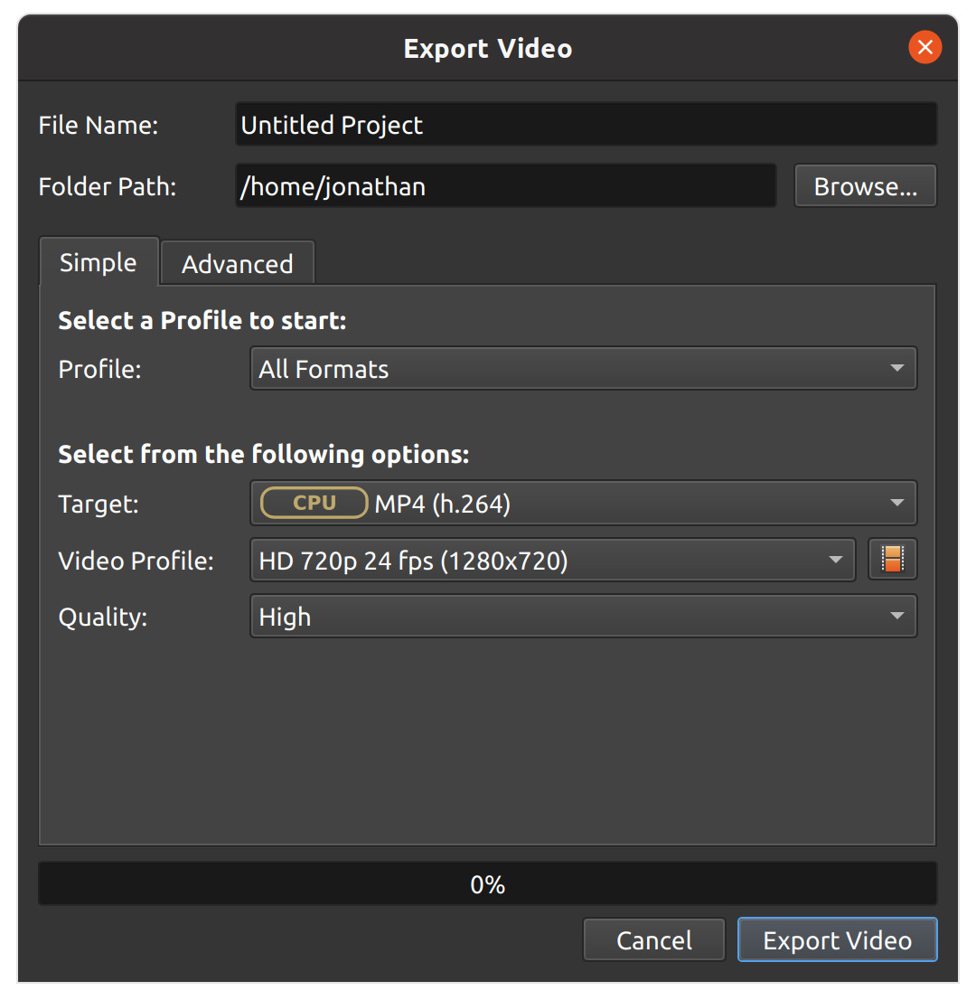

.. Copyright (c) 2008-2016 OpenShot Studios, LLC
 (http://www.openshotstudios.com). This file is part of
 OpenShot Video Editor (http://www.openshot.org), an open-source project
 dedicated to delivering high quality video editing and animation solutions
 to the world.

.. OpenShot Video Editor is free software: you can redistribute it and/or modify
 it under the terms of the GNU General Public License as published by
 the Free Software Foundation, either version 3 of the License, or
 (at your option) any later version.

.. OpenShot Video Editor is distributed in the hope that it will be useful,
 but WITHOUT ANY WARRANTY; without even the implied warranty of
 MERCHANTABILITY or FITNESS FOR A PARTICULAR PURPOSE.  See the
 GNU General Public License for more details.

.. You should have received a copy of the GNU General Public License
 along with OpenShot Library.  If not, see <http://www.gnu.org/licenses/>.

Export
======

Exporting converts your OpenShot project (clips, effects, animations, titles) into a single video output
file (using a process called ``video encoding``). By using the default settings, the exported video will be compatible
with most media players (such as VLC) and websites (such as YouTube, Vimeo, Facebook) and creates a
``MP4 (h.264 + AAC)`` formatted video file. See :ref:`profiles_mp4_h264_ref`.

Click on the :guilabel:`Export Video` icon at the top of the screen (or use the :guilabel:`File→Export Video` menu).
The default values will work fine, so just click the :guilabel:`Export Video` button to render your
new video. You can also create your own custom export profiles, see :ref:`profiles_ref`.

Simple Mode
-----------

While video encoding is very complicated, with dozens of interrelated settings and options, OpenShot
makes it easy, with sensible defaults, and most of this complexity hidden away behind our `Simple` tab,
which is the default export view.

.. table::
   :widths: 10 30

   ==================  ============
   Simple Setting      Description
   ==================  ============
   Profile             Common presets (combinations of presets and video profiles grouped by category, for example: **Web**)
   Target              Target presets related to the current profile (collections of common formats, codecs, and quality settings, see :ref:`preset_list_ref`)
   Video Profile       Video profiles related to the current target (collections of common size, frame rate, and aspect ratios, see :ref:`profile_list_ref` or create your own :ref:`profiles_ref`)
   Quality             Quality settings (low, med, high), which relate to various video and audio bitrates.
   ==================  ============

Advanced Mode
-------------

Most users will never need to switch to the `Advanced` tab, but if you need to customize any of the
video encoding settings, for example, custom bitrates, different codecs, or limiting the range of frames
exported, this is the tab for you.

Advanced Options
^^^^^^^^^^^^^^^^

.. image:: images/export-advanced.jpg

.. table::
   :widths: 10 30

   ==================  ============
   Advanced Setting    Description
   ==================  ============
   Export To           Export both `video & audio`, `only audio`, `only video`, or an `image sequence`
   Start Frame         The first frame to export (default is 1)
   End Frame           The final frame to export (default is the last frame in your project to contain a clip)
   ==================  ============

Profile
^^^^^^^

A video profile is a collection of common video settings (*size, frame rate, aspect ratio*). Profiles are used
during editing, previewing, and exporting to provide a quick way to switch between common combinations of
these settings. The :guilabel:`Export Dialog` will **default** to the same profile used by the project.

*NOTE: It is important to choose a **Profile** with the same **aspect ratio** used when editing your project. If
you are exporting at a **different aspect ratio**, it might stretch the image, crop the image, add black bars, or otherwise
introduce an issue which changes the exported video, making it appear differently than the :guilabel:`Preview` inside
OpenShot.*

.. image:: images/export-advanced-profile.jpg

.. table::
   :widths: 10 30

   ==================  ============
   Profile Setting     Description
   ==================  ============
   Profile             The video profile to use during export (collection of size, frame rate, and aspect ratios, see :ref:`profile_list_ref`)
   Width               The width of the video export (in pixels)
   Height              The height of the video export (in pixels)
   Aspect Ratio        The aspect ratio of the final exported video. 1920x1080 reduces to 16:9. This also takes into account the pixel ratio, for example 2:1 rectangular pixels will affect the aspect ratio.
   Pixel Ratio         The ratio representing pixel shape. Most video profiles use a 1:1 square pixel shape, but others will use rectangular pixels.
   Frame Rate          The frequency that the frames will be displayed at.
   Interlaced          Is this format used on alternating scan lines (i.e. broadcast and analog formats)
   ==================  ============

Image Sequence Settings
^^^^^^^^^^^^^^^^^^^^^^^

.. image:: images/export-advanced-image-seq.jpg

.. table::
   :widths: 10 30

   ==================  ============
   Image Setting Name  Description
   ==================  ============
   Image Format        The string format that represents the output file name in an sequence of images. For example, %05d.png would pad a number with 5 digits: 00001.png, 00002.png.
   ==================  ============

Video Settings
^^^^^^^^^^^^^^

.. image:: images/export-advanced-video.jpg

.. table::
   :widths: 10 30

   ==================  ============
   Video Setting Name  Description
   ==================  ============
   Video Format        The name of the container format (``mp4``, ``mov``, ``avi``, ``webm``, etc...)
   Video Codec         The name of the video codec used during video encoding (``libx264``, ``mpeg4``, ``libaom-av1``, etc...)
   Bit Rate / Quality  The bitrate to use for video encoding. Accepts the following formats: ``5 Mb/s``, ``96 kb/s``, ``23 crf``, etc...
   ==================  ============

Audio Settings
^^^^^^^^^^^^^^

.. image:: images/export-advanced-audio.jpg

.. table::
   :widths: 10 30

   ==================  ============
   Audio Setting Name  Description
   ==================  ============
   Audio Codec         The name of the audio codec used during audio encoding (``aac``, ``mp2``, ``libmp3lame``, etc...)
   Sample Rate         The number of audio samples per second. Common values are ``44100`` and ``48000``.
   Channel Layout      The number and layout of audio channels (``Stereo``, ``Mono``, ``Surround``, etc...)
   Bit Rate / Quality  The bitrate to use for audio encoding. Accepts the following formats: ``96 kb/s``, ``128 kb/s``, ``192 kb/s``, etc...
   ==================  ============
