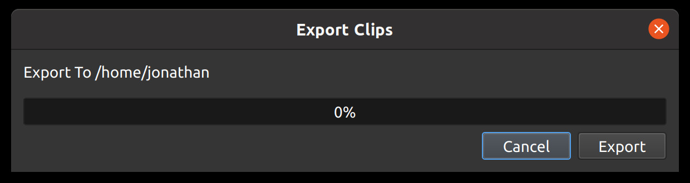

.. Copyright (c) 2008-2016 OpenShot Studios, LLC
 (http://www.openshotstudios.com). This file is part of
 OpenShot Video Editor (http://www.openshot.org), an open-source project
 dedicated to delivering high quality video editing and animation solutions
 to the world.

.. OpenShot Video Editor is free software: you can redistribute it and/or modify
 it under the terms of the GNU General Public License as published by
 the Free Software Foundation, either version 3 of the License, or
 (at your option) any later version.

.. OpenShot Video Editor is distributed in the hope that it will be useful,
 but WITHOUT ANY WARRANTY; without even the implied warranty of
 MERCHANTABILITY or FITNESS FOR A PARTICULAR PURPOSE.  See the
 GNU General Public License for more details.

.. You should have received a copy of the GNU General Public License
 along with OpenShot Library.  If not, see <http://www.gnu.org/licenses/>.

.. _files_ref:

Files
=====

To create a video, we need to make media files available to our project by importing files
into OpenShot. Most media file types are recognized, such as videos, images, and audio files.
Files can be viewed and managed in the **Project Files** panel.

Note that imported files are not copied anywhere, they remain in the physical location they
were before and are simply being made available to your video project. So, they must not be
deleted, renamed, or moved after adding them to your project. The "Show All", "Video", "Audio",
"Image" filters above the files allows you to only see the file types you are interested in.
You can also toggle the view between :guilabel:`details` and :guilabel:`thumbnails` view of your files.

.. _import_files_ref:

Import Files
------------
There are many different ways to import media files into an OpenShot project. When a file is imported successfully,
it will be automatically selected and scrolled into view (in the **Project Files** panel). Also, if the **Project Files** panel
is not currently visible, OpenShot will automatically display the panel.

.. table::
   :widths: 25 80

   ===========================  ============
   Import File Method           Description
   ===========================  ============
   Drag and Drop                Drag and drop the files from your file manager (file explorer, finder, etc...).
   Context menu (`File Menu`_)  Right click anywhere in the **Project Files** panel and choose :guilabel:`Import Files`.
   Main Menu                    In the main menu choose: :guilabel:`File\→Import Files`.
   Toolbar button               Click the :guilabel:`+` toolbar button in the main toolbar.
   Keyboard shortcut            Press :kbd:`Ctrl-F` (:kbd:`Cmd-F` on Mac).
   ===========================  ============

.. image:: images/quick-start-drop-files.jpg

.. _file_menu_ref:

File Menu
---------
To view the file menu, right click on a file (in the **Project Files** panel). Here are the actions you can use from the
file menu.

.. image:: images/file-menu.jpg

====================  ============
File Context Option   Description
====================  ============
Import Files...       Import files into your project
Thumbnail/Detail      Toggle the view between details and thumbnails
Preview File          Preview a media file
Split File            Split a file into many smaller files. The new trimmed files appear in the Project Files list.
Edit Title            Edit an existing title SVG file
Duplicate Title       Make a copy, and then edit the copied title SVG file
Add to Timeline       Add many files to the timeline in one step, including transitions or alternating tracks.
Choose Profile        Change the current project profile to match the selected file. If the file's profile does not match a known profile, it will give you the option to create a custom profile.
File Properties       View the properties of a file, such as frame rate, size, etc...
Remove from Project   Remove a file from the project
====================  ============

.. _split_clip_ref:

Split File
----------
If you need to cut a large video file into many smaller files before editing, the **Split File** dialog is built exactly for this
purpose. Right click on a file, and choose :guilabel:`Split File`. Use this dialog to quickly separate a large file into
many smaller segments. For each segment, you can select the starting and ending frame, and a title. Each segment appears
as a new file in the Project Files dialog.

.. image:: images/file-split-dialog.jpg

.. table::
   :widths: 5 20 80

   ==  ==================  ============
   #   Name                Description
   ==  ==================  ============
   1   Start of File       Choose the starting frame of your file by clicking this button
   2   End of File         Choose the ending frame of your file by clicking this button
   3   Name of File        Enter an optional name
   4   Create Button       Create the file (which resets this dialog, so you can repeat these steps for each segment)
   ==  ==================  ============

Please refer to the section :ref:`clips_cutting_slicing_ref` for more ways to cut and slice clips directly in the timeline.

Export Files
------------
If you want your split file segments available outside of your OpenShot project, or want to copy all your video assets to one place,
you can do this with the **Export Files** dialog. Simply :kbd:`Ctrl+Click` to select all the files you like,
then :kbd:`Right Click` and choose :guilabel:`Export Files`. In the dialog that appears, choose a destination folder, and
click :guilabel:`Export`.

NOTE: This will export each file or file segment using its **original video profile** (width, height, framerate, aspect ratio, etc...). It
also supports any :ref:`split_clip_ref` (described above). For example, if you have split a long video file into
many different segments (and named them), you can now export all the segments as separate video files (using the original
file's video profile).

Add to Timeline
---------------
In certain cases, you might need to add many files to the timeline at the same time. For example, a photo slideshow,
or a large number of short video clips. The **Add to Timeline** dialog can automate this task for you. First, select
all files you need to add, right click, and choose Add to Timeline.

.. image:: images/file-add-to-timeline.jpg

.. table::
   :widths: 5 28 80

   ==  ==================  ============
   #   Name                Description
   ==  ==================  ============
   1   Selected Files      The list of selected files that need to be added to the timeline
   2   Order of Files      Use these buttons to reorder the list of files (move up, move down, randomize, remove)
   3   Timeline Position   Choose the starting position and track where these files need to be inserted on the timeline
   4   Fade Options        Fade in, fade out, both, or none (only affects the image, and not audio)
   5   Zoom Options        Zoom in, zoom out, or none
   6   Transitions         Choose a specific transition to use between files, random, or none (only affects the image, and not the audio)
   ==  ==================  ============

.. _file_properties_ref:

Properties
----------
To view the properties of any imported file in your video project, right click on the file, and choose **File Properties**.
This will launch the file properties dialog, which displays information about your media file. For certain types of images
(i.e. image sequences), you can adjust the frame rate on this dialog also.

.. image:: images/file-properties.jpg

.. table::
   :widths: 5 24 60
   
   ==  ====================  ============
   #   Name                  Description
   ==  ====================  ============
   1   File Properties       Select an image sequence in the **Project Files** panel, right click and choose **File Properties**
   2   Frame Rate            For image sequences, you can also adjust the frame rate of the animation
   ==  ====================  ============

.. _file_remove_ref:

Remove from Project
-------------------

This will remove a file from the project. It will not delete the underlying physical file though, so removing a file from the project merely makes it unavailable for this video project.

Missing Files
-------------

When you create and save a project in OpenShot, any files imported into the software (such as videos, audio, and images) 
must remain accessible throughout the project's duration. This means that these imported files should not be renamed, deleted, 
or moved to different folders. Additionally, the full path where these files are located should not be renamed either. 
This principle applies to other video editing software as well.

For example, users might move or delete folders, unplug their USB devices, or move or delete their project files. Any of these examples 
cause a :guilabel:`Missing File` message, in which OpenShot prompts you to locate the folder of the missing file(s). Depending on the 
number of files you added to your project, OpenShot could prompt you many times to find the missing files.

When OpenShot saves a project, all file paths are converted to **relative** file paths. As long as you keep all assets organized in
the same parent folder (including the \*.osp project file), you will be able to move your project folder without triggering any
missing file(s) prompts. You can even move a self-contained project folder to another computer without any issues.

Everyone has their unique way of organizing files, and it's crucial to remember not to make changes to file paths, rename files, 
or delete files when working with video editors, as it can lead to missing file issues. For a detailed guide on missing file(s), 
see `The Case of “Missing Files”! <https://github.com/OpenShot/openshot-qt/wiki/Missing-File-Prompt>`_
