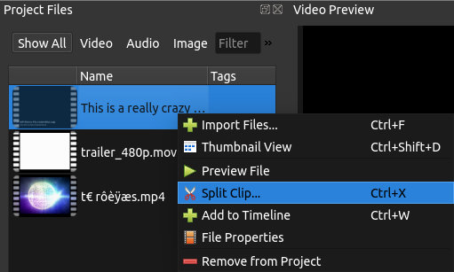
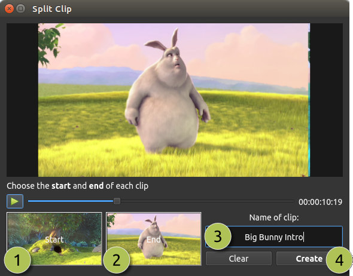
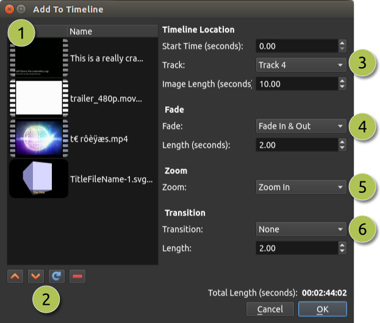
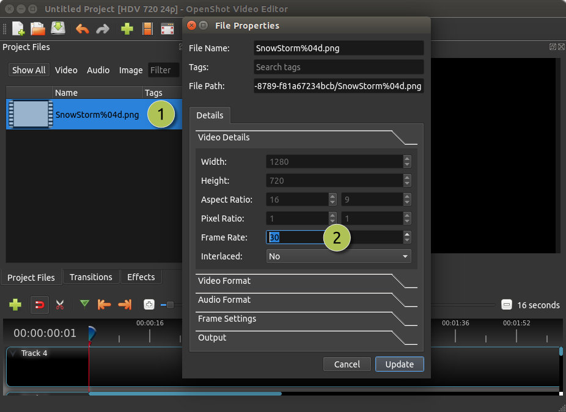

.. Copyright (c) 2008-2016 OpenShot Studios, LLC
 (http://www.openshotstudios.com). This file is part of
 OpenShot Video Editor (http://www.openshot.org), an open-source project
 dedicated to delivering high quality video editing and animation solutions
 to the world.

.. OpenShot Video Editor is free software: you can redistribute it and/or modify
 it under the terms of the GNU General Public License as published by
 the Free Software Foundation, either version 3 of the License, or
 (at your option) any later version.

.. OpenShot Video Editor is distributed in the hope that it will be useful,
 but WITHOUT ANY WARRANTY; without even the implied warranty of
 MERCHANTABILITY or FITNESS FOR A PARTICULAR PURPOSE.  See the
 GNU General Public License for more details.

.. You should have received a copy of the GNU General Public License
 along with OpenShot Library.  If not, see <http://www.gnu.org/licenses/>.

Files
=====

Before we can begin making a video, we need to import files into OpenShot. Most media file types are
recognized, such as videos, images, and audio files. Files can be viewed and managed in the **Project Files** panel.

Import Files
------------
There are many ways to import media files into OpenShot.

.. table::
     :widths: 25

     ====================  ============
     Name                  Description
     ====================  ============
     Drag and Drop         Drag and drop the files from your file manager (file explorer, finder, etc...)
     Right Click\→Import   Right click in the **Project Files** panel, choose **Import Files...**
     File Menu\→Import     File menu\→Import Files...
     Import Files Toolbar  Click the **Import Files...** toolbar button (on the top menu)
     ====================  ============

.. image:: images/quick-start-drop-files.jpg

File Menu
---------
To view the file menu, right click on a file (in the **Project Files** panel). Here are the actions you can use from the
file menu.

====================  ============
Name                  Description
====================  ============
Import Files...       Import files into your project
Thumbnail/Detail      Toggle the view between details and thumbnails
Preview File          Preview a media file
Split Clip...         Split a file into many smaller clips
Edit Title            Edit an existing title SVG file
Duplicate Title       Make a copy, and then edit the copied title SVG file
Add to Timeline       Add many files to the timeline in one step
File Properties       View the properties of a file, such as frame rate, size, etc...
Remove from Project   Remove a file from the project
====================  ============

Split Clip
----------
If you need to cut a file into many smaller clips before editing, the **Split Clip** dialog is built exactly for this
purpose. Right click on a file, and choose Split Clip... from the file menu. This opens the Split Clip dialog. Use this
dialog to quickly cut out as many small clips as you need. The dialog stays open after you create a clip, to allow you
to repeat the steps for your next clip. When you are finished, simply close the dialog.

.. table::
     :widths: 5 20

     ==  ==================  ============
     #   Name                Description
     ==  ==================  ============
     1   Start of Clip       Choose the starting frame of your clip by clicking this button
     2   End of Clip         Choose the ending frame of your clip by clicking this button
     3   Name of Clip        Enter an optional name
     4   Create Clip         Create the clip (which resets this dialog, so you can repeat these steps for each clip)
     ==  ==================  ============

Add to Timeline
---------------
In certain cases, you might need to add many files to the timeline at the same time. For example, a photo slide show,
or a large number of short video clips. The **Add to Timeline** dialog can automate this task for you. First, select
all files you need to add, right click, and choose Add to Timeline.

.. table::
     :widths: 5 28

     ==  ==================  ============
     #   Name                Description
     ==  ==================  ============
     1   Selected Files      The list of selected files that need to be added to the timeline
     2   Order of Files      Use these buttons to reorder the list of files (move up, move down, randomize, remove)
     3   Timeline Position   Choose the starting position and track where these files need to be inserted on the timeline
     4   Fade Options        Fade in, fade out, both, or none
     5   Zoom Options        Zoom in, zoom out, or none
     6   Transitions         Choose a specific transition to use between files, random, or none
     ==  ==================  ============

Properties
----------
To view the properties of any imported file in your video project, right click on the file, and choose **File Properties**.
This will launch the file properties dialog, which displays information about your media file. For certain types of images
(i.e. image sequences), you can adjust the frame rate on this dialog also.

.. table::
     :widths: 5 24
     
     ==  ====================  ============
     #   Name                  Description
     ==  ====================  ============
     1   File Properties       Select an image sequence in the **Project Files** panel, right click and choose **File Properties**
     2   Frame Rate            For image sequences, you can also adjust the frame rate of the animation
     ==  ====================  ============

