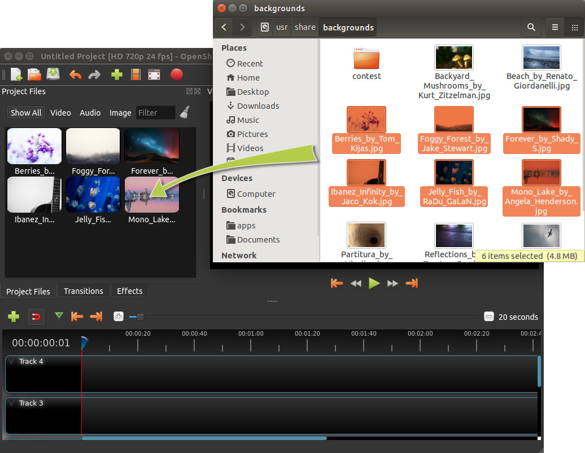
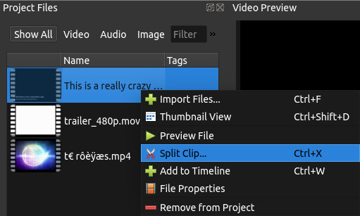
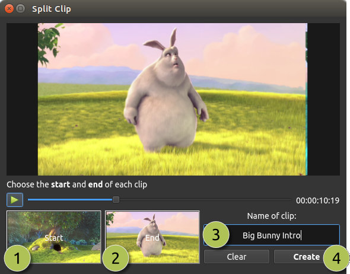
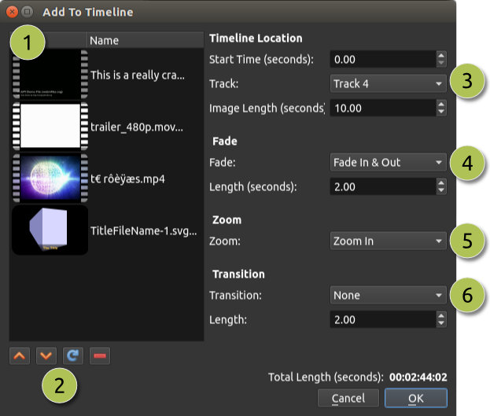
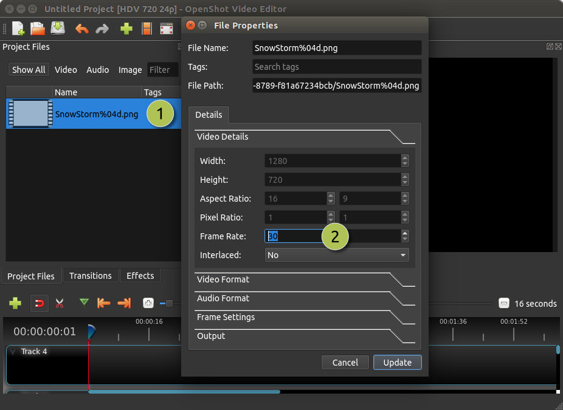

.. Copyright (c) 2008-2026 OpenShot Studios, LLC
 (http://www.openshotstudios.com). This file is part of
 OpenShot Video Editor (http://www.openshot.org), an open-source project
 dedicated to delivering high quality video editing and animation solutions
 to the world.

.. OpenShot Video Editor is free software: you can redistribute it and/or modify
 it under the terms of the GNU General Public License as published by
 the Free Software Foundation, either version 3 of the License, or
 (at your option) any later version.

.. OpenShot Video Editor is distributed in the hope that it will be useful,
 but WITHOUT ANY WARRANTY; without even the implied warranty of
 MERCHANTABILITY or FITNESS FOR A PARTICULAR PURPOSE.  See the
 GNU General Public License for more details.

.. You should have received a copy of the GNU General Public License
 along with OpenShot Library.  If not, see <http://www.gnu.org/licenses/>.

.. _files_ref:

Files
=====

To create a video, we need to make media files available to our project by importing files
into OpenShot. Most media file types are recognized, such as videos, images, and audio files.
Files can be viewed and managed in the **Project Files** panel.

Note that imported files are not copied anywhere, they remain in the physical location they
were before and are simply being made available to your video project. So, they must not be
deleted, renamed, or moved after adding them to your project. The "Show All", "Video", "Audio",
"Image" filters above the files allows you to only see the file types you are interested in.
You can also toggle the view between :guilabel:`details` and :guilabel:`thumbnails` view of your files.

.. _import_files_ref:

Import Files
------------
There are many different ways to import media files into an OpenShot project. When a file is imported successfully,
it will be automatically selected and scrolled into view (in the **Project Files** panel). Also, if the **Project Files** panel
is not currently visible, OpenShot will automatically display the panel.

.. table::
   :widths: 25 80

   ===========================  ============
   Import File Method           Description
   ===========================  ============
   Drag and Drop                Drag and drop the files from your file manager (file explorer, finder, etc...).
   Context menu (`File Menu`_)  Right click anywhere in the **Project Files** panel and choose :guilabel:`Import Files`.
   Main Menu                    In the main menu choose: :guilabel:`File\→Import Files`.
   Toolbar button               Click the :guilabel:`+` toolbar button in the main toolbar.
   Keyboard shortcut            Press :kbd:`Ctrl-F` (:kbd:`Cmd-F` on Mac).
   Paste from Clipboard         Press :kbd:`Ctrl-V` (:kbd:`Cmd-V` on Mac) to paste copied files from your clipboard. See :ref:`paste_from_clipboard_ref`.
   ===========================  ============

.. _paste_from_clipboard_ref:

Paste from Clipboard
--------------------
You can paste files and clipboard media straight into OpenShot. If you copied one or more files in your
file manager, switch to OpenShot and press :kbd:`Ctrl-V` in the **Project Files** panel to add them, just like importing.

If you copied media **data** (for example, **Copy Image** in a web browser, a pasted frame from another app, or other image/audio/video clipboard data),
press :kbd:`Ctrl-V` in OpenShot to create a file for that clipboard content. OpenShot saves a copy in a temporary folder:
``.openshot_qt/clipboard/``. The new file is then added to your project and appears in **Project Files**.

.. _file_menu_ref:

File Menu
---------
To view the file menu, right click on a file (in the **Project Files** panel). Here are the actions you can use from the
file menu.

.. list-table::
   :widths: 30 70
   :header-rows: 1

   * - File Context Option
     - Description
   * - Import Files...
     - Import files into your project
   * - Create with AI / Enhance with AI (Optional)
     - AI menu actions for generating or enhancing media files. These options are shown only when AI is enabled and the selected file type supports the workflow. See :ref:`ai_ref`.
   * - Details View
     - Switch the Project Files panel to details view
   * - Preview File
     - Preview a media file
   * - Split File
     - Split a file into many smaller files. The new trimmed files appear in the Project Files list.
   * - Export Files
     - Export selected files (and split segments) to a destination folder
   * - Add to Timeline
     - Add many files to the timeline in one step, including transitions or alternating tracks.
   * - Choose Profile
     - Change the current project profile to match the selected file. If the file's profile does not match a known profile, it will give you the option to create a custom profile.
   * - File Properties
     - View the properties of a file, such as frame rate, size, etc...
   * - Optimize
     - Create, link, unlink, or delete optimized preview files for the selected video files.
   * - Remove from Project
     - Remove a file from the project
   * - Edit Title
     - Edit an existing title SVG file (shown when an SVG title is selected)
   * - Duplicate Title
     - Make a copy, and then edit the copied title SVG file (shown when an SVG title is selected)

Preview File
------------
The :guilabel:`Preview File` action opens the Preview dialog for the
selected file from :guilabel:`Project Files`. Simply double check a file to open this dialog.

- Playback starts automatically.
- Loop is enabled by default.
- Press :kbd:`Space` to toggle play/pause.
- Use the mouse scroll wheel to zoom in/out.
- A :guilabel:`Reset Zoom` button appears when zoom is not 100%, and resets to 100%.

Optimize
--------
Optimized preview files are lower-resolution copies of your source video files (sometimes referred to as proxy files),
used to improve editing responsiveness without changing the original media. They are especially helpful with large
formats such as 4K, high frame rate, or high bitrate footage.

For video files, the file context menu includes an :guilabel:`Optimize` submenu. This feature creates or links
smaller preview copies of your source clips, which can improve playback and scrubbing on slower systems or with
high-resolution footage. Optimizing also pre-loads thumbnails to further improve the editing smoothness when
zooming into the timeline.

The :guilabel:`Optimize` submenu contains these actions:

.. list-table::
   :widths: 30 70
   :header-rows: 1

   * - Action
     - Description
   * - Optimize Video
     - Create an optimized preview file for each selected video file. OpenShot stores these files in the project's ``optimized`` assets folder.
   * - Link to Existing...
     - Choose a folder containing already-created optimized files and link the best matching files to the selected source clips. This supports common proxy naming styles, known proxy suffixes, file ID suffixes, and extension changes.
   * - Unlink
     - Remove the optimized preview link from the selected file without deleting the optimized file from disk.
   * - Delete & Unlink
     - Delete the linked optimized file from disk, then remove the link from the selected file.

When optimization is in progress, the submenu changes to a single :guilabel:`Cancel` action for the selected file(s).
Optimized preview files are used only for editing and preview playback. Your final export still uses the original source files.

When you use :guilabel:`Link to Existing...`, OpenShot tries to match each selected source clip to an existing optimized
file in a safe order. It first looks for the same base filename with a different video extension, then for common
proxy-style names such as ``_proxy``, ``_preview``, ``_optimized``, ``_lowres``, resolution tags such as ``_720p``
or ``_1080p``, and camera/editor-style variants such as ``_p``. It also supports names that add the OpenShot file ID
after a known proxy suffix, such as ``clip001_proxy_F1.mp4``, and it can still match files named only by file ID,
such as ``F1.mp4``.

Best practice when bringing your own optimized files is to keep the same base filename as the source clip and add a
clear proxy-style suffix, for example ``clip001_proxy.mp4`` or ``clip001_proxy.mov``. If you need to avoid filename
collisions, append the OpenShot file ID after the proxy suffix, for example ``clip001_proxy_F1.mp4``. Avoid unrelated
suffixes such as ``_final`` or ``_reviewcopy``, because OpenShot does not treat those as safe proxy naming patterns.

.. _split_clip_ref:

Split File
----------
Use **Split File** to choose the parts of a longer recording you want to work with. Right click a file
in **Project Files** and choose :guilabel:`Split File`. Select the start and end of a segment, give it an
optional name, and click :guilabel:`Create`. Repeat to prepare as many segments as you need.

Each segment appears in Project Files and can be added to the timeline like any other file. The segments
all use the original media on disk, so you can prepare them without making extra copies of the recording.

When you add a segment to the timeline, OpenShot gives its properties starting keyframes at the segment's
beginning. For example, with :ref:`auto_keyframes_ref` on, you can move to the end and change the rotation
to make it turn over the length of that segment. The animation starts from the part you chose to use.

If you have already animated a timeline clip, slicing it preserves that animation through the cut.
Split File is useful for choosing your segments before you begin that work.

.. table::
   :widths: 5 20 80

   ==  ==================  ============
   #   Name                Description
   ==  ==================  ============
   1   Start of File       Choose the starting frame of your file by clicking this button
   2   End of File         Choose the ending frame of your file by clicking this button
   3   Name of File        Enter an optional name
   4   Create Button       Add the segment to Project Files and reset the dialog to prepare another segment
   ==  ==================  ============

Please refer to the section :ref:`clips_cutting_slicing_ref` for more ways to cut and slice clips directly in the timeline.

Export Files
------------
If you want your split file segments available outside of your OpenShot project, or want to copy all your video assets to one place,
you can do this with the **Export Files** dialog. Simply :kbd:`Ctrl+Click` to select all the files you like,
then :kbd:`Right Click` and choose :guilabel:`Export Files`. In the dialog that appears, choose a destination folder, and
click :guilabel:`Export`.

NOTE: This will export each file or file segment using its **original video profile** (width, height, framerate, aspect ratio, etc...). It
also supports any :ref:`split_clip_ref` (described above). For example, if you have split a long video file into
many different segments (and named them), you can now export all the segments as separate video files (using the original
file's video profile).

Add to Timeline
---------------
In certain cases, you might need to add many files to the timeline at the same time. For example, a photo slideshow,
or a large number of short video clips. The **Add to Timeline** dialog can automate this task for you. First, select
all files you need to add, right click, and choose Add to Timeline.

.. table::
   :widths: 5 28 80

   ==  ==================  ============
   #   Name                Description
   ==  ==================  ============
   1   Selected Files      The list of selected files that need to be added to the timeline
   2   Order of Files      Use these buttons to reorder the list of files (move up, move down, randomize, remove)
   3   Timeline Position   Choose the starting position and track where these files need to be inserted on the timeline
   4   Fade Options        Fade in, fade out, both, or none (only affects the image, and not audio)
   5   Zoom Options        Zoom in, zoom out, or none
   6   Transitions         Choose a specific transition to use between files, random, or none (only affects the image, and not the audio)
   ==  ==================  ============

.. _file_properties_ref:

Properties
----------
To view the properties of any imported file in your video project, right click on the file, and choose **File Properties**.
This will launch the file properties dialog, which displays information about your media file. For certain types of images
(i.e. image sequences), you can adjust the frame rate on this dialog also.

.. table::
   :widths: 5 24 60
   
   ==  ====================  ============
   #   Name                  Description
   ==  ====================  ============
   1   File Properties       Select an image sequence in the **Project Files** panel, right click and choose **File Properties**
   2   Frame Rate            For image sequences, you can also adjust the frame rate of the animation
   ==  ====================  ============

.. _file_remove_ref:

Remove from Project
-------------------

Removing an entry from **Project Files** does not delete the source media from disk.

You can import the file again whenever you need it. For example, after preparing several
:ref:`Split File segments <split_clip_ref>` and removing the original from Project Files, you might want
to use a different part of the recording. Import it again to work with the whole recording; your existing
segments stay as they are. If the original is already in Project Files, importing it again selects it.

.. _project_assets_folder_ref:

Project Assets Folder
---------------------
OpenShot creates and uses a few **temporary working folders** while you edit. These live under
``.openshot_qt/`` in your user profile and hold project-specific files that OpenShot generates for you:

* ``.openshot_qt/blender/`` - Blender animation renders created by the Animated Title dialog
* ``.openshot_qt/title/`` - SVG title files created by the Title dialog
* ``.openshot_qt/thumbnail/`` - Thumbnails generated for Project Files and Timeline
* ``.openshot_qt/clipboard/`` - Media created from clipboard pastes (images, audio, or video that must be saved to disk first)
* ``.openshot_qt/optimized/`` - Optimized preview files created for smoother editing
* ``.openshot_qt/protobuf_data`` - Tracking and object detection data

When you choose **File→Save As**, OpenShot copies these folders into your project directory, inside a single folder named
``PROJECTNAME_Assets``. For example: ``MyProject_Assets/clipboard`` will contain any media you pasted from the clipboard,
and ``MyProject_Assets/optimized`` will contain any optimized preview files linked to the project.

As part of this process, all paths inside your ``*.osp`` project file are updated to be **relative** to your project folder.

Missing Files
-------------

When you create and save a project in OpenShot, any files imported into the software (such as videos, audio, and images) 
must remain accessible throughout the project's duration. This means that these imported files should not be renamed, deleted, 
or moved to different folders. Additionally, the full path where these files are located should not be renamed either. 
This principle applies to other video editing software as well.

For example, users might move or delete folders, unplug their USB devices, or move or delete their project files. Any of these examples 
cause a :guilabel:`Missing File` message, in which OpenShot prompts you to locate the folder of the missing file(s). Depending on the 
number of files you added to your project, OpenShot could prompt you many times to find the missing files.

When OpenShot saves a project, all file paths are converted to **relative** file paths. As long as you keep all assets organized in
the same parent folder (including the \*.osp project file), you will be able to move your project folder without triggering any
missing file(s) prompts. You can even move a self-contained project folder to another computer without any issues.

Everyone has their unique way of organizing files, and it's crucial to remember not to make changes to file paths, rename files, 
or delete files when working with video editors, as it can lead to missing file issues. For a detailed guide on missing file(s), 
see `The Case of “Missing Files”! <https://github.com/OpenShot/openshot-qt/wiki/Missing-File-Prompt>`_
