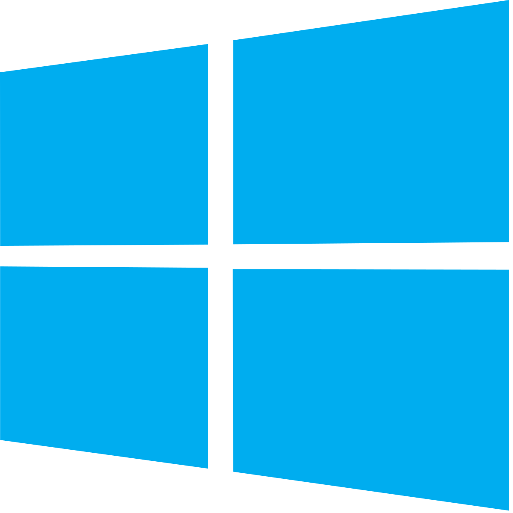

.. Copyright (c) 2008-2020 OpenShot Studios, LLC
 (http://www.openshotstudios.com). This file is part of
 OpenShot Video Editor (http://www.openshot.org), an open-source project
 dedicated to delivering high quality video editing and animation solutions
 to the world.

.. OpenShot Video Editor is free software: you can redistribute it and/or modify
 it under the terms of the GNU General Public License as published by
 the Free Software Foundation, either version 3 of the License, or
 (at your option) any later version.

.. OpenShot Video Editor is distributed in the hope that it will be useful,
 but WITHOUT ANY WARRANTY; without even the implied warranty of
 MERCHANTABILITY or FITNESS FOR A PARTICULAR PURPOSE.  See the
 GNU General Public License for more details.

.. You should have received a copy of the GNU General Public License
 along with OpenShot Library.  If not, see <http://www.gnu.org/licenses/>.

Getting Started
===============

|openshot| OpenShot Video Editor is available for most operating systems, including |linux| Linux (most distributions), |mac| Apple Mac OS X, and |win| Microsoft Windows.  View the System Requirements section below before downloading the latest version from the official OpenShot `download page <https://www.openshot.org/download/>`_.

.. _gs-System-Requrements_ref:

System Requirements
-------------------
Video editing benefits from large amounts of memory, modern multi-core CPUs, and fast disks. Basically, you want the best computer you can afford when editing video. Here are the minimum system requirements and the recommended system requirements:

.. list-table:: 
   :widths: 50 50
   :header-rows: 1

   * - Minimum Requirements
     - Recommended Requirements
   * - 64-bit Operatinng System
       | * Linux 
       | * Mac OS X 10.9.5+ 
       | * Microsoft Windows 7/8/8.1/10
     - 64-bit Operating System
       | * Linux 
       | * Mac OS X 10.15+ 
       | * Microsoft Windows 10+
   * - Multi-core processor
     - Quad-core 64-bit processor
       | * AMD Ryzen 9
       | * Intel Core i9
   * - 4 GB RAM
     - 16 GB DDR 4 RAM
   * - 500 MB HDD 
     - | 10GB SDD 
       | (SATA III, PCIe or PCIe NVMe)

.. _gs-linux_ref: 

Linux
-----
Download the AppImage file from the project website (|Link|_).  Once downloaded, right click the AppImage file, choose Properties, and mark the file as **Executable**.  Double click the AppImage to launch it.

.. _gs-mac_ref: 

Mac
---
Download the DMG file from the project website (|Link|_), double click it, then drag the OpenShot application icon into your **Applications** shortcut. This is very similar to how most other Mac applications are installed. Now launch OpenShot by double-clicking the icon.

.. _gs-win_ref:

Windows
-------
Download the Windows installer executable from the project website (|link|_), double click it, and follow the directions on screen. Once completed, OpenShot will be installed and available in your Start menu.

.. |mac| image:: images/mac-logo.svg
    :height: 20px

.. |Link| replace:: download page
.. _Link: https://www.openshot.org/download/

.. Link the icons to the sections in the document
