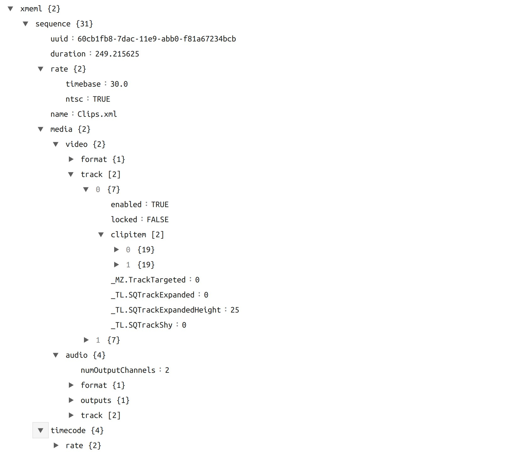

.. Copyright (c) 2008-2016 OpenShot Studios, LLC
 (http://www.openshotstudios.com). This file is part of
 OpenShot Video Editor (http://www.openshot.org), an open-source project
 dedicated to delivering high quality video editing and animation solutions
 to the world.

.. OpenShot Video Editor is free software: you can redistribute it and/or modify
 it under the terms of the GNU General Public License as published by
 the Free Software Foundation, either version 3 of the License, or
 (at your option) any later version.

.. OpenShot Video Editor is distributed in the hope that it will be useful,
 but WITHOUT ANY WARRANTY; without even the implied warranty of
 MERCHANTABILITY or FITNESS FOR A PARTICULAR PURPOSE.  See the
 GNU General Public License for more details.

.. You should have received a copy of the GNU General Public License
 along with OpenShot Library.  If not, see <http://www.gnu.org/licenses/>.

Import & Export
===============

Video editing projects (including tracks, clips, and keyframes) can be **imported** and **exported** from OpenShot
Video Editor in widely supported formats (**EDL**: Edit Decision Lists, and **XML**: Final Cut Pro format). For example, if
you start editing a video in a different program (Adobe Premier, Final Cut Pro, etc...), but later need to move all
your edits to OpenShot (or vice versa).

EDL (Edit Decision Lists)
-------------------------
The following features are supported when importing and exporting an EDL file with OpenShot.

.. table::
   :widths: 25

   ====================  ============
   Name                  Description
   ====================  ============
   EDL Format            CMX-3600 (a very widely supported variation)
   Single Track          Only a single track can be imported at a time (this is a limitation of the EDL format)
   Tape Name             Only **AX** and **BL** tape names are currently supported in OpenShot
   Edits (V and A)       Only edits are currently supported (transitions are not yet supported)
   Opacity               Opacity keyframes are supported
   Audio Levels          Volume keyframes are supported
   ====================  ============

.. code-block:: python
   :caption: Example EDL format supported by OpenShot:

    TITLE: Clips - TRACK 5
    FCM: NON-DROP FRAME

    001  BL       V     C        00:00:00:01 00:00:03:17 00:00:00:01 00:00:03:17
    001  AX       V     C        00:00:00:01 00:00:10:01 00:00:03:17 00:00:13:17
    * FROM CLIP NAME: Intro.png

    002  BL       V     C        00:00:00:01 00:00:05:09 00:00:13:17 00:00:18:25
    002  AX       V     C        00:00:00:01 00:00:10:01 00:00:18:25 00:00:28:25
    * FROM CLIP NAME: FileName.mp4
    * OPACITY LEVEL AT 00:00:00:01 IS 0.00%  (REEL AX)
    * OPACITY LEVEL AT 00:00:01:01 IS 100.00%  (REEL AX)
    * OPACITY LEVEL AT 00:00:09:01 IS 100.00%  (REEL AX)
    * OPACITY LEVEL AT 00:00:10:01 IS 0.00%  (REEL AX)

    003  BL       V     C        00:00:00:01 00:00:33:15 00:00:28:25 00:01:02:09
    003  AX       V     C        00:00:14:25 00:00:34:29 00:01:02:09 00:01:22:13
    003  AX       A     C        00:00:14:25 00:00:34:29 00:01:02:09 00:01:22:13
    * FROM CLIP NAME: FileName2.mp4

    004  BL       V     C        00:00:00:01 00:00:26:25 00:01:22:13 00:01:49:07
    004  AX       A     C        00:00:00:01 00:02:20:01 00:01:49:07 00:04:09:07
    * FROM CLIP NAME: Music.wav
    * AUDIO LEVEL AT 00:00:00:01 IS -99.00 DB  (REEL AX A1)
    * AUDIO LEVEL AT 00:00:03:01 IS 0.00 DB  (REEL AX A1)
    * AUDIO LEVEL AT 00:02:17:01 IS 0.00 DB  (REEL AX A1)
    * AUDIO LEVEL AT 00:02:20:01 IS -99.00 DB  (REEL AX A1)

XML (Final Cut Pro format)
--------------------------
The following features are supported when importing and exporting an XML file with OpenShot. This XML format
is supported in many video editors (not just Final Cut Pro). In fact, most commercial video editors have some
support for importing and exporting this same XML format.

.. table::
   :widths: 25

   ====================  ============
   Name                  Description
   ====================  ============
   XML Format            Final Cut Pro format (but most commercial video editors also support this format)
   All Tracks            All video and audio tracks are supported
   Edits                 All clips on all tracks are supported (video, image, and audio files). Transitions are not yet supported.
   Opacity               Opacity keyframes are supported
   Audio Levels          Volume keyframes are supported
   ====================  ============

Example XML Output (tree view)
^^^^^^^^^^^^^^^^^^^^^^^^^^^^^^

