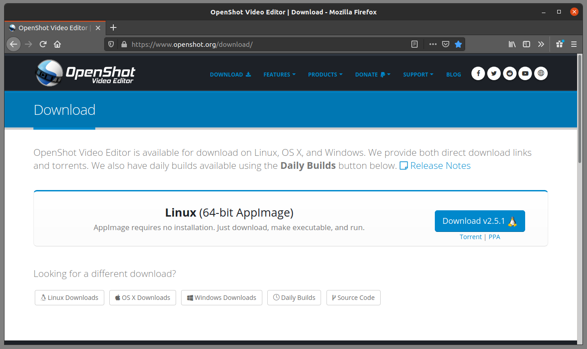
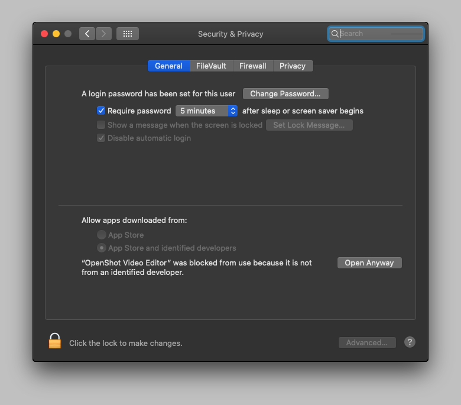

.. Copyright (c) 2008-2020 OpenShot Studios, LLC
 (http://www.openshotstudios.com). This file is part of
 OpenShot Video Editor (http://www.openshot.org), an open-source project
 dedicated to delivering high quality video editing and animation solutions
 to the world.

.. OpenShot Video Editor is free software: you can redistribute it and/or 
 modify it under the terms of the GNU General Public License as published by
 the Free Software Foundation, either version 3 of the License, or
 (at your option) any later version.

.. OpenShot Video Editor is distributed in the hope that it will be useful,
 but WITHOUT ANY WARRANTY; without even the implied warranty of
 MERCHANTABILITY or FITNESS FOR A PARTICULAR PURPOSE.  See the
 GNU General Public License for more details.

.. You should have received a copy of the GNU General Public License
 along with OpenShot Library.  If not, see <http://www.gnu.org/licenses/>.

.. Edited September 27, 2020 - [USA]TechDude

Install |ops| OpenShot
-----------------------

OpenShot™ is available for the following 64-bit operating systems: Microsoft 
Windows®, Linux® (most distributions), and Apple® macOS®.

|win| Windows®
^^^^^^^^^^^^^^

Download the Windows installer executable from the official OpenShot |Link|_.

Choose to save the file to your system so you can launch the installer after 
the download completes.

Once downloaded, launch the EXE file, and follow the directions on screen. 
Choose the language that you want to use if it is not already highlighted in 
the pull-down menu. 

Read the License Agreement and select the radio button in front of "I accept 
the agreement" if you agree to the terms.

Choose where to install OpenShot or use the default path provided.

Select any additional shortcuts that you want setup to create when it installs 
the application.

Review the options for installing OpenShot.  Click the back button to make 
changes or click Install to install OpenShot on your system.

.. image:: images/install-win7.png

When Setup completes, you can choose to launch the program by leaving the check 
in the box next to "Launch OpenShot Video Editor" and clicking "Finish".

Setup created an icon in your Start Menu from where you can launch the program.

|lin| Linux®
^^^^^^^^^^^^

Download the Linux AppImage from the official OpenShot |Link|_.  

Choose to save the file to your computer.

Once downloaded, move the file to the folder where it will live.  

Right-click the AppImage file, click Properties then mark the file as 
**Executable**.  

Double-click the AppImage file to launch the application.

|mac| macOS®
^^^^^^^^^^^^

Download the disk image (DMG) file from the official OpenShot |Link|_.  

Choose to save the file to your system so you can launch the installer after 
the download completes.

Double-click the DMG file to open the image.  This allows you to drag the 
application to your Applications folder.

Locate the icon in your Applications folder and double-click it to launch 
OpenShot.

If you receive an error message that states: 

.. image:: images/error-mac1.png

you can correct this issue. Apple macOS needs permission to run the file that 
you downloaded from the Internet. There are a couple of methods that may work. 
Please try the procedures below (in order) to see if one of them works for you.

1. Go to System Preferences >> Security & Privacy >> General >> Click the lock 
in the bottom left corner >> Enter your password >> Click Unlock >> Click Open 
anyway near the bottom >> Open.

2. Go to System Preferences >> Security & Privacy >> General. You might see one 
or more alerts near the bottom that says:

Click "Open".  Also, ensure that you select the "App Store and identified 
developers" radio button on the same tab.

.. inline replacements for images

.. |mac| image:: images/logo-mac.png
    :height: 20px
.. |win| image:: images/logo-win.png
    :height: 20px
.. |ops| image:: images/logo-ops.png
    :height: 20px
.. |Link| replace:: download page
.. _Link: https://www.openshot.org/download/