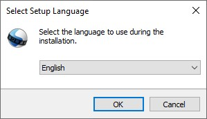
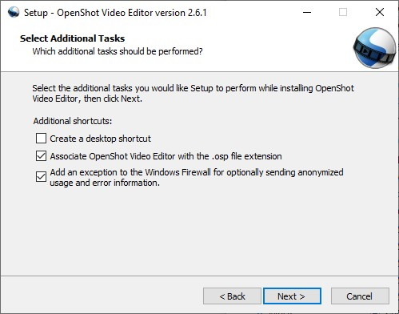
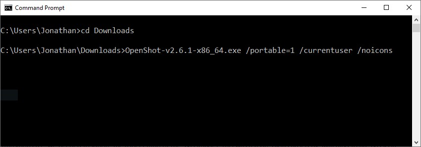
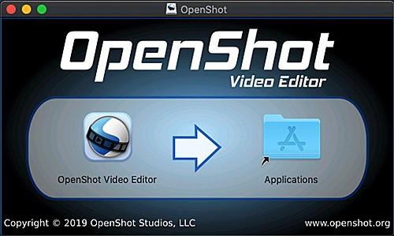
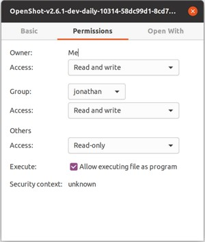

.. Copyright (c) 2008-2020 OpenShot Studios, LLC
 (http://www.openshotstudios.com). This file is part of
 OpenShot Video Editor (http://www.openshot.org), an open-source project
 dedicated to delivering high quality video editing and animation solutions
 to the world.

.. OpenShot Video Editor is free software: you can redistribute it and/or modify
 it under the terms of the GNU General Public License as published by
 the Free Software Foundation, either version 3 of the License, or
 (at your option) any later version.

.. OpenShot Video Editor is distributed in the hope that it will be useful,
 but WITHOUT ANY WARRANTY; without even the implied warranty of
 MERCHANTABILITY or FITNESS FOR A PARTICULAR PURPOSE.  See the
 GNU General Public License for more details.

.. You should have received a copy of the GNU General Public License
 along with OpenShot Library.  If not, see <http://www.gnu.org/licenses/>.

Installation
============

The latest **stable** version of OpenShot Video Editor for Linux,
Mac, Chrome OS, and Windows can be downloaded from the official download page at
https://www.openshot.org/download/. You can find our latest **unstable** versions
(i.e. daily builds) at https://www.openshot.org/download#daily (these versions are
updated very frequently, and often contain many improvements not yet released in our stable
build).

Windows (Installer)
^^^^^^^^^^^^^^^^^^^

Download the Windows installer from the `official download page
<https://www.openshot.org/download/>`_ (the download page contains both 64-bit and
32-bit versions), double click it, and follow the directions on screen. Once completed,
OpenShot will be installed and available in your Start menu.

Windows (Portable)
^^^^^^^^^^^^^^^^^^

If you need to install OpenShot on Windows without Administrator permissions,
we also support a portable installation process. Download the Windows installer
from the `official download page <https://www.openshot.org/download/>`_, open the command prompt,
and type the following commands:

..  code-block:: console
    :caption: Install portable version of OpenShot (no administrator permissions required)

    cd C:\Users\USER\Downloads\
    OpenShot-v2.6.1-x86_64.exe /portable=1 /currentuser /noicons

Mac
^^^

Download the DMG file from the `official download page
<https://www.openshot.org/download/>`_, double click it, and then drag the OpenShot application
icon into your **Applications** shortcut. This is very similar to how most Mac applications are
installed. Now launch OpenShot from `Launchpad` or `Applications` in Finder.

Linux (AppImage)
^^^^^^^^^^^^^^^^

Most Linux distributions have a version of OpenShot in their software
repositories, which can be installed using your package manager / software store.
However, these packaged versions are often very outdated (be sure to check the version number:
:guilabel:`Help→About OpenShot`). For this reason, we recommend installing an AppImage from the
`official download page <https://www.openshot.org/download/>`_.

Once downloaded, right click on the AppImage, choose Properties, and mark the file as **Executable**.
Finally, double click the AppImage to launch OpenShot. If double clicking does not launch OpenShot, you can also
right click on the AppImage, and choose `Execute` or `Run`. For a detailed guide on installing our AppImage
and creating a launcher for it, see our
`AppImage Installation Guide <https://github.com/OpenShot/openshot-qt/wiki/AppImage-Installation>`_.

Linux (PPA)
^^^^^^^^^^^

For Debian-based Linux distributions (Ubuntu, Mint, etc...), we also have a PPA
(Personal Package Archive), which adds our official OpenShot software repository to your package
manager, making it possible to install our latest version, without relying on our AppImages.

..  code-block:: console
    :caption: Stable PPA (Contains only official releases)

    sudo add-apt-repository ppa:openshot.developers/ppa
    sudo apt update
    sudo apt install openshot-qt python3-openshot

..  code-block:: console
    :caption: Daily PPA (Highly experimental and unstable, for testers)

    sudo add-apt-repository ppa:openshot.developers/libopenshot-daily
    sudo apt update
    sudo apt install openshot-qt python3-openshot

Chrome OS (Chromebook)
^^^^^^^^^^^^^^^^^^^^^^

Chrome OS supports Linux apps, but this feature is off by default. You can turn it on in *Settings*.
Once Linux is enabled, you can install and run OpenShot Linux AppImages on any *x86-based*
Chromebook. The command below will download our AppImage and configure your system to run
OpenShot successfully.

- Navigate to *chrome://os-settings/crostini* (Copy/Paste)
- Under "Linux (Beta)" select "Turn On". Default values are fine.
- When the Terminal appears (i.e. black window), Copy/Paste the following command:
    - ``bash <(wget -O - http://openshot.org/files/chromeos/install-stable.sh)``
