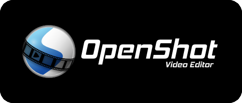
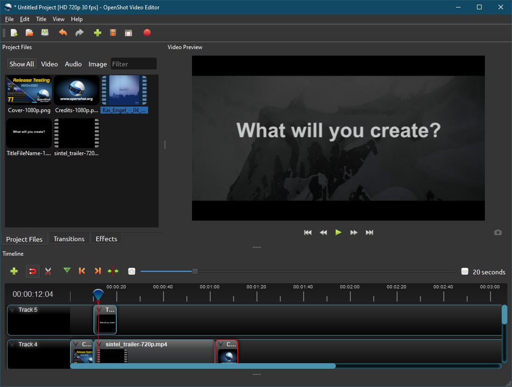

.. Copyright (c) 2008-2020 OpenShot Studios, LLC
 (http://www.openshotstudios.com). This file is part of
 OpenShot Video Editor (http://www.openshot.org), an open-source project
 dedicated to delivering high quality video editing and animation solutions
 to the world.

.. OpenShot Video Editor is free software: you can redistribute it and/or 
 modify it under the terms of the GNU General Public License as published by
 the Free Software Foundation, either version 3 of the License, or
 (at your option) any later version.

.. OpenShot Video Editor is distributed in the hope that it will be useful,
 but WITHOUT ANY WARRANTY; without even the implied warranty of
 MERCHANTABILITY or FITNESS FOR A PARTICULAR PURPOSE.  See the
 GNU General Public License for more details.

.. You should have received a copy of the GNU General Public License
 along with OpenShot Library.  If not, see <http://www.gnu.org/licenses/>.

.. Edited September 27, 2020 - [USA]TechDude

User Guide
==========

This guide is a simple how-to to get the user started with enough information 
to create a small, quick video by the end of the Quick Tutorial.  For more 
in-depth information regarding |ops| OpenShot™, please refer to the 
`User Manual <manual.html>`__.

Introduction
------------

We created |ops| OpenShot™ in 2008 to build a free, open-source video editor 
for Linux.  We designed OpenShot™ to be easy to use, quick to learn, and a 
powerful video editor.  Quickly cut, slice, and edit any clip or video.  
OpenShot™ is available for the following 64-bit operating systems:

 -  |win| `Microsoft® Windows® <install.html#win-windows>`_
 -  |lin| `Linux® (most distributions) <install.html#lin-linux>`_
 -  |mac| `Apple® macOS® <install.html#mac-macos>`_
 
Users have downloaded OpenShot™ millions of times, and it continues to grow as 
a project.  OpenShot™ Video Editor is an award-winning, open-source video 
editor that can create stunning videos, films, and animations with an 
easy-to-use interface and a rich feature-set.

Features
--------
OpenShot™ Video Editor has many abilities and features, including:

- 2D animation support
- 3D animated titles support
- Advanced Timeline (including Drag & Drop, scrolling, zooming, and snapping)
- Audio mixing and editing (multiple channel support)
- Clip resizing, scaling, trimming, snapping, rotation, and cutting
- Compositing, image overlays, watermarks
- Cross-platform (Supports Linux, macOS, and Windows)
- Desktop integration (Drag & Drop support)
- Digital video effects (including brightness, gamma, hue, and gray-scale)
- Frame accuracy (step through each frame of video)
- Powerful curve-based Key frame animations
- Scrolling motion picture credits
- Support for many `video, audio, and image formats 
  <https://en.wikipedia.org/wiki/FFmpeg#Supported_codecs_and_formats>`_
- SVG friendly, to create and include vector titles and credits
- Time-mapping and speed changes on clips (slow/fast, forward/backward, etc.)
- Title templates, title creation, sub-titles
- Unlimited tracks/layers for video editing
- Video transitions with real-time previews
- and many more!

Screenshot
----------

System Requirements
-------------------

Video editing uses sizable amounts of memory, modern multi-core CPUs, and 
fast internal storage.  It is always best to have as much memory as possible.  
You will also want a powerful processor.  You can manage using any processor 
with a speed of 2.4 gigahertz (GHz) or higher.  Finally, you will want to make 
sure you have plenty of storage available to hold the software and video 
with which you will be working.  A Solid State Device (SSD) provides faster 
disk access which helps when finalizing your project.  Most modern computers 
should work well with OpenShot™.

When editing video with OpenShot™, you want a computer system that meets these 
**minimum system requirements**:

- 64-bit Multi-core processor (2.4+ GHz)
- 4 GB of Random-Access Memory (RAM)
- 500 MB of free storage space for installation
- 500 GB of internal storage space for processing
- 64-bit Operating System (Linux, macOS, Windows 64-bit)
- Monitor or laptop display capable of 1280x720 (720P) resolution

A more in depth version of the System Requirements is available in the 
`User Manual <manual.html#system-requirements>`_.

License
-------

OpenShot™ Video Editor is Free and Open Source Software (FOSS).  It is fully
functional without limitations or restrictions on use.  You can redistribute it 
and change it under the terms of the GNU General Public License as published by 
the Free Software Foundation, either version 3 of the License, or (at your 
option) any later version.

OpenShot Studios, LLC distributes OpenShot™ Video Editor in the hope that it 
will be useful, but WITHOUT ANY WARRANTY; without even the implied warranty of 
MERCHANTABILITY or FITNESS FOR A PARTICULAR PURPOSE.  See the 
`GNU General Public License <https://www.gnu.org/licenses/gpl-3.0.en.html>`_
for more details.

.. inline replacements for images

.. |Link| replace:: download page
.. _Link: https://www.openshot.org/download/
