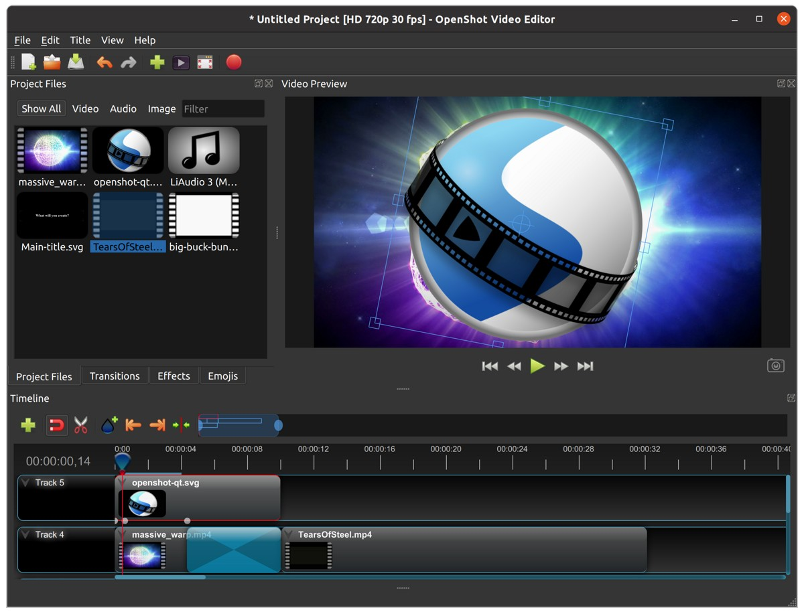

.. Copyright (c) 2008-2020 OpenShot Studios, LLC
 (http://www.openshotstudios.com). This file is part of
 OpenShot Video Editor (http://www.openshot.org), an open-source project
 dedicated to delivering high quality video editing and animation solutions
 to the world.

.. OpenShot Video Editor is free software: you can redistribute it and/or modify
 it under the terms of the GNU General Public License as published by
 the Free Software Foundation, either version 3 of the License, or
 (at your option) any later version.

.. OpenShot Video Editor is distributed in the hope that it will be useful,
 but WITHOUT ANY WARRANTY; without even the implied warranty of
 MERCHANTABILITY or FITNESS FOR A PARTICULAR PURPOSE.  See the
 GNU General Public License for more details.

.. You should have received a copy of the GNU General Public License
 along with OpenShot Library.  If not, see <http://www.gnu.org/licenses/>.

Introduction
============

OpenShot Video Editor is an award-winning, open-source video editor, available on
Linux, Mac, and Windows. OpenShot can create stunning videos, films, and animations with an
easy-to-use interface and rich feature-set.

.. image:: images/openshot-banner.jpg

Features
--------
- **Free & open-source** (licensed under GPLv3)
- **Cross-platform** (Linux, OS X, Chrome OS, and Windows)
- **Easy-to-use UI** (beginner-friendly, built-in tutorial)
- **Supports most formats** (video, audio, images - FFmpeg-based)
- **70+ video profiles & presets** (including YouTube HD)
- **Advanced timeline** (drag-drop, scroll, zoom, snap)
- **Advanced clips** (trim, alpha, scale, rotate, shear, transform)
- **Real-time preview** (multi-threaded, performance-optimized)
- **Simple & advanced views** (customizable)
- **Keyframe animations** (`linear`, `Bézier`, `constant` interpolation)
- **Compositing, overlays, watermarks, transparency**
- **Unlimited tracks / layers** (for complex projects)
- **Transitions, masks, wipes** (grayscale images, animated masks)
- **Video & audio effects** (brightness, hue, chroma key, and more)
- **Image sequences & 2D animations**
- **Blender 3D integration** (animated 3D title templates)
- **Vector file support & editing** (SVG for titles)
- **Audio mixing, waveform, editing**
- **Emojis** (open-source stickers & artwork)
- **Frame accuracy** (per-frame navigation)
- **Time re-mapping & speed changes** (slow/fast, forward/backward)
- **Advanced AI** (motion tracking, object detection, stabilization)
- **Credits & captions** (scrolling, animated)
- **Hardware acceleration** (NVIDIA, AMD, Intel, etc.)
- **Import & export** (EDL, Final Cut Pro)
- **Desktop integration** (drag-drop from file managers)
- **JSON project format** (`OpenShot Cloud API <https://www.openshot.org/cloud-api/>`_ compatible)
- **Customizable shortcuts**
- **Translations** (100+ languages)
- **High DPI** monitor support
- **Community support** (`Visit our forum <https://openshot.org/forum/>`_)

Screenshot
----------

.. _min_system_req_ref:

System Requirements
-------------------
Video editing benefits from modern, multi-core CPUs with **fast clock speeds** (GHz), large amounts of memory,
and fast hard disk drives. Basically, you want the best computer you can afford when video editing. Here are the
**minimum system requirements**:

TL;DR
^^^^^
Most computers manufactured after 2017 will run OpenShot

Minimum Specifications
^^^^^^^^^^^^^^^^^^^^^^
- 64-bit Operating System (*Linux, OS X, Chrome OS, Windows 7/8/10/11*)
- Multi-core processor with 64-bit support
    - Minimum cores: 2 (*recommended: 6+ cores*)
    - Minimum threads: 4 (*recommended: 6+ threads*)
    - Minimum turbo clock speed: 2.7 Ghz (*recommended: 3.4+ Ghz*)
- 4GB of RAM (*16+ GB recommended*)
- 1 GB of hard-disk space for installation & usage (*recommended: 50+ GB available hard-disk space for media, videos, images, and storage*)
- Optional: Solid-state drive (SSD), if utilizing disk-caching add an additional 10GB of hard-disk space
- For factors related to real-time previews, see :ref:`playback_ref`.

License
-------
OpenShot Video Editor is free software: you can redistribute it and/or modify
it under the terms of the GNU General Public License as published by
the Free Software Foundation, either version 3 of the License, or
(at your option) any later version.

OpenShot Video Editor is distributed in the hope that it will be useful,
but WITHOUT ANY WARRANTY; without even the implied warranty of
MERCHANTABILITY or FITNESS FOR A PARTICULAR PURPOSE.  See the
GNU General Public License for more details.
