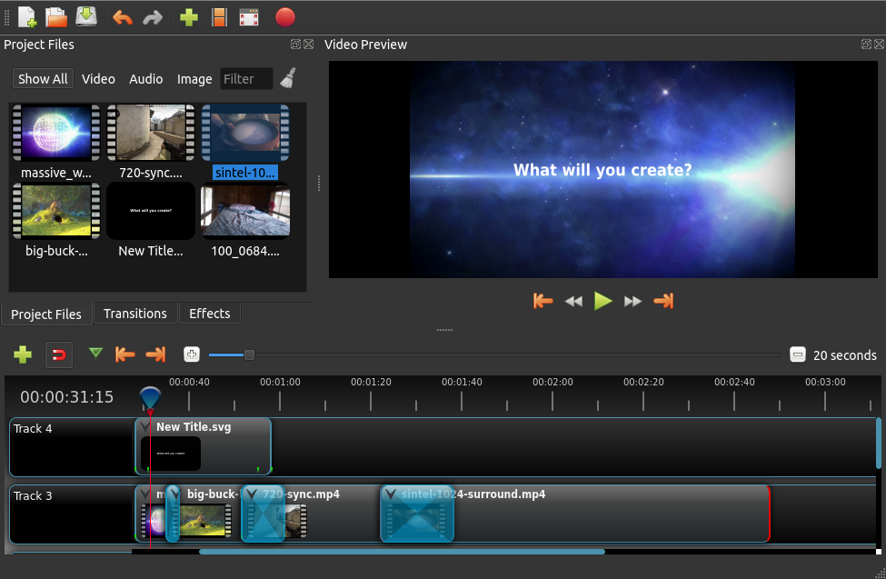

.. Copyright (c) 2008-2016 OpenShot Studios, LLC
 (http://www.openshotstudios.com). This file is part of
 OpenShot Video Editor (http://www.openshot.org), an open-source project
 dedicated to delivering high quality video editing and animation solutions
 to the world.

.. OpenShot Video Editor is free software: you can redistribute it and/or modify
 it under the terms of the GNU General Public License as published by
 the Free Software Foundation, either version 3 of the License, or
 (at your option) any later version.

.. OpenShot Video Editor is distributed in the hope that it will be useful,
 but WITHOUT ANY WARRANTY; without even the implied warranty of
 MERCHANTABILITY or FITNESS FOR A PARTICULAR PURPOSE.  See the
 GNU General Public License for more details.

.. You should have received a copy of the GNU General Public License
 along with OpenShot Library.  If not, see <http://www.gnu.org/licenses/>.

Introduction
=============

OpenShot Video Editor is an award-winning, open-source video editor, available on Linux, Mac, and Windows. Create
stunning videos, films, and animations with OpenShot's easy-to-use interface and rich feature-set.

Features Overview
------------------
* Support for many video, audio, and image formats (based on FFmpeg)
* Unlimited tracks / layers
* Powerful key-frame animations
* Video transitions & effects
* Compositing, image overlays, and watermarks
* Title editor with templates
* 3D animations and effects
* 2D animation support (image sequences)
* Frame accuracy
* Transformations (scale, location, rotation, time)
* Audio mixing
* Export presets

User Interface
---------------

