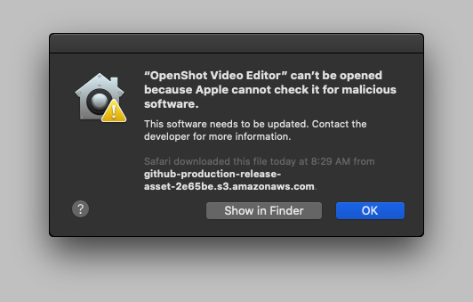

.. Copyright (c) 2008-2020 OpenShot Studios, LLC
 (http://www.openshotstudios.com). This file is part of
 OpenShot Video Editor (http://www.openshot.org), an open-source project
 dedicated to delivering high quality video editing and animation solutions
 to the world.

.. OpenShot Video Editor is free software: you can redistribute it and/or 
 modify it under the terms of the GNU General Public License as published by
 the Free Software Foundation, either version 3 of the License, or
 (at your option) any later version.

.. OpenShot Video Editor is distributed in the hope that it will be useful,
 but WITHOUT ANY WARRANTY; without even the implied warranty of
 MERCHANTABILITY or FITNESS FOR A PARTICULAR PURPOSE.  See the
 GNU General Public License for more details.

.. You should have received a copy of the GNU General Public License
 along with OpenShot Library.  If not, see <http://www.gnu.org/licenses/>.

.. Edited September 25, 2020 - [USA]TechDude

Introduction
============

We created |ops| OpenShot™ in 2008 to build a free, open-source video editor for 
Linux.  We designed OpenShot to be easy to use, quick to learn, and a powerful 
video editor.  Quickly cut, slice, and edit any clip or video.  OpenShot is 
now available for:

 -  |win| `Microsoft® Windows® <#win-windows>`_
 -  |lin| `Linux® (most distributions) <#lin-linux>`_
 -  |mac| `Apple® macOS® <#mac-macos>`_
 
Users have downloaded OpenShot millions of times, and it continues to grow as 
a project!  OpenShot™ Video Editor is an award-winning, open-source video 
editor that can create stunning videos, films, and animations with an 
easy-to-use interface and a rich feature-set.

Features
--------
OpenShot Video Editor has many abilities and features, including:

- 2D animation support (image sequences)
- 3D animated titles support (including effects)
- Advanced Timeline (including Drag & Drop scrolling, panning, zooming, and 
  snapping)
- Audio mixing and editing (multiple channel support)
- Clip resizing, scaling, trimming, snapping, rotation, and cutting
- Compositing, image overlays, watermarks
- Cross-platform (Supports Linux, macOS, and Windows)
- Desktop integration (drag and drop support)
- Digital video effects, including brightness, gamma, hue, gray-scale, and 
  chroma-key
- Frame accuracy (step through each frame of video)
- Powerful curve-based Key frame animations
- Scrolling motion picture credits
- Support for many videos, audio, and image formats (based on FFmpeg)
- SVG friendly, to create and include vector titles and credits
- Time-mapping and speed changes on clips (slow/fast, forward/backward, etc.)
- Title templates, title creation, sub-titles
- Unlimited tracks/layers for video editing
- Video transitions with real-time previews
- and many more!

Screenshot
----------

System Requirements
-------------------

Video editing uses sizable amounts of memory, modern multi-core CPUs, and 
fast internal storage.  There are various specifications you will want to 
check when reviewing computers for video editing.  Check the memory, 
processor, graphics card, and storage.

Most over-the-counter computers max out at 32GB RAM, so it is always best to 
have as much memory as possible.  You will also want a powerful processor.  
You can manage using any processor with a speed of 2.5 gigahertz (GHz) or 
higher.  Finally, you will want to make sure you have plenty of storage 
available to hold the software and video footage with which you will be 
working.  Your best bet is to use a computer with more than 1.0 TB of storage 
but, failing that, anything with at least 500 GB is suitable.

When editing video with OpenShot, you want a computer system that meets these 
**minimum system requirements**:

- 64-bit Multi-core processor
- 4 GB of Random-Access Memory (RAM)
- 500 MB of free storage space for installation
- 500 GB of internal storage space for processing
- Internal or discrete Graphics Processing Unit (GPU)
- 64-bit Operating System (Linux, macOS, Windows 64-bit)
- Monitor or laptop display capable of 1280x720 (720P) resolution
- Optional: Solid-state drive (SSD), if using disk-caching (and an additional 
  10GB of hard-disk space)

A more in depth version of the System Requirements is available in the 
`User Manual <manual.html#system-requirements>`__.

License
-------

OpenShot Video Editor is Free and Open Source Software (FOSS).  You can 
redistribute it and change it under the terms of the GNU General Public 
License as published by the Free Software Foundation, either version 3 of the 
License, or (at your option) any later version.

OpenShot Studios, LLC distributes OpenShot Video Editor in the hope that it 
will be useful, but WITHOUT ANY WARRANTY; without even the implied warranty of 
MERCHANTABILITY or FITNESS FOR A PARTICULAR PURPOSE.  See the 
`GNU General Public License <https://www.gnu.org/licenses/gpl-3.0.en.html>`_
for more details.

Download |ops| OpenShot
-----------------------

There are many ways to download and install OpenShot™ Video Editor, which is 
available for the following 64-bit operating systems: Microsoft Windows®, Linux® (most 
distributions), and Apple® macOS®.

|win| Windows®
^^^^^^^^^^^^^^

Download the Windows installer executable from the official OpenShot |Link|_.  
Once downloaded, double-click the EXE file, and follow the directions on 
screen.  When complete, OpenShot is available in your Start menu.

|lin| Linux®
^^^^^^^^^^^^

Download the AppImage from the official OpenShot |Link|_.  Once downloaded, 
move the file to the folder where it will live.  Right-click the AppImage 
file, click Properties then mark the file as **Executable**.  Double-click the 
AppImage file to launch the application.

|mac| macOS®
^^^^^^^^^^^^

Download the DMG file from the official OpenShot |Link|_.  Once downloaded, 
double-click the DMG file then drag the OpenShot application icon to your 
**Applications** folder.  Double-click the icon to launch the application.

In macOS, if you receive an error message that states: 

you can correct this issue. Apple macOS needs permission to run the file that 
you downloaded from the Internet. There are a couple of methods that may work. 
Please try the procedures below (in order) to see if one of them works for you.

1. Go to System Preferences >> Security & Privacy >> General >> Click the lock 
in the bottom left corner >> Enter your password >> Click Unlock >> Click Open 
anyway near the bottom >> Open.

2. Go to System Preferences >> Security & Privacy >> General. You might see one 
or more alerts near the bottom that says:

.. image:: images/error-mac2.png

Click "Open".  Also, ensure that you select the "App Store and identified 
developers" radio button on the same tab.

.. inline replacements for images
.. |lin| image:: images/logo-lin.png
    :height: 20px
.. |mac| image:: images/logo-mac.png
    :height: 20px
.. |win| image:: images/logo-win.png
    :height: 20px
.. |ops| image:: images/logo-ops.png
    :height: 20px
.. |Link| replace:: download page
.. _Link: https://www.openshot.org/download/
