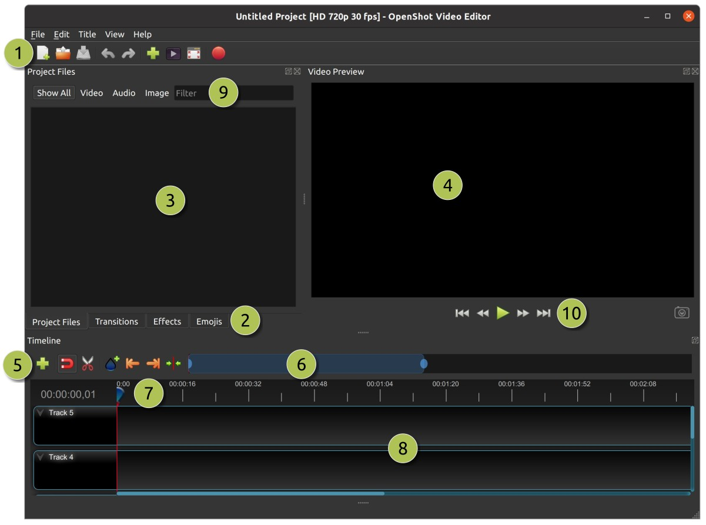
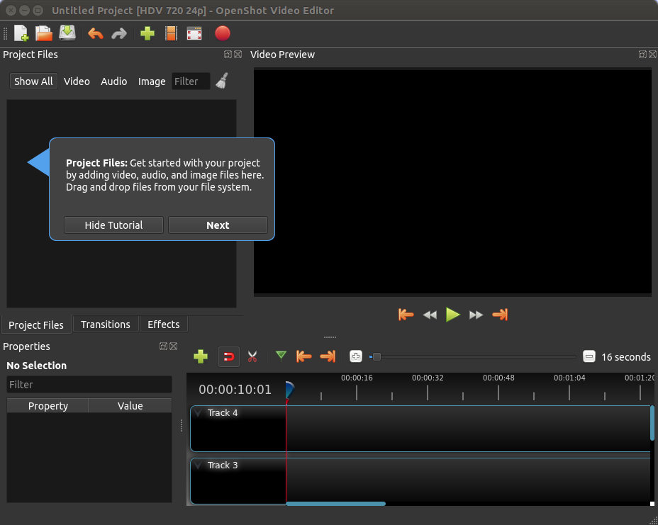
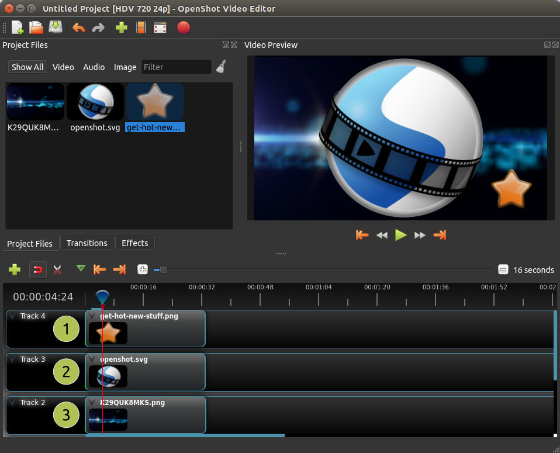

.. Copyright (c) 2008-2016 OpenShot Studios, LLC
 (http://www.openshotstudios.com). This file is part of
 OpenShot Video Editor (http://www.openshot.org), an open-source project
 dedicated to delivering high quality video editing and animation solutions
 to the world.

.. OpenShot Video Editor is free software: you can redistribute it and/or modify
 it under the terms of the GNU General Public License as published by
 the Free Software Foundation, either version 3 of the License, or
 (at your option) any later version.

.. OpenShot Video Editor is distributed in the hope that it will be useful,
 but WITHOUT ANY WARRANTY; without even the implied warranty of
 MERCHANTABILITY or FITNESS FOR A PARTICULAR PURPOSE.  See the
 GNU General Public License for more details.

.. You should have received a copy of the GNU General Public License
 along with OpenShot Library.  If not, see <http://www.gnu.org/licenses/>.

Main Window
===========

OpenShot Video Editor has one main window which contains most of the information, buttons,
and menus needed to edit your video project.

Overview
--------

.. table::
   :widths: 5 22 73
   
   ==  ==================  ============
   #   Name                Description
   ==  ==================  ============
   1   Main Toolbar        Contains buttons to open, save, and export your video project.
   2   Function Tabs       Switch between Project Files, Transitions, and Effects.
   3   Project Files       All audio, video, and image files that have been imported into your project.
   4   Preview Window      This is the area that the video will playback on the screen.
   5   Edit Toolbar        This toolbar contains buttons used for snapping, inserting markers, and jumping between markers.
   6   Zoom Slider         This slider will adjust the time-scale of your timeline.
   7   Play-head / Ruler   The ruler shows the time-scale, and the red line is the play-head. The play-head represents the current playback position.
   8   Timeline            The timeline visualizes your video project, and each clip and transition in your project.
   9   Filter              Filter the list of items shown (project files, transitions, and effects) by using these buttons and filter textbox. Enter a few letters of what you are looking for, and the results will be shown.
   10  Filter              Right to left: Jump to Start, Rewind, Play/Pause, Fast Forward, and Jump to End Buttons
   ==  ==================  ============

For step-by-step instructions on the basic usage of OpenShot, be sure to read the
:ref:`quick_tutorial_ref`.

Built-in Tutorial
-----------------
When you first launch OpenShot, you will be presented with a friendly built-in tutorial. It will point out and explain
the basics. Clicking **Next** will jump to the next topic. You can always view this tutorial again from the **Help\→Tutorial** menu.

.. _tracks_ref:

Tracks & Layers
------------------

OpenShot uses tracks to layer videos and images. The top most track is the top layer, and the bottom track is the bottom layer.
If you are familiar with layers in a photo editing application, then you should be quite familiar with this concept.
OpenShot will mix each layer together, just like a photo editing application. You can have an unlimited number of tracks, but
typically a video project will not need more than 10 (or so) tracks.

For example, imagine a 3 track video project

.. table::
   :widths: 5 18 77
   
   ==  ==================  ============
   #   Name                Description
   ==  ==================  ============
   1   Top Track           Clips on this track will always be on top and visible
   2   Middle Track        Clips in the middle (might or might not be visible, depending on what is above them)
   3   Bottom Track        Clips on this track will always be on the bottom
   ==  ==================  ============

.. _keyboard_shortcut_ref:

Keyboard Shortcuts
------------------
Here is a list of the default keyboard shortcuts supported by OpenShot. You can configure these shortcuts
in the Preferences dialog. Learning a few of these shortcuts can save you a bunch of time!

==================  ============
Shortcut            Action
==================  ============
Ctrl+H              About OpenShot
Ctrl+M              Add Marker
Ctrl+Shift+T        Add Track
Ctrl+W              Add to Timeline
Ctrl+B              Animated Title
Ctrl+P              Choose Profile
Ctrl+C              Copy
Delete              Delete Item
Backspace           Delete Item
Ctrl+D              Details View
Ctrl+E              Export Video
L                   Fast Forward
F11                 Fullscreen
Ctrl+F              Import Files
Ctrl+End            Jump to End
Ctrl+Home           Jump to Start
Ctrl+N              New Project
Right               Next Frame
Ctrl+Right          Next Marker
Ctrl+O              Open Project
Ctrl+V              Paste
Space               Play/Pause Toggle
Up                  Play/Pause Toggle
Down                Play/Pause Toggle
K                   Play/Pause Toggle
Ctrl+Shift+P        Preferences
Left                Previous Frame
Ctrl+Left           Previous Marker
Ctrl+I              Properties
Ctrl+Q              Quit
Ctrl+Y              Redo
J                   Rewind
Ctrl+S              Save Project
Ctrl+Shift+S        Save Project As...
Ctrl+A              Select All
Ctrl+Shift+A        Select None
Ctrl+K              Slice All: Keep Both Sides
Ctrl+L              Slice All: Keep Left Side
Ctrl+J              Slice All: Keep Right Side
Ctrl+G              Toggle Snapping
R                   Toggle Razor tool
Ctrl+X              Split Clip
Ctrl+Shift+D        Thumbnail View
Ctrl+T              Title Editor
Ctrl+Z              Undo
=                   Zoom In
--                   Zoom Out
Ctrl+Scroll         Zoom In/Out
Ctrl+Middle Button  Scroll Timeline
==================  ============
