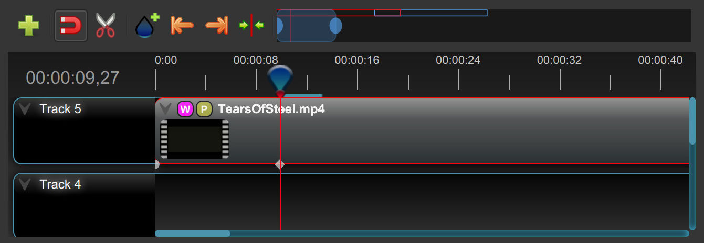

.. Copyright (c) 2008-2016 OpenShot Studios, LLC
 (http://www.openshotstudios.com). This file is part of
 OpenShot Video Editor (http://www.openshot.org), an open-source project
 dedicated to delivering high quality video editing and animation solutions
 to the world.

.. OpenShot Video Editor is free software: you can redistribute it and/or modify
 it under the terms of the GNU General Public License as published by
 the Free Software Foundation, either version 3 of the License, or
 (at your option) any later version.

.. OpenShot Video Editor is distributed in the hope that it will be useful,
 but WITHOUT ANY WARRANTY; without even the implied warranty of
 MERCHANTABILITY or FITNESS FOR A PARTICULAR PURPOSE.  See the
 GNU General Public License for more details.

.. You should have received a copy of the GNU General Public License
 along with OpenShot Library.  If not, see <http://www.gnu.org/licenses/>.

Main Window
===========

OpenShot Video Editor has one main window which contains most of the information, buttons,
and menus needed to edit your video project.

Overview
--------

.. image:: images/main-window.jpg

.. table::
   :widths: 5 22 73

   ==  ==================  ============
   #   Name                Description
   ==  ==================  ============
   1   Main Toolbar        Contains buttons to open, save, and export your video project.
   2   Function Tabs       Switch between Project Files, Transitions, Effects, and Emojis.
   3   Project Files       All audio, video, and image files that have been imported into your project.
   4   Preview Window      This is the area that the video will playback on the screen.
   5   Timeline Toolbar    This toolbar contains buttons used for snapping, inserting markers, slicing razor, jumping between markers, and centering the timeline on the playhead. See :ref:`timeline_toolbar_ref`.
   6   Zoom Slider         This slider will adjust the time-scale of your timeline. Drag the left or right edge to zoom in or out. Drag the blue area to scroll the timeline left or right. Clips and transitions are displayed as simple rectangles, to give you context for adjusting the zoom to specific clips.
   7   Play-head / Ruler   The ruler shows the time-scale, and the red line is the play-head. The play-head represents the current playback position. Hold :kbd:`Shift` key while dragging the playhead to snap to nearby clips.
   8   Timeline            The timeline visualizes your video project, and each clip and transition in your project. You can drag the mouse to select, move, or delete multiple items.
   9   Filter              Filter the list of items shown (project files, transitions, effects, and emojis) by using these buttons and filter textbox. Enter a few letters of what you are looking for, and the results will be shown.
   10  Playback            Left to Right: Jump to Start, Rewind, Play/Pause, Fast Forward, and Jump to End
   ==  ==================  ============

For step-by-step instructions on the basic usage of OpenShot, be sure to read the
:ref:`quick_tutorial_ref`.

Built-in Tutorial
-----------------
When you first launch OpenShot, you will be presented with a friendly built-in tutorial. It will demonstrate and explain
the basics. Clicking :guilabel:`Next` will jump to the next topic. You can always view this tutorial again from the :guilabel:`Help→Tutorial` menu.

.. image:: images/built-in-tutorial.jpg

.. _tracks_ref:

Tracks & Layers
------------------

OpenShot uses tracks to layer videos and images. The top most track is the top
layer, and the bottom track is the bottom layer. If you are familiar with layers
in a photo editing application, then you should be quite familiar with this
concept. OpenShot will stack the layers and mix each one together, just like a
photo editing application. You can have an unlimited number of tracks, but
typically a simple video project will not need more than 5 tracks.

For example, imagine a 3 track video project

.. image:: images/tracks.jpg

.. table::
   :widths: 5 18 77

   ==  ==================  ============
   #   Name                Description
   ==  ==================  ============
   1   Top Track           Clips on this track will always be on top and visible. Often watermarks and titles are placed on higher tracks.
   2   Middle Track        Clips in the middle (might or might not be visible, depending on what is above them)
   3   Bottom Track        Clips on this track will always be on the bottom. Often audio clips are placed on lower tracks.
   ==  ==================  ============

.. _timeline_toolbar_ref:

Timeline Toolbar
----------------

.. table::
   :widths: 20 73

   ===========================  ============
   Name                         Description
   ===========================  ============
   Add Track                    Add a new track to the timeline. New projects start with 5 tracks by default.
   Snapping                     Toggle between snapping and non-snapping modes. Snapping makes it easier to place clips next to other clips.
   Razor Tool                   Toggle the razor tool on and off. This tool will cut a clip exactly where you click on it, splitting a clip into 2 clips.
   Add Marker                   Add a marker to the timeline at the current playhead position. This can be useful for returning to a specific position on the timeline.
   Previous Marker              Jump to the previous marker. This moves the playhead to the left, seeking to the next marker or important position (i.e. start / end positions of clips).
   Next Marker                  Jump to the next marker. This moves the playhead to the right, seeking to the next marker or important position (i.e. start / end positions of clips).
   Center Timeline on Playhead  This centers the timeline on the playhead position. This can be useful if the playhead is not visible and you want to quickly scroll the timeline to that position.
   Zoom Slider                  This controls the visible portion of the timeline. Adjusting the left/right handles will zoom in/out of your timeline, keeping a specific section of your project in view.
   ===========================  ============

.. _keyboard_shortcut_ref:

Keyboard Shortcuts
------------------
Here is a list of the default keyboard shortcuts supported by OpenShot. You can
configure these shortcuts in the Preferences window, which is opened by selecting
:guilabel:`Edit→Preferences` from the OpenShot menu bar.
(On macOS, choose :guilabel:`OpenShot Video Editor→Preferences`.)
Learning a few of these shortcuts can save you a bunch of time!

===================================   =======================   ====================  ====================
Action                                Shortcut 1                Shortcut 2            Shortcut 3
===================================   =======================   ====================  ====================
About OpenShot                        :kbd:`Ctrl+H`
Add Marker                            :kbd:`M`
Add Track                             :kbd:`Ctrl+Y`
Add to Timeline                       :kbd:`Ctrl+Alt+A`
Advanced View                         :kbd:`Alt+Shift+1`
Animated Title                        :kbd:`Ctrl+Shift+T`
Center on Playhead                    :kbd:`Shift+C`            :kbd:`Alt+Up`
Choose Profile                        :kbd:`Ctrl+Alt+P`
Clear All Cache                       :kbd:`Ctrl+Shift+ESC`
Clear History                         :kbd:`Ctrl+Shift+H`
Clear Waveform Display Data           :kbd:`Ctrl+Shift+W`
Copy                                  :kbd:`Ctrl+C`
Cut                                   :kbd:`Ctrl+X`
Delete Item                           :kbd:`Delete`             :kbd:`Backspace`
Delete Item (Ripple)                  :kbd:`Shift+Delete`
Details View                          :kbd:`Ctrl+Page Up`
Duplicate                             :kbd:`Ctrl+Shift+/`
Edit Title                            :kbd:``
Export Video                          :kbd:`Ctrl+E`             :kbd:`Ctrl+M`
Fast Forward                          :kbd:`L`
Freeze View                           :kbd:`Ctrl+F`
Fullscreen                            :kbd:`F11`
Import Files...                       :kbd:`Ctrl+I`
Insert Keyframe                       :kbd:`Alt+Shift+K`
Jump To End                           :kbd:`End`
Jump To Start                         :kbd:`Home`
Launch Tutorial                       :kbd:`F2`
New Project                           :kbd:`Ctrl+N`
Next Frame                            :kbd:`Right`              :kbd:`.`
Next Marker                           :kbd:`Shift+M`            :kbd:`Alt+Right`
Nudge left (1 Frame)                  :kbd:`Ctrl+Left`
Nudge left (5 Frames)                 :kbd:`Shift+Ctrl+Left`
Nudge right (1 Frame)                 :kbd:`Ctrl+Right`
Nudge right (5 Frames)                :kbd:`Shift+Ctrl+Right`
Open Help Contents                    :kbd:`F1`
Open Project...                       :kbd:`Ctrl+O`
Paste                                 :kbd:`Ctrl+V`
Play/Pause Toggle                     :kbd:`Space`              :kbd:`Up`             :kbd:`Down`
Preferences                           :kbd:`Ctrl+P`
Previous Frame                        :kbd:`Left`               :kbd:`,`
Previous Marker                       :kbd:`Ctrl+Shift+M`       :kbd:`Alt+Left`
Properties                            :kbd:`U`
Quit                                  :kbd:`Ctrl+Q`
Razor Toggle                          :kbd:`C`                  :kbd:`B`              :kbd:`R`
Redo                                  :kbd:`Ctrl+Shift+Z`
Rewind                                :kbd:`J`
Save Current Frame                    :kbd:`Ctrl+Shift+Y`
Save Current Frame                    :kbd:`Ctrl+Shift+Y`
Save Project                          :kbd:`Ctrl+S`
Save Project As...                    :kbd:`Ctrl+Shift+S`
Select All                            :kbd:`Ctrl+A`
Select Item (Ripple)                  :kbd:`Shift+A`            :kbd:`Shift+Click`
Select None                           :kbd:`Ctrl+Shift+A`
Show All Docks                        :kbd:`Ctrl+Shift+D`
Simple View                           :kbd:`Alt+Shift+0`
Slice All: Keep Both Sides            :kbd:`Ctrl+Shift+K`
Slice All: Keep Left Side             :kbd:`Ctrl+Shift+J`
Slice All: Keep Right Side            :kbd:`Ctrl+Shift+L`
Slice Selected: Keep Both Sides       :kbd:`Ctrl+K`
Slice Selected: Keep Left Side        :kbd:`Ctrl+J`
Slice Selected: Keep Right Side       :kbd:`Ctrl+L`
Slice Selected: Keep Left (Ripple)    :kbd:`W`
Slice Selected: Keep Right (Ripple)   :kbd:`Q`
Snapping Toggle                       :kbd:`S`
Split Clip...                         :kbd:`Shift+1`
Thumbnail View                        :kbd:`Ctrl+Page Down`
Title                                 :kbd:`Ctrl+T`
Transform                             :kbd:`Ctrl+Alt+T`
Un-Freeze View                        :kbd:`Ctrl+Shift+F`
Undo                                  :kbd:`Ctrl+Z`
View Toolbar                          :kbd:`Ctrl+Shift+B`
Zoom In                               :kbd:`=`                  :kbd:`Ctrl+=`
Zoom Out                              :kbd:`-`                  :kbd:`Ctrl+-`
===================================   =======================   ====================  ====================

Menu
----
The following menu options are available on the main window on OpenShot. Most of these options can be accessed
by the keyboard shortcuts mentioned above. On some Operating Systems (such as macOS) a few of these options
are renamed and/or rearranged.

.. list-table::
   :widths: 16 80
   :header-rows: 1

   * - Menu Name
     - Description
   * - File
     -
       - :guilabel:`New Project` Create a blank new project.
       - :guilabel:`Open Project` Open an existing project.
       - :guilabel:`Recent Projects` Access recently opened projects.
       - :guilabel:`Save Project` Save the current project.
       - :guilabel:`Import Files` Import media files into the project.
       - :guilabel:`Choose Profile` Select a project profile (*i.e. 1080p @ 30fps, 720p @ 24fps, ...*).
       - :guilabel:`Save Current Frame` Save the current preview video frame as an image (sometimes represented with a camera icon).
       - :guilabel:`Import Project` Import another project into the current project (*Adobe and Final Cut Pro formats partially supported*).
       - :guilabel:`Export Project` Export the current project to a specified format (*EDL, Adobe, and Final Cut Pro formats partially supported*).
       - :guilabel:`Quit` Exit the application.
   * - Edit
     -
       - :guilabel:`Undo` Undo the last action.
       - :guilabel:`Redo` Redo the last undone action.
       - :guilabel:`Clear` Clear the current history or waveform cached data. This makes the `.osp project` file a much smaller file size.
       - :guilabel:`Preferences` Open the preferences dialog to customize settings.
   * - Title
     -
       - :guilabel:`Title` Add a SVG vector title to the project. See :ref:`text_and_titles_ref`.
       - :guilabel:`Animated Title` Add an animated title to the project. See :ref:`animated_titles_ref`.
   * - View
     -
       - :guilabel:`Toolbar` Show or hide the main window toolbar.
       - :guilabel:`Fullscreen` Toggle fullscreen mode.
       - :guilabel:`Views` Switch or reset the main window layout (*Simple, Advanced, Freeze, Show All*).
       - :guilabel:`Docks` Show or hide various dockable panels (*Captions, Effects, Emojis, Project Files, Properties, Transitions, Video Preview*).
   * - Help
     -
       - :guilabel:`Contents` Open the user guide online.
       - :guilabel:`Tutorial` Access the built-in tutorial for new users.
       - :guilabel:`Report a Bug` Report a bug or issue.
       - :guilabel:`Ask a Question` Ask a question about the software.
       - :guilabel:`Translate` Contribute to translations of the software.
       - :guilabel:`Donate` Make a donation to support the project.
       - :guilabel:`About` View information about the software (version, contributors, translators, changelog, and supporters).

Views
-----

The OpenShot main window is composed of multiple **docks**. These **docks** are arranged and snapped together
into a grouping that we call a **View**. OpenShot comes with two primary views: :guilabel:`Simple View` and
:guilabel:`Advanced View`.

Simple View
^^^^^^^^^^^
This is the **default** view, and is designed to be easy-to-use, especially for first-time users. It contains
:guilabel:`Project Files` on the top left, :guilabel:`Preview Window` on the top right, and :guilabel:`Timeline` on
the bottom. If you accidentally close or move a dock, you can quickly reset all the docks back to their default
location using the :guilabel:`View->Views->Simple View` menu at the top of the screen.

Advanced View
^^^^^^^^^^^^^
This is an advanced view, which adds more docks to the screen at once, improving access to many features that are
not visible in Simple View. Once you have mastered the Simple View, we recommend giving this view a try as well.
NOTE: You can also drag and drop the docks anywhere you would like, for a fully custom view.

Docks
^^^^^
Each widget on the OpenShot main window is contained in a **dock**. These docks can be dragged and snapped around the
main window, and even grouped together (into tabs). OpenShot will always save your main window dock layout when you
exit the program. Re-launching OpenShot will restore your custom dock layout automatically.

.. list-table::
   :widths: 20 80
   :header-rows: 1

   * - Dock Name
     - Description
   * - Captions
     - Manage and add captions or subtitles to your video project. Allows you to create, edit, and manage caption data. See :ref:`caption_effect_ref` effect.
   * - Effects
     - Browse and apply video and audio effects to your video clips. Includes filters, color adjustments, and special effects. See :ref:`effects_ref`.
   * - Emojis
     - Add emoji graphics to your video project. Choose from a variety of emojis to enhance your video content.
   * - Project Files
     - View and manage all the media files imported into your project. Organize, filter, and tag video, audio, and image files. See :ref:`files_ref`.
   * - Properties
     - View and edit the properties of a selected effect, transition, or clip. Adjust settings such as duration, size, position, etc... See :ref:`clip_properties_ref`.
   * - Transitions
     - Browse and apply transitions between video clips. Choose from a variety of transition wipes to create smooth changes between scenes. See :ref:`transitions_ref`.
   * - Video Preview
     - Preview the current state of your video project. Allows you to play back and review your edits in real-time. See :ref:`playback_ref`.

If you have accidentally closed or moved a dock and can no longer find it, there are a couple easy solutions.
First, you can use the :guilabel:`View->Views->Simple View` menu option at the top of the screen, to restore the view back to its
default. Or you can use the :guilabel:`View->Views->Docks->...` menu to show or hide specific dock widgets on the main window.

High DPI / 4K Monitors
----------------------

OpenShot Video Editor provides robust support for High DPI (Dots Per Inch) monitors, ensuring that the interface looks
sharp and is easily readable on displays with various DPI settings. This support is particularly beneficial for users
with 4K monitors or other high-resolution displays.

Per Monitor DPI Awareness
^^^^^^^^^^^^^^^^^^^^^^^^^

OpenShot is DPI aware on a per-monitor basis, meaning it can adjust its scaling dynamically depending on the DPI
settings of each connected monitor. This ensures a consistent and high-quality user experience across different displays.

DPI Scaling on Windows
^^^^^^^^^^^^^^^^^^^^^^

On Windows, OpenShot rounds the scaling factor to the nearest whole value to maintain visual integrity. This rounding
helps avoid visual artifacts in the UI rendering and ensures that the interface elements remain crisp and well-aligned.
Due to this rounding, scaling options can sometimes lead to increased font-sizes and a feeling that the UI elements
are a bit too large.

- **125% scaling** rounds to **100%**
- **150% scaling** rounds to **200%**

Workarounds for Fine-Grained Adjustment
^^^^^^^^^^^^^^^^^^^^^^^^^^^^^^^^^^^^^^^

While rounding helps maintain a clean interface, there are workarounds for users who require more precise control
over the scaling. However, these methods are **not recommended** due to potential visual artifacts:

- **QT_SCALE_FACTOR_ROUNDING_POLICY=PassThrough**

   - Setting this environment variable can disable rounding and allow more precise scaling.
   - **Note:** This may cause visual artifacts, particularly in the timeline, and is not recommended.

- **QT_SCALE_FACTOR=0.75** (or similar value)

   - Manually setting the scale factor can provide finer adjustments to the font and UI scaling.
   - **Note:** This method can also lead to visual artifacts and make OpenShot harder to use.

For more info on adjusting these environment variables, please visit
https://github.com/OpenShot/openshot-qt/wiki/OpenShot-UI-too-large.
