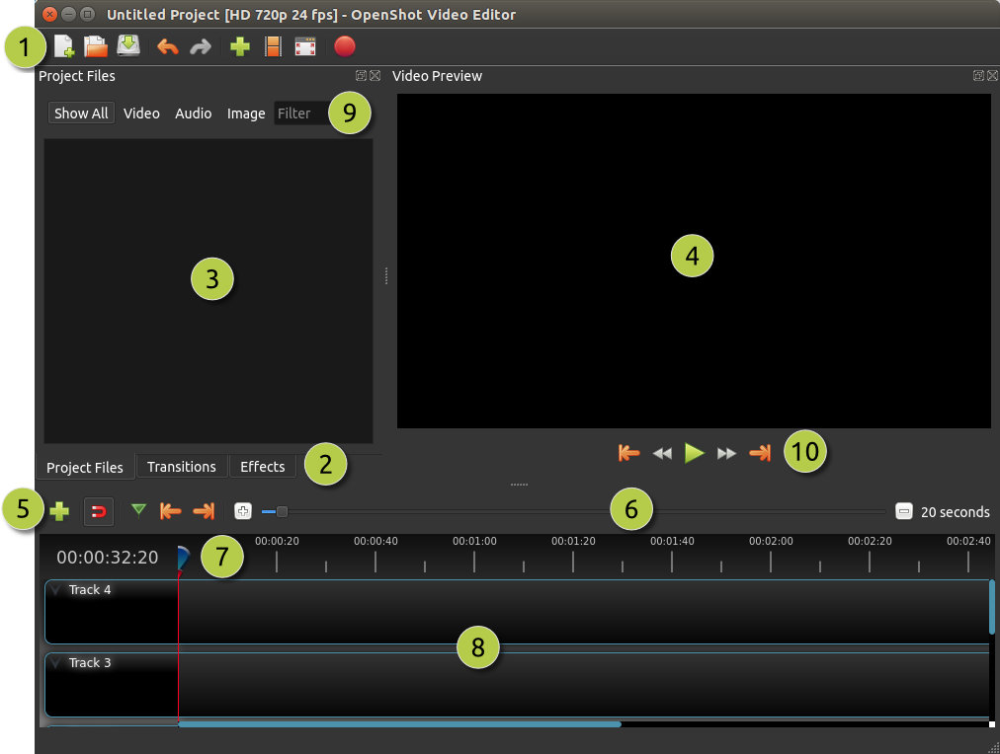
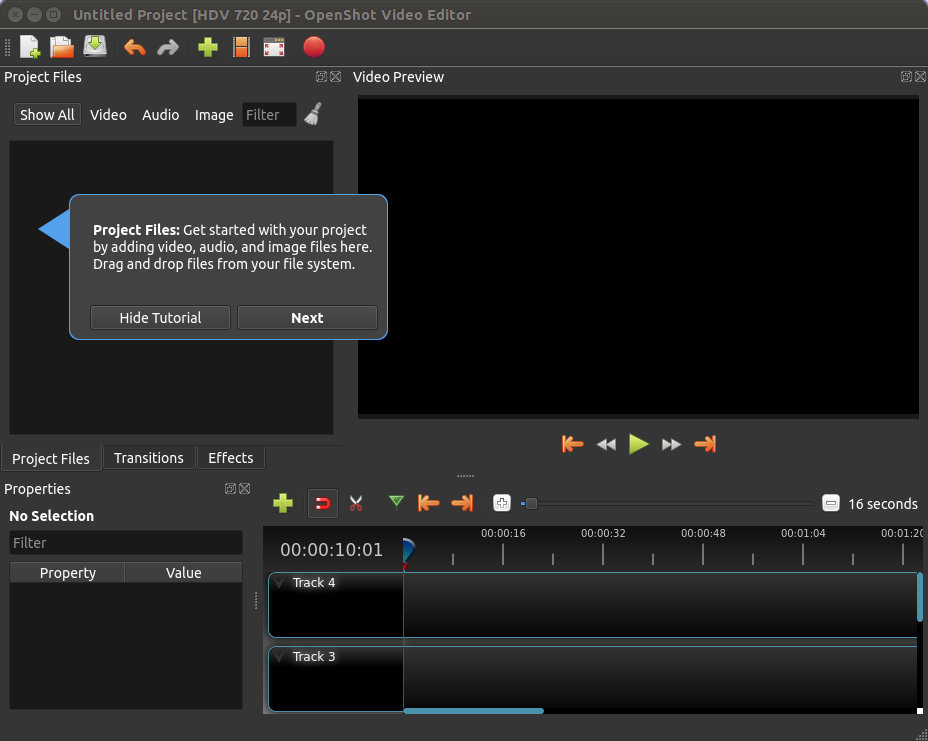
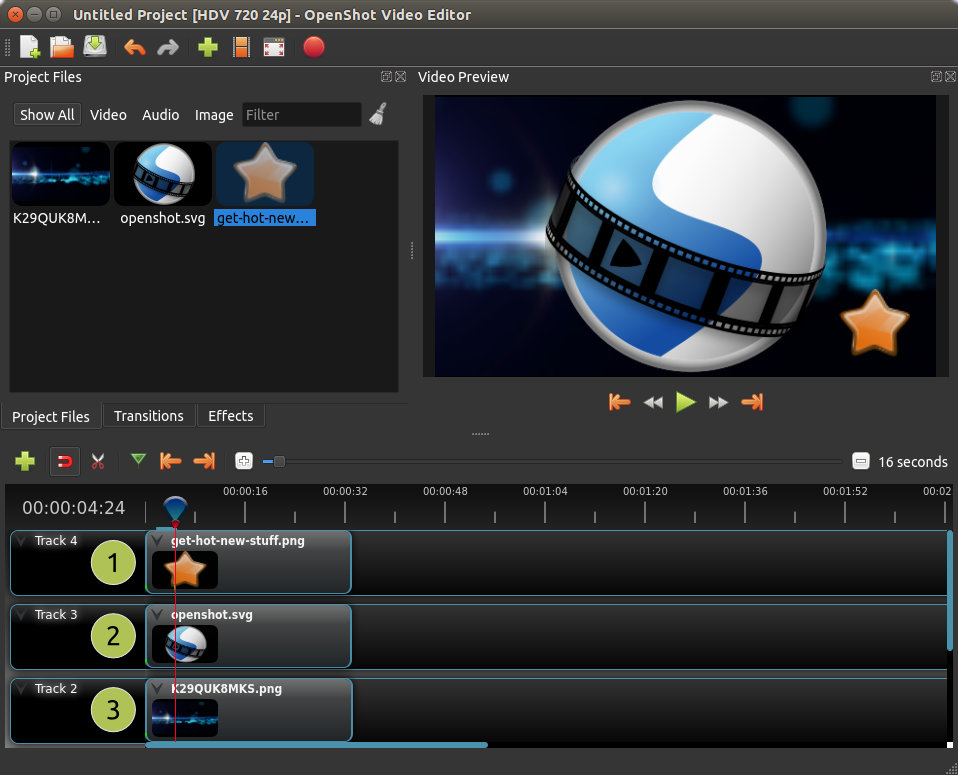
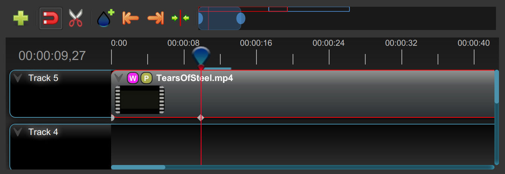

.. Copyright (c) 2008-2026 OpenShot Studios, LLC
 (http://www.openshotstudios.com). This file is part of
 OpenShot Video Editor (http://www.openshot.org), an open-source project
 dedicated to delivering high quality video editing and animation solutions
 to the world.

.. OpenShot Video Editor is free software: you can redistribute it and/or modify
 it under the terms of the GNU General Public License as published by
 the Free Software Foundation, either version 3 of the License, or
 (at your option) any later version.

.. OpenShot Video Editor is distributed in the hope that it will be useful,
 but WITHOUT ANY WARRANTY; without even the implied warranty of
 MERCHANTABILITY or FITNESS FOR A PARTICULAR PURPOSE.  See the
 GNU General Public License for more details.

.. You should have received a copy of the GNU General Public License
 along with OpenShot Library.  If not, see <http://www.gnu.org/licenses/>.

Main Window
===========

OpenShot Video Editor has one main window which contains most of the information, buttons,
and menus needed to edit your video project.

Overview
--------

.. table::
   :widths: 5 22 73

   ==  ==================  ============
   #   Name                Description
   ==  ==================  ============
   1   Main Toolbar        Contains buttons to open, save, and export your video project.
   2   Function Tabs       Switch between Project Files, Transitions, Effects, and Emojis.
   3   Project Files       All audio, video, and image files that have been imported into your project.
   4   Preview Window      This is the area that the video will playback on the screen.
   5   Timeline Toolbar    This toolbar contains buttons used for snapping, inserting markers, slicing razor, jumping between markers, and centering the timeline on the playhead. See :ref:`timeline_toolbar_ref`.
   6   Zoom Slider         This slider will adjust the time-scale of your timeline. Drag the left or right edge to zoom in or out. Drag the blue area to scroll the timeline left or right. Clips and transitions are displayed as simple rectangles, to give you context for adjusting the zoom to specific clips.
   7   Play-head / Ruler   The ruler shows the time-scale, and the line is the play-head. The play-head represents the current playback position. The current timecode can be clicked to enter an exact timecode. Hold :kbd:`Shift` key while dragging the playhead to snap to nearby clips.
   8   Timeline            The timeline visualizes your video project, and each clip and transition in your project. You can drag the mouse to select, move, or delete multiple items.
   9   Filter              Filter the list of items shown (project files, transitions, effects, and emojis) by using these buttons and filter textbox. Enter a few letters of what you are looking for, and the results will be shown.
   10  Playback            Left to Right: Jump to Start, Rewind, Play/Pause, Fast Forward, and Jump to End
   11  Track               Track area containing the track name, track menu, and per-track controls such as lock and keyframe panel icons.
   ==  ==================  ============

For step-by-step instructions on the basic usage of OpenShot, be sure to read the
:ref:`quick_tutorial_ref`.

Built-in Tutorial
-----------------
When you first launch OpenShot, you will be presented with a friendly built-in tutorial. It will demonstrate and explain
the basics. Clicking :guilabel:`Next` will jump to the next topic. You can always view this tutorial again from the :guilabel:`Help→Tutorial` menu.

.. _tracks_ref:

Tracks & Layers
------------------

OpenShot uses tracks to layer videos and images. The top most track is the top
layer, and the bottom track is the bottom layer. If you are familiar with layers
in a photo editing application, then you should be quite familiar with this
concept. OpenShot will stack the layers and mix each one together, just like a
photo editing application. You can have an unlimited number of tracks, but
typically a simple video project will not need more than 5 tracks.

For example, imagine a 3 track video project

.. table::
   :widths: 5 18 77

   ==  ==================  ============
   #   Name                Description
   ==  ==================  ============
   1   Top Track           Clips on this track will always be on top and visible. Often watermarks and titles are placed on higher tracks.
   2   Middle Track        Clips in the middle (might or might not be visible, depending on what is above them)
   3   Bottom Track        Clips on this track will always be on the bottom. Often audio clips are placed on lower tracks.
   ==  ==================  ============

.. _timeline_toolbar_ref:

Timeline Toolbar
----------------

For a beginner-friendly overview of timeline editing (selection, tracks,
keyframes, and common workflows), see :ref:`timeline_ref`.

.. list-table::
   :widths: 5 28 67
   :header-rows: 1

   * - #
     - Control Group
     - Description
   * - 1
     - Add Track
     - Add a new track to the timeline. New projects start with 5 tracks by default.
   * - 2
     - Undo / Redo
     - Undo or redo your latest timeline edits.
   * - 3
     - Snap, Retime, Razor
     - Snapping toggles magnetic alignment. Timing Tool enables retiming by dragging clip edges. Razor Tool cuts clips at the clicked position.
   * - 4
     - Add Marker, Next/Prev Marker
     - Add a marker at the playhead and jump to previous or next marker/clip boundaries.
   * - 5
     - Center on Playhead
     - Center the visible timeline area around the current playhead position.
   * - 6
     - Zoom Slider
     - Control the visible timeline range. Drag handles to zoom in/out, drag center to pan, and double-click to fit timeline. You can also use :kbd:`Ctrl+Scroll Wheel`, or on the QWidget timeline hold :kbd:`Ctrl` and drag with the middle mouse button for smooth zooming.
   * - 7
     - Track toggles (Lock, Keyframe Panel)
     - Per-track controls such as lock and keyframe panel visibility.

.. _keyboard_shortcut_ref:

Keyboard Shortcuts
------------------
Here is a list of the default keyboard shortcuts supported by OpenShot. You can
configure these shortcuts in the Preferences window, which is opened by selecting
:guilabel:`Edit→Preferences` from the OpenShot menu bar.
(On macOS, choose :guilabel:`OpenShot Video Editor→Preferences`.)
Learning a few of these shortcuts can save you a bunch of time!

.. table::
   :widths: 35 20 20 20

   ===================================   =======================   ==========================   ====================
   Action                                Shortcut 1                Shortcut 2                   Shortcut 3
   ===================================   =======================   ==========================   ====================
   About OpenShot                        :kbd:`Ctrl+H`
   Add Marker                            :kbd:`M`
   Add Track                             :kbd:`Ctrl+Y`
   Add to Timeline                       :kbd:`Ctrl+Alt+A`
   Animated Title                        :kbd:`Ctrl+Shift+T`
   Ask a Question...                     :kbd:`F4`
   Center on Playhead                    :kbd:`Shift+C`            :kbd:`Alt+Up`
   Color View                            :kbd:`Alt+Shift+2`
   Choose Profile                        :kbd:`Ctrl+Alt+P`
   Clear All Cache                       :kbd:`Ctrl+Shift+ESC`
   Clear History                         :kbd:`Ctrl+Shift+H`
   Delete Optimized Videos               :kbd:`Ctrl+Shift+O`
   Clear Waveform Display Data           :kbd:`Ctrl+Shift+W`
   Copy                                  :kbd:`Ctrl+C`
   Cut                                   :kbd:`Ctrl+X`
   Delete Item                           :kbd:`Delete`             :kbd:`Backspace`
   Delete Item (Ripple)                  :kbd:`Shift+Delete`
   Details View                          :kbd:`Ctrl+Page Up`
   Donate                                :kbd:`F7`
   Duplicate                             :kbd:`Ctrl+Shift+/`
   Edit Title                            :kbd:`Alt+T`
   Export Selected Files                 :kbd:`Ctrl+Shift+E`
   Export Video / Media                  :kbd:`Ctrl+E`             :kbd:`Ctrl+M`
   Fast Forward                          :kbd:`L`
   File Properties                       :kbd:`Alt+I`              :kbd:`Ctrl+Double Click`
   Fullscreen                            :kbd:`F11`
   Import Files...                       :kbd:`Ctrl+I`
   Insert Keyframe                       :kbd:`Alt+Shift+K`
   Join our Community...                 :kbd:`F5`
   Jump To End                           :kbd:`End`
   Jump To Start                         :kbd:`Home`
   Launch Tutorial                       :kbd:`F2`
   New Project                           :kbd:`Ctrl+N`
   Next Frame                            :kbd:`Right`              :kbd:`.`
   Next Marker                           :kbd:`Shift+M`            :kbd:`Alt+Right`
   Nudge left (1 Frame)                  :kbd:`Ctrl+Left`
   Nudge left (5 Frames)                 :kbd:`Shift+Ctrl+Left`
   Nudge right (1 Frame)                 :kbd:`Ctrl+Right`
   Nudge right (5 Frames)                :kbd:`Shift+Ctrl+Right`
   Open Help Contents                    :kbd:`F1`
   Open Project...                       :kbd:`Ctrl+O`
   Paste                                 :kbd:`Ctrl+V`
   Play/Pause Toggle                     :kbd:`Space`              :kbd:`Up`                    :kbd:`Down`
   Preferences                           :kbd:`Ctrl+P`
   Preview File                          :kbd:`Alt+P`              :kbd:`Double Click`
   Previous Frame                        :kbd:`Left`               :kbd:`,`
   Previous Marker                       :kbd:`Ctrl+Shift+M`       :kbd:`Alt+Left`
   Properties                            :kbd:`U`
   Quit                                  :kbd:`Ctrl+Q`
   Razor Toggle                          :kbd:`C`                  :kbd:`B`                     :kbd:`R`
   Redo                                  :kbd:`Ctrl+Shift+Z`
   Report a Bug...                       :kbd:`F3`
   Rewind                                :kbd:`J`
   Save Current Frame                    :kbd:`Ctrl+Shift+Y`
   Save Current Frame                    :kbd:`Ctrl+Shift+Y`
   Save Project                          :kbd:`Ctrl+S`
   Save Project As...                    :kbd:`Ctrl+Shift+S`
   Select All                            :kbd:`Ctrl+A`
   Select Item (Ripple)                  :kbd:`Alt+A`              :kbd:`Alt+Click`
   Select None                           :kbd:`Ctrl+Shift+A`
   Simple View                           :kbd:`Alt+Shift+0`
   Slice All: Keep Both Sides            :kbd:`Ctrl+Shift+K`
   Slice All: Keep Left Side             :kbd:`Ctrl+Shift+J`
   Slice All: Keep Right Side            :kbd:`Ctrl+Shift+L`
   Slice Selected: Keep Both Sides       :kbd:`Ctrl+K`
   Slice Selected: Keep Left Side        :kbd:`Ctrl+J`
   Slice Selected: Keep Right Side       :kbd:`Ctrl+L`
   Slice Selected: Keep Left (Ripple)    :kbd:`W`
   Slice Selected: Keep Right (Ripple)   :kbd:`Q`
   Snapping Toggle                       :kbd:`S`
   Split File                            :kbd:`Alt+S`              :kbd:`Shift+Double Click`
   Thumbnail View                        :kbd:`Ctrl+Page Down`
   Timing Toggle                         :kbd:`T`
   Title                                 :kbd:`Ctrl+T`
   Translate this Application...         :kbd:`F6`
   Undo                                  :kbd:`Ctrl+Z`
   View Toolbar                          :kbd:`Ctrl+Shift+B`
   Zoom In                               :kbd:`=`                  :kbd:`Ctrl+=`
   Zoom Out                              :kbd:`-`                  :kbd:`Ctrl+-`
   Zoom to Timeline                      :kbd:`\\`                  :kbd:`Shift+\\`             :kbd:`Double Click`
   ===================================   =======================   ==========================   ====================

Menu
----
The following menu options are available on the main window on OpenShot. Most of these options can be accessed
by the keyboard shortcuts mentioned above. On some Operating Systems (such as macOS) a few of these options
are renamed and/or rearranged.

.. list-table::
   :widths: 16 80
   :header-rows: 1

   * - Menu Name
     - Description
   * - File
     -
       - :guilabel:`New Project` Create a blank new project.
       - :guilabel:`Open Project` Open an existing project.
       - :guilabel:`Recent Projects` Access recently opened projects.
       - :guilabel:`Recovery` Restore a previously saved version of your current project.
       - :guilabel:`Save Project` Save the current project.
       - :guilabel:`Import Files` Import media files into the project.
       - :guilabel:`Choose Profile` Select a project profile (*i.e. 1080p @ 30fps, 720p @ 24fps, ...*).
       - :guilabel:`Save Current Frame` Save the current preview video frame as an image (sometimes represented with a camera icon).
       - :guilabel:`Import Project` Import another project into the current project (*Adobe and Final Cut Pro formats partially supported*).
       - :guilabel:`Export Project` Export the current project to a specified format (*EDL, Adobe, and Final Cut Pro formats partially supported*).
       - :guilabel:`Quit` Exit the application.
   * - Edit
     -
       - :guilabel:`Undo` Undo the last action.
       - :guilabel:`Redo` Redo the last undone action.
       - :guilabel:`Clear` Clear the current history or waveform cached data. This makes the `.osp project` file a much smaller file size.
       - :guilabel:`Preferences` Open the preferences dialog to customize settings.
   * - Title
     -
       - :guilabel:`Title` Add a SVG vector title to the project. See :ref:`text_and_titles_ref`.
       - :guilabel:`Animated Title` Add an animated title to the project. See :ref:`animated_titles_ref`.
   * - View
     -
       - :guilabel:`Simple View` and :guilabel:`Color View` switch or reset the main window layout.
       - :guilabel:`My Views` Save, load, update, and delete your own named layouts. See :ref:`my_views_ref`.
       - :guilabel:`Docks` Show or hide various dockable panels.
       - :guilabel:`Scopes` Show or hide scope docks, or open all scopes at once.
       - :guilabel:`Window` Show or hide the main window toolbar, or toggle fullscreen mode.
   * - Help
     -
       - :guilabel:`Contents` Open the user guide online.
       - :guilabel:`Tutorial` Access the built-in tutorial for new users.
       - :guilabel:`Report a Bug` Report a bug or issue.
       - :guilabel:`Ask a Question` Ask a question about the software.
       - :guilabel:`Translate` Contribute to translations of the software.
       - :guilabel:`Donate` Make a donation to support the project.
       - :guilabel:`About` View information about the software (version, contributors, translators, changelog, and supporters).

About OpenShot
--------------
Use :guilabel:`Help→About OpenShot` to check your OpenShot version. Click
:guilabel:`Copy` next to the version number to copy a short version and system
details report, which is the preferred way to share this information when
reporting a bug or asking for help.

Example output:

.. code-block:: text

   **OpenShot Version Info**
   Version: 3.5.1-dev | libopenshot: 0.7.0
   OS: Ubuntu 24.04
   CPU: AMD Ryzen 7 8840HS w/ Radeon 780M Graphics (16 threads) | RAM: 15 GB
   Cache: Memory, 900 MB, 905 frames, ahead 50%, pre-roll 24/48
   Performance: Threads: OMP 16 | FFmpeg 16, Cards: Decode: None (0) | Encode: 0

.. _views_ref:

Views
-----

The OpenShot main window is composed of multiple **docks**. These **docks** are arranged and snapped together
into a grouping that we call a **View**. OpenShot includes :guilabel:`Simple View`, :guilabel:`Color View`,
and :guilabel:`My Views` (user-defined layouts).

Simple View
^^^^^^^^^^^
This is the **default** view, and is designed to be easy-to-use, especially for first-time users. It contains
:guilabel:`Project Files` on the top left, :guilabel:`Preview Window` on the top right, and :guilabel:`Timeline` on
the bottom. If you accidentally close or move a dock, you can quickly reset all the docks back to their default
location using the :guilabel:`View->Simple View` menu at the top of the screen.

Color View
^^^^^^^^^^
This view is focused on color correction and scopes. It enlarges the video preview, hides file-management docks,
keeps the timeline and properties visible, places the :guilabel:`Color Wheels` dock on the right, and tabifies the
:guilabel:`Luma Waveform` and :guilabel:`Histogram` docks together below it.

Recording View
^^^^^^^^^^^^^^
This view is focused on creating new recordings inside OpenShot. It shows :guilabel:`Project Files`,
:guilabel:`Video Preview`, :guilabel:`Timeline`, and the :guilabel:`Recording` dock. The :guilabel:`Properties`
dock is grouped with :guilabel:`Project Files` as a tab, so you can show it from :guilabel:`View->Docks->Properties`
without disrupting the recording layout.

The :guilabel:`Recording` dock can record microphone audio, screen capture, webcam video, or combinations of those
sources. When screen and webcam are recorded together, OpenShot can place the webcam as a corner picture-in-picture
clip. Those corner camera clips use normal clip properties after they are added to the timeline:
:guilabel:`Gravity` chooses the corner, :guilabel:`Scale X` and :guilabel:`Scale Y` set the corner size,
:guilabel:`Margin` creates the inset layout area that keeps the camera away from the screen edge, and
:guilabel:`Corner Radius` rounds the camera clip without adding a separate Mask effect. See :ref:`clip_properties_ref`
for details.

.. _my_views_ref:

My Views
^^^^^^^^
**My Views** lets you save any dock arrangement as a named layout and recall it instantly. This is ideal for
workflows that require switching between different editing modes — for example, a detailed audio mix layout and
a focused color grading layout — without manually repositioning docks each time.

Each saved view captures the position, size, and visibility of every dock, as well as the timeline height.
Saved views are stored in your project settings and persist across sessions.

**View → My Views** menu options:

.. list-table::
   :widths: 30 70
   :header-rows: 1

   * - Menu Item
     - Description
   * - List of user-defined views
     - Click to restore that layout. The currently active view shows a checkmark.
   * - Update "*[name]*"
     - Save your current dock arrangement over the active view, replacing it.
   * - Delete "*[name]*"
     - Remove the active view (asks for confirmation first).
   * - Save Current View As...
     - Name and save your current dock arrangement as a new view.

**Typical workflow:**

1. Arrange your docks exactly how you like them.
2. Open :guilabel:`View → My Views → Save Current View As...` and enter a name (e.g. *"Audio Mix"*).
3. Later, open :guilabel:`View → My Views` and click the view name to restore that layout instantly.
4. If you adjust the layout and want to keep the changes, choose :guilabel:`Update "Audio Mix"` to overwrite it.

Docks
^^^^^
Each widget on the OpenShot main window is contained in a **dock**. These docks can be dragged and snapped around the
main window, and even grouped together (into tabs). OpenShot will always save your main window dock layout when you
exit the program. Re-launching OpenShot will restore your custom dock layout automatically. Scope docks are grouped
under :guilabel:`View->Scopes`.

.. list-table::
   :widths: 20 80
   :header-rows: 1

   * - Dock Name
     - Description
   * - Captions
     - Manage and add captions or subtitles to your video project. Allows you to create, edit, and manage caption data. See :ref:`caption_effect_ref` effect.
   * - Effects
     - Browse and apply video and audio effects to your video clips. Includes filters, color adjustments, and special effects. See :ref:`effects_ref`.
   * - Color Wheels
     - Edit Color Grade wheel controls for global, shadows, midtones, and highlights from a dedicated right-side dock.
   * - Emojis
     - Add emoji graphics to your video project. Choose from a variety of emojis to enhance your video content.
   * - Histogram
     - Analyze the tonal and channel distribution of the current preview frame.
   * - Luma Waveform
     - Analyze brightness distribution across the current preview frame.
   * - Audio Levels
     - Monitor audio level scope data for the current preview frame.
   * - Project Files
     - View and manage all the media files imported into your project. Organize, filter, and tag video, audio, and image files. See :ref:`files_ref`.
   * - Properties
     - View and edit the properties of a selected effect, transition, or clip. Adjust settings such as duration, size, position, etc... See :ref:`clip_properties_ref`.
   * - Recording
     - Record microphone audio, screen video, webcam video, or combined screen-and-camera recordings.
   * - Transitions
     - Browse and apply transitions between video clips. Choose from a variety of transition wipes to create smooth changes between scenes. See :ref:`transitions_ref`.
   * - Video Preview
     - Preview the current state of your video project. Allows you to play back and review your edits in real-time. See :ref:`playback_ref`.

If you have accidentally closed or moved a dock and can no longer find it, there are a couple easy solutions.
First, you can use the :guilabel:`View->Simple View` menu option at the top of the screen, to restore the view back to its
default. Or you can use the :guilabel:`View->Docks->...` menu to show or hide specific dock widgets on the main window.
