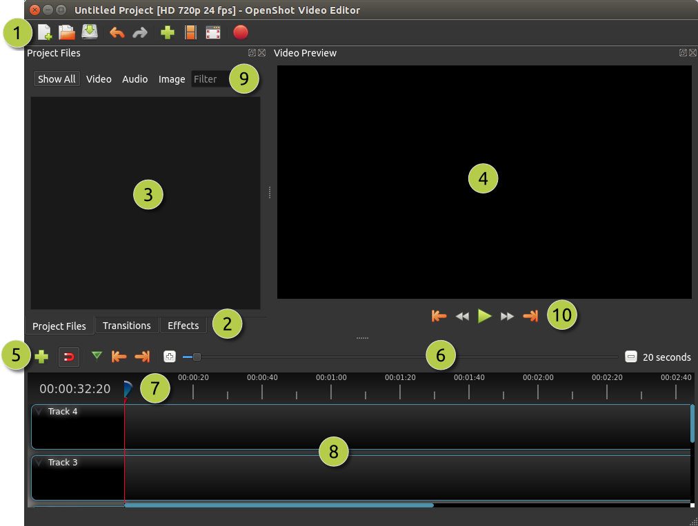

.. Copyright (c) 2008-2016 OpenShot Studios, LLC
 (http://www.openshotstudios.com). This file is part of
 OpenShot Video Editor (http://www.openshot.org), an open-source project
 dedicated to delivering high quality video editing and animation solutions
 to the world.

.. OpenShot Video Editor is free software: you can redistribute it and/or modify
 it under the terms of the GNU General Public License as published by
 the Free Software Foundation, either version 3 of the License, or
 (at your option) any later version.

.. OpenShot Video Editor is distributed in the hope that it will be useful,
 but WITHOUT ANY WARRANTY; without even the implied warranty of
 MERCHANTABILITY or FITNESS FOR A PARTICULAR PURPOSE.  See the
 GNU General Public License for more details.

.. You should have received a copy of the GNU General Public License
 along with OpenShot Library.  If not, see <http://www.gnu.org/licenses/>.

Main Window
===========

OpenShot Video Editor has one main window which contains most of the information, buttons,
and menus needed to edit your video project.

Overview
--------

.. table::
     :widths: 5 22 73

     ==  ==================  ============
     #   Name                Description
     ==  ==================  ============
     1   Main Toolbar        Contains buttons to open, save, and export your video project.
     2   Function Tabs       Switch between Project Files, Transitions, and Effects.
     3   Project Files       All audio, video, and image files that have been imported into your project.
     4   Preview Window      This is the area that the video will playback on the screen.
     5   Edit Toolbar        This toolbar contains buttons used for snapping, inserting markers, and jumping between markers.
     6   Zoom Slider         This slider will adjust the time-scale of your timeline.
     7   Play-head / Ruler   The ruler shows the time-scale, and the red line is the play-head. The play-head represents the current playback position.
     8   Timeline            The timeline visualizes your video project, and each clip and transition in your project.
     9   Filter              Filter the list of items shown (project files, transitions, and effects) by using these buttons and filter textbox. Enter a few letters of what you are looking for, and the results will be shown.
     ==  ==================  ============

For step-by-step instructions on the basic usage of OpenShot, be sure to read the
:ref:`quick_tutorial_ref`.

Built-in Tutorial
-----------------
When you first launch OpenShot, you will be presented with a friendly built-in tutorial. It will demonstrate and explain
the basics. Clicking :guilabel:`Next` will jump to the next topic. You can always view this tutorial again from the :menuselection:`Help --> Tutorial` menu.

.. image:: images/built-in-tutorial.jpg

Tracks & Layers
------------------

OpenShot uses tracks to layer videos and images. The top most track is the top
layer, and the bottom track is the bottom layer. If you are familiar with layers
in a photo editing application, then you should be quite familiar with this
concept. OpenShot will stack the layers and mix each one together, just like a
photo editing application. You can have an unlimited number of tracks, but
typically a video project will not need more than 10 tracks.

Here's a typical three-track video project, for example:

.. image:: images/tracks.jpg

.. table::
     :widths: 5 22 73

     ==  ==================  ============
     #   Track               Description
     ==  ==================  ============
     1   Top Track           Clips that will always be visible in front of other clips
     2   Middle Track        Clips in the middle (might or might not be visible, depending on what is above them)
     3   Bottom Track        Clips that will always be hidden behind anything on the tracks above
     ==  ==================  ============

.. _keyboard_shortcut_ref:

Keyboard Shortcuts
------------------
Here is a list of the default keyboard shortcuts supported by OpenShot. You can
configure these shortcuts in the Preferences window, which is opened by selecting
:menuselection:`Edit --> Preferences` from the OpenShot menu bar.
(On macOS, choose :menuselection:`OpenShot Video Editor --> Preferences`.)
Learning a few of these shortcuts can save you a bunch of time!

.. list-table::
   :header-rows: 1
   :widths: 15 20

   * - Shortcut
     - Action
   * - :kbd:`Ctrl` + :kbd:`H`
     - About OpenShot
   * - :kbd:`Ctrl` + :kbd:`M`
     - Add Marker
   * - :kbd:`Ctrl` + :kbd:`Shift` + :kbd:`T`
     - Add Track
   * - :kbd:`Ctrl` + :kbd:`W`
     - Add to Timeline
   * - :kbd:`Ctrl` + :kbd:`B`
     - Animated Title
   * - :kbd:`Ctrl` + :kbd:`P`
     - Choose Profile
   * - :kbd:`Ctrl` + :kbd:`C`
     - Copy
   * - :kbd:`Delete`
     - Delete Item
   * - :kbd:`Backspace`
     - Delete Item
   * - :kbd:`Ctrl` + :kbd:`D`
     - Details View
   * - :kbd:`Ctrl` + :kbd:`E`
     - Export Video
   * - :kbd:`L`
     - Fast Forward
   * - :kbd:`F11`
     - Fullscreen
   * - :kbd:`Ctrl` + :kbd:`F`
     - Import Files
   * - :kbd:`Ctrl` + :kbd:`End`
     - Jump to End
   * - :kbd:`Ctrl` + :kbd:`Home`
     - Jump to Start
   * - :kbd:`Ctrl` + :kbd:`N`
     - New Project
   * - :kbd:`Right`
     - Next Frame
   * - :kbd:`Ctrl` + :kbd:`Right`
     - Next Marker
   * - :kbd:`Ctrl` + :kbd:`O`
     - Open Project
   * - :kbd:`Ctrl` + :kbd:`V`
     - Paste
   * - :kbd:`Space`
     - Play/Pause Toggle
   * - :kbd:`Up`
     - Play/Pause Toggle
   * - :kbd:`Down`
     - Play/Pause Toggle
   * - :kbd:`K`
     - Play/Pause Toggle
   * - :kbd:`Ctrl` + :kbd:`Shift` + :kbd:`P`
     - Preferences
   * - :kbd:`Left`
     - Previous Frame
   * - :kbd:`Ctrl` + :kbd:`Left`
     - Previous Marker
   * - :kbd:`Ctrl` + :kbd:`I`
     - Properties
   * - :kbd:`Ctrl` + :kbd:`Q`
     - Quit
   * - :kbd:`Ctrl` + :kbd:`Y`
     - Redo
   * - :kbd:`J`
     - Rewind
   * - :kbd:`Ctrl` + :kbd:`S`
     - Save Project
   * - :kbd:`Ctrl` + :kbd:`Shift` + :kbd:`S`
     - Save Project As...
   * - :kbd:`Ctrl` + :kbd:`A`
     - Select All
   * - :kbd:`Ctrl` + :kbd:`Shift` + :kbd:`A`
     - Select None
   * - :kbd:`Ctrl` + :kbd:`K`
     - Slice All: Keep Both Sides
   * - :kbd:`Ctrl` + :kbd:`L`
     - Slice All: Keep Left Side
   * - :kbd:`Ctrl` + :kbd:`J`
     - Slice All: Keep Right Side
   * - :kbd:`Ctrl` + :kbd:`G`
     - Toggle Snapping
   * - :kbd:`Ctrl` + :kbd:`X`
     - Split Clip
   * - :kbd:`Ctrl` + :kbd:`Shift` + :kbd:`D`
     - Thumbnail View
   * - :kbd:`Ctrl` + :kbd:`T`
     - Title Editor
   * - :kbd:`Ctrl` + :kbd:`Z`
     - Undo
   * - :kbd:`=`
     - Zoom In
   * - :kbd:`-`
     - Zoom Out
   * - :kbd:`Ctrl` + Scroll
     - Zoom In/Out
   * - :kbd:`Ctrl` + Middle Button
     - Scroll Timeline
