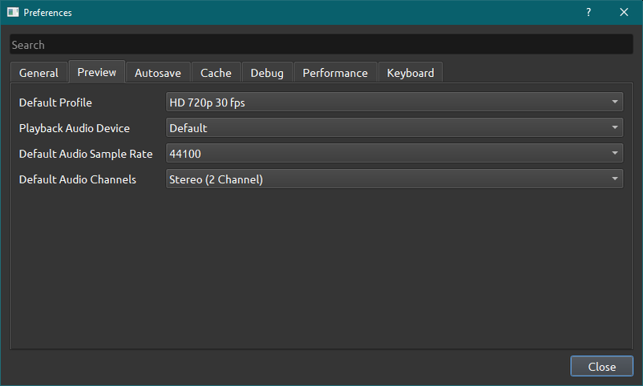
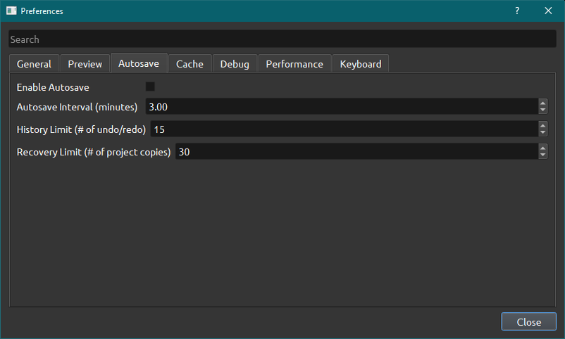

.. Copyright (c) 2020-2020 OpenShot Studios, LLC
 (http://www.openshotstudios.com). This file is part of
 OpenShot Video Editor (http://www.openshot.org), an open-source project
 dedicated to delivering high quality video editing and animation solutions
 to the world.

.. OpenShot Video Editor is free software: you can redistribute it and/or modify
 it under the terms of the GNU General Public License as published by
 the Free Software Foundation, either version 3 of the License, or
 (at your option) any later version.

.. OpenShot Video Editor is distributed in the hope that it will be useful,
 but WITHOUT ANY WARRANTY; without even the implied warr.. Copyright (c) 2008-2020 OpenShot Studios, LLC
 (http://www.openshotstudios.com). This file is part of
 OpenShot Video Editor (http://www.openshot.org), an open-source project
 dedicated to delivering high quality video editing and animation solutions
 to the world.

.. OpenShot Video Editor is free software: you can redistribute it and/or modify
 it under the terms of the GNU General Public License as published by
 the Free Software Foundation, either version 3 of the License, or
 (at your option) any later version.

.. OpenShot Video Editor is distributed in the hope that it will be useful,
 but WITHOUT ANY WARRANTY; without even the implied warranty of
 MERCHANTABILITY or FITNESS FOR A PARTICULAR PURPOSE.  See the
 GNU General Public License for more details.

.. You should have received a copy of the GNU General Public License
 along with OpenShot Library.  If not, see <http://www.gnu.org/licenses/>.

.. _preferences_ref:

Preferences
===========
The Preferences menu is where you modify all settings concerning OpenShot.
They can be found in the menu under **Edit→Preferences**.
You will need to restart OpenShot before changes are applied. 
After installation, you need to set the paths for Blender and Inkscape under the General if you want to use them.  
Also check if the audio settings under Preview are the same as your system, or you may experience sound issues during playback. 

General
-------

.. image:: images/preferences-1-general.png

Preview
-------

Here you can set the default Video Profile, but you can always choose a different one at the start of your project. More about :ref:`profiles`

Here you can choose which connected audio device should be used by OpenShot. 
If you experience sound issues, make sure your audio settings are the same as your audio card.
The default audio sample rate of your sound device can be found under the sound device settings from your operating system. 

.. TODO:: Add to FAQ, add Link [WIKI tag AUDIO + FAQ ?] here.  
   For more info check our FAQ on the wiki.
   Windows: disable audio enhancements/microphone recognition

Autosave
--------

When loading in projects from older versions of OpenShot, you may want to terporary disable Autosave to see if they work. This to prevent them from being automatically overwritten by a broken version. 
.. Advise SuslikV on github https://github.com/OpenShot/openshot-qt/issues/3334

Cache
-----

.. image:: images/preferences-4-cache.png
.. TODO:: Cache settings
  CacheMode - When to use Disk? Servers?
  Cache Limit (MB): How much % of RAM advised? Different for iGPU vs dedicated GPU?
  Image Format: What is PPM/XMB/XPM? Where is this used for? 
  Scale Factor: ??
  Image Quality: ??

Debug
-----

.. image:: images/preferences-5-debug.png
Here you can modify how much data should be logged. Normally, *Debug Mode (verbose)* is off.
The default port is 5556
If you want to help improve the program you can enable **Send Anonymous Metrics and Errors**.

Performance
-----------
.. image:: images/preferences-6-performance.png

Please keep in mind that hardware accelleration is experimental at the moment.
For more information take a look at our `Github<https://github.com/OpenShot/libopenshot/blob/develop/doc/HW-ACCEL.md>`_
It may be best to test each modification directly after changing so you remember what was changed if you experience issues.

.. TODO:: Performance settings
  Process Video Frame Rates in Parallel
  OMP Threads = Open Multi-Processing? https://en.wikipedia.org/wiki/OpenMP
  FFmpeg Threads 
        (NB: it states 0=default, but the actualy default upon installation is 8 ?)
         Advices is N(cores-1) or N(Threads-1) ?
 Hardware Decoder max width/height  Can be found where? Link to HW manufacturers?
 Use Blender GPU rendering: Default = on?
    (May be default in Blender 2.8? - 
    May work backfire if system has multiple GPUs and high-end GPU recognizes Blender automatically)
        

Keyboard
--------
.. image:: images/preferences-7-keyboard.png

This is where hotkeys can be seen and re-assigned, as described under 
:ref:`keyboard_shortcut_ref`. 
