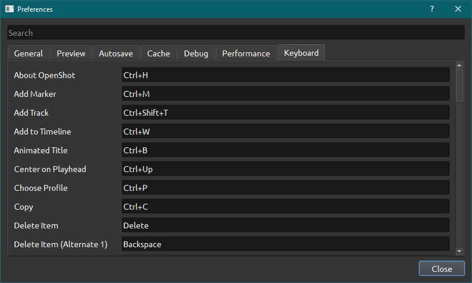

.. Copyright (c) 2008-2020 OpenShot Studios, LLC
 (http://www.openshotstudios.com). This file is part of
 OpenShot Video Editor (http://www.openshot.org), an open-source project
 dedicated to delivering high quality video editing and animation solutions
 to the world.

.. OpenShot Video Editor is free software: you can redistribute it and/or modify
 it under the terms of the GNU General Public License as published by
 the Free Software Foundation, either version 3 of the License, or
 (at your option) any later version.

.. OpenShot Video Editor is distributed in the hope that it will be useful,
 but WITHOUT ANY WARRANTY; without even the implied warranty of
 MERCHANTABILITY or FITNESS FOR A PARTICULAR PURPOSE.  See the
 GNU General Public License for more details.

.. You should have received a copy of the GNU General Public License
 along with OpenShot Library.  If not, see <http://www.gnu.org/licenses/>.

.. _preferences_ref:

Preferences
===========
The Preferences window is where you modify all settings concerning OpenShot.
They can be found in the top menu under **Edit→Preferences**.
You will need to restart OpenShot after your changes are applied. 
After installation, you need to set the paths for Blender and Inkscape under the General tab if you want to use them.  
Also, check the audio settings under the Preview tab.  Make sure they are the same as your system, or you may experience sound issues during preview/playback. 

General
-------

The General tab of the Preferences window allows you to modify the  settings that apply to OpenShot as a whole.

.. table::
   :widths: 30 15

   ================================  =============  ===========
   Setting                           Default        Description
   ================================  =============  ===========
   Language                          Default        Choose your preferred language for OpenShot menus and windows  
   Default Theme                     Humanity:Dark  Choose your theme for OpenShot, either Light, Dark or None
   Image Length (seconds)            10.00          How long the image displays on the screen when added to the timeline
   Volume                            75.00          The percentage of the volume of the clip when added to the timeline
   Blender Command (path)            *<blank>*      The path to the binary for Blender
   Advanced Title Editor (path)      *<blank>*      The path to the binary for Inkscape
   Show Export Dialog when Finished  *<checked>*    Displays the Export Video windows after the export is finished
   ================================  =============  ===========

Preview
-------

.. image:: images/preferences-2-preview.png

Here you can set the Default Profile for your project, but you can always choose a different one when you start a new project. More about `profiles <profiles.html>`_.

Here you can choose which connected audio device should be used by OpenShot. 
If you experience sound issues, make sure that your audio settings match your audio card.
The default audio sample rate of your sound device can be found under the sound device settings from your operating system. 

.. table::
   :widths: 30 20

   ================================  ==================  ===========
   Setting                           Default             Description
   ================================  ==================  ===========
   Default Video Profile             HD 720P 30 fps      Select the profile for Preview and Export defaults  
   Playback Audio Device             Default             
   Default Audio Sample Rate         44100               
   Default Audio Channels            Stereo (2 Channel)  
   ================================  ==================  ===========
   
.. TODO Add to FAQ, add Link [WIKI tag AUDIO + FAQ ?] here.  
   For more info check our FAQ on the wiki.
   Windows: disable audio enhancements/microphone recognition

Autosave
--------

.. image:: images/preferences-3-autosave.png

Autosave is a saving function in OpenShot which automatically saves the current changes or progress to your project, helping to reduce the risk or impact of data loss in case of a crash, freeze or user error.

When loading projects from older versions of OpenShot, you may want to terporary disable Autosave to see if they work. This to prevent them from being automatically overwritten by a broken version. 
.. Advise SuslikV on github https://github.com/OpenShot/openshot-qt/issues/3334

Cache
-----

A cache is a hardware or software component that stores data so that future requests for that data can be served faster.

.. TODO Cache settings
  CacheMode - When to use Disk? Servers?
  Cache Limit (MB): How much % of RAM advised? Different for iGPU vs dedicated GPU?
  Image Format: What is PPM/XMB/XPM? Where is this used for? 
  Scale Factor: ??
  Image Quality: ??

Debug
-----

Here you can modify how much data should be logged. Normally, *Debug Mode (verbose)* is off.
The default port is 5556
If you want to help improve the program you can enable **Send Anonymous Metrics and Errors**.

Performance
-----------
.. image:: images/preferences-6-performance.png

Please keep in mind that hardware accelleration is experimental at the moment.
For more information take a look at our `Github <https://github.com/OpenShot/libopenshot/blob/develop/doc/HW-ACCEL.md>`_
It may be best to test each modification directly after changing so you remember what was changed if you experience issues.

.. TODO Performance settings
  Process Video Frame Rates in Parallel
  OMP Threads = Open Multi-Processing? https://en.wikipedia.org/wiki/OpenMP
  FFmpeg Threads 
        (NB: it states 0=default, but the actualy default upon installation is 8 ?)
         Advices is N(cores-1) or N(Threads-1) ?
 Hardware Decoder max width/height  Can be found where? Link to HW manufacturers?
 Use Blender GPU rendering: Default = on?
    (May be default in Blender 2.8? - 
    May work backfire if system has multiple GPUs and high-end GPU recognizes Blender automatically)
        

Keyboard
--------

This is where hotkeys can be seen and re-assigned, as described under 
:ref:`keyboard_shortcut_ref`. 
