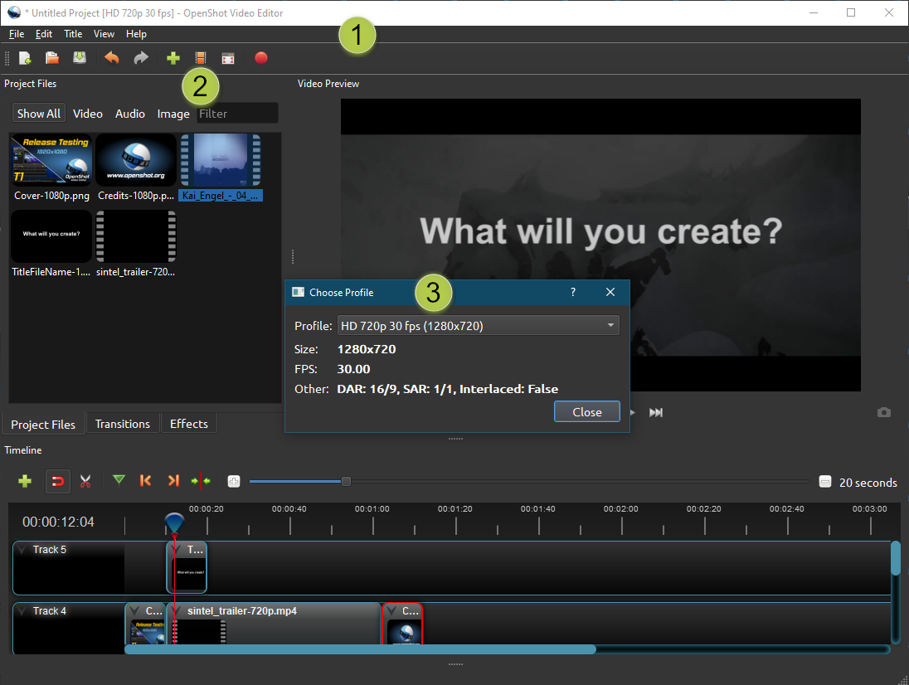
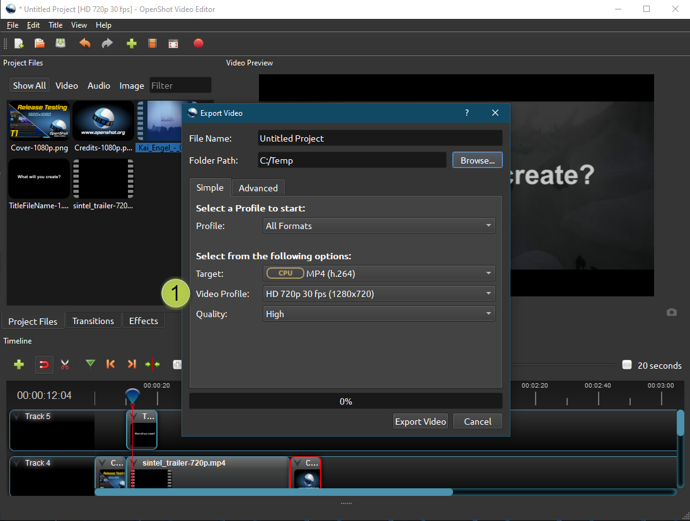

.. Copyright (c) 2008-2020 OpenShot Studios, LLC
 (http://www.openshotstudios.com). This file is part of
 OpenShot Video Editor (http://www.openshot.org), an open-source project
 dedicated to delivering high quality video editing and animation solutions
 to the world.

.. OpenShot Video Editor is free software: you can redistribute it and/or modify
 it under the terms of the GNU General Public License as published by
 the Free Software Foundation, either version 3 of the License, or
 (at your option) any later version.

.. OpenShot Video Editor is distributed in the hope that it will be useful,
 but WITHOUT ANY WARRANTY; without even the implied warranty of
 MERCHANTABILITY or FITNESS FOR A PARTICULAR PURPOSE.  See the
 GNU General Public License for more details.

.. You should have received a copy of the GNU General Public License
 along with OpenShot Library.  If not, see <http://www.gnu.org/licenses/>.

.. _profiles_ref:

Profiles
========

A profile is a collection of common video settings (size, frame rate, aspect ratio, etc...). Profiles are used
during editing, previewing, and exporting to provide a quick way to switch between common combinations of these settings.

If you often use the same profile, you can set a default under:
**Edit>Preferences>Preview>Default Profile**

Project Profile
---------------

The project profile is used when previewing your project and editing. The default project profile is "HD 720p 30fps".
It is best practice to always switch to your target profile before you begin editing. For example, if you are targeting
1080p 30fps, switch to that profile before you begin editing your project.

==  ==================  ============
#   Name                Description
==  ==================  ============
1   Title Bar           The title bar of OpenShot displays the current profile
2   Profile Button      Launch the profiles dialog
3   Choose Profile      Select a profile for editing and preview
==  ==================  ============

Export Profile
--------------

The export profile always defaults to your current project profile, but can be changed to target different profiles.

==  ==================  ============
#   Name                Description
==  ==================  ============
1   Choose Profile      Select a profile for export
==  ==================  ============

Custom Profile
--------------
Although OpenShot has more than 70 profiles included by default, you can also create your own custom profiles. Create a
new file in the C:\\Users\\*USERNAME*\\.openshot_qt\\profiles folder. Use the following text as your template (i.e. copy and paste this into the file):

.. code-block:: python

    description=Custom Profile Name
    frame_rate_num=30000
    frame_rate_den=1001
    width=1280
    height=720
    progressive=1
    sample_aspect_num=1
    sample_aspect_den=1
    display_aspect_num=16
    display_aspect_den=9
    colorspace=709

Once you restart OpenShot, you will see your custom profile appear in the list of Profiles.

By reversing the values for 'width' and 'height', you can create a vertical profile. 
The line 'progressive' is a  boolean value. 
Set 1 for Progressive or 0 for interlaced.

While there is a line for "colorspace", this is currently not supported. 

.. TODO:: Colorspace is currently  broken, re-enable table when fixed. 
  see  https://github.com/OpenShot/openshot-qt/issues/3427

  =====  =====  =========
  Value  Use    YUV colorspace used by International Telecommunications Union
  =====  =====  =========
  601    SD     Legacy. Use only if all source video is in this format
  709    HD     Normal mode for most cases
  2020   UHD    Not supported. 
  =====  =====  =========

Frame rate is defined as fraction, calculated by deviding frame_rate_num by frame_rate_den. 

================  ==============  ==============
Frame rate (fps)  frame_rate_num  frame_rate_den
================  ==============  ==============
24                24              1
25                25              1
30                30              1
60                60              1
23.98             24000           1001
29.97             30000           1001
59.94             60000           1001
================  ==============  ==============

