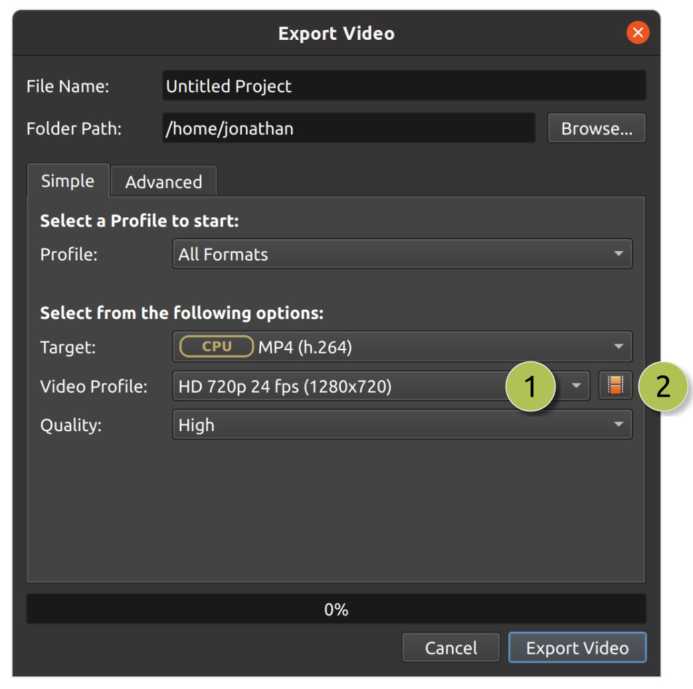

.. Copyright (c) 2008-2023 OpenShot Studios, LLC
 (http://www.openshotstudios.com). This file is part of
 OpenShot Video Editor (http://www.openshot.org), an open-source project
 dedicated to delivering high quality video editing and animation solutions
 to the world.

.. OpenShot Video Editor is free software: you can redistribute it and/or modify
 it under the terms of the GNU General Public License as published by
 the Free Software Foundation, either version 3 of the License, or
 (at your option) any later version.

.. OpenShot Video Editor is distributed in the hope that it will be useful,
 but WITHOUT ANY WARRANTY; without even the implied warranty of
 MERCHANTABILITY or FITNESS FOR A PARTICULAR PURPOSE.  See the
 GNU General Public License for more details.

.. You should have received a copy of the GNU General Public License
 along with OpenShot Library.  If not, see <http://www.gnu.org/licenses/>.

.. _profiles_ref:

Profiles
========

A video profile is a collection of common video settings (*size, frame rate, aspect ratio*). Profiles are used
during editing, previewing, and exporting to provide a quick way to switch between common combinations of
these settings.

If you often use the same profile, you can set a default profile:
:guilabel:`Edit→Preferences→Preview`.

Project Profile
---------------

The project profile is used when previewing your project and editing. The default project profile is ``HD 720p 30fps``.
It is best practice to always switch to your target profile before you begin editing. For example, if you are targeting
1080p 30fps, switch to that profile before you begin editing your project. For a full list of included profiles
see :ref:`profile_list_ref`.

.. image:: images/profiles.jpg

==  ==================  ============
#   Name                Description
==  ==================  ============
1   Title Bar           The title bar of OpenShot displays the current profile
2   Profile Button      Launch the profiles dialog
3   Choose Profile      Select a profile for editing and preview
==  ==================  ============

Choose Profile Dialog
---------------------


==  ==================  ============
#   Name                Description
==  ==================  ============
1   Filter / Search     Filter the available profiles by typing a few characters (i.e. FHD, 720p, 16:9, etc...)
2   Selected Profile    Click on the desired profile, and then the :guilabel:`OK` button. You can also double click a profile to select it.
3   Filtered Count      Count of filtered profiles
4   Accept Profile      Click the :guilabel:`OK` button to switch to the selected profile.
==  ==================  ============

Export Profile
--------------

The export profile always defaults to your current project profile, but can be changed to target different profiles.



==  ==================  ============
#   Name                Description
==  ==================  ============
1   Choose Profile      Select an export profile from a dropdown. This list is sorted from largest resolution at the top, smallest resolution at the bottom.
2   Search Profiles     Open Profile dialog to filter and search for an export profile, which can sometimes be much quicker to find a specific profile.
==  ==================  ============

Custom Profile
--------------
Although OpenShot has more than 400 profiles (:ref:`profile_list_ref`) included by default, you can also create
your own custom profiles. Create a new text file in the ``~/.openshot_qt/profiles/`` or
``C:\Users\USERNAME\.openshot_qt\profiles`` folder. Use the following text as your template (i.e. copy and
paste this into the new file):

.. code-block:: python

    description=Custom Profile Name
    frame_rate_num=30000
    frame_rate_den=1001
    width=1280
    height=720
    progressive=1
    sample_aspect_num=1
    sample_aspect_den=1
    display_aspect_num=16
    display_aspect_den=9

.. table::
   :widths: 24 60

   ======================  ============
   Profile Property        Description
   ======================  ============
   description             The friendly name of the profile (this is what OpenShot displays in the user interface)
   frame_rate_num          The frame rate numerator. All frame rates are expressed as fractions. For example, ``30 FPS == 30/1``.
   frame_rate_den          The frame rate denominator. All frame rates are expressed as fractions. For example, ``29.97 FPS == 30,000/1001``.
   width                   The number of horizontal pixels in the image. By reversing the values for `width` and `height`, you can create a vertical profile.
   height                  The number of vertical pixels in the image
   progressive             ```(0 or 1)``` If 1, both even and odd rows of pixels are used. If 0, only odd or even rows of pixels are used.
   sample_aspect_num       The numerator of the **SAR** (sample/pixel shape aspect ratio), ``1:1`` ratio would represent a square pixel, ``2:1`` ratio would represent a ``2x1`` rectangle pixel shape, etc...
   sample_aspect_den       The denominator of the **SAR** (sample/pixel shape aspect ratio)
   display_aspect_num      The numerator of the **DAR** (display aspect ratio), ``(width/height) X (sample aspect ratio)``. This is the final ratio of the image displayed on screen, reduced to the smallest fraction possible (common ratios are 16:9 for wide formats, 4:3 for legacy television formats).
   display_aspect_den      The denominator of the **DAR** (display aspect ratio)
   ======================  ============

Once you restart OpenShot, you will see your custom profile appear in the list of Profiles.

.. _preset_list_ref:

Preset List
-----------

OpenShot includes many **export presets**, which combine our list of common profiles and their associated video export settings (``video codec``,
``audio codec``, ``audio channels``, ``audio sample rate``, etc...), which target specific output formats, websites, and devices. The **default
export preset** used by OpenShot is ``MP4 (h.264 + AAC)``, see :ref:`profiles_mp4_h264_ref`.

All Formats
^^^^^^^^^^^

AVI (h.264)
~~~~~~~~~~~

.. table::
   :widths: 30 30

   =======================  ============
   Preset Attribute         Description
   =======================  ============
   Video Format             AVI
   Video Codec              libx264
   Audio Codec              aac
   Audio Channels           2
   Audio Channel Layout     Stereo
   Sample Rate              48000
   Video Bitrate (low)      384 kb/s
   Video Bitrate (med)      5 Mb/s
   Video Bitrate (high)     15.00 Mb/s
   Audio Bitrate (low)      96 kb/s
   Audio Bitrate (med)      128 kb/s
   Audio Bitrate (high)     192 kb/s
   Profiles                 | All Profiles
   =======================  ============

AVI (mpeg2)
~~~~~~~~~~~

.. table::
   :widths: 30 30

   =======================  ============
   Preset Attribute         Description
   =======================  ============
   Video Format             AVI
   Video Codec              mpeg2video
   Audio Codec              mp2
   Audio Channels           2
   Audio Channel Layout     Stereo
   Sample Rate              48000
   Video Bitrate (low)      384 kb/s
   Video Bitrate (med)      5 Mb/s
   Video Bitrate (high)     15.00 Mb/s
   Audio Bitrate (low)      96 kb/s
   Audio Bitrate (med)      128 kb/s
   Audio Bitrate (high)     192 kb/s
   Profiles                 | All Profiles
   =======================  ============

AVI (mpeg4)
~~~~~~~~~~~

.. table::
   :widths: 30 30

   =======================  ============
   Preset Attribute         Description
   =======================  ============
   Video Format             AVI
   Video Codec              mpeg4
   Audio Codec              libmp3lame
   Audio Channels           2
   Audio Channel Layout     Stereo
   Sample Rate              48000
   Video Bitrate (low)      384 kb/s
   Video Bitrate (med)      5 Mb/s
   Video Bitrate (high)     15.00 Mb/s
   Audio Bitrate (low)      96 kb/s
   Audio Bitrate (med)      128 kb/s
   Audio Bitrate (high)     192 kb/s
   Profiles                 | All Profiles
   =======================  ============

GIF (animated)
~~~~~~~~~~~~~~

.. table::
   :widths: 30 30

   =======================  ============
   Preset Attribute         Description
   =======================  ============
   Video Format             GIF
   Video Codec              gif
   Video Bitrate (low)      384 kb/s
   Video Bitrate (med)      5 Mb/s
   Video Bitrate (high)     15.00 Mb/s
   Profiles                 | All Profiles
   =======================  ============

MKV (h.264 dx)
~~~~~~~~~~~~~~

.. table::
   :widths: 30 30

   =======================  ============
   Preset Attribute         Description
   =======================  ============
   Video Format             MKV
   Video Codec              h264_dxva2
   Audio Codec              aac
   Audio Channels           2
   Audio Channel Layout     Stereo
   Sample Rate              48000
   Video Bitrate (low)      384 kb/s
   Video Bitrate (med)      5 Mb/s
   Video Bitrate (high)     15.00 Mb/s
   Audio Bitrate (low)      96 kb/s
   Audio Bitrate (med)      128 kb/s
   Audio Bitrate (high)     192 kb/s
   Profiles                 | All Profiles
   =======================  ============

MKV (h.264 nv)
~~~~~~~~~~~~~~

.. table::
   :widths: 30 30

   =======================  ============
   Preset Attribute         Description
   =======================  ============
   Video Format             MKV
   Video Codec              h264_nvenc
   Audio Codec              aac
   Audio Channels           2
   Audio Channel Layout     Stereo
   Sample Rate              48000
   Video Bitrate (low)      384 kb/s
   Video Bitrate (med)      5 Mb/s
   Video Bitrate (high)     15.00 Mb/s
   Audio Bitrate (low)      96 kb/s
   Audio Bitrate (med)      128 kb/s
   Audio Bitrate (high)     192 kb/s
   Profiles                 | All Profiles
   =======================  ============

MKV (h.264 qsv)
~~~~~~~~~~~~~~~

.. table::
   :widths: 30 30

   =======================  ============
   Preset Attribute         Description
   =======================  ============
   Video Format             MKV
   Video Codec              h264_qsv
   Audio Codec              aac
   Audio Channels           2
   Audio Channel Layout     Stereo
   Sample Rate              48000
   Video Bitrate (low)      384 kb/s
   Video Bitrate (med)      5 Mb/s
   Video Bitrate (high)     15.00 Mb/s
   Audio Bitrate (low)      96 kb/s
   Audio Bitrate (med)      128 kb/s
   Audio Bitrate (high)     192 kb/s
   Profiles                 | All Profiles
   =======================  ============

MKV (h.264 va)
~~~~~~~~~~~~~~

.. table::
   :widths: 30 30

   =======================  ============
   Preset Attribute         Description
   =======================  ============
   Video Format             MKV
   Video Codec              h264_vaapi
   Audio Codec              aac
   Audio Channels           2
   Audio Channel Layout     Stereo
   Sample Rate              48000
   Video Bitrate (low)      384 kb/s
   Video Bitrate (med)      5 Mb/s
   Video Bitrate (high)     15.00 Mb/s
   Audio Bitrate (low)      96 kb/s
   Audio Bitrate (med)      128 kb/s
   Audio Bitrate (high)     192 kb/s
   Profiles                 | All Profiles
   =======================  ============

MKV (h.264 videotoolbox)
~~~~~~~~~~~~~~~~~~~~~~~~

.. table::
   :widths: 30 30

   =======================  ============
   Preset Attribute         Description
   =======================  ============
   Video Format             MKV
   Video Codec              h264_videotoolbox
   Audio Codec              aac
   Audio Channels           2
   Audio Channel Layout     Stereo
   Sample Rate              48000
   Video Bitrate (low)      384 kb/s
   Video Bitrate (med)      5 Mb/s
   Video Bitrate (high)     15.00 Mb/s
   Audio Bitrate (low)      96 kb/s
   Audio Bitrate (med)      128 kb/s
   Audio Bitrate (high)     192 kb/s
   Profiles                 | All Profiles
   =======================  ============

MKV (h.264)
~~~~~~~~~~~

.. table::
   :widths: 30 30

   =======================  ============
   Preset Attribute         Description
   =======================  ============
   Video Format             MKV
   Video Codec              libx264
   Audio Codec              aac
   Audio Channels           2
   Audio Channel Layout     Stereo
   Sample Rate              48000
   Video Bitrate (low)      384 kb/s
   Video Bitrate (med)      5 Mb/s
   Video Bitrate (high)     15.00 Mb/s
   Audio Bitrate (low)      96 kb/s
   Audio Bitrate (med)      128 kb/s
   Audio Bitrate (high)     192 kb/s
   Profiles                 | All Profiles
   =======================  ============

MKV (h.265)
~~~~~~~~~~~

.. table::
   :widths: 30 30

   =======================  ============
   Preset Attribute         Description
   =======================  ============
   Video Format             MKV
   Video Codec              libx265
   Audio Codec              aac
   Audio Channels           2
   Audio Channel Layout     Stereo
   Sample Rate              48000
   Video Bitrate (low)      50 crf
   Video Bitrate (med)      23 crf
   Video Bitrate (high)     0 crf
   Audio Bitrate (low)      96 kb/s
   Audio Bitrate (med)      128 kb/s
   Audio Bitrate (high)     192 kb/s
   Profiles                 | All Profiles
   =======================  ============

MOV (h.264)
~~~~~~~~~~~

.. table::
   :widths: 30 30

   =======================  ============
   Preset Attribute         Description
   =======================  ============
   Video Format             MOV
   Video Codec              libx264
   Audio Codec              aac
   Audio Channels           2
   Audio Channel Layout     Stereo
   Sample Rate              48000
   Video Bitrate (low)      384 kb/s
   Video Bitrate (med)      5 Mb/s
   Video Bitrate (high)     15.00 Mb/s
   Audio Bitrate (low)      96 kb/s
   Audio Bitrate (med)      128 kb/s
   Audio Bitrate (high)     192 kb/s
   Profiles                 | All Profiles
   =======================  ============

MOV (mpeg2)
~~~~~~~~~~~

.. table::
   :widths: 30 30

   =======================  ============
   Preset Attribute         Description
   =======================  ============
   Video Format             MOV
   Video Codec              mpeg2video
   Audio Codec              mp2
   Audio Channels           2
   Audio Channel Layout     Stereo
   Sample Rate              48000
   Video Bitrate (low)      384 kb/s
   Video Bitrate (med)      5 Mb/s
   Video Bitrate (high)     15.00 Mb/s
   Audio Bitrate (low)      96 kb/s
   Audio Bitrate (med)      128 kb/s
   Audio Bitrate (high)     192 kb/s
   Profiles                 | All Profiles
   =======================  ============

MOV (mpeg4)
~~~~~~~~~~~

.. table::
   :widths: 30 30

   =======================  ============
   Preset Attribute         Description
   =======================  ============
   Video Format             MOV
   Video Codec              mpeg4
   Audio Codec              libmp3lame
   Audio Channels           2
   Audio Channel Layout     Stereo
   Sample Rate              48000
   Video Bitrate (low)      384 kb/s
   Video Bitrate (med)      5 Mb/s
   Video Bitrate (high)     15.00 Mb/s
   Audio Bitrate (low)      96 kb/s
   Audio Bitrate (med)      128 kb/s
   Audio Bitrate (high)     192 kb/s
   Profiles                 | All Profiles
   =======================  ============

MP3 (audio only)
~~~~~~~~~~~~~~~~

.. table::
   :widths: 30 30

   =======================  ============
   Preset Attribute         Description
   =======================  ============
   Video Format             MP3
   Audio Codec              libmp3lame
   Audio Channels           2
   Audio Channel Layout     Stereo
   Sample Rate              48000
   Audio Bitrate (low)      96 kb/s
   Audio Bitrate (med)      128 kb/s
   Audio Bitrate (high)     192 kb/s
   Profiles                 | All Profiles
   =======================  ============

MP4 (AV1 rav1e)
~~~~~~~~~~~~~~~

.. table::
   :widths: 30 30

   =======================  ============
   Preset Attribute         Description
   =======================  ============
   Video Format             MP4
   Video Codec              librav1e
   Audio Codec              libvorbis
   Audio Channels           2
   Audio Channel Layout     Stereo
   Sample Rate              48000
   Video Bitrate (low)      200 qp
   Video Bitrate (med)      100 qp
   Video Bitrate (high)     50 qp
   Audio Bitrate (low)      96 kb/s
   Audio Bitrate (med)      128 kb/s
   Audio Bitrate (high)     192 kb/s
   Profiles                 | All Profiles
   =======================  ============

MP4 (AV1 svt)
~~~~~~~~~~~~~

.. table::
   :widths: 30 30

   =======================  ============
   Preset Attribute         Description
   =======================  ============
   Video Format             MP4
   Video Codec              libsvtav1
   Audio Codec              libvorbis
   Audio Channels           2
   Audio Channel Layout     Stereo
   Sample Rate              48000
   Video Bitrate (low)      60 qp
   Video Bitrate (med)      50 qp
   Video Bitrate (high)     30 qp
   Audio Bitrate (low)      96 kb/s
   Audio Bitrate (med)      128 kb/s
   Audio Bitrate (high)     192 kb/s
   Profiles                 | All Profiles
   =======================  ============

MP4 (HEVC va)
~~~~~~~~~~~~~

.. table::
   :widths: 30 30

   =======================  ============
   Preset Attribute         Description
   =======================  ============
   Video Format             MP4
   Video Codec              hevc_vaapi
   Audio Codec              aac
   Audio Channels           2
   Audio Channel Layout     Stereo
   Sample Rate              48000
   Video Bitrate (low)      384 kb/s
   Video Bitrate (med)      5 Mb/s
   Video Bitrate (high)     15.00 Mb/s
   Audio Bitrate (low)      96 kb/s
   Audio Bitrate (med)      128 kb/s
   Audio Bitrate (high)     192 kb/s
   Profiles                 | All Profiles
   =======================  ============

MP4 (Xvid)
~~~~~~~~~~

.. table::
   :widths: 30 30

   =======================  ============
   Preset Attribute         Description
   =======================  ============
   Video Format             MP4
   Video Codec              libxvid
   Audio Codec              aac
   Audio Channels           2
   Audio Channel Layout     Stereo
   Sample Rate              48000
   Video Bitrate (low)      384 kb/s
   Video Bitrate (med)      5 Mb/s
   Video Bitrate (high)     15.00 Mb/s
   Audio Bitrate (low)      96 kb/s
   Audio Bitrate (med)      128 kb/s
   Audio Bitrate (high)     192 kb/s
   Profiles                 | All Profiles
   =======================  ============

MP4 (h.264 dx)
~~~~~~~~~~~~~~

.. table::
   :widths: 30 30

   =======================  ============
   Preset Attribute         Description
   =======================  ============
   Video Format             MP4
   Video Codec              h264_dxva2
   Audio Codec              aac
   Audio Channels           2
   Audio Channel Layout     Stereo
   Sample Rate              48000
   Video Bitrate (low)      384 kb/s
   Video Bitrate (med)      5 Mb/s
   Video Bitrate (high)     15.00 Mb/s
   Audio Bitrate (low)      96 kb/s
   Audio Bitrate (med)      128 kb/s
   Audio Bitrate (high)     192 kb/s
   Profiles                 | All Profiles
   =======================  ============

MP4 (h.264 nv)
~~~~~~~~~~~~~~

.. table::
   :widths: 30 30

   =======================  ============
   Preset Attribute         Description
   =======================  ============
   Video Format             MP4
   Video Codec              h264_nvenc
   Audio Codec              aac
   Audio Channels           2
   Audio Channel Layout     Stereo
   Sample Rate              48000
   Video Bitrate (low)      384 kb/s
   Video Bitrate (med)      5 Mb/s
   Video Bitrate (high)     15.00 Mb/s
   Audio Bitrate (low)      96 kb/s
   Audio Bitrate (med)      128 kb/s
   Audio Bitrate (high)     192 kb/s
   Profiles                 | All Profiles
   =======================  ============

MP4 (h.264 qsv)
~~~~~~~~~~~~~~~

.. table::
   :widths: 30 30

   =======================  ============
   Preset Attribute         Description
   =======================  ============
   Video Format             MP4
   Video Codec              h264_qsv
   Audio Codec              aac
   Audio Channels           2
   Audio Channel Layout     Stereo
   Sample Rate              48000
   Video Bitrate (low)      384 kb/s
   Video Bitrate (med)      5 Mb/s
   Video Bitrate (high)     15.00 Mb/s
   Audio Bitrate (low)      96 kb/s
   Audio Bitrate (med)      128 kb/s
   Audio Bitrate (high)     192 kb/s
   Profiles                 | All Profiles
   =======================  ============

MP4 (h.264 va)
~~~~~~~~~~~~~~

.. table::
   :widths: 30 30

   =======================  ============
   Preset Attribute         Description
   =======================  ============
   Video Format             MP4
   Video Codec              h264_vaapi
   Audio Codec              aac
   Audio Channels           2
   Audio Channel Layout     Stereo
   Sample Rate              48000
   Video Bitrate (low)      384 kb/s
   Video Bitrate (med)      5 Mb/s
   Video Bitrate (high)     15.00 Mb/s
   Audio Bitrate (low)      96 kb/s
   Audio Bitrate (med)      128 kb/s
   Audio Bitrate (high)     192 kb/s
   Profiles                 | All Profiles
   =======================  ============

MP4 (h.264 videotoolbox)
~~~~~~~~~~~~~~~~~~~~~~~~

.. table::
   :widths: 30 30

   =======================  ============
   Preset Attribute         Description
   =======================  ============
   Video Format             MP4
   Video Codec              h264_videotoolbox
   Audio Codec              aac
   Audio Channels           2
   Audio Channel Layout     Stereo
   Sample Rate              48000
   Video Bitrate (low)      384 kb/s
   Video Bitrate (med)      5 Mb/s
   Video Bitrate (high)     15.00 Mb/s
   Audio Bitrate (low)      96 kb/s
   Audio Bitrate (med)      128 kb/s
   Audio Bitrate (high)     192 kb/s
   Profiles                 | All Profiles
   =======================  ============

.. _profiles_mp4_h264_ref:

MP4 (h.264)
~~~~~~~~~~~

This is the default export preset used by OpenShot. This format is compatible
with most media players (such as VLC) and websites (such as YouTube, Vimeo, Facebook).

.. table::
   :widths: 30 30

   =======================  ============
   Preset Attribute         Description
   =======================  ============
   Video Format             MP4
   Video Codec              libx264
   Audio Codec              aac
   Audio Channels           2
   Audio Channel Layout     Stereo
   Sample Rate              48000
   Video Bitrate (low)      384 kb/s
   Video Bitrate (med)      5 Mb/s
   Video Bitrate (high)     15.00 Mb/s
   Audio Bitrate (low)      96 kb/s
   Audio Bitrate (med)      128 kb/s
   Audio Bitrate (high)     192 kb/s
   Profiles                 | All Profiles
   =======================  ============

MP4 (h.265)
~~~~~~~~~~~

.. table::
   :widths: 30 30

   =======================  ============
   Preset Attribute         Description
   =======================  ============
   Video Format             MP4
   Video Codec              libx265
   Audio Codec              aac
   Audio Channels           2
   Audio Channel Layout     Stereo
   Sample Rate              48000
   Video Bitrate (low)      50 crf
   Video Bitrate (med)      23 crf
   Video Bitrate (high)     0 crf
   Audio Bitrate (low)      96 kb/s
   Audio Bitrate (med)      128 kb/s
   Audio Bitrate (high)     192 kb/s
   Profiles                 | All Profiles
   =======================  ============

MP4 (mpeg4)
~~~~~~~~~~~

.. table::
   :widths: 30 30

   =======================  ============
   Preset Attribute         Description
   =======================  ============
   Video Format             MP4
   Video Codec              mpeg4
   Audio Codec              libmp3lame
   Audio Channels           2
   Audio Channel Layout     Stereo
   Sample Rate              48000
   Video Bitrate (low)      384 kb/s
   Video Bitrate (med)      5 Mb/s
   Video Bitrate (high)     15.00 Mb/s
   Audio Bitrate (low)      96 kb/s
   Audio Bitrate (med)      128 kb/s
   Audio Bitrate (high)     192 kb/s
   Profiles                 | All Profiles
   =======================  ============

MPEG (mpeg2)
~~~~~~~~~~~~

.. table::
   :widths: 30 30

   =======================  ============
   Preset Attribute         Description
   =======================  ============
   Video Format             MPEG
   Video Codec              mpeg2video
   Audio Codec              mp2
   Audio Channels           2
   Audio Channel Layout     Stereo
   Sample Rate              48000
   Video Bitrate (low)      384 kb/s
   Video Bitrate (med)      5 Mb/s
   Video Bitrate (high)     15.00 Mb/s
   Audio Bitrate (low)      96 kb/s
   Audio Bitrate (med)      128 kb/s
   Audio Bitrate (high)     192 kb/s
   Profiles                 | All Profiles
   =======================  ============

OGG (theora/flac)
~~~~~~~~~~~~~~~~~

.. table::
   :widths: 30 30

   =======================  ============
   Preset Attribute         Description
   =======================  ============
   Video Format             OGG
   Video Codec              libtheora
   Audio Codec              flac
   Audio Channels           2
   Audio Channel Layout     Stereo
   Sample Rate              48000
   Video Bitrate (low)      384 kb/s
   Video Bitrate (med)      5 Mb/s
   Video Bitrate (high)     15.00 Mb/s
   Audio Bitrate (low)      96 kb/s
   Audio Bitrate (med)      128 kb/s
   Audio Bitrate (high)     192 kb/s
   Profiles                 | All Profiles
   =======================  ============

OGG (theora/vorbis)
~~~~~~~~~~~~~~~~~~~

.. table::
   :widths: 30 30

   =======================  ============
   Preset Attribute         Description
   =======================  ============
   Video Format             OGG
   Video Codec              libtheora
   Audio Codec              libvorbis
   Audio Channels           2
   Audio Channel Layout     Stereo
   Sample Rate              48000
   Video Bitrate (low)      384 kb/s
   Video Bitrate (med)      5 Mb/s
   Video Bitrate (high)     15.00 Mb/s
   Audio Bitrate (low)      96 kb/s
   Audio Bitrate (med)      128 kb/s
   Audio Bitrate (high)     192 kb/s
   Profiles                 | All Profiles
   =======================  ============

WEBM (vp9)
~~~~~~~~~~

.. table::
   :widths: 30 30

   =======================  ============
   Preset Attribute         Description
   =======================  ============
   Video Format             WEBM
   Video Codec              libvpx-vp9
   Audio Codec              libvorbis
   Audio Channels           2
   Audio Channel Layout     Stereo
   Sample Rate              48000
   Video Bitrate (low)      50 crf
   Video Bitrate (med)      30 crf
   Video Bitrate (high)     5 crf
   Audio Bitrate (low)      96 kb/s
   Audio Bitrate (med)      128 kb/s
   Audio Bitrate (high)     192 kb/s
   Profiles                 | All Profiles
   =======================  ============

WEBM (vp9) lossless
~~~~~~~~~~~~~~~~~~~

.. table::
   :widths: 30 30

   =======================  ============
   Preset Attribute         Description
   =======================  ============
   Video Format             WEBM
   Video Codec              libvpx-vp9
   Audio Codec              libvorbis
   Audio Channels           2
   Audio Channel Layout     Stereo
   Sample Rate              48000
   Video Bitrate (low)      50 crf
   Video Bitrate (med)      23 crf
   Video Bitrate (high)     0 crf
   Audio Bitrate (low)      96 kb/s
   Audio Bitrate (med)      128 kb/s
   Audio Bitrate (high)     192 kb/s
   Profiles                 | All Profiles
   =======================  ============

WEBM (vpx)
~~~~~~~~~~

.. table::
   :widths: 30 30

   =======================  ============
   Preset Attribute         Description
   =======================  ============
   Video Format             WEBM
   Video Codec              libvpx
   Audio Codec              libvorbis
   Audio Channels           2
   Audio Channel Layout     Stereo
   Sample Rate              48000
   Video Bitrate (low)      384 kb/s
   Video Bitrate (med)      5 Mb/s
   Video Bitrate (high)     15.00 Mb/s
   Audio Bitrate (low)      96 kb/s
   Audio Bitrate (med)      128 kb/s
   Audio Bitrate (high)     192 kb/s
   Profiles                 | All Profiles
   =======================  ============

WEBP (vp9 va)
~~~~~~~~~~~~~

.. table::
   :widths: 30 30

   =======================  ============
   Preset Attribute         Description
   =======================  ============
   Video Format             WEBM
   Video Codec              vp9_vaapi
   Audio Codec              libopus
   Audio Channels           2
   Audio Channel Layout     Stereo
   Sample Rate              48000
   Video Bitrate (low)      384 kb/s
   Video Bitrate (med)      5 Mb/s
   Video Bitrate (high)     15.00 Mb/s
   Audio Bitrate (low)      96 kb/s
   Audio Bitrate (med)      128 kb/s
   Audio Bitrate (high)     192 kb/s
   Profiles                 | All Profiles
   =======================  ============

Device
^^^^^^

Apple TV
~~~~~~~~

.. table::
   :widths: 30 30

   =======================  ============
   Preset Attribute         Description
   =======================  ============
   Video Format             MP4
   Video Codec              libx264
   Audio Codec              aac
   Audio Channels           2
   Audio Channel Layout     Stereo
   Sample Rate              48000
   Video Bitrate (high)     5 Mb/s
   Audio Bitrate (high)     256 kb/s
   Profiles                 | HD 720p 30 fps
   =======================  ============

Chromebook
~~~~~~~~~~

.. table::
   :widths: 30 30

   =======================  ============
   Preset Attribute         Description
   =======================  ============
   Video Format             WEBM
   Video Codec              libvpx
   Audio Codec              libvorbis
   Audio Channels           2
   Audio Channel Layout     Stereo
   Sample Rate              48000
   Video Bitrate (low)      384 kb/s
   Video Bitrate (med)      5 Mb/s
   Video Bitrate (high)     15.00 Mb/s
   Audio Bitrate (low)      96 kb/s
   Audio Bitrate (med)      128 kb/s
   Audio Bitrate (high)     192 kb/s
   Profiles                 | All Profiles
   =======================  ============

Nokia nHD
~~~~~~~~~

.. table::
   :widths: 30 30

   =======================  ============
   Preset Attribute         Description
   =======================  ============
   Video Format             AVI
   Video Codec              libxvid
   Audio Codec              aac
   Audio Channels           2
   Audio Channel Layout     Stereo
   Sample Rate              48000
   Video Bitrate (low)      1 Mb/s
   Video Bitrate (med)      3 Mb/s
   Video Bitrate (high)     5 Mb/s
   Audio Bitrate (low)      128 kb/s
   Audio Bitrate (med)      256 kb/s
   Audio Bitrate (high)     320 kb/s
   Profiles                 | NTSC SD 1/4 QVGA 240p 29.97 fps
   =======================  ============

Xbox 360
~~~~~~~~

.. table::
   :widths: 30 30

   =======================  ============
   Preset Attribute         Description
   =======================  ============
   Video Format             AVI
   Video Codec              libxvid
   Audio Codec              aac
   Audio Channels           2
   Audio Channel Layout     Stereo
   Sample Rate              48000
   Video Bitrate (low)      2 Mb/s
   Video Bitrate (med)      5 Mb/s
   Video Bitrate (high)     8 Mb/s
   Audio Bitrate (low)      128 kb/s
   Audio Bitrate (med)      256 kb/s
   Audio Bitrate (high)     320 kb/s
   Profiles                 | FHD 1080p 29.97 fps
                            | HD 720p 29.97 fps
                            | NTSC SD Widescreen Anamorphic 480i 29.97 fps
   =======================  ============

Web
^^^

Flickr-HD
~~~~~~~~~

.. table::
   :widths: 30 30

   =======================  ============
   Preset Attribute         Description
   =======================  ============
   Video Format             MOV
   Video Codec              libx264
   Audio Codec              aac
   Audio Channels           2
   Audio Channel Layout     Stereo
   Sample Rate              48000
   Video Bitrate (low)      384 kb/s
   Video Bitrate (med)      5 Mb/s
   Video Bitrate (high)     15.00 Mb/s
   Audio Bitrate (low)      96 kb/s
   Audio Bitrate (med)      128 kb/s
   Audio Bitrate (high)     192 kb/s
   Profiles                 | FHD 1080p 29.97 fps
                            | FHD PAL 1080p 25 fps
                            | HD 720p 25 fps
                            | HD 720p 29.97 fps
   =======================  ============

Instagram
~~~~~~~~~

.. table::
   :widths: 30 30

   =======================  ============
   Preset Attribute         Description
   =======================  ============
   Video Format             MP4
   Video Codec              libx264
   Audio Codec              aac
   Audio Channels           2
   Audio Channel Layout     Stereo
   Sample Rate              48000
   Video Bitrate (low)      384 kb/s
   Video Bitrate (med)      3.5 Mb/s
   Video Bitrate (high)     5.50 Mb/s
   Audio Bitrate (low)      96 kb/s
   Audio Bitrate (med)      128 kb/s
   Audio Bitrate (high)     192 kb/s
   Profiles                 | FHD 1080p 30 fps
                            | FHD PAL 1080p 25 fps
                            | FHD Vertical 1080p 25 fps
                            | FHD Vertical 1080p 30 fps
                            | HD 720p 25 fps
                            | HD 720p 30 fps
                            | HD Vertical 720p 25 fps
                            | HD Vertical 720p 30 fps
   =======================  ============

Metacafe
~~~~~~~~

.. table::
   :widths: 30 30

   =======================  ============
   Preset Attribute         Description
   =======================  ============
   Video Format             MP4
   Video Codec              mpeg4
   Audio Codec              libmp3lame
   Audio Channels           2
   Audio Channel Layout     Stereo
   Sample Rate              44100
   Video Bitrate (low)      2 Mb/s
   Video Bitrate (med)      5 Mb/s
   Video Bitrate (high)     8 Mb/s
   Audio Bitrate (low)      128 kb/s
   Audio Bitrate (med)      256 kb/s
   Audio Bitrate (high)     320 kb/s
   Profiles                 | NTSC SD SQ VGA 480p 29.97 fps
   =======================  ============

Picasa
~~~~~~

.. table::
   :widths: 30 30

   =======================  ============
   Preset Attribute         Description
   =======================  ============
   Video Format             MP4
   Video Codec              libx264
   Audio Codec              libmp3lame
   Audio Channels           2
   Audio Channel Layout     Stereo
   Sample Rate              44100
   Video Bitrate (low)      2 Mb/s
   Video Bitrate (med)      5 Mb/s
   Video Bitrate (high)     8 Mb/s
   Audio Bitrate (low)      128 kb/s
   Audio Bitrate (med)      256 kb/s
   Audio Bitrate (high)     320 kb/s
   Profiles                 | NTSC SD SQ VGA 480p 29.97 fps
   =======================  ============

Twitter
~~~~~~~

.. table::
   :widths: 30 30

   =======================  ============
   Preset Attribute         Description
   =======================  ============
   Video Format             MP4
   Video Codec              libx264
   Audio Codec              aac
   Audio Channels           2
   Audio Channel Layout     Stereo
   Sample Rate              48000
   Video Bitrate (low)      384 kb/s
   Video Bitrate (med)      1.7 Mb/s
   Video Bitrate (high)     3.5 Mb/s
   Audio Bitrate (low)      96 kb/s
   Audio Bitrate (med)      128 kb/s
   Audio Bitrate (high)     192 kb/s
   Profiles                 | FHD 1080p 30 fps
                            | FHD PAL 1080p 25 fps
                            | FHD Vertical 1080p 25 fps
                            | FHD Vertical 1080p 30 fps
                            | HD 720p 25 fps
                            | HD 720p 30 fps
                            | HD Vertical 720p 25 fps
                            | HD Vertical 720p 30 fps
   =======================  ============

Vimeo
~~~~~

.. table::
   :widths: 30 30

   =======================  ============
   Preset Attribute         Description
   =======================  ============
   Video Format             MP4
   Video Codec              libx264
   Audio Codec              libmp3lame
   Audio Channels           2
   Audio Channel Layout     Stereo
   Sample Rate              48000
   Video Bitrate (low)      2 Mb/s
   Video Bitrate (med)      5 Mb/s
   Video Bitrate (high)     8 Mb/s
   Audio Bitrate (low)      128 kb/s
   Audio Bitrate (med)      256 kb/s
   Audio Bitrate (high)     320 kb/s
   Profiles                 | NTSC SD SQ VGA 480p 29.97 fps
                            | NTSC SD Wide FWVGA 480p 29.97 fps
   =======================  ============

Vimeo-HD
~~~~~~~~

.. table::
   :widths: 30 30

   =======================  ============
   Preset Attribute         Description
   =======================  ============
   Video Format             MP4
   Video Codec              libx264
   Audio Codec              libmp3lame
   Audio Channels           2
   Audio Channel Layout     Stereo
   Sample Rate              48000
   Video Bitrate (low)      4 Mb/s
   Video Bitrate (med)      8 Mb/s
   Video Bitrate (high)     12 Mb/s
   Audio Bitrate (low)      128 kb/s
   Audio Bitrate (med)      256 kb/s
   Audio Bitrate (high)     320 kb/s
   Profiles                 | FHD 1080p 23.98 fps
                            | FHD 1080p 24 fps
                            | FHD 1080p 29.97 fps
                            | FHD 1080p 30 fps
                            | FHD PAL 1080p 25 fps
                            | HD 720p 23.98 fps
                            | HD 720p 24 fps
                            | HD 720p 25 fps
                            | HD 720p 29.97 fps
                            | HD 720p 30 fps
   =======================  ============

Wikipedia
~~~~~~~~~

.. table::
   :widths: 30 30

   =======================  ============
   Preset Attribute         Description
   =======================  ============
   Video Format             OGG
   Video Codec              libtheora
   Audio Codec              libvorbis
   Audio Channels           2
   Audio Channel Layout     Stereo
   Sample Rate              48000
   Video Bitrate (low)      384 kb/s
   Video Bitrate (med)      5 Mb/s
   Video Bitrate (high)     15.00 Mb/s
   Audio Bitrate (low)      96 kb/s
   Audio Bitrate (med)      128 kb/s
   Audio Bitrate (high)     192 kb/s
   Profiles                 | NTSC SD 1/4 QVGA 240p 29.97 fps
   =======================  ============

YouTube HD
~~~~~~~~~~

.. table::
   :widths: 30 30

   =======================  ============
   Preset Attribute         Description
   =======================  ============
   Video Format             MP4
   Video Codec              libx264
   Audio Codec              libmp3lame
   Audio Channels           2
   Audio Channel Layout     Stereo
   Sample Rate              48000
   Video Bitrate (low)      8 Mb/s
   Video Bitrate (med)      10 Mb/s
   Video Bitrate (high)     12 Mb/s
   Audio Bitrate (low)      128 kb/s
   Audio Bitrate (med)      256 kb/s
   Audio Bitrate (high)     320 kb/s
   Profiles                 | FHD 1080p 23.98 fps
                            | FHD 1080p 24 fps
                            | FHD 1080p 29.97 fps
                            | FHD 1080p 30 fps
                            | FHD 1080p 59.94 fps
                            | FHD 1080p 60 fps
                            | FHD PAL 1080p 25 fps
                            | FHD PAL 1080p 50 fps
                            | FHD Vertical 1080p 23.98 fps
                            | FHD Vertical 1080p 24 fps
                            | FHD Vertical 1080p 25 fps
                            | FHD Vertical 1080p 29.97 fps
                            | FHD Vertical 1080p 30 fps
                            | FHD Vertical 1080p 50 fps
                            | FHD Vertical 1080p 59.94 fps
                            | FHD Vertical 1080p 60 fps
   =======================  ============

YouTube HD (2K)
~~~~~~~~~~~~~~~

.. table::
   :widths: 30 30

   =======================  ============
   Preset Attribute         Description
   =======================  ============
   Video Format             MP4
   Video Codec              libx264
   Audio Codec              libmp3lame
   Audio Channels           2
   Audio Channel Layout     Stereo
   Sample Rate              48000
   Video Bitrate (low)      16 Mb/s
   Video Bitrate (med)      20 Mb/s
   Video Bitrate (high)     24 Mb/s
   Audio Bitrate (low)      128 kb/s
   Audio Bitrate (med)      256 kb/s
   Audio Bitrate (high)     320 kb/s
   Profiles                 | 2.5K WQHD 1440p 23.98 fps
                            | 2.5K WQHD 1440p 24 fps
                            | 2.5K WQHD 1440p 25 fps
                            | 2.5K WQHD 1440p 29.97 fps
                            | 2.5K WQHD 1440p 30 fps
                            | 2.5K WQHD 1440p 50 fps
                            | 2.5K WQHD 1440p 59.94 fps
                            | 2.5K WQHD 1440p 60 fps
   =======================  ============

YouTube HD (4K)
~~~~~~~~~~~~~~~

.. table::
   :widths: 30 30

   =======================  ============
   Preset Attribute         Description
   =======================  ============
   Video Format             MP4
   Video Codec              libx264
   Audio Codec              libmp3lame
   Audio Channels           2
   Audio Channel Layout     Stereo
   Sample Rate              48000
   Video Bitrate (low)      45 Mb/s
   Video Bitrate (med)      56 Mb/s
   Video Bitrate (high)     68 Mb/s
   Audio Bitrate (low)      128 kb/s
   Audio Bitrate (med)      256 kb/s
   Audio Bitrate (high)     320 kb/s
   Profiles                 | 4K UHD 2160p 23.98 fps
                            | 4K UHD 2160p 24 fps
                            | 4K UHD 2160p 25 fps
                            | 4K UHD 2160p 29.97 fps
                            | 4K UHD 2160p 30 fps
                            | 4K UHD 2160p 50 fps
                            | 4K UHD 2160p 59.94 fps
                            | 4K UHD 2160p 60 fps
   =======================  ============

YouTube HD (8K)
~~~~~~~~~~~~~~~

.. table::
   :widths: 30 30

   =======================  ============
   Preset Attribute         Description
   =======================  ============
   Video Format             MP4
   Video Codec              libx264
   Audio Codec              libmp3lame
   Audio Channels           2
   Audio Channel Layout     Stereo
   Sample Rate              48000
   Video Bitrate (low)      160 Mb/s
   Video Bitrate (med)      200 Mb/s
   Video Bitrate (high)     240 Mb/s
   Audio Bitrate (low)      128 kb/s
   Audio Bitrate (med)      256 kb/s
   Audio Bitrate (high)     320 kb/s
   Profiles                 | 8K UHD 4320p 23.98 fps
                            | 8K UHD 4320p 24 fps
                            | 8K UHD 4320p 25 fps
                            | 8K UHD 4320p 29.97 fps
                            | 8K UHD 4320p 30 fps
                            | 8K UHD 4320p 50 fps
                            | 8K UHD 4320p 59.94 fps
                            | 8K UHD 4320p 60 fps
   =======================  ============

YouTube Standard
~~~~~~~~~~~~~~~~

.. table::
   :widths: 30 30

   =======================  ============
   Preset Attribute         Description
   =======================  ============
   Video Format             MP4
   Video Codec              libx264
   Audio Codec              libmp3lame
   Audio Channels           2
   Audio Channel Layout     Stereo
   Sample Rate              48000
   Video Bitrate (low)      2 Mb/s
   Video Bitrate (med)      5 Mb/s
   Video Bitrate (high)     8 Mb/s
   Audio Bitrate (low)      128 kb/s
   Audio Bitrate (med)      256 kb/s
   Audio Bitrate (high)     320 kb/s
   Profiles                 | HD 720p 23.98 fps
                            | HD 720p 24 fps
                            | HD 720p 25 fps
                            | HD 720p 29.97 fps
                            | HD 720p 30 fps
                            | HD 720p 59.94 fps
                            | HD 720p 60 fps
                            | HD Vertical 720p 23.98 fps
                            | HD Vertical 720p 24 fps
                            | HD Vertical 720p 25 fps
                            | HD Vertical 720p 29.97 fps
                            | HD Vertical 720p 30 fps
                            | HD Vertical 720p 50 fps
                            | HD Vertical 720p 59.94 fps
                            | HD Vertical 720p 60 fps
                            | NTSC SD SQ VGA 480p 29.97 fps
                            | NTSC SD Wide FWVGA 480p 29.97 fps
                            | PAL HD 720p 50 fps
   =======================  ============

DVD
^^^

DVD-NTSC
~~~~~~~~

.. table::
   :widths: 30 30

   =======================  ============
   Preset Attribute         Description
   =======================  ============
   Video Format             DVD
   Video Codec              mpeg2video
   Audio Codec              aac
   Audio Channels           2
   Audio Channel Layout     Stereo
   Sample Rate              48000
   Video Bitrate (low)      1 Mb/s
   Video Bitrate (med)      3 Mb/s
   Video Bitrate (high)     5 Mb/s
   Audio Bitrate (low)      128 kb/s
   Audio Bitrate (med)      192 kb/s
   Audio Bitrate (high)     256 kb/s
   Profiles                 | NTSC SD Anamorphic 480i 29.97 fps
                            | NTSC SD Widescreen Anamorphic 480i 29.97 fps
   =======================  ============

DVD-PAL
~~~~~~~

.. table::
   :widths: 30 30

   =======================  ============
   Preset Attribute         Description
   =======================  ============
   Video Format             DVD
   Video Codec              mpeg2video
   Audio Codec              aac
   Audio Channels           2
   Audio Channel Layout     Stereo
   Sample Rate              48000
   Video Bitrate (low)      1 Mb/s
   Video Bitrate (med)      3 Mb/s
   Video Bitrate (high)     5 Mb/s
   Audio Bitrate (low)      128 kb/s
   Audio Bitrate (med)      192 kb/s
   Audio Bitrate (high)     256 kb/s
   Profiles                 | PAL SD Anamorphic 576i 25 fps
                            | PAL SD Widescreen Anamorphic 576i 25 fps
   =======================  ============

Blu-Ray/AVCHD
^^^^^^^^^^^^^

AVCHD Disks
~~~~~~~~~~~

.. table::
   :widths: 30 30

   =======================  ============
   Preset Attribute         Description
   =======================  ============
   Video Format             MP4
   Video Codec              libx264
   Audio Codec              aac
   Audio Channels           2
   Audio Channel Layout     Stereo
   Sample Rate              48000
   Video Bitrate (low)      15 Mb/s
   Video Bitrate (high)     40 Mb/s
   Audio Bitrate (low)      256 kb/s
   Audio Bitrate (high)     256 kb/s
   Profiles                 | FHD 1080i 30 fps
                            | FHD PAL 1080i 25 fps
                            | FHD PAL 1080p 25 fps
   =======================  ============

.. _profile_list_ref:

Profile List
------------

OpenShot includes over 400 built-in video profiles. These profiles match the most common
video project sizes and frame rates used around the world. It is recommended to edit your
project using the same profile as you intend to export. You can also edit your project with
different profiles which match your target aspect ratio, for example: all ``16:9`` profiles
are generally compatible with each other. Sometimes it can be useful to edit a project in
a lower resolution profile, and export in a higher resolution profile. A full list of
profiles is provided below.

Profile Definitions
^^^^^^^^^^^^^^^^^^^

- **Profile Name**: Short, friendly name for a video profile (e.g., FHD 1080p 30 fps)
- **FPS**: Frames Per Second
- **DAR**: Display Aspect Ratio (e.g., 1920:1080 becomes 16:9)
- **SAR**: Sample Aspect Ratio (e.g., 1:1 square pixel, 2:1 horizontal rectangular pixel). The SAR directly affects the display aspect ratio. For instance, a 4:3 video can be displayed as 16:9 using rectangular pixels. Non-square pixels adjust the final display width.
- **PAR**: Pixel Aspect Ratio (identical to SAR)
- **SAR Adjusted Width**: Final display width considering SAR
- **Interlaced**: Alternating odd and even lines, used in analog broadcasting
- **NTSC**: Analog TV system in America (usually 29.97 fps)
- **PAL**: Analog TV system in Europe, Australia, and much of the world (usually 25 fps)
- **UHD**: Ultra High Definition
- **QHD**: Quad High Definition
- **FHD**: Full High Definition
- **HD**: High Definition (equal or greater than 1280x720 pixels)
- **SD**: Standard Definition (smaller than 1280x720 pixels)

.. table::
   :widths: 60 5 5 5 5 5 14 20

   =============================================  ======  ======  ======  ======  ======  ==========  ==================
   Profile Name                                   Width   Height  FPS     DAR     SAR     Interlaced  SAR Adjusted Width
   =============================================  ======  ======  ======  ======  ======  ==========  ==================
   16K UHD 8640p 59.94 fps                        15360   8640    59.94   16:9    1:1     No          15360
   16K UHD 8640p 29.97 fps                        15360   8640    29.97   16:9    1:1     No          15360
   16K UHD 8640p 23.98 fps                        15360   8640    23.98   16:9    1:1     No          15360
   16K UHD 8640p 60 fps                           15360   8640    60.00   16:9    1:1     No          15360
   16K UHD 8640p 50 fps                           15360   8640    50.00   16:9    1:1     No          15360
   16K UHD 8640p 30 fps                           15360   8640    30.00   16:9    1:1     No          15360
   16K UHD 8640p 25 fps                           15360   8640    25.00   16:9    1:1     No          15360
   16K UHD 8640p 24 fps                           15360   8640    24.00   16:9    1:1     No          15360
   8K UHD 4320p 59.94 fps                         7680    4320    59.94   16:9    1:1     No          7680
   8K UHD 4320p 29.97 fps                         7680    4320    29.97   16:9    1:1     No          7680
   8K UHD 4320p 23.98 fps                         7680    4320    23.98   16:9    1:1     No          7680
   8K UHD 4320p 60 fps                            7680    4320    60.00   16:9    1:1     No          7680
   8K UHD 4320p 50 fps                            7680    4320    50.00   16:9    1:1     No          7680
   8K UHD 4320p 30 fps                            7680    4320    30.00   16:9    1:1     No          7680
   8K UHD 4320p 25 fps                            7680    4320    25.00   16:9    1:1     No          7680
   8K UHD 4320p 24 fps                            7680    4320    24.00   16:9    1:1     No          7680
   5K UHD 2880p 59.94 fps                         5120    2880    59.94   16:9    1:1     No          5120
   5K UHD 2880p 29.97 fps                         5120    2880    29.97   16:9    1:1     No          5120
   5K UHD 2880p 23.98 fps                         5120    2880    23.98   16:9    1:1     No          5120
   5K UHD 2880p 60 fps                            5120    2880    60.00   16:9    1:1     No          5120
   5K UHD 2880p 50 fps                            5120    2880    50.00   16:9    1:1     No          5120
   5K UHD 2880p 30 fps                            5120    2880    30.00   16:9    1:1     No          5120
   5K UHD 2880p 25 fps                            5120    2880    25.00   16:9    1:1     No          5120
   5K UHD 2880p 24 fps                            5120    2880    24.00   16:9    1:1     No          5120
   4K UHD 2160p 59.94 fps                         3840    2160    59.94   16:9    1:1     No          3840
   4K UHD 2160p 29.97 fps                         3840    2160    29.97   16:9    1:1     No          3840
   4K UHD 2160p 23.98 fps                         3840    2160    23.98   16:9    1:1     No          3840
   4K UHD 2160p 60 fps                            3840    2160    60.00   16:9    1:1     No          3840
   4K UHD 2160p 50 fps                            3840    2160    50.00   16:9    1:1     No          3840
   4K UHD 2160p 30 fps                            3840    2160    30.00   16:9    1:1     No          3840
   4K UHD 2160p 25 fps                            3840    2160    25.00   16:9    1:1     No          3840
   4K UHD 2160p 24 fps                            3840    2160    24.00   16:9    1:1     No          3840
   3K QHD+ 1800p 59.94 fps                        3200    1800    59.94   16:9    1:1     No          3200
   3K QHD+ 1800p 29.97 fps                        3200    1800    29.97   16:9    1:1     No          3200
   3K QHD+ 1800p 23.98 fps                        3200    1800    23.98   16:9    1:1     No          3200
   3K QHD+ 1800p 60 fps                           3200    1800    60.00   16:9    1:1     No          3200
   3K QHD+ 1800p 50 fps                           3200    1800    50.00   16:9    1:1     No          3200
   3K QHD+ 1800p 30 fps                           3200    1800    30.00   16:9    1:1     No          3200
   3K QHD+ 1800p 25 fps                           3200    1800    25.00   16:9    1:1     No          3200
   3K QHD+ 1800p 24 fps                           3200    1800    24.00   16:9    1:1     No          3200
   2.5K WQHD 1440p 59.94 fps                      2560    1440    59.94   16:9    1:1     No          2560
   2.5K WQHD 1440p 29.97 fps                      2560    1440    29.97   16:9    1:1     No          2560
   2.5K WQHD 1440p 23.98 fps                      2560    1440    23.98   16:9    1:1     No          2560
   2.5K WQHD 1440p 60 fps                         2560    1440    60.00   16:9    1:1     No          2560
   2.5K WQHD 1440p 50 fps                         2560    1440    50.00   16:9    1:1     No          2560
   2.5K WQHD 1440p 30 fps                         2560    1440    30.00   16:9    1:1     No          2560
   2.5K WQHD 1440p 25 fps                         2560    1440    25.00   16:9    1:1     No          2560
   2.5K WQHD 1440p 24 fps                         2560    1440    24.00   16:9    1:1     No          2560
   FHD 1080p 59.94 fps                            1920    1080    59.94   16:9    1:1     No          1920
   FHD 1080p 29.97 fps                            1920    1080    29.97   16:9    1:1     No          1920
   FHD 1080p 23.98 fps                            1920    1080    23.98   16:9    1:1     No          1920
   FHD 1080p 60 fps                               1920    1080    60.00   16:9    1:1     No          1920
   FHD PAL 1080p 50 fps                           1920    1080    50.00   16:9    1:1     No          1920
   FHD 1080p 30 fps                               1920    1080    30.00   16:9    1:1     No          1920
   FHD PAL 1080p 25 fps                           1920    1080    25.00   16:9    1:1     No          1920
   FHD 1080p 24 fps                               1920    1080    24.00   16:9    1:1     No          1920
   FHD 1080i 29.97 fps                            1920    1080    29.97   16:9    1:1     Yes         1920
   FHD 1080i 30 fps                               1920    1080    30.00   16:9    1:1     Yes         1920
   FHD PAL 1080i 25 fps                           1920    1080    25.00   16:9    1:1     Yes         1920
   FHD Anamorphic 1035i 29.97 fps                 1920    1035    29.97   16:9    23:24   Yes         1840
   FHD Anamorphic 1035i 30 fps                    1920    1035    30.00   16:9    23:24   Yes         1840
   FHD Anamorphic 1035i 25 fps                    1920    1035    25.00   16:9    23:24   Yes         1840
   HD+ 900p 59.94 fps                             1600    900     59.94   16:9    1:1     No          1600
   HD+ 900p 29.97 fps                             1600    900     29.97   16:9    1:1     No          1600
   HD+ 900p 23.98 fps                             1600    900     23.98   16:9    1:1     No          1600
   HD+ 900p 60 fps                                1600    900     60.00   16:9    1:1     No          1600
   HD+ 900p 50 fps                                1600    900     50.00   16:9    1:1     No          1600
   HD+ 900p 30 fps                                1600    900     30.00   16:9    1:1     No          1600
   HD+ 900p 25 fps                                1600    900     25.00   16:9    1:1     No          1600
   HD+ 900p 24 fps                                1600    900     24.00   16:9    1:1     No          1600
   HD Anamorphic 1152i 25 fps                     1440    1152    25.00   16:9    64:45   Yes         2048
   HD Anamorphic 1080p 59.94 fps                  1440    1080    59.94   16:9    4:3     No          1920
   HD Anamorphic 1080p 29.97 fps                  1440    1080    29.97   16:9    4:3     No          1920
   HD Anamorphic 1080p 23.98 fps                  1440    1080    23.98   16:9    4:3     No          1920
   HD Anamorphic 1080p 60 fps                     1440    1080    60.00   16:9    4:3     No          1920
   HD Anamorphic 1080p 50 fps                     1440    1080    50.00   16:9    4:3     No          1920
   HD Anamorphic 1080p 30 fps                     1440    1080    30.00   16:9    4:3     No          1920
   HD Anamorphic 1080p 25 fps                     1440    1080    25.00   16:9    4:3     No          1920
   HD Anamorphic 1080p 24 fps                     1440    1080    24.00   16:9    4:3     No          1920
   HD Anamorphic 1080i 29.97 fps                  1440    1080    29.97   16:9    4:3     Yes         1920
   HD Anamorphic 1080i 30 fps                     1440    1080    30.00   16:9    4:3     Yes         1920
   HD Anamorphic 1080i 25 fps                     1440    1080    25.00   16:9    4:3     Yes         1920
   NTSC SD 16CIF Anamorphic 1152p 29.97 fps       1408    1152    29.97   4:3     12:11   No          1536
   PAL SD 16CIF Anamorphic 1152p 25 fps           1408    1152    25.00   4:3     12:11   No          1536
   PAL SD 16CIF Anamorphic 1152p 15 fps           1408    1152    15.00   4:3     12:11   No          1536
   HD 720p 59.94 fps                              1280    720     59.94   16:9    1:1     No          1280
   HD 720p 29.97 fps                              1280    720     29.97   16:9    1:1     No          1280
   HD 720p 23.98 fps                              1280    720     23.98   16:9    1:1     No          1280
   HD 720p 60 fps                                 1280    720     60.00   16:9    1:1     No          1280
   PAL HD 720p 50 fps                             1280    720     50.00   16:9    1:1     No          1280
   HD 720p 30 fps                                 1280    720     30.00   16:9    1:1     No          1280
   HD 720p 25 fps                                 1280    720     25.00   16:9    1:1     No          1280
   HD 720p 24 fps                                 1280    720     24.00   16:9    1:1     No          1280
   FHD Vertical 1080p 59.94 fps                   1080    1920    59.94   9:16    1:1     No          1080
   FHD Vertical 1080p 29.97 fps                   1080    1920    29.97   9:16    1:1     No          1080
   FHD Vertical 1080p 23.98 fps                   1080    1920    23.98   9:16    1:1     No          1080
   FHD Vertical 1080p 60 fps                      1080    1920    60.00   9:16    1:1     No          1080
   FHD Vertical 1080p 50 fps                      1080    1920    50.00   9:16    1:1     No          1080
   FHD Vertical 1080p 30 fps                      1080    1920    30.00   9:16    1:1     No          1080
   FHD Vertical 1080p 25 fps                      1080    1920    25.00   9:16    1:1     No          1080
   FHD Vertical 1080p 24 fps                      1080    1920    24.00   9:16    1:1     No          1080
   HD Vertical 1080p 60 fps                       1080    1350    60.00   4:5     1:1     No          1080
   HD Vertical 1080p 50 fps                       1080    1350    50.00   4:5     1:1     No          1080
   HD Vertical 1080p 30 fps                       1080    1350    30.00   4:5     1:1     No          1080
   HD Vertical 1080p 25 fps                       1080    1350    25.00   4:5     1:1     No          1080
   HD Vertical 1080p 24 fps                       1080    1350    24.00   4:5     1:1     No          1080
   HD Square 1080p 60 fps                         1080    1080    60.00   1:1     1:1     No          1080
   HD Square 1080p 50 fps                         1080    1080    50.00   1:1     1:1     No          1080
   HD Square 1080p 30 fps                         1080    1080    30.00   1:1     1:1     No          1080
   HD Square 1080p 25 fps                         1080    1080    25.00   1:1     1:1     No          1080
   HD Square 1080p 24 fps                         1080    1080    24.00   1:1     1:1     No          1080
   WSVGA 600p 59.94 fps                           1024    600     59.94   128:75  1:1     No          1024
   WSVGA 600p 29.97 fps                           1024    600     29.97   128:75  1:1     No          1024
   WSVGA 600p 23.98 fps                           1024    600     23.98   128:75  1:1     No          1024
   WSVGA 600p 60 fps                              1024    600     60.00   128:75  1:1     No          1024
   WSVGA 600p 50 fps                              1024    600     50.00   128:75  1:1     No          1024
   WSVGA 600p 30 fps                              1024    600     30.00   128:75  1:1     No          1024
   WSVGA 600p 25 fps                              1024    600     25.00   128:75  1:1     No          1024
   WSVGA 600p 24 fps                              1024    600     24.00   128:75  1:1     No          1024
   WSVGA 600p 15 fps                              1024    600     15.00   128:75  1:1     No          1024
   WSVGA 576p 59.94 fps                           1024    576     59.94   16:9    1:1     No          1024
   WSVGA 576p 29.97 fps                           1024    576     29.97   16:9    1:1     No          1024
   WSVGA 576p 23.98 fps                           1024    576     23.98   16:9    1:1     No          1024
   WSVGA 576p 60 fps                              1024    576     60.00   16:9    1:1     No          1024
   WSVGA 576p 50 fps                              1024    576     50.00   16:9    1:1     No          1024
   WSVGA 576p 30 fps                              1024    576     30.00   16:9    1:1     No          1024
   PAL SD Wide WSVGA 576p 25 fps                  1024    576     25.00   16:9    1:1     No          1024
   WSVGA 576p 24 fps                              1024    576     24.00   16:9    1:1     No          1024
   WSVGA 576p 15 fps                              1024    576     15.00   16:9    1:1     No          1024
   DVGA 640p 59.94 fps                            960     640     59.94   3:2     1:1     No          960
   DVGA 640p 29.97 fps                            960     640     29.97   3:2     1:1     No          960
   DVGA 640p 23.98 fps                            960     640     23.98   3:2     1:1     No          960
   DVGA 640p 60 fps                               960     640     60.00   3:2     1:1     No          960
   DVGA 640p 50 fps                               960     640     50.00   3:2     1:1     No          960
   DVGA 640p 30 fps                               960     640     30.00   3:2     1:1     No          960
   DVGA 640p 25 fps                               960     640     25.00   3:2     1:1     No          960
   DVGA 640p 24 fps                               960     640     24.00   3:2     1:1     No          960
   DVGA 640p 15 fps                               960     640     15.00   3:2     1:1     No          960
   qHD 540p 59.94 fps                             960     540     59.94   16:9    1:1     No          960
   qHD 540p 29.97 fps                             960     540     29.97   16:9    1:1     No          960
   qHD 540p 23.98 fps                             960     540     23.98   16:9    1:1     No          960
   qHD 540p 60 fps                                960     540     60.00   16:9    1:1     No          960
   qHD 540p 50 fps                                960     540     50.00   16:9    1:1     No          960
   qHD 540p 30 fps                                960     540     30.00   16:9    1:1     No          960
   qHD 540p 25 fps                                960     540     25.00   16:9    1:1     No          960
   qHD 540p 24 fps                                960     540     24.00   16:9    1:1     No          960
   FWVGA 480p 59.94 fps                           854     480     59.94   16:9    1:1     No          854
   NTSC SD Wide FWVGA 480p 29.97 fps              854     480     29.97   16:9    1:1     No          854
   FWVGA 480p 23.98 fps                           854     480     23.98   16:9    1:1     No          854
   FWVGA 480p 60 fps                              854     480     60.00   16:9    1:1     No          854
   FWVGA 480p 50 fps                              854     480     50.00   16:9    1:1     No          854
   FWVGA 480p 30 fps                              854     480     30.00   16:9    1:1     No          854
   FWVGA 480p 25 fps                              854     480     25.00   16:9    1:1     No          854
   FWVGA 480p 24 fps                              854     480     24.00   16:9    1:1     No          854
   FWVGA 480p 15 fps                              854     480     15.00   16:9    1:1     No          854
   SVGA 600p 59.94 fps                            800     600     59.94   4:3     1:1     No          800
   SVGA 600p 29.97 fps                            800     600     29.97   4:3     1:1     No          800
   SVGA 600p 23.98 fps                            800     600     23.98   4:3     1:1     No          800
   SVGA 600p 60 fps                               800     600     60.00   4:3     1:1     No          800
   SVGA 600p 50 fps                               800     600     50.00   4:3     1:1     No          800
   SVGA 600p 30 fps                               800     600     30.00   4:3     1:1     No          800
   SVGA 600p 25 fps                               800     600     25.00   4:3     1:1     No          800
   SVGA 600p 24 fps                               800     600     24.00   4:3     1:1     No          800
   SVGA 600p 15 fps                               800     600     15.00   4:3     1:1     No          800
   WVGA 480p 59.94 fps                            800     480     59.94   5:3     1:1     No          800
   WVGA 480p 29.97 fps                            800     480     29.97   5:3     1:1     No          800
   WVGA 480p 23.98 fps                            800     480     23.98   5:3     1:1     No          800
   WVGA 480p 60 fps                               800     480     60.00   5:3     1:1     No          800
   WVGA 480p 50 fps                               800     480     50.00   5:3     1:1     No          800
   WVGA 480p 30 fps                               800     480     30.00   5:3     1:1     No          800
   WVGA 480p 25 fps                               800     480     25.00   5:3     1:1     No          800
   WVGA 480p 24 fps                               800     480     24.00   5:3     1:1     No          800
   WVGA 480p 15 fps                               800     480     15.00   5:3     1:1     No          800
   PAL SD SQ 576p 25 fps                          768     576     25.00   4:3     1:1     No          768
   WVGA 480p 59.94 fps                            768     480     59.94   16:10   1:1     No          768
   WVGA 480p 29.97 fps                            768     480     29.97   16:10   1:1     No          768
   WVGA 480p 23.98 fps                            768     480     23.98   16:10   1:1     No          768
   WVGA 480p 60 fps                               768     480     60.00   16:10   1:1     No          768
   WVGA 480p 50 fps                               768     480     50.00   16:10   1:1     No          768
   WVGA 480p 30 fps                               768     480     30.00   16:10   1:1     No          768
   WVGA 480p 25 fps                               768     480     25.00   16:10   1:1     No          768
   WVGA 480p 24 fps                               768     480     24.00   16:10   1:1     No          768
   WVGA 480p 15 fps                               768     480     15.00   16:10   1:1     No          768
   HD Vertical 720p 59.94 fps                     720     1280    59.94   9:16    1:1     No          720
   HD Vertical 720p 29.97 fps                     720     1280    29.97   9:16    1:1     No          720
   HD Vertical 720p 23.98 fps                     720     1280    23.98   9:16    1:1     No          720
   HD Vertical 720p 60 fps                        720     1280    60.00   9:16    1:1     No          720
   HD Vertical 720p 50 fps                        720     1280    50.00   9:16    1:1     No          720
   HD Vertical 720p 30 fps                        720     1280    30.00   9:16    1:1     No          720
   HD Vertical 720p 25 fps                        720     1280    25.00   9:16    1:1     No          720
   HD Vertical 720p 24 fps                        720     1280    24.00   9:16    1:1     No          720
   PAL SD Anamorphic 576p 50 fps                  720     576     50.00   16:9    64:45   No          1024
   PAL SD Anamorphic 576p 50 fps                  720     576     50.00   4:3     16:15   No          768
   PAL SD Widescreen Anamorphic 576p 25 fps       720     576     25.00   16:9    64:45   No          1024
   PAL SD Anamorphic 576p 25 fps                  720     576     25.00   4:3     16:15   No          768
   PAL SD Widescreen Anamorphic 576i 25 fps       720     576     25.00   16:9    64:45   Yes         1024
   PAL SD Anamorphic 576i 25 fps                  720     576     25.00   4:3     16:15   Yes         768
   NTSC SD Anamorphic 486p 23.98 fps              720     486     23.98   16:9    6:5     No          864
   NTSC SD Anamorphic 486p 23.98 fps              720     486     23.98   4:3     9:10    No          648
   NTSC SD Anamorphic 486i 29.97 fps              720     486     29.97   16:9    6:5     Yes         864
   NTSC SD Anamorphic 486i 29.97 fps              720     486     29.97   4:3     9:10    Yes         648
   NTSC SD Anamorphic 480p 59.94 fps              720     480     59.94   16:9    32:27   No          853
   NTSC SD Anamorphic 480p 59.94 fps              720     480     59.94   4:3     8:9     No          640
   WVGA 480p 59.94 fps                            720     480     59.94   3:2     1:1     No          720
   NTSC SD Widescreen Anamorphic 480p 29.97 fps   720     480     29.97   16:9    32:27   No          853
   NTSC SD Anamorphic 480p 29.97 fps              720     480     29.97   4:3     8:9     No          640
   WVGA 480p 29.97 fps                            720     480     29.97   3:2     1:1     No          720
   NTSC SD Anamorphic 480p 23.98 fps              720     480     23.98   16:9    32:27   No          853
   NTSC SD Anamorphic 480p 23.98 fps              720     480     23.98   4:3     8:9     No          640
   WVGA 480p 23.98 fps                            720     480     23.98   3:2     1:1     No          720
   NTSC SD Anamorphic 480p 60 fps                 720     480     60.00   16:9    32:27   No          853
   NTSC SD Anamorphic 480p 60 fps                 720     480     60.00   4:3     8:9     No          640
   WVGA 480p 60 fps                               720     480     60.00   3:2     1:1     No          720
   NTSC SD Anamorphic 480p 50 fps                 720     480     50.00   16:9    32:27   No          853
   NTSC SD Anamorphic 480p 50 fps                 720     480     50.00   4:3     8:9     No          640
   WVGA 480p 50 fps                               720     480     50.00   3:2     1:1     No          720
   NTSC SD Anamorphic 480p 30 fps                 720     480     30.00   16:9    32:27   No          853
   NTSC SD Anamorphic 480p 30 fps                 720     480     30.00   4:3     8:9     No          640
   WVGA 480p 30 fps                               720     480     30.00   3:2     1:1     No          720
   NTSC SD Anamorphic 480p 25 fps                 720     480     25.00   16:9    32:27   No          853
   NTSC SD Anamorphic 480p 25 fps                 720     480     25.00   4:3     8:9     No          640
   WVGA 480p 25 fps                               720     480     25.00   3:2     1:1     No          720
   NTSC SD Anamorphic 480p 24 fps                 720     480     24.00   16:9    32:27   No          853
   NTSC SD Anamorphic 480p 24 fps                 720     480     24.00   4:3     8:9     No          640
   WVGA 480p 24 fps                               720     480     24.00   3:2     1:1     No          720
   WVGA 480p 15 fps                               720     480     15.00   3:2     1:1     No          720
   NTSC SD Anamorphic 480i 59.94 fps              720     480     59.94   16:9    32:27   Yes         853
   NTSC SD Anamorphic 480i 59.94 fps              720     480     59.94   4:3     8:9     Yes         640
   NTSC SD Widescreen Anamorphic 480i 29.97 fps   720     480     29.97   16:9    32:27   Yes         853
   NTSC SD Anamorphic 480i 29.97 fps              720     480     29.97   4:3     8:9     Yes         640
   NTSC SD Anamorphic 480i 23.98 fps              720     480     23.98   16:9    32:27   Yes         853
   NTSC SD Anamorphic 480i 23.98 fps              720     480     23.98   4:3     8:9     Yes         640
   NTSC SD Anamorphic 480i 60 fps                 720     480     60.00   16:9    32:27   Yes         853
   NTSC SD Anamorphic 480i 60 fps                 720     480     60.00   4:3     8:9     Yes         640
   NTSC SD Anamorphic 480i 30 fps                 720     480     30.00   16:9    32:27   Yes         853
   NTSC SD Anamorphic 480i 30 fps                 720     480     30.00   4:3     8:9     Yes         640
   NTSC SD Anamorphic 480i 25 fps                 720     480     25.00   16:9    32:27   Yes         853
   NTSC SD Anamorphic 480i 25 fps                 720     480     25.00   4:3     8:9     Yes         640
   NTSC SD Anamorphic 480i 24 fps                 720     480     24.00   16:9    32:27   Yes         853
   NTSC SD Anamorphic 480i 24 fps                 720     480     24.00   4:3     8:9     Yes         640
   PAL SD 4CIF 4SIF Anamorphic 576p 29.97 fps     704     576     29.97   4:3     12:11   No          768
   PAL SD 4CIF 4SIF Anamorphic 576p 25 fps        704     576     25.00   4:3     12:11   No          768
   PAL SD 4CIF 4SIF Anamorphic 576p 15 fps        704     576     15.00   4:3     12:11   No          768
   PAL SD Anamorphic 576i 25 fps                  704     576     25.00   16:9    16:11   Yes         1024
   PAL SD Anamorphic 576i 25 fps                  704     576     25.00   4:3     12:11   Yes         768
   NTSC SD Anamorphic 480p 59.94 fps              704     480     59.94   16:9    40:33   No          853
   NTSC SD Anamorphic 480p 59.94 fps              704     480     59.94   4:3     10:11   No          640
   NTSC SD Anamorphic 480p 29.97 fps              704     480     29.97   16:9    40:33   No          853
   NTSC SD 4SIF Anamorphic 480p 29.97 fps         704     480     29.97   4:3     10:11   No          640
   NTSC SD Anamorphic 480p 23.98 fps              704     480     23.98   16:9    40:33   No          853
   NTSC SD Anamorphic 480p 23.98 fps              704     480     23.98   4:3     10:11   No          640
   NTSC SD Anamorphic 480p 60 fps                 704     480     60.00   16:9    40:33   No          853
   NTSC SD Anamorphic 480p 60 fps                 704     480     60.00   4:3     10:11   No          640
   NTSC SD Anamorphic 480p 50 fps                 704     480     50.00   16:9    40:33   No          853
   NTSC SD Anamorphic 480p 50 fps                 704     480     50.00   4:3     10:11   No          640
   NTSC SD Anamorphic 480p 30 fps                 704     480     30.00   16:9    40:33   No          853
   NTSC SD Anamorphic 480p 30 fps                 704     480     30.00   4:3     10:11   No          640
   NTSC SD Anamorphic 480p 25 fps                 704     480     25.00   16:9    40:33   No          853
   NTSC SD 4SIF Anamorphic 480p 25 fps            704     480     25.00   4:3     10:11   No          640
   NTSC SD Anamorphic 480p 24 fps                 704     480     24.00   16:9    40:33   No          853
   NTSC SD Anamorphic 480p 24 fps                 704     480     24.00   4:3     10:11   No          640
   NTSC SD 4SIF Anamorphic 480p 15 fps            704     480     15.00   4:3     10:11   No          640
   NTSC SD Anamorphic 480i 29.97 fps              704     480     29.97   16:9    40:33   Yes         853
   NTSC SD 4SIF Anamorphic 480i 29.97 fps         704     480     29.97   4:3     10:11   Yes         640
   NTSC SD Anamorphic 480i 30 fps                 704     480     30.00   16:9    40:33   Yes         853
   NTSC SD Anamorphic 480i 30 fps                 704     480     30.00   4:3     10:11   Yes         640
   NTSC SD Anamorphic 480i 25 fps                 704     480     25.00   16:9    40:33   Yes         853
   NTSC SD Anamorphic 480i 25 fps                 704     480     25.00   4:3     10:11   Yes         640
   NTSC SD VGA 480p 59.94 fps                     640     480     59.94   4:3     1:1     No          640
   NTSC SD SQ VGA 480p 29.97 fps                  640     480     29.97   4:3     1:1     No          640
   NTSC SD VGA 480p 23.98 fps                     640     480     23.98   4:3     1:1     No          640
   NTSC SD VGA 480p 60 fps                        640     480     60.00   4:3     1:1     No          640
   NTSC SD VGA 480p 50 fps                        640     480     50.00   4:3     1:1     No          640
   NTSC SD VGA 480p 30 fps                        640     480     30.00   4:3     1:1     No          640
   NTSC SD VGA 480p 25 fps                        640     480     25.00   4:3     1:1     No          640
   NTSC SD VGA 480p 24 fps                        640     480     24.00   4:3     1:1     No          640
   VGA 480p 15 fps                                640     480     15.00   4:3     1:1     No          640
   NTSC SD 480i 29.97 fps                         640     480     29.97   4:3     1:1     Yes         640
   NTSC SD 480i 23.98 fps                         640     480     23.98   4:3     1:1     Yes         640
   NTSC SD 480i 30 fps                            640     480     30.00   4:3     1:1     Yes         640
   NTSC SD 480i 25 fps                            640     480     25.00   4:3     1:1     Yes         640
   NTSC SD 480i 24 fps                            640     480     24.00   4:3     1:1     Yes         640
   nHD 360p 59.94 fps                             640     360     59.94   16:9    1:1     No          640
   nHD 360p 29.97 fps                             640     360     29.97   16:9    1:1     No          640
   nHD 360p 23.98 fps                             640     360     23.98   16:9    1:1     No          640
   nHD 360p 60 fps                                640     360     60.00   16:9    1:1     No          640
   nHD 360p 50 fps                                640     360     50.00   16:9    1:1     No          640
   nHD 360p 30 fps                                640     360     30.00   16:9    1:1     No          640
   nHD 360p 25 fps                                640     360     25.00   16:9    1:1     No          640
   nHD 360p 24 fps                                640     360     24.00   16:9    1:1     No          640
   PAL SD Anamorphic 576p 25 fps                  544     576     25.00   16:9    32:17   No          1024
   PAL SD Anamorphic 576p 25 fps                  544     576     25.00   4:3     24:17   No          768
   PAL SD Anamorphic 576i 25 fps                  544     576     25.00   16:9    32:17   Yes         1024
   PAL SD Anamorphic 576i 25 fps                  544     576     25.00   4:3     24:17   Yes         768
   NTSC SD 3/4 Anamorphic 480p 23.98 fps          544     480     23.98   4:3     20:17   No          640
   NTSC SD 3/4 Anamorphic 480p 25 fps             544     480     25.00   4:3     20:17   No          640
   NTSC SD 3/4 Anamorphic 480i 29.97 fps          544     480     29.97   4:3     20:17   Yes         640
   NTSC SD 3/4 Anamorphic 480i 25 fps             544     480     25.00   4:3     20:17   Yes         640
   NTSC SD 3/4 Anamorphic 480p 23.98 fps          528     480     23.98   4:3     40:33   No          640
   NTSC SD 3/4 Anamorphic 480p 25 fps             528     480     25.00   4:3     40:33   No          640
   NTSC SD 3/4 Anamorphic 480i 29.97 fps          528     480     29.97   4:3     40:33   Yes         640
   NTSC SD 3/4 Anamorphic 480i 25 fps             528     480     25.00   4:3     40:33   Yes         640
   PAL SD 1/4 Wide 288p 25 fps                    512     288     25.00   16:9    1:1     No          512
   PAL SD Anamorphic 576p 25 fps                  480     576     25.00   16:9    32:15   No          1024
   PAL SD Anamorphic 576p 25 fps                  480     576     25.00   4:3     8:5     No          768
   PAL SD Anamorphic 576i 25 fps                  480     576     25.00   16:9    32:15   Yes         1024
   PAL SD Anamorphic 576i 25 fps                  480     576     25.00   4:3     8:5     Yes         768
   NTSC SD Anamorphic 480i 29.97 fps              480     480     29.97   16:9    16:9    Yes         853
   NTSC SD Anamorphic 480i 29.97 fps              480     480     29.97   4:3     4:3     Yes         640
   NTSC SD Anamorphic 480i 23.98 fps              480     480     23.98   16:9    16:9    Yes         853
   NTSC SD Anamorphic 480i 23.98 fps              480     480     23.98   4:3     4:3     Yes         640
   NTSC SD Anamorphic 480i 30 fps                 480     480     30.00   4:3     4:3     Yes         640
   HVGA 320p 59.94 fps                            480     320     59.94   3:2     1:1     No          480
   HVGA 320p 29.97 fps                            480     320     29.97   3:2     1:1     No          480
   HVGA 320p 23.98 fps                            480     320     23.98   3:2     1:1     No          480
   HVGA 320p 60 fps                               480     320     60.00   3:2     1:1     No          480
   HVGA 320p 50 fps                               480     320     50.00   3:2     1:1     No          480
   HVGA 320p 30 fps                               480     320     30.00   3:2     1:1     No          480
   HVGA 320p 25 fps                               480     320     25.00   3:2     1:1     No          480
   HVGA 320p 24 fps                               480     320     24.00   3:2     1:1     No          480
   HVGA 320p 15 fps                               480     320     15.00   3:2     1:1     No          480
   NTSC SD 1/4 Wide 240p 29.97 fps                427     240     29.97   16:9    1:1     No          427
   WQVGA 240p 59.94 fps                           400     240     59.94   5:3     1:1     No          400
   WQVGA 240p 29.97 fps                           400     240     29.97   5:3     1:1     No          400
   WQVGA 240p 23.98 fps                           400     240     23.98   5:3     1:1     No          400
   WQVGA 240p 60 fps                              400     240     60.00   5:3     1:1     No          400
   WQVGA 240p 50 fps                              400     240     50.00   5:3     1:1     No          400
   WQVGA 240p 30 fps                              400     240     30.00   5:3     1:1     No          400
   WQVGA 240p 25 fps                              400     240     25.00   5:3     1:1     No          400
   WQVGA 240p 24 fps                              400     240     24.00   5:3     1:1     No          400
   WQVGA 240p 15 fps                              400     240     15.00   5:3     1:1     No          400
   PAL SD 1/4 288p 25 fps                         384     288     25.00   4:3     1:1     No          384
   WQVGA 240p 59.94 fps                           384     240     59.94   16:10   1:1     No          384
   WQVGA 240p 29.97 fps                           384     240     29.97   16:10   1:1     No          384
   WQVGA 240p 23.98 fps                           384     240     23.98   16:10   1:1     No          384
   WQVGA 240p 60 fps                              384     240     60.00   16:10   1:1     No          384
   WQVGA 240p 50 fps                              384     240     50.00   16:10   1:1     No          384
   WQVGA 240p 30 fps                              384     240     30.00   16:10   1:1     No          384
   WQVGA 240p 25 fps                              384     240     25.00   16:10   1:1     No          384
   WQVGA 240p 24 fps                              384     240     24.00   16:10   1:1     No          384
   WQVGA 240p 15 fps                              384     240     15.00   16:10   1:1     No          384
   WQVGA 240p 59.94 fps                           360     240     59.94   3:2     1:1     No          360
   WQVGA 240p 29.97 fps                           360     240     29.97   3:2     1:1     No          360
   WQVGA 240p 23.98 fps                           360     240     23.98   3:2     1:1     No          360
   WQVGA 240p 60 fps                              360     240     60.00   3:2     1:1     No          360
   WQVGA 240p 50 fps                              360     240     50.00   3:2     1:1     No          360
   WQVGA 240p 30 fps                              360     240     30.00   3:2     1:1     No          360
   WQVGA 240p 25 fps                              360     240     25.00   3:2     1:1     No          360
   WQVGA 240p 24 fps                              360     240     24.00   3:2     1:1     No          360
   WQVGA 240p 15 fps                              360     240     15.00   3:2     1:1     No          360
   PAL SD Anamorphic 576p 25 fps                  352     576     25.00   16:9    32:11   No          1024
   PAL SD CVD Anamorphic 576p 25 fps              352     576     25.00   4:3     24:11   No          768
   PAL SD Anamorphic 576i 25 fps                  352     576     25.00   16:9    32:11   Yes         1024
   PAL SD CVD Anamorphic 576i 25 fps              352     576     25.00   4:3     24:11   Yes         768
   NTSC SD CVD Anamorphic 480p 29.97 fps          352     480     29.97   4:3     20:11   No          640
   NTSC SD 1/2 Anamorphic 480p 23.98 fps          352     480     23.98   4:3     20:11   No          640
   NTSC SD 1/2 Anamorphic 480p 25 fps             352     480     25.00   4:3     20:11   No          640
   NTSC SD CVD 1/2 Anamorphic 480i 29.97 fps      352     480     29.97   4:3     20:11   Yes         640
   NTSC SD 1/2 Anamorphic 480i 25 fps             352     480     25.00   4:3     20:11   Yes         640
   PAL SD CIF SIF Anamorphic 288p 29.97 fps       352     288     29.97   4:3     12:11   No          384
   PAL SD Anamorphic 288p 25 fps                  352     288     25.00   16:9    16:11   No          512
   PAL SD CIF SIF VCD Anamorphic 288p 25 fps      352     288     25.00   4:3     12:11   No          384
   PAL SD CIF SIF Anamorphic 288p 15 fps          352     288     15.00   4:3     12:11   No          384
   PAL SD Anamorphic 288i 25 fps                  352     288     25.00   16:9    16:11   Yes         512
   PAL SD CIF Anamorphic 288i 25 fps              352     288     25.00   4:3     12:11   Yes         384
   NTSC SD SIF VCD Anamorphic 240p 29.97 fps      352     240     29.97   4:3     10:11   No          320
   NTSC SD SIF Anamorphic 240p 23.98 fps          352     240     23.98   4:3     10:11   No          320
   NTSC SD SIF Anamorphic 240p 25 fps             352     240     25.00   4:3     10:11   No          320
   NTSC SD SIF Anamorphic 240p 15 fps             352     240     15.00   4:3     10:11   No          320
   NTSC SD SIF Anamorphic 240i 29.97 fps          352     240     29.97   4:3     10:11   Yes         320
   QVGA 240p 59.94 fps                            320     240     59.94   4:3     1:1     No          320
   NTSC SD 1/4 QVGA 240p 29.97 fps                320     240     29.97   4:3     1:1     No          320
   QVGA 240p 23.98 fps                            320     240     23.98   4:3     1:1     No          320
   QVGA 240p 60 fps                               320     240     60.00   4:3     1:1     No          320
   QVGA 240p 50 fps                               320     240     50.00   4:3     1:1     No          320
   QVGA 240p 30 fps                               320     240     30.00   4:3     1:1     No          320
   QVGA 240p 25 fps                               320     240     25.00   4:3     1:1     No          320
   QVGA 240p 24 fps                               320     240     24.00   4:3     1:1     No          320
   QVGA 240p 15 fps                               320     240     15.00   4:3     1:1     No          320
   HQVGA 160p 59.94 fps                           256     160     59.94   16:10   1:1     No          256
   HQVGA 160p 29.97 fps                           256     160     29.97   16:10   1:1     No          256
   HQVGA 160p 23.98 fps                           256     160     23.98   16:10   1:1     No          256
   HQVGA 160p 60 fps                              256     160     60.00   16:10   1:1     No          256
   HQVGA 160p 50 fps                              256     160     50.00   16:10   1:1     No          256
   HQVGA 160p 30 fps                              256     160     30.00   16:10   1:1     No          256
   HQVGA 160p 25 fps                              256     160     25.00   16:10   1:1     No          256
   HQVGA 160p 24 fps                              256     160     24.00   16:10   1:1     No          256
   HQVGA 160p 15 fps                              256     160     15.00   16:10   1:1     No          256
   HQVGA 160p 59.94 fps                           240     160     59.94   3:2     1:1     No          240
   HQVGA 160p 29.97 fps                           240     160     29.97   3:2     1:1     No          240
   HQVGA 160p 23.98 fps                           240     160     23.98   3:2     1:1     No          240
   HQVGA 160p 60 fps                              240     160     60.00   3:2     1:1     No          240
   HQVGA 160p 50 fps                              240     160     50.00   3:2     1:1     No          240
   HQVGA 160p 30 fps                              240     160     30.00   3:2     1:1     No          240
   HQVGA 160p 25 fps                              240     160     25.00   3:2     1:1     No          240
   HQVGA 160p 24 fps                              240     160     24.00   3:2     1:1     No          240
   HQVGA 160p 15 fps                              240     160     15.00   3:2     1:1     No          240
   PAL SD QCIF Anamorphic 144p 29.97 fps          176     144     29.97   4:3     12:11   No          192
   PAL SD QCIF Anamorphic 144p 25 fps             176     144     25.00   4:3     12:11   No          192
   PAL SD QCIF Anamorphic 144p 15 fps             176     144     15.00   4:3     12:11   No          192
   NTSC SD SIF 1/2 Anamorphic 120p 23.98 fps      176     120     23.98   4:3     10:11   No          160
   NTSC SD SIF 1/2 Anamorphic 120p 25 fps         176     120     25.00   4:3     10:11   No          160
   QQVGA 120p 59.94 fps                           160     120     59.94   4:3     1:1     No          160
   QQVGA 120p 29.97 fps                           160     120     29.97   4:3     1:1     No          160
   QQVGA 120p 23.98 fps                           160     120     23.98   4:3     1:1     No          160
   QQVGA 120p 60 fps                              160     120     60.00   4:3     1:1     No          160
   QQVGA 120p 50 fps                              160     120     50.00   4:3     1:1     No          160
   QQVGA 120p 30 fps                              160     120     30.00   4:3     1:1     No          160
   QQVGA 120p 25 fps                              160     120     25.00   4:3     1:1     No          160
   QQVGA 120p 24 fps                              160     120     24.00   4:3     1:1     No          160
   QQVGA 120p 15 fps                              160     120     15.00   4:3     1:1     No          160
   NTSC SD SQ CIF 96p 29.97 fps                   128     96      29.97   4:3     1:1     No          128
   NTSC SD SQ CIF 96p 25 fps                      128     96      25.00   4:3     1:1     No          128
   NTSC SD SQ CIF 96p 15 fps                      128     96      15.00   4:3     1:1     No          128
   =============================================  ======  ======  ======  ======  ======  ==========  ==================
