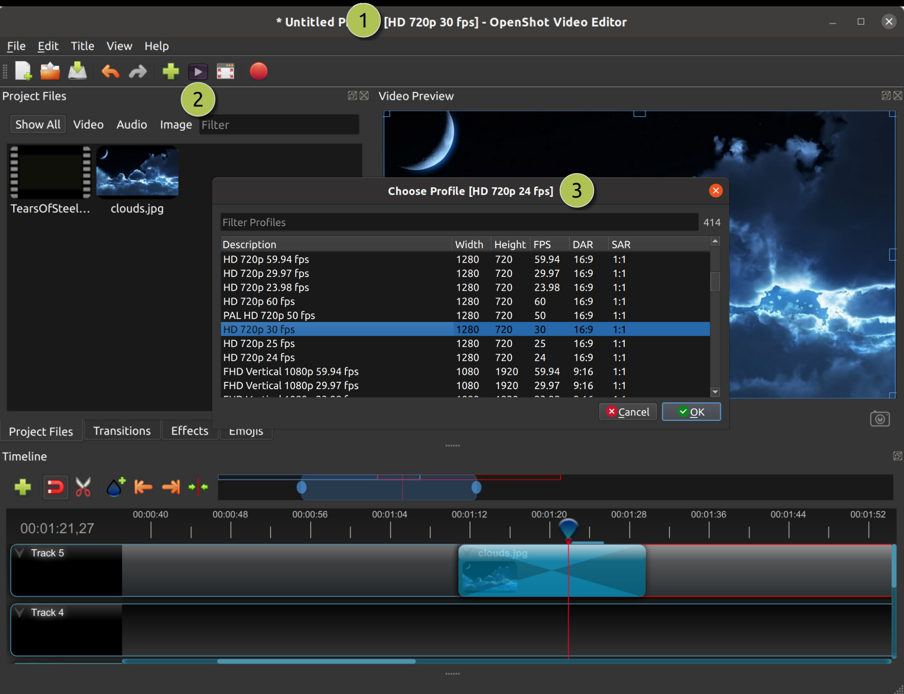

.. Copyright (c) 2008-2016 OpenShot Studios, LLC
 (http://www.openshotstudios.com). This file is part of
 OpenShot Video Editor (http://www.openshot.org), an open-source project
 dedicated to delivering high quality video editing and animation solutions
 to the world.

.. OpenShot Video Editor is free software: you can redistribute it and/or modify
 it under the terms of the GNU General Public License as published by
 the Free Software Foundation, either version 3 of the License, or
 (at your option) any later version.

.. OpenShot Video Editor is distributed in the hope that it will be useful,
 but WITHOUT ANY WARRANTY; without even the implied warranty of
 MERCHANTABILITY or FITNESS FOR A PARTICULAR PURPOSE.  See the
 GNU General Public License for more details.

.. You should have received a copy of the GNU General Public License
 along with OpenShot Library.  If not, see <http://www.gnu.org/licenses/>.

.. _profiles_ref:

Profiles
========

A profile is a collection of common video settings (size, frame rate, aspect ratio, etc...). Profiles are used
during editing, previewing, and exporting to provide a quick way to switch between common combinations of these settings.

Project Profile
---------------

The project profile is used when previewing your project and editing. The default project profile is "HD 720p 24fps".
It is best practice to always switch to your target profile before you begin editing. For example, if you are targeting
1080p 30fps, switch to that profile before you begin editing your project.

==  ==================  ============
#   Name                Description
==  ==================  ============
1   Title Bar           The title bar of OpenShot displays the current profile
2   Profile Button      Launch the profiles dialog
3   Choose Profile      Select a profile for editing and preview
==  ==================  ============

Export Profile
--------------

The export profile always defaults to your current project profile, but can be changed to target different profiles.

.. image:: images/export-profiles.jpg

==  ==================  ============
#   Name                Description
==  ==================  ============
1   Choose Profile      Select a profile for export
==  ==================  ============

Custom Profile
--------------
Although OpenShot has more than 70 profiles included by default, you can also create your own custom profiles. Create a
new file in the */.openshot_qt/profiles/* folder. Use the following text as your template (i.e. copy and paste this
into the file):

.. code-block:: python

    description=Custom Profile Name
    frame_rate_num=30000
    frame_rate_den=1001
    width=1280
    height=720
    progressive=1
    sample_aspect_num=1
    sample_aspect_den=1
    display_aspect_num=16
    display_aspect_den=9

Once you restart OpenShot, you will see your custom profile appear in the list of Profiles.

Profile List
------------

OpenShot includes a large list of common profiles.

=====================================  ======  ======  ======  ======  ======  ==========
Profile Name                           Width   Height  FPS     DAR     PAR     Interlaced
=====================================  ======  ======  ======  ======  ======  ==========
1024x576 16:9 PAL                      1024    576     25.00   16:9    1:1     No
2.5K QHD 1440p 23.98 fps               2560    1440    23.98   16:9    1:1     No
2.5K QHD 1440p 24 fps                  2560    1440    24.00   16:9    1:1     No
2.5K QHD 1440p 25 fps                  2560    1440    25.00   16:9    1:1     No
2.5K QHD 1440p 29.97 fps               2560    1440    29.97   16:9    1:1     No
2.5K QHD 1440p 30 fps                  2560    1440    30.00   16:9    1:1     No
2.5K QHD 1440p 50 fps                  2560    1440    50.00   16:9    1:1     No
2.5K QHD 1440p 59.94 fps               2560    1440    59.94   16:9    1:1     No
2.5K QHD 1440p 60 fps                  2560    1440    60.00   16:9    1:1     No
384x288 4:3 PAL                        384     288     25.00   4:3     1:1     No
4K UHD 2160p 23.98 fps                 3840    2160    23.98   16:9    1:1     No
4K UHD 2160p 24 fps                    3840    2160    24.00   16:9    1:1     No
4K UHD 2160p 25 fps                    3840    2160    25.00   16:9    1:1     No
4K UHD 2160p 29.97 fps                 3840    2160    29.97   16:9    1:1     No
4K UHD 2160p 30 fps                    3840    2160    30.00   16:9    1:1     No
4K UHD 2160p 50 fps                    3840    2160    50.00   16:9    1:1     No
4K UHD 2160p 59.94 fps                 3840    2160    59.94   16:9    1:1     No
4K UHD 2160p 60 fps                    3840    2160    60.00   16:9    1:1     No
512x288 16:9 PAL                       512     288     25.00   16:9    1:1     No
768x576 4:3 PAL                        768     576     25.00   4:3     1:1     No
CIF 15 fps                             352     288     15.00   4:3     59:54   No
CIF NTSC                               352     288     29.97   4:3     10:11   No
CIF PAL                                352     288     25.00   4:3     59:54   No
CVD NTSC                               480     352     29.97   4:3     20:11   Yes
CVD PAL                                576     352     25.00   4:3     59:27   Yes
DV/DVD NTSC                            720     480     29.97   4:3     8:9     Yes
DV/DVD PAL                             720     576     25.00   4:3     16:15   Yes
DV/DVD Widescreen NTSC                 720     480     29.97   16:9    32:27   Yes
DV/DVD Widescreen PAL                  720     576     25.00   16:9    64:45   Yes
DV/DVD Widescreen PAL (Anamorphic)     720     576     25.00   16:9    64:45   No
HD 1080i 25 fps                        1920    1080    25.00   16:9    1:1     Yes
HD 1080i 29.97 fps                     1920    1080    29.97   16:9    1:1     Yes
HD 1080i 30 fps                        1920    1080    30.00   16:9    1:1     Yes
HD 1080p 23.98 fps                     1920    1080    23.98   16:9    1:1     No
HD 1080p 24 fps                        1920    1080    24.00   16:9    1:1     No
HD 1080p 25 fps                        1920    1080    25.00   16:9    1:1     No
HD 1080p 29.97 fps                     1920    1080    29.97   16:9    1:1     No
HD 1080p 30 fps                        1920    1080    30.00   16:9    1:1     No
HD 1080p 50 fps                        1920    1080    50.00   16:9    1:1     No
HD 1080p 59.94 fps                     1920    1080    59.94   16:9    1:1     No
HD 1080p 60 fps                        1920    1080    60.00   16:9    1:1     No
HD 720p 23.98 fps                      1280    720     23.98   16:9    1:1     No
HD 720p 24 fps                         1280    720     24.00   16:9    1:1     No
HD 720p 25 fps                         1280    720     25.00   16:9    1:1     No
HD 720p 29.97 fps                      1280    720     29.97   16:9    1:1     No
HD 720p 30 fps                         1280    720     30.00   16:9    1:1     No
HD 720p 50 fps                         1280    720     50.00   16:9    1:1     No
HD 720p 59.94 fps                      1280    720     59.94   16:9    1:1     No
HD 720p 60 fps                         1280    720     60.00   16:9    1:1     No
HD Vertical 1080p 30 fps               1080    1920    30.00   9:16    1:1     No
HD Vertical 720p 30 fps                720     1280    30.00   9:16    1:1     No
HDV 1080 25i 1920x1080                 1920    1080    25.00   16:9    1:1     Yes
HDV 1080 25p 1920x1080                 1920    1080    25.00   16:9    1:1     No
HDV 1440x1080i 25 fps                  1440    1080    25.00   16:9    4:3     Yes
HDV 1440x1080i 29.97 fps               1440    1080    29.97   16:9    4:3     Yes
HDV 1440x1080p 25 fps                  1440    1080    25.00   16:9    4:3     No
HDV 1440x1080p 29.97 fps               1440    1080    29.97   16:9    4:3     No
HDV 720 24p                            1280    720     24.00   16:9    1:1     No
Mobile 360p                            320     240     29.97   4:3     1:1     No
NTSC 23.98 fps                         720     486     23.98   4:3     8:9     No
NTSC 29.97 fps                         720     486     29.97   4:3     8:9     Yes
QCIF 15 fps                            176     144     15.00   4:3     59:54   No
QCIF NTSC                              176     144     29.97   4:3     10:11   No
QCIF PAL                               176     144     25.00   4:3     59:54   No
QVGA 15 fps                            320     240     15.00   4:3     1:1     No
QVGA 29.97 fps                         320     240     29.97   4:3     1:1     No
QVGA Widescreen 29.97 fps              426     240     29.97   16:9    1:1     No
SVCD NTSC                              480     480     29.97   4:3     15:11   Yes
SVCD PAL                               480     576     25.00   4:3     59:36   Yes
SVCD Widescreen NTSC                   480     480     29.97   16:9    20:11   Yes
SVCD Widescreen PAL                    480     576     25.00   16:9    59:27   Yes
VCD NTSC                               352     240     29.97   4:3     10:11   No
VCD PAL                                352     288     25.00   4:3     59:54   No
VGA NTSC                               640     480     29.97   4:3     1:1     No
VGA Widescreen NTSC                    854     480     29.97   16:9    1:1     No
=====================================  ======  ======  ======  ======  ======  ==========
