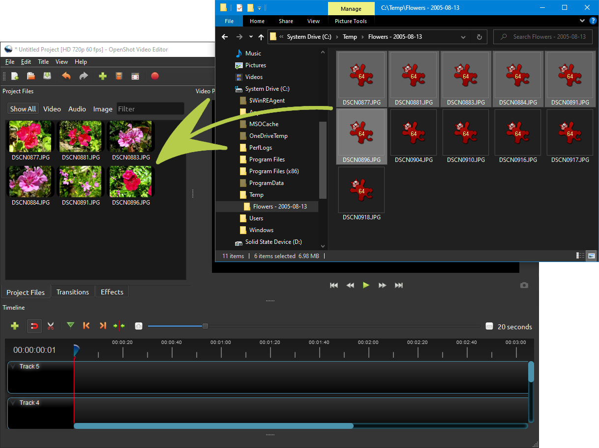
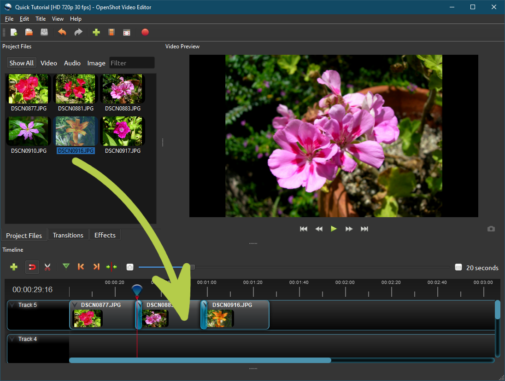
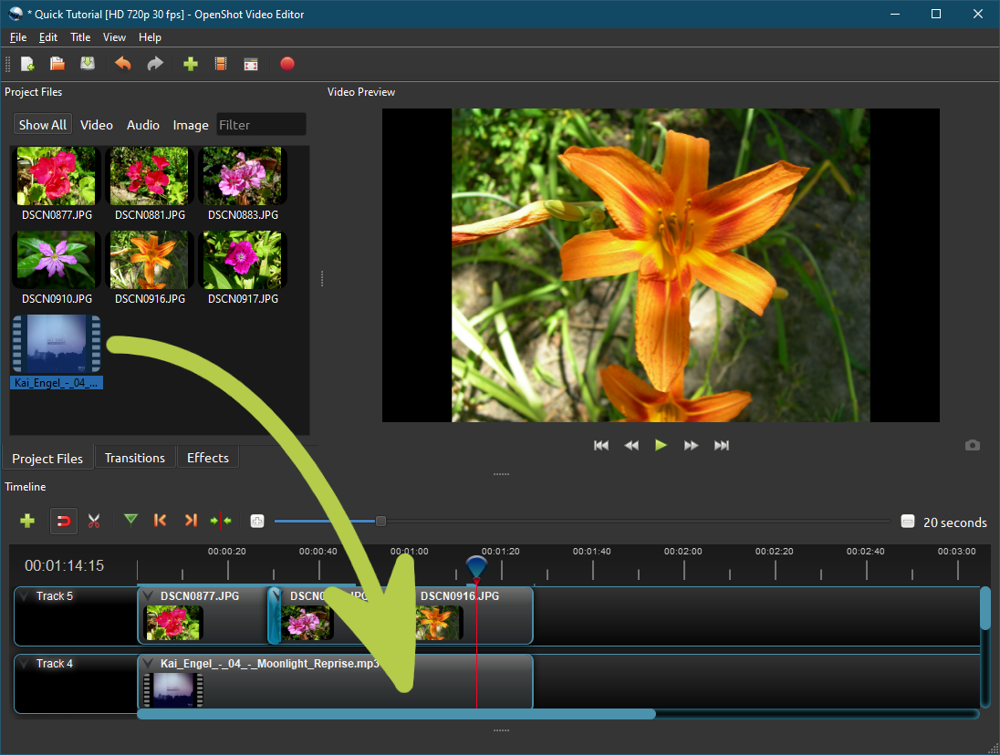
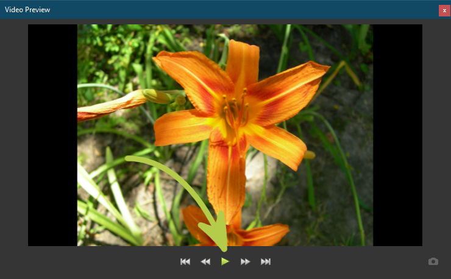
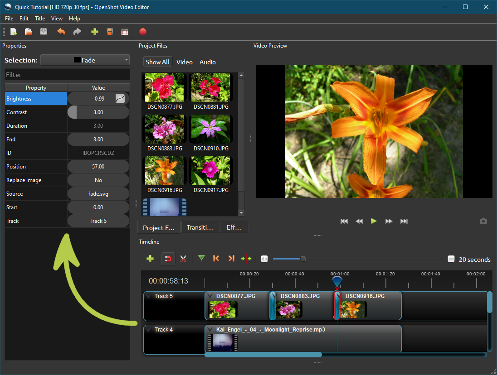
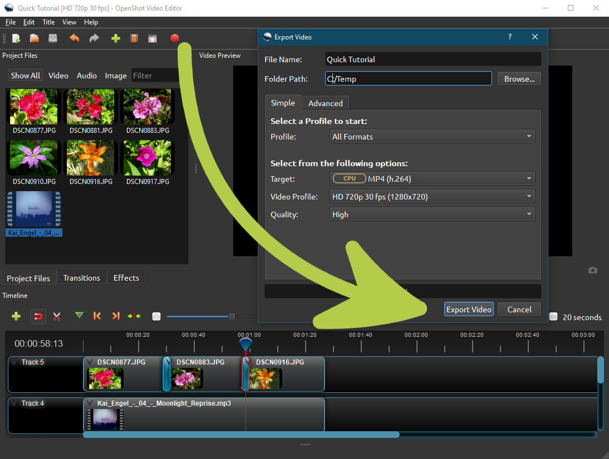

.. Copyright (c) 2008-2020 OpenShot Studios, LLC
 (http://www.openshotstudios.com). This file is part of
 OpenShot Video Editor (http://www.openshot.org), an open-source project
 dedicated to delivering high quality video editing and animation solutions
 to the world.

.. OpenShot Video Editor is free software: you can redistribute it and/or modify
 it under the terms of the GNU General Public License as published by
 the Free Software Foundation, either version 3 of the License, or
 (at your option) any later version.

.. OpenShot Video Editor is distributed in the hope that it will be useful,
 but WITHOUT ANY WARRANTY; without even the implied warranty of
 MERCHANTABILITY or FITNESS FOR A PARTICULAR PURPOSE.  See the
 GNU General Public License for more details.

.. You should have received a copy of the GNU General Public License
 along with OpenShot Library.  If not, see <http://www.gnu.org/licenses/>.

.. Edited September 25, 2020 - [USA]TechDude

Quick Tutorial
===============

OpenShot is easy to use, and it has many advanced features.  This introductory 
tutorial shows you how to make a simple photo slide-show with music in **less 
than 5 minutes**.  After this tutorial, you can make a simple photo slide-show 
with music.

Step 1 – Import Photos & Music
-------------------------------
Before we can begin making a video, we need to import files into OpenShot.  
Drag-and-drop two or three images (photos) (\*.JPG, \*.PNG, or another type) 
and a music file (\*.MP3, \*.WAV, or another type) from your file manager or 
desktop to OpenShot.  You can add your clips to the timeline as well as the 
Project Files list.  Be sure to drop the files to where the arrow in the 
illustration is pointing.  You can also use the green "+" button to open the 
"Import File..." dialog box.  Select the files you wish to import by 
CTRL+clicking them with your cursor then click the Open button.  In this dialog 
box, you cannot drag the files to the Project Files list in OpenShot.

Step 2 – Add Photos to Timeline
--------------------------------
Next, drag each photo to the timeline (as seen in the illustration).  The 
Timeline represents your final video, so arrange your photos as you want them 
to appear in your video.  If you overlap two images, OpenShot smoothly fades 
between them.  The overlap is called a transition, which is displayed by 
rounded blue rectangles between the clips.  You can rearrange the clips as many 
times as needed by simply dragging and dropping.  

OpenShot uses tracks to layer videos and images.  The topmost track is the top 
layer.  The bottom track is the bottom layer (the default is Track 1).  The 
highest track (by default Track 5) is visible while the lower tracks will only 
be visible if the higher tracks don't have any clips above them at that point 
in the timeline.  Also, lower tracks are visible if the clips on the higher 
tracks are allowing images to pass through them using the Alpha (transparency) 
setting.

Step 3 – Add Music to Timeline
-------------------------------
To make your photo slide-show more enjoyable, we need to add some music.  You 
should have imported a music file in Step 1.  Click on the music file, and drag 
it to a lower track in the timeline.  If the song is too long, click the right 
edge of your music clip and drag it to the left to make your clip shorter.

Step 4 – Preview your Project
------------------------------
To preview your video and audio, click the Play button under the Preview 
window.  You can pause, rewind, and fast-forward your video project by clicking 
the corresponding buttons.

Step 5 – Refine and Adjust Your Video
--------------------------------------
OpenShot has many advanced features to enhance your project.  You can use 
Titles to add a title screen or text to your clip.  Transitions gradually fade 
one clip to another.  Animations change the properties of a clip over time.  
These changes can be even more refined using the Properties window (Press 
**CTRL+I** if the Properties window is not already visible).  For more 
information, use the menu to the left to find the related topics.

Step 6 – Export your Video
---------------------------
Once you have edited your photo slide-show video, the last step is to export 
the project.  Exporting converts your OpenShot project into a single video 
file.  By using the default settings, the video works on most media players 
(such as VLC) or websites (such as YouTube, Vimeo, …).

Click the Export Video icon in the top toolbar (Press CTRL+E or use the **File 
>> Export Video** menu).  Choose from one of the many preset export options, 
and click the *Export Video* button.  Exporting can take a very long time, 
depending on several factors: 1) the length of your project 2) The video 
profile that you chose, 3) the quality of the export video and 4) the speed of 
your computer's Central Processing Unit (CPU).  Please be aware of these 
factors and be patient as your system creates your video.

In Conclusion
-------------
Now you should have a basic understanding of how OpenShot works.  Importing, 
Arranging, Previewing, and Exporting.  Hopefully, this tutorial took less than 
5 minutes for you to complete.  Please read the rest of this guide for a more 
detailed understanding of OpenShot and its advanced features.  If you have any 
questions after reading this User Guide, join our 
`Reddit Community <https://www.redit.com/OpenShot>`_ and ask others for help 
with your issue.  If you still have issues after joining our Reddit Community 
and believe that you have a bug in OpenShot, visit our 
`GitHub Repository <https://www.github.com/OpenShot>`_.  Enjoy!
