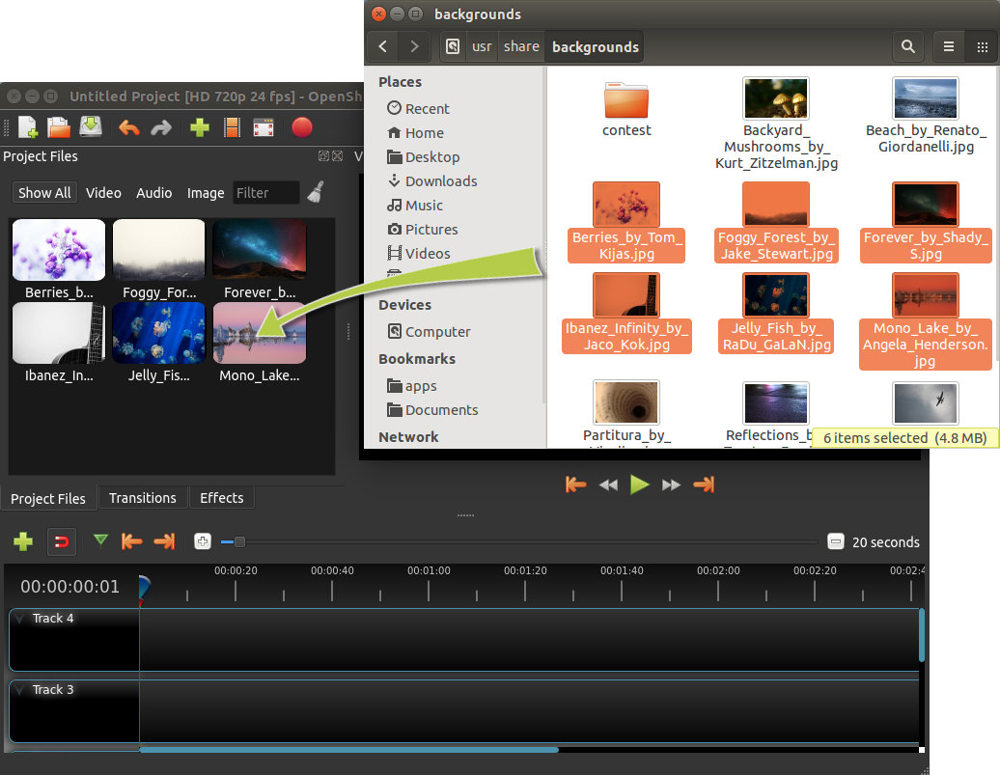
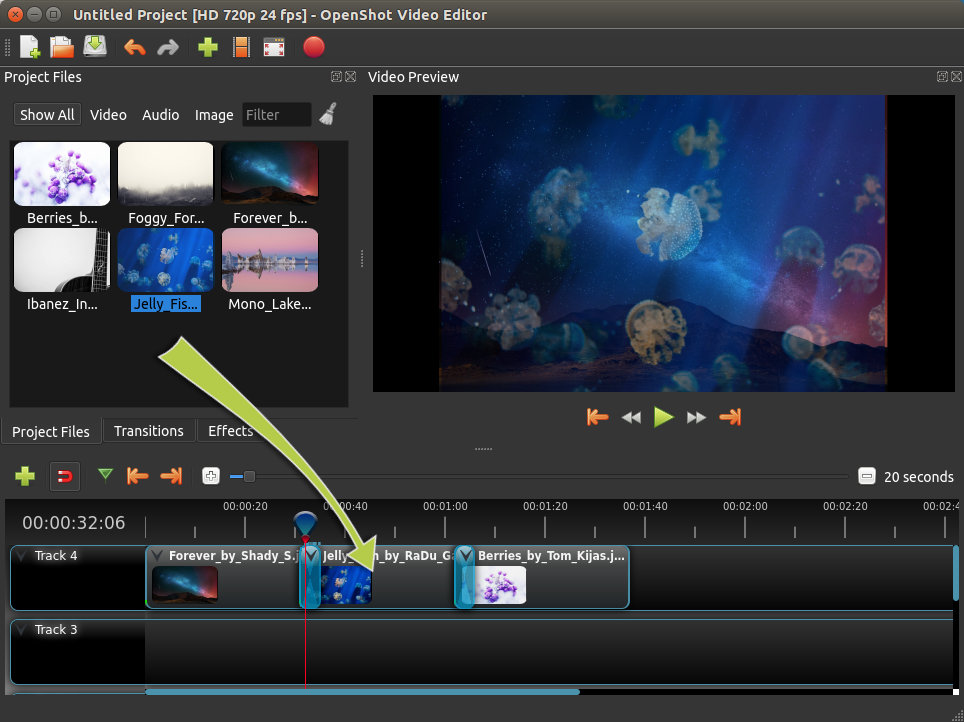
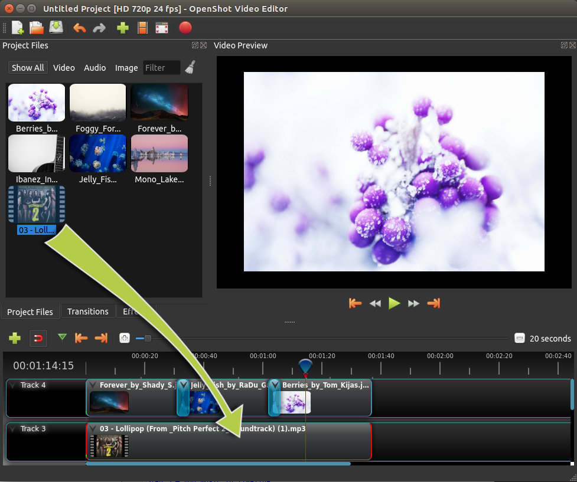
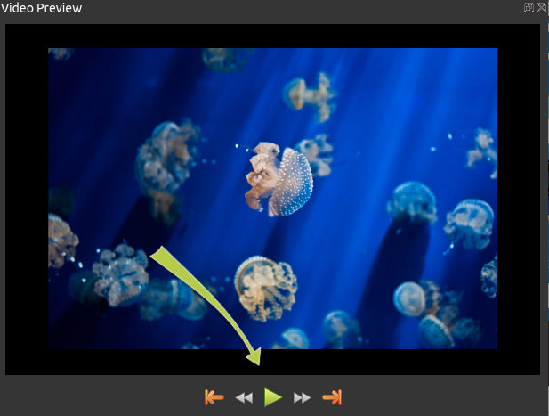
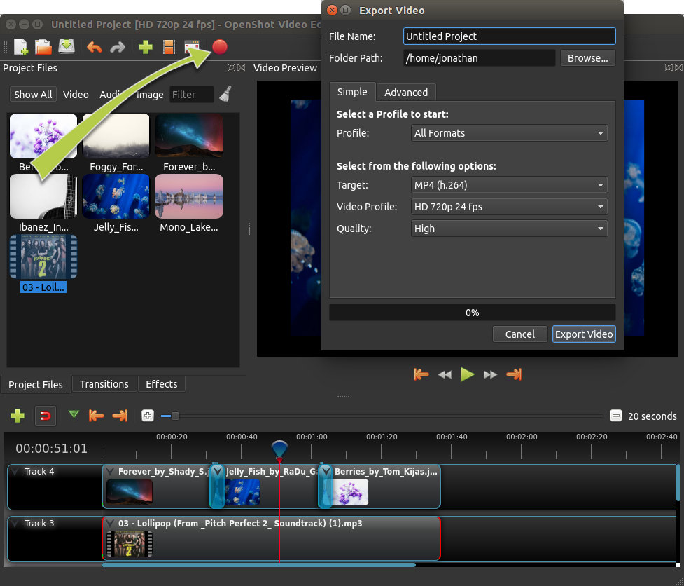

.. Copyright (c) 2008-2016 OpenShot Studios, LLC
 (http://www.openshotstudios.com). This file is part of
 OpenShot Video Editor (http://www.openshot.org), an open-source project
 dedicated to delivering high quality video editing and animation solutions
 to the world.

.. OpenShot Video Editor is free software: you can redistribute it and/or modify
 it under the terms of the GNU General Public License as published by
 the Free Software Foundation, either version 3 of the License, or
 (at your option) any later version.

.. OpenShot Video Editor is distributed in the hope that it will be useful,
 but WITHOUT ANY WARRANTY; without even the implied warranty of
 MERCHANTABILITY or FITNESS FOR A PARTICULAR PURPOSE.  See the
 GNU General Public License for more details.

.. You should have received a copy of the GNU General Public License
 along with OpenShot Library.  If not, see <http://www.gnu.org/licenses/>.

.. _quick_tutorial_ref:

Quick Tutorial
==============

Using OpenShot is very easy, and this tutorial will take you through the basics in
**under 5 minutes**. After this tutorial, you will be able to make a simple photo
slide-show with music.

Video Tutorials
---------------

If you prefer to learn by **watching videos** instead of reading, we have many official video tutorials
that cover a wide range of beginner and introductory topics. These videos are a great next step
on your way to master OpenShot Video Editor!

- `Video: Getting Started <https://youtu.be/1k-ISfd-YBE>`_
- `Video: The Basics (Part 1) <https://youtu.be/VE6awGSr22Q>`_
- `Video: The Basics (Part 2) <https://youtu.be/6PA98QL9tkw>`_
- `Video: Basic Animation <https://youtu.be/P3zIprwr1rk>`_
- `Video: Trim, Slice, and Split <https://youtu.be/BQS2tmgD_Rk>`_
- `Video: Chroma Key <https://youtu.be/2sushecqMs4>`_
- `Video: Masks & Transitions <https://youtu.be/2sushecqMs4>`_
- `Video: Backup & Recovery <https://youtu.be/5XaWBTBTpTo>`_

Step 1 – Import media files
---------------------------

Before we can begin making a video, we need to import media files into OpenShot. Most video,
image and music file formats will work. Drag and drop a few videos or images and a music file
from your Desktop to OpenShot. Be sure to drop the files where the
arrow in the illustration is pointing to.

Alternative methods to add files to your projects are described in the section
:ref:`import_files_ref`.
The "Show All", "Video", "Audio", "Image" filters above the added files
allows you to only see the file types you are interested in.

Step 2 – Arrange Clips on Timeline
----------------------------------------------

Next, drag each video or photo onto a track in the timeline (as seen in the illustration).
The timeline represents your final video, so arrange your photos (i.e. clips) in whatever sequence you want
them to appear in your video. If you overlap two clips, OpenShot will automatically create a
smooth fade between them, displayed by blue rounded rectangles between the clips. Remember,
you can rearrange the clips as many times as needed by simply dragging and dropping them.

You can also shorten or lengthen each clip, by clicking the left or right edge and dragging
your mouse. For example, if you want a photo to last longer than 10 seconds (the default duration),
simply grab the right edge of the photo (on the timeline), and drag it to the right (to increase
the clip's duration).

Step 3 – Add Music to Timeline
------------------------------

To make our creation more interesting, we need to add some music. Click on the music
file that you imported in step 1, and drag it onto the timeline. If the song is too long, grab
the right edge of your music clip, and resize it smaller (that will make it end earlier). You
could also insert the same file multiple times, if your music is too short.

Step 4 – Preview your Project
------------------------------

To preview what our video looks & sounds like, click the Play button under the preview window.
You can also pause, rewind, and fast-forward your video project by clicking the corresponding
buttons.

Step 5 – Export your Video
---------------------------

Once you are happy with your project, the next step is to export your video.
This will convert your OpenShot project into a single video file, which will work on most
media players (such as VLC) or websites (such as YouTube, Vimeo, etc...).

Click on the Export Video icon at the top of the screen (or use the **File > Export Video** menu).
Choose from one of the many preset export options, and click the *Export Video* button.

You should now have a basic understanding of how OpenShot works. Importing, Arranging,
Previewing, and Exporting. Hopefully this tutorial took less than 5 minutes for you to
complete. Please read the rest of this guide for a more detailed understanding of OpenShot,
and its advanced features and capabilities.
