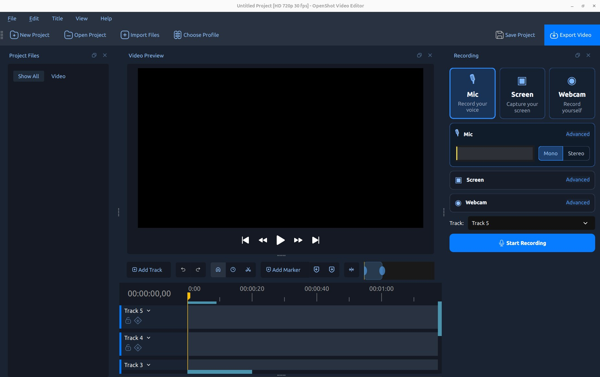
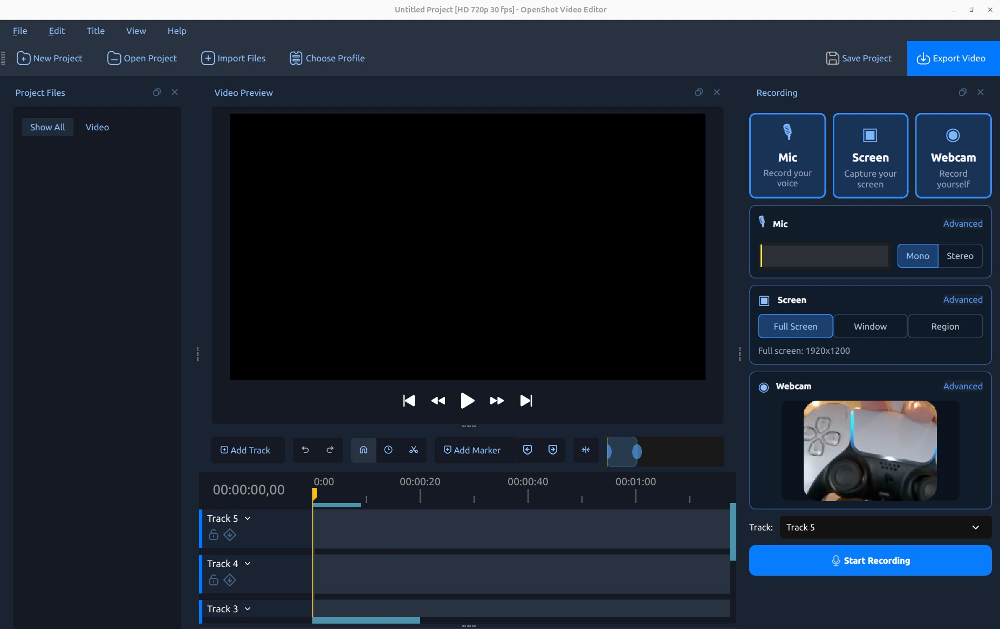

.. Copyright (c) 2008-2026 OpenShot Studios, LLC
 (http://www.openshotstudios.com). This file is part of
 OpenShot Video Editor (http://www.openshot.org), an open-source project
 dedicated to delivering high quality video editing and animation solutions
 to the world.

.. OpenShot Video Editor is free software: you can redistribute it and/or modify
 it under the terms of the GNU General Public License as published by
 the Free Software Foundation, either version 3 of the License, or
 (at your option) any later version.

.. OpenShot Video Editor is distributed in the hope that it will be useful,
 but WITHOUT ANY WARRANTY; without even the implied warranty of
 MERCHANTABILITY or FITNESS FOR A PARTICULAR PURPOSE.  See the
 GNU General Public License for more details.

.. You should have received a copy of the GNU General Public License
 along with OpenShot Library.  If not, see <http://www.gnu.org/licenses/>.

.. _recording_ref:

Recording
=========

OpenShot can record a microphone, the desktop, and a webcam directly into the current project. You can enable one
source or combine several in a synchronized recording session. Each source remains an independent media file and
timeline clip, making it easy to adjust microphone volume, crop a webcam, or edit the screen capture separately.

Open the dedicated layout with :guilabel:`View → Recording View`, or show only the dock with
:guilabel:`View → Docks → Recording`.

Quick Start
-----------

1. Move the timeline playhead to the point where the recording should begin.
2. Open :guilabel:`View → Recording View`.
3. Enable :guilabel:`Mic`, :guilabel:`Screen`, :guilabel:`Webcam`, or any combination of them.
4. Select the destination :guilabel:`Track`. Multiple sources use adjacent tracks automatically.
5. Open each source's :guilabel:`Advanced` section and verify its device and quality options.
6. Click :guilabel:`Start Recording`. Perform the narration or action you want to capture.
7. Click :guilabel:`Stop Recording`, either in the dock or from the recording status control.
8. Wait briefly while OpenShot finishes the files. They are imported into Project Files and placed on the timeline.

Recording Sources
-----------------

The source cards at the top of the dock can be enabled independently. An unavailable card indicates that the required
device, operating-system capture service, or libopenshot feature was not detected.

.. list-table:: Recorded sources and outputs
   :widths: 16 25 27 32
   :header-rows: 1

   * - Source
     - Recorded File
     - Audio
     - Typical Use
   * - Mic
     - ``Mic-<timestamp>``
     - Microphone only
     - Narration, voice-over, commentary, or interviews.
   * - Screen
     - ``Screen-<timestamp>.mp4``
     - Optional system audio
     - Tutorials, demonstrations, presentations, or games.
   * - Webcam
     - ``Webcam-<timestamp>.mp4``
     - No audio
     - Presenter video or a picture-in-picture camera.

When Mic and Screen are enabled together, microphone audio is kept in its own file while system audio is embedded in
the screen video. This separation is intentional: it lets you independently adjust, mute, fade, or process the voice
and computer audio during editing. Webcam video has no audio, avoiding a duplicate microphone track and echo.

Live Feedback and Timeline Placement
------------------------------------

The microphone meter responds before and during recording, which helps confirm that the selected input is working.
During recording, OpenShot draws a temporary clip and live microphone waveform on the timeline. The completed files
replace these previews after recording stops.

All enabled sources start at the same timeline position. OpenShot stacks them in a useful compositing order:

.. table:: Default source stack
   :widths: 25 75

   =================  =============================================================
   Source             Placement
   =================  =============================================================
   Webcam             Highest assigned track, so a corner camera appears on top.
   Screen             Below the webcam and above microphone audio.
   Mic                Lowest assigned track because it contains audio only.
   =================  =============================================================

If there are not enough tracks below the selected track, OpenShot creates or selects additional tracks as needed.
Recordings are also added to :guilabel:`Project Files`, so they can be reused even if you remove their first timeline
clips.

Microphone Recording
--------------------

Enable :guilabel:`Mic` to record narration as a separate audio file. Use the Mono/Stereo control beside the level
meter for the common channel choice, and open :guilabel:`Advanced` for all settings.

.. table:: Microphone options
   :widths: 22 22 56

   ===============  ===================  ===============================================================
   Option           Typical Default      Description
   ===============  ===================  ===============================================================
   Input            System input         Selects the microphone or audio-input device.
   Format           FLAC                 Chooses WAV, FLAC, or MP3. FLAC is lossless with smaller files than WAV.
   Sample Rate      48000 Hz              Sets the recording sample rate. Match the device and project when possible.
   Channels         Mono                 Records one or two input channels. Mono is usually best for one microphone.
   ===============  ===================  ===============================================================

Aim for a healthy meter response without clipping. A quiet waveform should remain visually quiet; OpenShot no longer
normalizes every newly generated waveform to full height. The lighter peak envelope highlights transients while the
solid RMS envelope summarizes sustained energy. Their detail is controlled by :guilabel:`Edit → Preferences →
Timeline → Waveform Samples (per second)`. See :ref:`clip_presets_ref` for waveform display and audio volume controls
after recording.

Screen Recording
----------------

Enable :guilabel:`Screen`, then choose a capture mode:

.. table:: Screen capture modes
   :widths: 20 80

   ===========  =================================================================================================
   Mode         Description
   ===========  =================================================================================================
   Full Screen  Captures the selected display or combined desktop area.
   Window       Click a window to capture its bounds. Availability and exact behavior depend on the platform.
   Region       Drag or select a rectangular desktop area. Availability depends on the platform.
   ===========  =================================================================================================

On Wayland desktops, the operating system's sharing portal asks which screen or window to share when recording
starts. The numeric window and region controls are hidden because selection belongs to that portal.

Screen Advanced Options
^^^^^^^^^^^^^^^^^^^^^^^

.. table:: Screen options
   :widths: 22 20 58

   ==================  ===============  ========================================================================
   Option              Default          Description
   ==================  ===============  ========================================================================
   Screen              Primary display  Selects a display or the complete desktop when supported.
   Offset              Selected bounds  Sets the capture area's X and Y desktop coordinates.
   Size                Selected bounds  Sets capture width and height. OpenShot uses encoder-safe even dimensions.
   FPS                 30               Sets the screen recording frame rate: 15, 24, 30, or 60 FPS.
   System Audio        On               Embeds computer playback audio in the screen MP4 when supported.
   Cursor              On               Includes the mouse pointer in the screen recording.
   Hide OpenShot       No               Temporarily hides OpenShot during selection and recording when enabled.
   ==================  ===============  ========================================================================

System Audio
^^^^^^^^^^^^

:guilabel:`System Audio` is enabled by default on supported capture backends. It records sound playing through the
computer—such as a game, browser, media player, or presentation—inside the screen recording. It does not replace the
Mic source. Enable both sources when you want system audio and commentary on independently editable clips.

If the control is disabled, the active platform or libopenshot build does not provide system-audio capture. OpenShot
forces the option Off rather than producing a misleading silent audio track. Operating-system privacy settings and
audio-routing configuration can also affect capture.

.. warning::

   Avoid playing captured system audio through speakers while also recording a microphone unless that sound is
   intentional. Headphones reduce echo and prevent the microphone from recording the speakers a second time.

Webcam Recording
----------------

Enable :guilabel:`Webcam` to record a camera as a silent video clip. A live preview helps verify framing before you
start. When Screen is also enabled, the default layout is a rounded, 30% camera in the bottom-right corner. When the
webcam is recorded alone, it defaults to full size.

.. table:: Webcam options
   :widths: 22 78

   ===========  ================================================================================================
   Option       Description
   ===========  ================================================================================================
   Input        Selects an available webcam or video-capture device.
   Resolution   Selects a resolution reported by the camera.
   Record FPS   Selects a frame rate supported at the chosen resolution.
   Layout       Chooses Bottom/Top Left/Right, Left, Right, Center, or Full Size placement.
   Size         Sets a corner camera to 20%, 30%, or 40% of the project frame.
   Corners      Uses Rectangle, Rounded, or Oval camera corners.
   ===========  ================================================================================================

Layout choices are applied as ordinary clip properties. After recording, use :guilabel:`Gravity`,
:guilabel:`Scale X`, :guilabel:`Scale Y`, :guilabel:`Margin`, and :guilabel:`Corner Radius` to refine the result.
See :ref:`clip_properties_ref`.

Combining Sources
-----------------

The Recording View keeps all enabled source controls together while leaving the preview and timeline visible.

.. list-table:: Useful recording combinations
   :widths: 26 34 40
   :header-rows: 1

   * - Workflow
     - Enable
     - Result
   * - Voice-over
     - Mic
     - One editable narration file.
   * - Silent tutorial
     - Screen
     - Screen MP4; turn System Audio Off if silence is desired.
   * - Game commentary
     - Mic + Screen
     - Separate mic clip plus screen video with game audio.
   * - Presenter camera
     - Mic + Webcam
     - Separate voice and silent camera video.
   * - Tutorial with camera
     - Mic + Screen + Webcam
     - Three synchronized clips with webcam above the screen.

Where Recordings Are Saved
--------------------------

Recordings are saved in the project's assets folder under ``recordings``. If the project has not been saved yet,
OpenShot uses its user-data location. Filenames contain the source name and a timestamp; another numeric suffix avoids
overwriting a file created during the same second.

Save the project before a long or important session so its recording destination is predictable. Do not move or
rename recorded files outside OpenShot while the project is using them.

Permissions and Platform Behavior
---------------------------------

Screen and camera capture depend on operating-system services, hardware, and build support. The controls in the dock
adapt to the available backend.

- **Linux/X11:** Full-screen, window, and numeric region capture are available when the X11 capture backend is built.
- **Linux/Wayland:** The desktop sharing portal chooses the capture source after recording starts.
- **Windows:** Desktop capture uses the available Windows screen backend; camera devices use Windows capture services.
- **macOS:** Screen capture uses the supported macOS backend, with window and region choices represented as cropped
  screen bounds when required.

The first recording may trigger Screen Recording, Microphone, Camera, or desktop-sharing permission prompts. Approve
the requested source, then restart OpenShot if the operating system requires it. A disabled source card or option is
preferable to a recording that silently omits an unsupported source.

Troubleshooting Recording
-------------------------

.. table:: Common recording problems
   :widths: 28 72

   ===========================  =================================================================================
   Problem                      What to Check
   ===========================  =================================================================================
   Mic meter does not move      Select the correct Input, verify OS microphone permission, and check mute/gain.
   Mic clips or distorts        Lower hardware/input gain and keep peaks below full scale.
   Mic is very quiet            Raise input gain near the device; timeline waveform height does not change audio.
   System Audio is disabled     The active screen backend/build does not support it; check platform audio routing.
   System Audio is silent       Play audio before testing, verify the output device, and inspect OS privacy/routing.
   Voice contains game echo     Use headphones so the mic does not capture speaker playback.
   Screen source is incorrect   Re-select Full Screen/Window/Region; on Wayland, choose again in the portal.
   Webcam is unavailable        Check camera permission, close other camera apps, and reconnect the device.
   Recording is choppy          Lower screen/camera FPS or resolution and close CPU-intensive applications.
   Clips appear on wrong track  Choose the top destination Track before recording, then move clips if needed.
   ===========================  =================================================================================

After Recording
---------------

Recorded clips behave like imported media. You can trim, slice, move, mute, fade, add effects, and adjust volume or
layout with the standard editing tools. Useful next topics are:

- :ref:`clips_cutting_slicing_ref` for trimming and slicing.
- :ref:`clip_presets_ref` for waveform, volume, fade, and other clip actions.
- :ref:`clip_properties_ref` for webcam placement and detailed adjustments.
- :ref:`playback_ref` for playback and audio troubleshooting.
