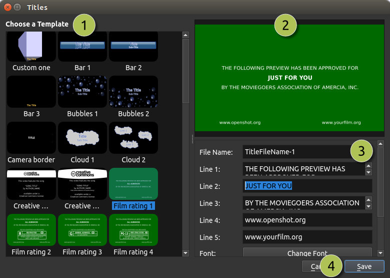
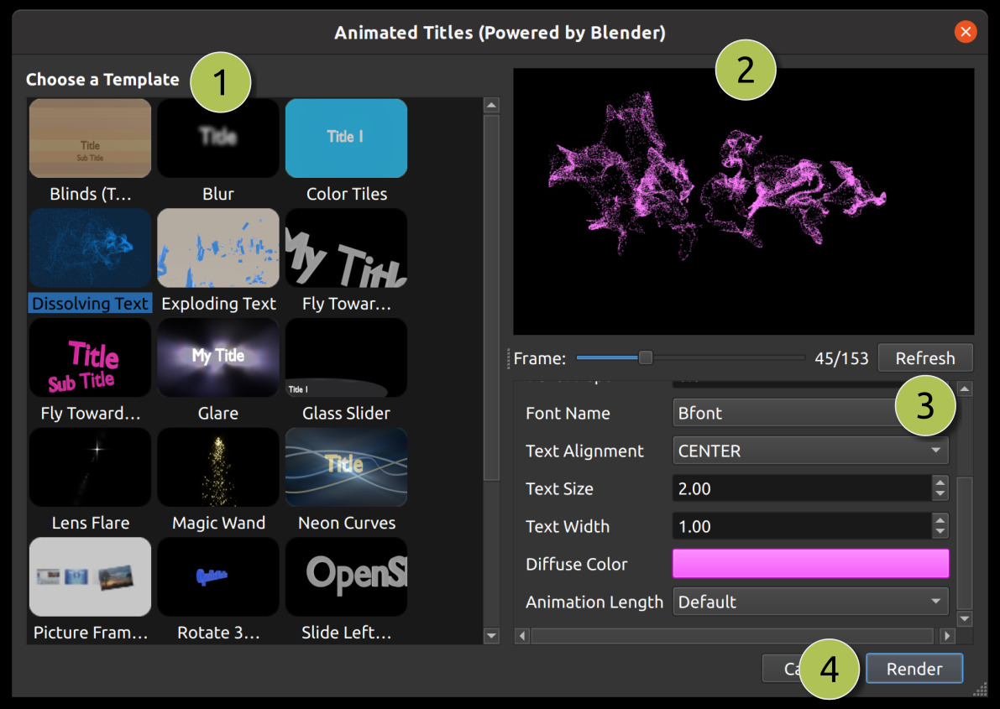

.. Copyright (c) 2008-2016 OpenShot Studios, LLC
 (http://www.openshotstudios.com). This file is part of
 OpenShot Video Editor (http://www.openshot.org), an open-source project
 dedicated to delivering high quality video editing and animation solutions
 to the world.

.. OpenShot Video Editor is free software: you can redistribute it and/or modify
 it under the terms of the GNU General Public License as published by
 the Free Software Foundation, either version 3 of the License, or
 (at your option) any later version.

.. OpenShot Video Editor is distributed in the hope that it will be useful,
 but WITHOUT ANY WARRANTY; without even the implied warranty of
 MERCHANTABILITY or FITNESS FOR A PARTICULAR PURPOSE.  See the
 GNU General Public License for more details.

.. You should have received a copy of the GNU General Public License
 along with OpenShot Library.  If not, see <http://www.gnu.org/licenses/>.

Titles
======

Adding text and titles is an important aspect of video editing, and OpenShot comes with an easy to use Title Editor. Use
the Title menu (located in the main menu of OpenShot) to launch the Title Editor. You can also use the keyboard shortcut
**Ctrl+T**.

Overview
--------

.. table::
   :widths: 5 26

   ==  ==================  ============
   #   Name                Description
   ==  ==================  ============
   1   Choose a Template   Choose from any available vector title template
   2   Preview Title       Preview your title as you make changes
   3   Title Properties    Change the text, colors, or edit in an advanced SVG image editor (such as Inkscape)
   4   Save                Save and add the title to your project
   ==  ==================  ============

Custom Titles
-------------
OpenShot can use any vector SVG image file as a title template. Just add an SVG image file to your 
*/.openshot_qt/title_templates/* folder, and it will appear in OpenShot's title editor after you restart OpenShot. You can
also right click on any SVG files in your **Project Files** panel, and choose **Edit Title** or **Duplicate Title**.

3D Animated Titles
------------------
Adding a 3D animated title is just as easy, using our **Animated Title** dialog. Use the Title menu (located
in the main menu of OpenShot) to launch the Animated Title editor. You can also use the keyboard shortcut **Ctrl+B**.

==  ==================  ============
#   Name                Description
==  ==================  ============
1   Choose a Template   Choose from any available 3D title templates
2   Preview Title       Preview your title as you make changes
3   Title Properties    Change the text, colors, and advanced properties
4   Render              Render the 3D animation, and add it to your project
==  ==================  ============

This feature requires the latest version of Blender (https://www.blender.org/download/) be installed, and the OpenShot
**Preferences** updated with the correct path to the Blender executable (for example: */home/USER/blender-2.78/blender*).

