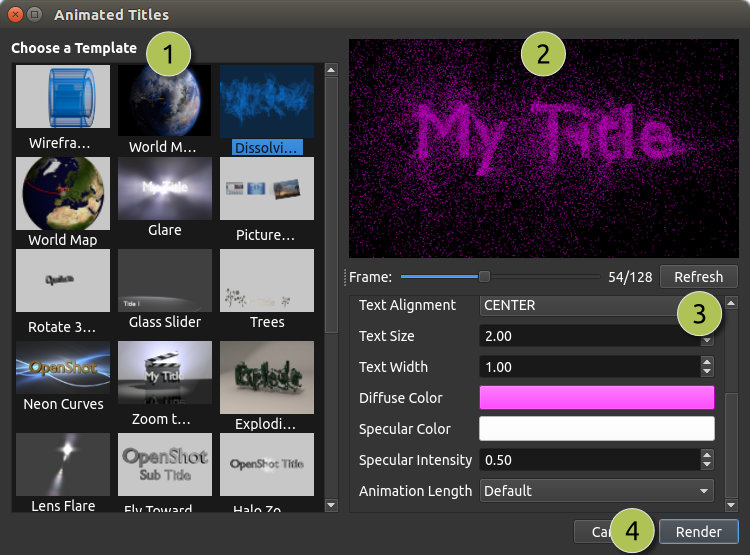

.. Copyright (c) 2008-2016 OpenShot Studios, LLC
 (http://www.openshotstudios.com). This file is part of
 OpenShot Video Editor (http://www.openshot.org), an open-source project
 dedicated to delivering high quality video editing and animation solutions
 to the world.

.. OpenShot Video Editor is free software: you can redistribute it and/or modify
 it under the terms of the GNU General Public License as published by
 the Free Software Foundation, either version 3 of the License, or
 (at your option) any later version.

.. OpenShot Video Editor is distributed in the hope that it will be useful,
 but WITHOUT ANY WARRANTY; without even the implied warranty of
 MERCHANTABILITY or FITNESS FOR A PARTICULAR PURPOSE.  See the
 GNU General Public License for more details.

.. You should have received a copy of the GNU General Public License
 along with OpenShot Library.  If not, see <http://www.gnu.org/licenses/>.

.. _text_and_titles_ref:

Text & Titles
=============

Adding text and titles is an important aspect of video editing, and OpenShot comes with an easy-to-use Title Editor. Use
the Title menu (located in the main menu of OpenShot) to launch the Title Editor. You can also use the keyboard shortcut
:kbd:`Ctrl+T`.

Titles are simply vector image files with transparent backgrounds (``*.svg``). OpenShot comes with many easy-to-use
templates, but you can also create your own or import new templates into OpenShot. These templates allow you to quickly
change the text, font, size, color, and background color. You can also launch an advanced, external SVG editor for
further customizations (if needed). Once the title is added to your project, drag and drop the title on a
Track above a video clip. The transparent background will allow the video below to appear behind the text.

Overview
--------

.. image:: images/title-editor.jpg

.. table::
   :widths: 5 26 60

   ==  ==================  ============
   #   Name                Description
   ==  ==================  ============
   1   Choose a Template   Choose from any available vector title template
   2   Preview Title       Preview your title as you make changes
   3   Title Properties    Change the text, font, size, colors, or edit in an advanced, external SVG image editor (such as Inkscape)
   4   Save                Save and add the title to your project
   ==  ==================  ============

Title Templates
---------------

OpenShot includes a variety of vector title templates that can be used to enhance your video projects.
Below is a table listing the available titles and their descriptions:

.. list-table::
   :header-rows: 1
   :widths: 20 80

   * - Title Name
     - Description
   * - Bar 1
     - A simple bar with text centered.
   * - Bar 2
     - A simple bar, centered, with 2 lines of text.
   * - Bar 3
     - Another variation of a simple bar with text, for lower 3rds.
   * - Bubbles 1
     - A title with bubble graphics for a playful look.
   * - Bubbles 2
     - A different bubble design for a fun and creative title.
   * - Camera Border
     - A border that mimics a camera viewfinder with centered text.
   * - Cloud 1
     - A title with a playful cloud graphic and text.
   * - Cloud 2
     - Another playful cloud design with 3 clouds and text.
   * - Creative Commons 1
     - Contains text and icons for Creative Commons attribution.
   * - Creative Commons 2
     - Another Creative Commons design with different styling plus website text.
   * - Film Rating 1
     - Displays a film rating for all audiences.
   * - Film Rating 2
     - Displays a film rating of "R" restricted.
   * - Film Rating 3
     - Displays a film rating of "G" for general audiences.
   * - Film Rating 4
     - Displays a film rating of "PG-13", parents strongly cautioned.
   * - Flames
     - A title with flame graphics for a fiery effect.
   * - Footer 1
     - A footer bar for lower thirds (left aligned).
   * - Footer 2
     - A footer bar for lower thirds (center aligned).
   * - Footer 3
     - A footer bar for lower thirds (right aligned).
   * - Gold 1
     - A title with a gold color scheme, centered with one line of text.
   * - Gold 2
     - Another gold-themed title, centered with two lines of text.
   * - Gold Bottom
     - Gold title positioned at the bottom of the screen.
   * - Gold Top
     - Gold title positioned at the top of the screen.
   * - Gray Box 1
     - A simple gray box for highlighting text (one line of text, top-left aligned).
   * - Gray Box 2
     - A simple gray box for highlighting text (two lins of text, top-left aligned).
   * - Gray Box 3
     - A simple gray box for highlighting text (one line of text, bottom-right aligned).
   * - Gray Box 4
     - A simple gray box for highlighting text (two lines of text, bottom-right aligned).
   * - Header 1
     - A header bar for titles or section headers (top-left aligned).
   * - Header 2
     - A header bar for titles or section headers (center aligned).
   * - Header 3
     - A header bar for titles or section headers (top-right aligned).
   * - Oval 1
     - An oval shape for highlighting or decorative purposes, text centered.
   * - Oval 2
     - Another oval design with a different style, text centered.
   * - Oval 3
     - Another oval design with two-lines of text, one at the top, one at the bottom.
   * - Oval 4
     - Yet another oval design, with text centered plus refection.
   * - Post it
     - Mimics a sticky note for annotations or reminders.
   * - Ribbon 1
     - A ribbon graphic with text.
   * - Ribbon 2
     - Another ribbon design with text.
   * - Ribbon 3
     - A third variation of a ribbon design with text.
   * - Smoke 1
     - A title with smoke effects for a dramatic look.
   * - Smoke 2
     - Another smoke design with a different style.
   * - Smoke 3
     - A third variation of smoke effects.
   * - Solid Color
     - A full-screen color background for various uses.
   * - Standard 1
     - A standard title design for general purposes (two lines centered).
   * - Standard 2
     - Another standard title with a different style (one line of text plus reflection).
   * - Standard 3
     - A third variation of a standard title (three lines of text).
   * - Standard 4
     - Yet another standard title design (four lines of text).
   * - Sunset
     - A title with sunset gradient for a warm, end-of-day theme.
   * - TV Rating
     - Displays TV ratings badge such as "G" and "PG" (for the corner of the screen).

Custom Title Templates
^^^^^^^^^^^^^^^^^^^^^^
OpenShot can use any vector SVG image file as a custom title template in the :guilabel:`Title Editor` dialog. Just add an SVG image file to your
``~/.openshot_qt/title_templates/`` folder, and it will appear the next time you launch the :guilabel:`Title Editor` dialog. You can
also right click on any SVG files in your **Project Files** panel, and choose **Edit Title** or **Duplicate Title**.

Note: These SVG templates are only used by the :guilabel:`Title Editor` dialog, and not :guilabel:`Animated Title` dialog.

.. _animated_titles_ref:

3D Animated Titles
------------------
Adding a 3D animated title is just as easy, using our **Animated Title** dialog. Use the Title menu (located
in the main menu of OpenShot) to launch the Animated Title editor. You can also use the keyboard shortcut **Ctrl+B**.
Note: Blender must be installed and configured before this feature will work in OpenShot. See :ref:`blender_install_ref`.

==  ==================  ============
#   Name                Description
==  ==================  ============
1   Choose a Template   Choose from any available 3D title templates
2   Preview Title       Preview your title as you make changes
3   Title Properties    Change the text, colors, and advanced properties
4   Render              Render the 3D animation, and add it to your project
==  ==================  ============

3D Animated Templates
^^^^^^^^^^^^^^^^^^^^^

OpenShot includes a variety of 3D animated templates that can be used to add dynamic and engaging elements to your
video projects. Below is a table listing the available templates and their descriptions:

.. list-table::
   :header-rows: 1
   :widths: 20 80

   * - Template Name
     - Description
   * - Blinds (Two Titles)
     - An animation featuring a blinds effect.
   * - Blur
     - A template that blurs text in and out, providing a smooth transition effect.
   * - Color Tiles
     - An animation with changing colors, suitable for vibrant and dynamic titles.
   * - Dissolving Text
     - A dissolve effect that turns any text into particles which get blown away by the wind.
   * - World Map
     - A template featuring a rotating Earth between 2 locations.
   * - Exploding Text
     - An animation where the title explode into pieces, adding dramatic impact.
   * - Fly Towards Camera
     - A fly-by animation with a single title zooming past the screen.
   * - Fly Towards Camera (Two Titles)
     - Similar to Fly By 1, but with two titles flying by.
   * - Glare
     - An animation with a glare effect, adding a bright, reflective look.
   * - Glass Slider
     - A sliding glass effect, providing a modern and sleek transition.
   * - Lens Flare
     - An animation featuring a lens flare, adding a cinematic touch.
   * - Magic Wand
     - A whimsical magic wand effect, ideal for magical or fantasy themes.
   * - Neon Curves
     - An animation with neon curves, creating a futuristic and vibrant look.
   * - Picture Frames (4 pictures)
     - A template featuring four picture frames, suitable for showcasing images or video clips.
   * - Rotate 360
     - A 360-degree rotation effect, providing a dynamic title animation.
   * - Slide Left to Right
     - A sliding effect where titles move from left to right.
   * - Snow
     - An animation with falling snow particles, perfect for winter or holiday themes.
   * - Space Movie Intro
     - A cinematic space-themed intro, ideal for epic or sci-fi projects.
   * - Wireframe Text
     - An animation with wireframe text, adding a technical or digital look.
   * - Zoom to Clapboard
     - A zoom title with a clapboard, perfect for film or video production themes.

Importing Text
--------------

You can generate text & titles in many different programs, such as Blender, Inkscape, Krita, Gimp, etc... Before you
can import text into OpenShot, you must first export the text from these programs into a compatible image format that
contains a **transparent background** and **alpha** channel.

The ``SVG`` format is a great choice for vector graphics (curves, shapes, text effects and paths), however
it is **not** always 100% compatible with OpenShot. Thus, we recommend using ``PNG`` format, which is a great web-based
image format that can include a transparent background and alpha channel. A transparent background and alpha channel
are needed for OpenShot to allow the text to not cover up videos and images on the timeline below them.

For information on importing animated sequences into OpenShot, please see :ref:`animation_image_seq_ref`.

Installing Inkscape
-------------------

The :guilabel:`Advanced Editor` feature in the :guilabel:`Title Editor` dialog requires the latest version of
Inkscape (https://inkscape.org/release/) be installed and the OpenShot **Preferences** updated with the 
correct path to the Inkscape executable. See the :ref:`preferences_general_ref` tab in Preferences. 

.. _blender_install_ref:

Installing Blender
------------------

The :guilabel:`Animated Title` feature in OpenShot requires the latest version of
Blender (https://www.blender.org/download/) be installed and the OpenShot **Preferences** updated 
with the correct path to the Blender executable. See the :ref:`preferences_general_ref` tab 
in Preferences. NOTE: The minimum supported version of Blender is 4.1+. Older versions of Blender are
not compatible with OpenShot Video Editor.

For a detailed guide on how to install these dependencies, see 
`Blender & Inkscape Guide <https://github.com/OpenShot/openshot-qt/wiki/Blender-and-Inkscape-Guide>`_.
