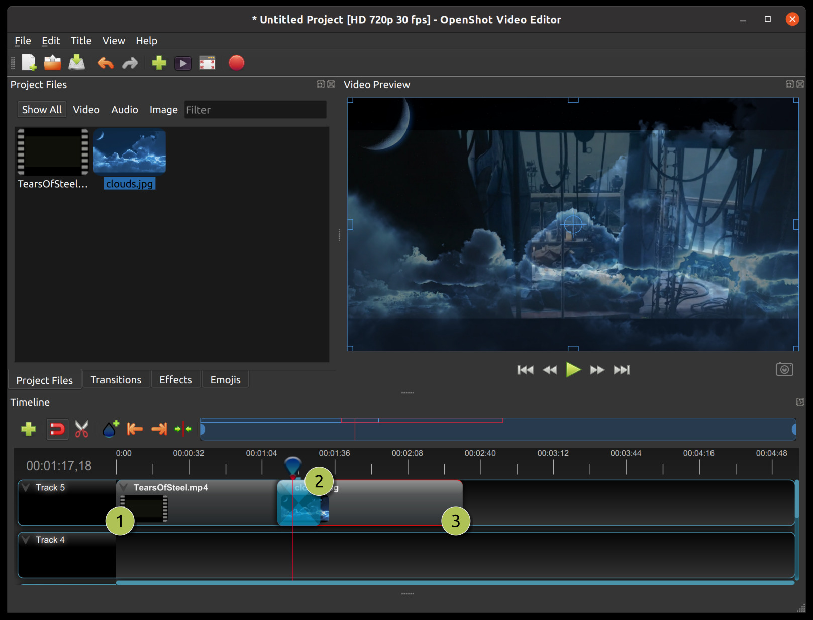
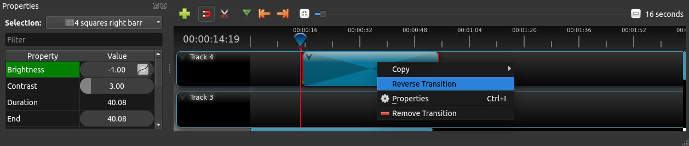

.. Copyright (c) 2008-2016 OpenShot Studios, LLC
 (http://www.openshotstudios.com). This file is part of
 OpenShot Video Editor (http://www.openshot.org), an open-source project
 dedicated to delivering high quality video editing and animation solutions
 to the world.

.. OpenShot Video Editor is free software: you can redistribute it and/or modify
 it under the terms of the GNU General Public License as published by
 the Free Software Foundation, either version 3 of the License, or
 (at your option) any later version.

.. OpenShot Video Editor is distributed in the hope that it will be useful,
 but WITHOUT ANY WARRANTY; without even the implied warranty of
 MERCHANTABILITY or FITNESS FOR A PARTICULAR PURPOSE.  See the
 GNU General Public License for more details.

.. You should have received a copy of the GNU General Public License
 along with OpenShot Library.  If not, see <http://www.gnu.org/licenses/>.

.. _transitions_ref:

Transitions
===========

A transition is used to gradually fade (or wipe) between two clip images. In OpenShot,
transitions are represented by blue, rounded rectangles on the timeline. They are automatically created when you
overlap two clips, and can be added manually by dragging one onto the timeline from the **Transitions** panel.
A transition must be placed on top of a clip (overlapping it), with the most common location being the beginning or end
of a clip.

NOTE: Transitions **do not** affect **audio**, so if you are intending to fade in/out the audio volume of a clip,
you must adjust the ``volume`` clip property. See :ref:`clip_properties_ref`

Overview
--------

==  ==================  ============
#   Name                Description
==  ==================  ============
1   Clip 1              A video clip
2   Transition          A gradual fade transition between the 2 clip images, created automatically by overlapping the clips (does not affect the audio)
3   Clip 2              An image clip
==  ==================  ============

Direction
---------
Transitions adjust the alpha/transparency of the overlapping clip image (i.e. the clip under the transition), and can either
fade from opaque to transparent, or transparent to opaque (does not affect the audio). Right click and choose :guilabel:`Reverse Transition` to change the
direction of the fade. You can also manually adjust the **Brightness** curve, animating the visual fade in any way you wish.

Transparency
------------
If transitions are used on images or videos that contain transparency (*i.e. alpha channel*) this will result in the
original clip disappearing abruptly (or popping out of existence), since OpenShot's transition system expects the 2nd
clip to fully cover up the first clip. For example, if the 2nd clip does not fully cover the first clip,
a transition might not be the best tool to use. Instead, you should consider adjusting the ``alpha`` property of the first
clip to make it fade out where needed, see :ref:`clip_properties_ref` or :ref:`clip_presets_ref`. Alternatively, you can
combine a transition and ``alpha`` fade when using transparent clips to more smoothly fade between then.

Cutting & Slicing
-----------------
OpenShot has many easy ways to adjust the start and end trim positions of a transition (otherwise known as cutting or trimming). The most common
method is simply grabbing the left (or right) edge of the transition and dragging. For a complete guide to slicing and all available keyboard
shortcuts, see the :ref:`clips_cutting_slicing_ref` and :ref:`keyboard_shortcut_ref` sections.

Mask
----
In video editing, masks are powerful tools that allow you to selectively display specific areas of a video clip.
Similar to masking in image editing, video masks define a region where changes will be applied while leaving
other parts of the video unaffected.

A mask can be thought of as a shape or path that outlines the area you want to target. Commonly used shapes
include rectangles, circles, and freeform paths. The masked area is referred to as the "masked region."

Masks can be animated, allowing you to change the shape or position over time. This enables dynamic effects like
revealing hidden elements or transitioning between different visual states. In OpenShot, you can convert a
transition to a mask, by customizing the :guilabel:`Brightness` key-frame curve. Keeping a static (unchanging)
value of brightness, will maintain a fixed mask location. Combine this with custom transition images, or even
custom image sequences, to create animated, complex masks.

Custom Transition
-----------------
Any greyscale image can be used as a transition (or mask), by adding it to your ``~/.openshot_qt/transitions/`` folder. Just
be sure to name your file something that is easily recognizable, and restart OpenShot. Your custom transition/mask will now show
up in the list of transitions.

Transition Properties
---------------------
Below is a list of transition properties which can be edited, and in most cases, animated over time. To view a transition's properties,
right click and choose :guilabel:`Properties`. The property editor will appear, where you can change these properties. NOTE: Pay
close attention to where the play-head (i.e. red playback line) is. Key frames are automatically created at the current playback
position, to help create animations.

NOTE: Transitions do not affect audio, so if you are intending to fade in/out the
audio volume of a clip, you must adjust the ``volume`` clip property. See :ref:`clip_properties_ref`.

.. table::
   :widths: 18 18 70

   ==========================  ==========  ============
   Transition Property Name    Type        Description
   ==========================  ==========  ============
   Brightness                  Key-frame   Curve representing the brightness of the transition image, which affects the fade/wipe (-1 to 1)
   Contrast                    Key-frame   Curve representing the contrast of the transition image, which affects the softness/hardness of the fade/wipe (0 to 20)
   Duration                    Float       The length of the transition (in seconds). Read-only property.
   End                         Float       The end trimming position of the transition (in seconds).
   ID                          String      A randomly generated GUID (globally unique identifier) assigned to each transition. Read-only property.
   Parent                      String      The parent object to this transition, which makes many of these keyframe values initialize to the parent value.
   Position                    Float       The position of the transition on the timeline (in seconds).
   Replace Image               Bool        For debugging a problem, this property displays the transition image (instead of becoming a transparency).
   Start                       Float       The start trimming position of the transition (in seconds).
   Track                       Int         The layer which holds the transition (higher tracks are rendered on top of lower tracks).
   ==========================  ==========  ============

Duration
""""""""
The :guilabel:`Duration` property is a float value indicating the length of the transition in seconds. This is a Read-only property.
This is calculated by: End - Start. To modify duration, you must edit the :guilabel:`Start` and/or :guilabel:`End` transition properties.

- **Usage Example:** Inspect the duration of a transition to ensure it fits a specific time slot in the project.
- **Tip:** Consider using the "Duration" property for transitions that need to match specific time intervals, such as dialogue or scenes.

End
"""
The :guilabel:`End` property defines the trimming point at the end of the transition in seconds, allowing you to control how much
of the transition is visible in the timeline. Changing this property will impact the :guilabel:`Duration` transition property.

- **Usage Example:** Trimming the end of a transition to align with another clip or trimming off unwanted sections of the transition.
- **Tip:** Combine the "Start" and "End" properties to precisely control the visible portion of the transition.

ID
""
The :guilabel:`ID` property holds a randomly generated GUID (Globally Unique Identifier) assigned to each transition,
ensuring its uniqueness. This is a Read-only property, and assigned by OpenShot when a transition is created.

- **Usage Example:** Referencing specific transitions within custom scripts or automation tasks.
- **Tip:** While typically managed behind the scenes, understanding transition IDs can aid in advanced project customization.

Track
"""""
The :guilabel:`Track` property is an integer indicating the layer on which the transition is placed. Transitions on higher
tracks are rendered above those on lower tracks.

- **Usage Example:** Arranging transitions in different layers for creating visual depth and complexity.
- **Tip:** Use higher tracks for elements that need to appear above others, like text overlays or graphics.
