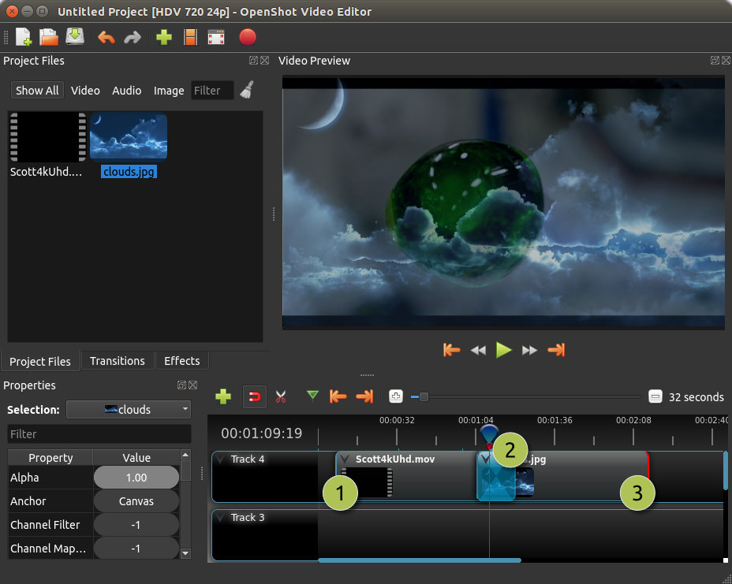
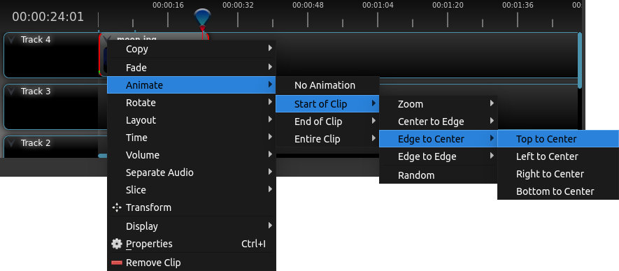
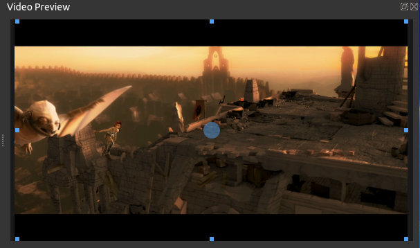
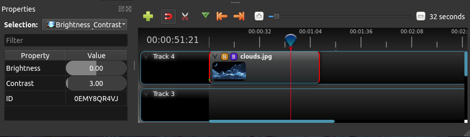

.. Copyright (c) 2008-2016 OpenShot Studios, LLC
 (http://www.openshotstudios.com). This file is part of
 OpenShot Video Editor (http://www.openshot.org), an open-source project
 dedicated to delivering high quality video editing and animation solutions
 to the world.

.. OpenShot Video Editor is free software: you can redistribute it and/or modify
 it under the terms of the GNU General Public License as published by
 the Free Software Foundation, either version 3 of the License, or
 (at your option) any later version.

.. OpenShot Video Editor is distributed in the hope that it will be useful,
 but WITHOUT ANY WARRANTY; without even the implied warranty of
 MERCHANTABILITY or FITNESS FOR A PARTICULAR PURPOSE.  See the
 GNU General Public License for more details.

.. You should have received a copy of the GNU General Public License
 along with OpenShot Library.  If not, see <http://www.gnu.org/licenses/>.

.. _clips_ref:

Clips
=====

Each media file you add to the OpenShot timeline is called a clip, and is visualized by a dark, rounded rectangle
(as seen in the screenshot below). A clip has a large number of properties, which affects how the clip is
rendered and composited, such as scale, location, rotation, and alpha. These properties can also be animated over time,
and when combined together, can create some amazing effects.

Overview
--------

.. table::
   :widths: 5 10 35
   
   ==  ==================  ============
   #   Name                Description
   ==  ==================  ============
   1   Clip 1              A video clip
   2   Transition          A gradual fade transition between the 2 clips
   3   Clip 2              An image clip
   ==  ==================  ============

.. _clips_cutting_slicing_ref:

Cutting & Slicing
-----------------
OpenShot has many easy ways to adjust the start and end positions of a clip (otherwise known as cutting). The most common
method is simply grabbing the left (or right) edge of the clip and dragging. Here is a list of methods for cutting clips in OpenShot:

.. table::
   :widths: 30
   
   ======================  ============
   Name                    Description
   ======================  ============
   **Slice**               When the play-head (i.e. vertical red playback line) is overlapping a clip, right click on the clip,
                           and choose :guilabel:`Slice`.
   **Slice All**           When the play-head is overlapping many clips, right click on the play-head, and choose
                           :guilabel:`Slice All` (it will cut all intersecting clips on all tracks).
   **Resizing Edge**       Mouse over the edge of a clip, and resize the edge.
   **Split Dialog**        Right click on a file, and choose :guilabel:`Split Clip`. A dialog will appear which allows
                           for creating lots of small cuts in a single video file.
   **Razor Tool**          The razor tool |razortool_icon| from the **Edit Toolbar** cuts a clip wherever you click on it.
                           So be careful, it is easy and dangerous!
   ======================  ============

Keep in mind that the above cutting methods also have :ref:`keyboard_shortcut_ref`, to save even more time.

.. _clip_presets_ref:

Preset Menu
-----------
OpenShot has tons of great preset animations and clip properties, such as fading, sliding, zooming, etc...
These presets can be accessed by right clicking on a clip.

.. table::
   :widths: 20
   
   ==================  ============
   Name                Description
   ==================  ============
   Fade                Fade in or out a clip (often easier than using a transition)
   Animate             Zoom and slide a clip
   Rotate              Rotate or flip a video
   Layout              Make a video smaller or larger, and snap to any corner
   Time                Reverse and speed up or slow down video
   Volume              Fade in or out the volume for a clip
   Separate Audio      Create a clip for each audio track
   Slice               Cut the clip at the play-head position
   Transform           Enable transform mode
   Display             Show waveform or thumbnail for a clip
   Properties          Show the properties panel for a clip
   Copy / Paste        Copy and paste key frames or duplicate an entire clip (with all key frames)
   Remove Clip         Remove a clip from the timeline
   ==================  ============

.. _clip_transform_ref:

Transform
---------
To quickly adjust the location and scale of a clip, select a clip on the timeline, right click and choose **Transform**.
Grab any of the small blue handles to adjust scale, and grab the middle circle to move the image. Note: Pay close
attention to where the play-head (i.e. red playback line) is. Key frames are automatically created at the current playback
position, to help create animations.

For more info on key frames and animation, see :ref:`animation_ref`.

Effects
-------
In addition to the many clip properties which can be animated and adjusted, you can also drop an effect directly onto
a clip. Each effect is represented by a small letter icon. Clicking the effect icon will populate the properties of that
effect, and allow you to edit (and animate) them.

.. _clip_properties_ref:

Properties
----------
Below is a list of clip properties which can be edited, and in most cases, animated over time. To view a clip's properties,
right click and choose **Properties**. The property editor will appear, where you can change these properties. Note: Pay
close attention to where the play-head (i.e. red playback line) is. Key frames are automatically created at the current playback
position, to help create animations.

.. table::
   :widths: 20

   ==================  ============
   Name                Description
   ==================  ============
   Gravity Type        The gravity of a clip determines where it snaps to its parent
   Scale Type          The scale determines how a clip should be resized to fit its parent
   Frame Display Type  The format to display the frame number (if any)
   Scale X             Curve representing the horizontal scaling in percent (0 to 1)
   Scale Y             Curve representing the vertical scaling in percent (0 to 1)
   Location X          Curve representing the relative X position in percent based on the gravity (-1 to 1)
   Location Y          Curve representing the relative Y position in percent based on the gravity (-1 to 1)
   Rotation            Curve representing the rotation (0 to 360)
   Alpha               Curve representing the alpha (1 to 0)
   Time                Curve representing the frames over time to play (used for speed and direction of video)
   Volume              Curve representing the volume (0 to 1)
   Shear X             Curve representing X shear angle in degrees (-45.0=left, 45.0=right)
   Shear Y             Curve representing Y shear angle in degrees (-45.0=down, 45.0=up)
   Channel Filter      A number representing an audio channel to filter (clears all other channels)
   Channel Mapping     A number representing an audio channel to output (only works when filtering a channel)
   Has Audio           An optional override to determine if this clip has audio (-1=undefined, 0=no, 1=yes)
   Has Video           An optional override to determine if this clip has video (-1=undefined, 0=no, 1=yes)
   Waveform            Should a waveform be used instead of the clip's image
   Waveform Color      Curve representing the color of the audio wave form
   ==================  ============

For more info on key frames and animation, see :ref:`animation_ref`.
